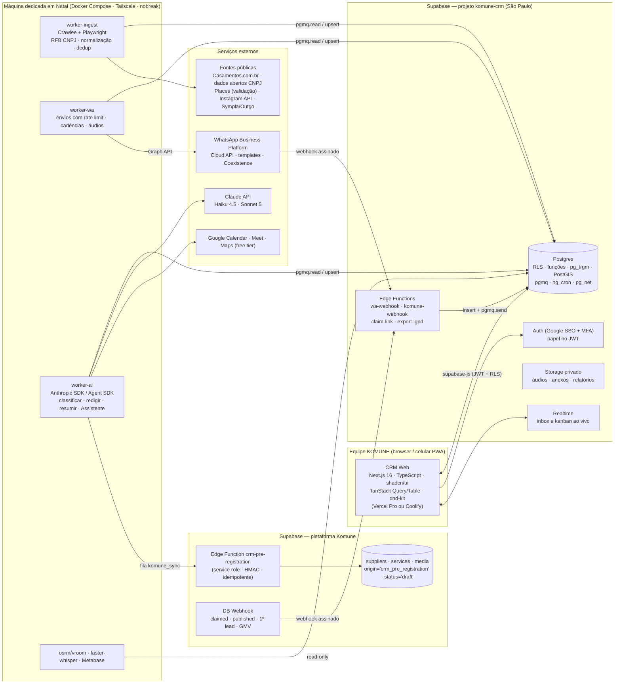

# PRD — CRM de Captação KOMUNE

**Codinome do produto:** KOMUNE CRM (o módulo de coleta de fornecedores em fontes públicas chama-se "Radar")
**Versão:** 1.0 — 03/09/2026
**Autor:** Cláudio (Claude), a pedido de Rafael Abreu
**Status:** Proposta para aprovação
**Aprovadores:** Rafael (CEO) · Luiz (TI) · Matheus (desenvolvimento) · Bárbara (comercial e marketing) · Heloísa (operação comercial) · Dennis (administrativo-financeiro e LGPD)
**Base:** transcrição da reunião de 03/09/2026, Contexto Mestre da KOMUNE, Plano Estratégico de 90 dias (02/09/2026), histórico de decisões do app Komune e 10 relatórios de pesquisa produzidos em 03/09/2026 (anexos R01 a R10, referenciados ao longo do texto).

## Como ler este documento

A seção 1 é o resumo executivo com as decisões que precisam de aprovação. As seções 2 a 6 explicam o contexto, os objetivos, as personas, a jornada do parceiro e o escopo por fase. A seção 7 é o coração do PRD: os requisitos funcionais de cada módulo, numerados no formato `RF-MÓDULO-NN` para servirem de backlog direto no Claude Code e no Asana. As seções 8 a 12 cobrem requisitos não funcionais, arquitetura, conformidade legal, roadmap de construção e riscos. A seção 13 lista as decisões que ficaram em aberto e que dependem de Rafael. Os apêndices trazem tabelas detalhadas (etapas, fontes, intenções do robô, modelo de dados, checklists legais, mercado de Natal e benchmarks) que os anexos de pesquisa aprofundam.

Terminologia usada no documento: **alvo** é um fornecedor ou produtor identificado mas ainda não trabalhado; **parceiro** é qualquer organização no CRM (fornecedor, produtor, cerimonialista, espaço); **negócio** é a oportunidade de captação de um parceiro em um funil; **etapa** é a posição do negócio no funil; **temperatura** é o estado calculado (frio, morno, quente, cliente); **porta aberta** é uma conversa real com decisor; **pré-cadastro** é o rascunho privado do perfil do fornecedor criado na plataforma Komune a partir de dados públicos, invisível até o fornecedor autorizar e completar. Siglas técnicas (RLS, OTP, HMAC, PWA, SDR etc.) estão no Apêndice H.

---

## 1. Resumo executivo

A KOMUNE decidiu, na reunião de 03/09/2026, construir seu próprio CRM em vez de adaptar uma ferramenta paga. O motivo é simples: a rodada de 15 dias de captação começa amanhã, a meta é publicar 100 fornecedores e 30 produtores/cerimonialistas até o marco C12 (06/11/2026) que libera a campanha paga a partir de 16/11, e nenhum CRM de prateleira faz as três coisas que a operação precisa ao mesmo tempo — descobrir fornecedores em fontes públicas, conversar com eles pelo WhatsApp em nome de uma pessoa real e transformar a conversa em um pré-cadastro dentro da plataforma Komune. Hoje a base vive numa planilha, o "CRM pago" serve só como disparador e as mensagens do número da empresa correm o risco de "cair num grupo onde ninguém vê".

Este PRD especifica um CRM web (mobile-first, instalável como PWA) com sete módulos: base de parceiros com importação e deduplicação; Radar de fornecedores (coleta em fontes públicas, enriquecimento, fila de revisão e pontuação por lacuna de oferta); funil kanban com próxima ação obrigatória; conversas de WhatsApp com o robô "Heloísa" (classificação de respostas, áudios reais, cadências, agendamento e transferência para humano); agenda e rotas de visita (manhã em vídeo, tarde em rota de 4 visitas); pré-cadastro e onboarding integrados à plataforma Komune até o primeiro lead entregue; e metas por pessoa com a Assistente de cobrança que envia a lista do dia às 07:30, fecha o dia às 18:00 e produz o relatório de segunda-feira às 08:00.

**Decisões que este PRD recomenda e que precisam de aprovação:**

1. **Construir do zero sobre Supabase + Next.js**, em projeto Supabase separado (`komune-crm`) na mesma organização do app, com workers rodando nas máquinas dedicadas em Natal e recepção de webhooks sempre em nuvem. O Atomic CRM (MIT, mesma stack) serve de pedreira de código, não de fundação. (R01, R05)
2. **WhatsApp pela API oficial da Meta (Cloud API), nunca automação não oficial no número verificado da empresa.** Primeiro contato e o único follow-up de silêncio (D+3) em modo assistido (Heloísa envia pelo app com um toque, a partir da fila preparada pelo CRM, sem custo); o robô assume dentro da janela de 24 horas, que é gratuita; lembretes de utilidade e reengajamentos fora da janela por template aprovado (≈ R$ 0,04 e ≈ R$ 0,34 cada). Custo da pilha de WhatsApp (mensagens Meta, infraestrutura e voz) entre R$ 220 e 530 por mês para 450 contatos, tendendo ao piso no modo assistido. A automação não oficial (Evolution/Baileys) fica restrita a laboratório com chip pré-pago descartável, sem vínculo com o Business Manager. (R04, R05, R06)
3. **Pré-cadastro transparente, nunca "anúncio fake".** O rascunho nasce invisível na plataforma, com dados factuais; fotos e textos só entram por upload ou autorização expressa do fornecedor; a autorização é pedida na primeira conversa (segunda mensagem do robô, logo após o áudio da Heloísa), com caminho curto para quem autoriza por texto sem reunião; o fornecedor reivindica o perfil por link único enviado ao seu WhatsApp e um código de confirmação (por e-mail no MVP; no próprio WhatsApp a partir da v1), aceita os termos com prova registrada e publica quando o checklist mínimo (61 pontos de completude) está verde. Rascunho não reivindicado em 30 dias é apagado. (R06, R10)
4. **Coleta de dados factual, em baixo volume e sem burlar bloqueios.** A espinha dorsal da lista-alvo é o Casamentos.com.br (≈ 270 fornecedores únicos em Natal) cruzado com a base pública de CNPJ da Receita Federal (custo zero, mais completa e juridicamente confortável) e com o Google Places apenas como validação em tempo real. GetNinjas não serve como base (não expõe lista nem contato) e Instagram só por API oficial ou curadoria manual. (R03, R06)
5. **Funil em dois estágios, com temperatura calculada no vocabulário da equipe.** Captação (prospectado → contatado → respondeu → em conversa → reunião marcada → apresentação realizada → autorizou → cadastro em andamento → publicado) e Ativação (publicado → 1º lead → lead respondido → 1ª contratação → recorrente), mais um funil próprio de produtor/cerimonialista. Frio = ainda não respondeu; morno = respondeu sem declarar interesse; quente = declarou interesse, pediu a taxa, autorizou ou marcou reunião; cliente = publicado. Todo negócio aberto tem próxima ação obrigatória e fica vermelho ("parado") quando passa do prazo da etapa. (R01, R02)
6. **Metas com definição rígida de "porta aberta"** (conversa com decisor, uma por alvo a cada 30 dias, com resultado registrado), Assistente de cobrança com regra pública de escalonamento (2 dias consecutivos abaixo de 50% → Rafael é avisado, e a pessoa sabe disso) e relatório de segunda 08:00 com o gráfico de acumulado × meta dos 100 fornecedores. (R07)
7. **Lista-alvo maior que a do plano.** Com conversão contatado → publicado de 20 a 30%, 100 fornecedores publicados exigem 350 a 500 alvos qualificados, não 300 — e, como a cadência adotada é mais conservadora que a dos benchmarks, a taxa de resposta pode ficar abaixo das premissas. O Radar deve entregar ≥ 450 alvos A/B até 30/09 e as taxas reais são recalibradas nas duas primeiras semanas. (R02, R09)

**Escopo do MVP (10 dias úteis, 04/09 a 18/09/2026; 07/09 é feriado):** o **MVP-núcleo** (D1–D5, até 11/09) substitui a planilha: importação com deduplicação, kanban do funil de fornecedor e do funil de produtor, ficha do parceiro com linha do tempo, fila diária de primeiros contatos em modo assistido, inbox com responsável, formulário de porta aberta em 20 segundos, biblioteca de áudios da Heloísa, resumo do dia às 07:30 e 18:00 por texto, e o Radar com Casamentos.com.br, base CNPJ de Natal e fila de revisão. O **MVP-estendido** (D6–D10, até 18/09) acrescenta classificação de respostas por IA com rascunho aprovado por humano, cadência de silêncio, agenda com Google Meet e rota simples da tarde, metas diárias, pré-cadastro v0 (contrato mínimo com a Komune + link de reivindicação) e relatório de segunda em XLSX/HTML. Antes disso, um "Dia 0" define a planilha-ponte que a equipe usa entre 04 e 09/09. O que fica para v1 (16/10) e v2 (13/11) está na seção 6.

**Custo recorrente estimado:** US$ 140 a 300 por mês (≈ R$ 770 a 1.650 ao câmbio de referência de R$ 5,50) somando Supabase, WhatsApp (mensagens Meta de US$ 40 a 80 no cenário com templates; menos de US$ 20 no modo assistido padrão), Claude API, hospedagem e serviços de dados; mais custos únicos de dois chips e um celular dedicado — contra R$ 170 a 4.300 por mês dos CRMs comerciais para 5 a 8 usuários (os com WhatsApp multiagente partem de ≈ R$ 550 mais tarifas da Meta), que ainda assim não fariam o pré-cadastro nem a integração com a plataforma. Esforço de construção: ≈ 40 dias de Claude Code, ≈ 10 dias de Matheus (lado Komune e revisão) e ≈ 6 dias de Luiz (Meta Business, chips, máquinas, DNS, backups) distribuídos em 10 semanas.

**O que muda em relação ao que foi dito na reunião:** o robô não "abre o WhatsApp e dispara para uma lista" a partir do número verificado — em 2026 esse é o padrão que a Meta persegue e bane; ele prepara a lista, a Heloísa dispara com um toque e o robô conduz a conversa a partir da resposta. Só a Heloísa (e no máximo mais dois aparelhos vinculados) escreve pelo número "Heloísa · Komune"; as demais pessoas abrem suas portas por ligação, visita, mensagem direta no Instagram e contatos pessoais, e registram tudo no CRM — os tetos de envio do número (20 a 60 primeiros contatos por dia) não comportam sete pessoas disparando. O pedido de autorização do pré-cadastro não vai na primeira mensagem (que deve ser curta, com uma só pergunta e sem link) e sim na segunda, assim que a pessoa responde. O áudio "com voz de mulher, não de robô" é literalmente a voz da Heloísa, em áudios gravados por ela (biblioteca por segmento e etapa) ou ao vivo; voz clonada fica como opção de fase 3, condicionada a consentimento e aviso. O GetNinjas não serve como base: publicamente ele só mostra avaliações e pedidos recentes, sem lista de profissionais nem telefone, e seus termos proíbem uso comercial dos dados — serve como termômetro de demanda por categoria e consulta manual. E o "anúncio fake" discutido e descartado na reunião vira pré-cadastro privado com reivindicação.

---
## 2. Contexto e problema

### 2.1 Onde a KOMUNE está

A KOMUNE é o app/marketplace de eventos de Natal/RN ("onde conexões viram encontros"), construído em React Native/Expo sobre Supabase, com painel web de parceiros (fornecedor/produtor) e site do cliente final. Em setembro de 2026 tem cerca de 15 mil contas criadas por ingressos de eventos gratuitos, cerca de 400 instalações, o Android ainda bloqueado no Play Console e apenas dois fornecedores publicados. O plano de 90 dias determina que o marketing de lançamento só começa quando houver 100 fornecedores e 30 produtores/cerimonialistas publicados (marco C12, 06/11/2026). A tese, confirmada pelos benchmarks (R02), é a de todo marketplace que deu certo: o lado difícil da oferta se conquista com venda direta, cadastro assistido e uma primeira oportunidade real, antes de qualquer campanha.

### 2.2 O que a reunião de 03/09 decidiu sobre o CRM

Rafael foi explícito: "o foco total de todo mundo vai ser só captar" nos próximos 15 dias; "é mais fácil a gente fazer o nosso porque daqui a pouco eu integro com a gente mesmo"; "hoje em dia a velocidade é amiga". O CRM que ele descreveu faz cinco coisas: (1) reúne alvos de contatos pessoais, da planilha existente e de fontes externas como Casamentos.com.br, GetNinjas, Constance Zahn e a base de CNPJ, por meio de scraper; (2) tem um robô de WhatsApp em número dedicado, rodando em máquina dedicada, que faz o primeiro contato em nome da Heloísa, manda áudio humano quando a pessoa responde, marca reunião (vídeo de manhã, visita presencial à tarde em rota de quatro clientes), faz follow-up e "perturba" o fornecedor até completar o cadastro; (3) classifica cada resposta (respondeu sim/não, interesse sim/não) e evolui a etapa; (4) cria o pré-cadastro do fornecedor na plataforma "meio que pronto para ele só acabar", com autorização pedida no primeiro contato — a ideia do anúncio espelhado sem aviso foi discutida e descartada por ser "feio" e "não correto"; (5) cobra a equipe por meio de uma "IA secretária" que diz "Rafael, você tinha 10 coisas para fazer, fez 1" e alimenta a reunião semanal de growth.

O Contexto Mestre já exigia um CRM com campos mínimos (nome, empresa, categoria, cidade, contato, origem, etapa, responsável, último contato, próxima ação, status, motivo da perda) e funis de fornecedor e de produtor. O plano de 90 dias previa montar o CRM em ferramenta gratuita até 18/09 (atividade C1: 300 fornecedores + 60 produtores como alvos) e o cadastro assistido de 100 perfis até 06/11 (C5). Este PRD substitui a ferramenta gratuita prevista em C1 pelo CRM próprio, mantendo as datas.

### 2.3 O problema em uma frase

A equipe de sete pessoas precisa transformar cerca de 450 alvos em 100 fornecedores publicados e ativos em 60 dias, com três "portas" por dia por pessoa, sem perder nenhuma conversa, sem depender do WhatsApp pessoal de cada um e sem colocar em risco o número da empresa nem a reputação da KOMUNE junto ao próprio público que quer conquistar.

### 2.4 O que a pesquisa mostrou (síntese dos dez anexos)

A pesquisa (R01 a R10) confirmou a decisão de construir e corrigiu quatro premissas da reunião.

Sobre CRMs (R01): o padrão dos líderes é "venda baseada em atividade" — todo negócio aberto tem próxima ação obrigatória, o cartão tem semáforo e negócios parados ficam vermelhos (Pipedrive, Close, Odoo). Os CRMs brasileiros "WhatsApp-first" (Kommo, RD Conversas, Agendor Chat) colocam a conversa dentro do cartão e penduram automações em cada etapa. Nenhum deles faz pré-cadastro na plataforma nem sincroniza etapa com publicação; comprar custaria de R$ 170 a R$ 4.300 por mês (para 5 a 8 usuários) e ainda deixaria isso de fora.

Sobre captação de supply (R02): Uber, Airbnb, DoorDash, iFood e Thumbtack começaram com venda direta intensa e cadastro feito pela própria equipe; ativação é a primeira transação em 30 dias, não o cadastro; prioridade vem da lacuna de demanda (DoorDash ranqueia comerciantes por "capacidade de preencher a lacuna em determinada geografia"); indicação é a segunda alavanca mais eficiente e só deve ser paga após ativação. Com conversão contatado → publicado de 20 a 30%, 100 publicados exigem 350 a 500 alvos.

Sobre fontes (R03, R09): o Casamentos.com.br lista 290 perfis (≈ 270 únicos, contagem verificada página a página; o anexo jurídico estimara ≈ 150) em Natal com nota, preço "a partir de", capacidade e endereço, mas sem telefone público; a base de CNPJ da Receita Federal traz telefone, e-mail e bairro de milhares de estabelecimentos nos CNAEs de eventos a custo zero; GetNinjas não expõe lista nem contato; o Instagram é ótimo para achar e péssimo para raspar; o universo de fornecedores ativos e localizáveis na Grande Natal fica entre 1.100 e 1.700, o que torna uma lista de 450 alvos factível em 15 dias.

Sobre WhatsApp (R04): desde julho de 2025 a Meta cobra por mensagem (marketing ≈ US$ 0,0625, utilidade ≈ US$ 0,0068 no Brasil; conversa na janela de 24 h é gratuita), intensificou em 2026 a detecção de clientes não oficiais com banimentos em ondas, e exige caminho de escalonamento humano. O Coexistence permite usar o mesmo número no app do celular e na API. Áudio como mensagem de voz é suportado (ogg/opus mono).

Sobre LGPD e termos de uso (R06): a base legal da prospecção B2B é o legítimo interesse documentado; fornecedor autônomo ou MEI é pessoa natural; o scraper deve coletar apenas dados factuais, sem fotos, textos ou avaliações; a primeira mensagem precisa dizer quem somos, de onde veio o contato e como sair; o Google Maps não pode virar base do CRM (só `place_id` pode ser armazenado); a primeira multa aplicada pela ANPD (Telekall, 2023) foi justamente contra a venda de listas de contatos para WhatsApp.

Sobre operação de campo (R07) e onboarding (R10): construir o módulo de rotas, agenda e cobrança custa menos de US$ 10 por mês em serviços externos (a cota gratuita do Google Maps Platform, de 10 mil chamadas mensais de matriz de rotas, cobre com folga as ≈ 150 que a KOMUNE usaria; o Google Calendar cria eventos com Meet sem custo); o padrão universal de onboarding é pedir pouco para entrar, mais para publicar e documentos para o selo, e o link do pré-cadastro deve abrir um perfil "40% pronto" (efeito do progresso dotado: 34% contra 19% de conclusão).

### 2.5 Princípios de produto

1. **Cadastro assistido é a regra.** O fornecedor confirma e completa; nunca "cria do zero".
2. **Nada é publicado sem autorização.** O pré-cadastro é privado, factual e expira.
3. **O WhatsApp é ponte, não prisão.** Usar o canal onde o fornecedor já está, pela via oficial, sem cara de robô e sem colocar o número da empresa em risco.
4. **Pessoa real, assistida por sistema.** Mensagens em nome da Heloísa, áudios com a voz dela, humano assume em uma resposta; o robô nunca nega ser automação.
5. **Toda conversa tem dono e toda oportunidade tem próxima ação.** Regra de sistema, não boa prática.
6. **Prioridade vem da lacuna de oferta.** O score do alvo muda todo dia conforme as categorias enchem.
7. **Ativação, não cadastro.** A meta é o primeiro lead respondido em até 30 dias, não o perfil criado.
8. **Automatizar o máximo, manter o humano onde o humano converte** (áudio, reunião, objeção repetida, negociação).
9. **Multi-cidade desde o modelo de dados**, Natal primeiro.
10. **Dados são ativo e responsabilidade**: origem registrada em cada campo, opt-out em uma palavra, retenção automática.

---

## 3. Objetivos, métricas de sucesso e não-objetivos

### 3.1 Objetivos do produto (ligados ao plano de 90 dias)

| Objetivo | Métrica de sucesso | Meta | Prazo | Origem no plano |
|---|---|---|---|---|
| O1 · Substituir planilha e ferramenta paga como fonte única de verdade da captação | Contatos, conversas e reuniões registrados no CRM ("o que não está no CRM não aconteceu") | ≥ 95% na semana de 21–25/09; 100% a partir de 28/09 | 28/09/2026 | C1 |
| O2 · Alimentar a máquina de prospecção com alvos qualificados | Alvos A/B revisados com contato válido (WhatsApp identificado ou celular com DDD 84, ou telefone fixo + Instagram) | ≥ 450 fornecedores · ≥ 100 produtores/cerimonialistas | 30/09/2026 | C1 (revisado) |
| O3 · Sustentar 3 portas abertas por dia por pessoa | Portas abertas registradas por pessoa/dia (mediana da equipe) | ≥ 3 | contínuo a partir de 14/09 | P1, A1 |
| O4 · Converter contato em publicação com previsibilidade | Contatado → publicado | 20–30% em ≤ 14 dias (Tier A) | dia 30 | C3–C5 |
| O5 · Entregar 100 fornecedores e 30 produtores publicados | Perfis publicados e completos | 40 / 100 / 130 fornecedores nos dias 30/60/90 · 30 produtores | 06/11/2026 | KR1, KR4, C12 |
| O6 · Ativar quem publica | Publicados com ≥ 1 lead real respondido em 30 dias | ≥ 70% | dia 60 | KR2, C11 |
| O7 · Densidade por categoria | Categorias com ≥ 5 fornecedores publicados | 14 | 04/12/2026 | KR3 |
| O8 · Proteger o canal | Taxa de bloqueio/denúncia no WhatsApp · opt-out | ≤ 1–2% · ≤ 3% | contínuo | R04, R06 |
| O9 · Velocidade de resposta | Tempo de 1ª resposta humana a fornecedor que respondeu (horário comercial) | ≤ 10–15 min | contínuo | R02, R08 |
| O10 · Decidir com dados | Relatório automático de segunda 08:00 com funil, densidade, burn-up e motivos de perda | toda segunda | a partir de 14/09 | D1, D3, G8 |

### 3.2 Métricas de saúde do produto

Tempo de registro de uma "porta aberta" (mediana ≤ 20 s no celular); tempo de registro de resultado de visita com áudio (≤ 30 s); percentual de negócios abertos sem próxima ação (meta 0%); percentual de conversas sem responsável (0%); percentual da fila "Meu dia" executada por pessoa (≥ 70%); fidelidade do pré-cadastro (campos confirmados ÷ pré-preenchidos ≥ 80%, mede a qualidade do Radar); tempo de sessão do fornecedor até publicar (≤ 10 min); custo por fornecedor publicado (acompanhar).

### 3.3 Não-objetivos (fora do escopo desta versão)

Não é objetivo deste PRD: substituir o painel de parceiros da Komune (o CRM cria o rascunho e acompanha; a edição definitiva e o financeiro continuam no painel); gerir o cliente final (B2C), ingressos ou rateio; ser um ERP de eventos (visão de longo prazo, seção 11.5); multi-tenant para oferecer o CRM a terceiros; campanhas de marketing em massa para as 15 mil contas; atendimento ao usuário final do app (o inbox de suporte a fornecedores e produtores entra, o suporte B2C fica no canal atual); integração com o Viva Positivo (financeiro do evento, prevista para a v2 do app) e com o Asana além do descrito no módulo 7.7; o roteiro da apresentação de 20 minutos e o kit comercial (atividade C2 do plano), aos quais o CRM entrega insumos (script por categoria, base de conhecimento, áudios, prévia do perfil e objeções), mas que são um entregável irmão.

---

## 4. Usuários e personas

### 4.1 Usuários internos

| Persona | Papel no CRM | O que precisa | Dispositivo principal |
|---|---|---|---|
| **Rafael** (CEO) | `admin` · dono de carteira de produtores e cerimonialistas de alto nível | Painel do time às 07:30 e 18:30; escalonamentos; burn-up; aprovar exceções (taxa, fundador); registrar por áudio enquanto caminha | Celular (WhatsApp da Assistente) + desktop na reunião de segunda |
| **Bárbara** (marketing e comercial) | `gestor` · líder da célula de fornecedores; dona de espaços, buffets e cerimoniais VIP | Kanban por categoria, densidade × meta, motivos de perda para ajustar pitch, templates e áudios por segmento, testes A/B de abertura | Desktop + celular |
| **Heloísa** (comercial operacional e suporte) | `sdr` principal · voz do primeiro contato · revisora de pré-cadastros | Fila do dia com textos prontos e botão de envio; inbox com rascunhos da IA; agenda e rota; formulário de 20 s; fila de curadoria; biblioteca de áudios | Celular (rota) + desktop (manhã) |
| **Gustavo** (citado na reunião como apoio à captação de produtores) | `sdr` (papel, dedicação e carteira a confirmar por Rafael) | Fila própria e registro em 20 s | Celular |
| **Estagiários (2) e embaixadores (3)** | `sdr` restrito / `embaixador` | Fila de revisão do Radar; carteira própria; link de indicação; sem exportação, telefone mascarado | Celular/desktop |
| **Dennis** (administrativo-financeiro) | `leitura` + `encarregado LGPD` | Pedidos de titulares, relatório de retenção/expurgo, custos por canal, FAQ financeira aprovada | Desktop |
| **Luiz** (TI) | `admin` técnico | Meta Business, máquinas dedicadas, backups, integrações, saúde do número | Desktop |
| **Matheus** (programador) | `admin` técnico · dono do lado Komune da integração | Edge Function de pré-cadastro, webhooks de status, campos novos em `suppliers`, revisão de PRs | Desktop |
| **Cláudio (Claude Code)** | construtor | PRD como backlog; prompts versionados; testes | — |

### 4.2 Parceiros externos (quem está do outro lado da conversa)

**Fornecedor** (cinco grupos: alimentos e bebidas, infraestrutura, prestadores de serviço, locais, recreação infantil). Dor: invisibilidade e dependência de indicação ou de portais com mensalidade e fidelidade de 12 meses; recebe leads que "só estão sondando". Argumento: "você não paga para aparecer, paga 8% quando fecha; fundador tem destaque, selo e uma oportunidade real em 30 dias". Muitos são MEI ou autônomos (fotógrafo, DJ, decoradora), portanto pessoas naturais para a LGPD.

**Cerimonialista / assessoria** (casamento, formatura, 15 anos). Cuida da experiência ponta a ponta, indica fornecedores e hoje recebe "BV" informal de cerca de 10%. Argumento: "a mesma comissão, agora transparente, contratual e paga automaticamente (5% via split), mais a ferramenta grátis". É o canal de indicação mais forte: cada cerimonialista abre 20 a 40 fornecedores.

**Produtor** (operacional: formaturas, corporativo, shows, festas recorrentes). Argumento: organização, público e fornecedores no mesmo lugar; comissão de 3% + 5% quando organiza; formaturas primeiro porque a comissão de intermediação já é prática aceita e a janela (nov/dez) coincide com o plano.

**Espaço / local** (salões, sítios, hotéis, restaurantes com evento, praia). Categoria âncora: dados ricos no Casamentos.com.br, decisor identificável, recebe visita presencial com naturalidade.

### 4.3 Jornadas típicas

A jornada da Heloísa e a jornada do Rafael estão descritas dia a dia no anexo R07 (seção 7). Em resumo: às 07:30 cada pessoa recebe pela Assistente a agenda, a fila top-5 e a meta do dia; das 08:00 às 09:15 responde quem escreveu e dispara os primeiros contatos da fila; a manhã tem apresentações de 20 minutos por Meet; à tarde a rota de 4 visitas em uma zona da cidade, com check-in e registro por áudio em 30 segundos; às 18:00 a Assistente fecha o dia com o que foi feito e o que faltou e oferece reprogramar. Rafael recebe às 07:30 e 18:30 o semáforo do time, o burn-up e apenas exceções durante o dia.

---
## 5. Jornada do parceiro e desenho dos funis

### 5.1 Princípios de desenho

Uma etapa só existe se tiver critério de entrada verificável, dono, SLA e próxima ação automática — etapas sem isso viram limbo. A temperatura é derivada da etapa, da intenção classificada e da recência do último contato, no vocabulário que a equipe já usa ("na hora que a pessoa respondeu com interesse, tá quente"), com override manual por estrelas (padrão RD Station/Odoo); ninguém precisa "escolher" frio/morno/quente. Fornecedor e produtor têm funis diferentes, mas a mesma organização pode estar nos dois (uma cerimonialista é produtora e também indicadora). Todo estado de saída exige motivo, porque o motivo da perda é o dado que ajusta o pitch da semana seguinte. O robô avança etapas automaticamente até "Respondeu", pode levar a "Reunião marcada" (quando o parceiro aceita um horário) e a "Autorizou" (quando autoriza por texto), e sugere os demais avanços; humano confirma o resto. O funil de 13 etapas do Contexto Mestre foi dividido em dois (captação e ativação), porque "visualização, lead, proposta, contratação" são eventos que vêm da plataforma, não ações manuais do time.

### 5.2 Caixa de alvos (antes do funil)

Alvos do Radar, da planilha e de captura manual entram numa **caixa de triagem**, não no kanban. Ali a Heloísa ou um estagiário aprova (vira negócio na etapa Prospectado com responsável), descarta (com motivo: fora do perfil, fora da região, duplicado, sem contato) ou mescla (duplicata). Isso evita poluir o funil com 450 cartões e é o padrão de Pipedrive (Leads Inbox), Kommo ("Leads recebidos") e Frappe.

### 5.3 Funil 1 — Captação de fornecedor

| # | Etapa | Critério de entrada | Critério de saída | SLA (vira "parado") | Automação ao entrar | Temp. |
|---|---|---|---|---|---|---|
| 1 | **Prospectado** | Aprovado na triagem, com categoria, cidade, ≥ 1 canal de contato, score e responsável | 1º contato enviado | 3 dias sem contato | Entra na fila de primeiros contatos do responsável, ordenada por score; IA sugere o "detalhe de personalização" da abertura | Frio |
| 2 | **Contatado** | 1º toque registrado (modo assistido pelo app) | Qualquer resposta **ou** cadência de silêncio esgotada | 3 dias sem resposta = follow-up único (D+3, pelo app); 14 dias = dormente | Régua de silêncio (seção 7.4); ligação D+5 (Tiers A e B) e DM/visita D+7–10 (Tier A) como tarefas humanas | Frio |
| 3 | **Respondeu** | Mensagem recebida do parceiro | Intenção classificada e tratada | Humano responde em ≤ 15 min no horário comercial; robô acusa recebimento em ≤ 1 min | Classificação (IA); interesse declarado → texto fixo + áudio da Heloísa + **pedido de autorização do pré-cadastro** (2ª mensagem); demais intenções → resposta fixa/IA; tarefa para o responsável; conversa atribuída | Morno (sem interesse declarado) / Quente (interesse, taxa, ligação) |
| 4 | **Em conversa** | Humano assumiu e trocou ≥ 2 mensagens, ou IA tratou objeção/pergunta dentro da FAQ | Reunião aceita **ou** autorização por texto (caminho curto → etapa 7) **ou** perda/pausa com motivo | 24 h para propor horário; 7 dias sem contato → alerta e volta a Morno; 14 dias → dormente | CTA com 2 horários (manhã Meet / tarde visita na zona do dia); SPACE preenchido pela IA a partir da conversa ou como tarefa do responsável | Morno / Quente conforme intenção |
| 5 | **Reunião marcada** | Data, hora e formato confirmados; evento no Google Calendar (pelo robô ou pela pessoa) | Reunião realizada ou no-show | Confirmação D-1 e 1 h antes; no-show → reagendar em ≤ 24 h (máx. 2) | Lembretes automáticos; no-show 2× → volta a Em conversa com nota; 3× → dormente | Quente |
| 6 | **Apresentação realizada** | Resultado registrado (interessado / objeção / não) | Autorização obtida ou objeção registrada | Follow-up no mesmo dia; 5 dias sem contato → alerta vermelho | Resumo pós-reunião + pedido de autorização, se ainda não dada (texto literal registrado); tarefas D+1 e D+3 | Quente |
| 7 | **Autorizou** | "Autorizo" (texto/áudio) registrado com data, canal e evidência — vindo da etapa 6 ou diretamente da 3/4 (caminho curto, sem reunião) | Link de reivindicação aberto e perfil reivindicado | 72 h para reivindicar | Pré-cadastro criado/atualizado na Komune; link único enviado; lembretes 24 h / 72 h / 7 dias e aviso final em D+20; rascunho expira em D+30 | Quente |
| 8 | **Cadastro em andamento** | Perfil reivindicado (OTP) e termos aceitos | Publicação aprovada na curadoria | Parado > 3 dias sem progresso = "perturbar"; > 14 dias = tarefa humana + visita | Cadência de onboarding citando o campo que falta (D+1, D+3, D+7, D+14); modo assistido (CS edita em nome do fornecedor) | Quente |
| 9 | **Publicado (ganho)** | `published` recebido da plataforma | Migra para o Funil 2 | Publicar em ≤ 24 h após checklist completo | Parabéns + kit de divulgação; selo Fundador; entra na fila de lead garantido | Cliente |
| — | **Nutrição / dormente** | Cadência esgotada sem resposta, "agora não" com data, ou "não" suave ("não é pra mim agora") | Novo gancho real (lead, case, evento, categoria em déficit) | Reengajar em D+30/D+60 com gancho obrigatório; retenção de 12 meses de inatividade | 1 toque por ciclo; 2 ciclos sem resposta → só humano | Frio |
| — | **Perdido** | "Não" firme com motivo (lista fechada) | Reabre só por iniciativa do parceiro ou decisão humana com motivo, após 90 dias | Motivo obrigatório; sem reativação automática | Relatório semanal de motivos | — |
| — | **Opt-out / não contatar** | Pediu para parar, bloqueou ou denunciou | Nunca reabre | Imediato (< 5 min) | Dados apagados; supressão permanente por hash do telefone; confirmação única | — |

Motivos de perda (lista fechada, editável pelo gestor): já anuncia em outro portal e não vê ganho; não aceita comissão; não confia em plataforma nova/sem clientes; agenda cheia, não precisa de demanda; não tem CNPJ/Pix e não quer formalizar; fora de Natal/Grande Natal; categoria fora do escopo; não é o decisor e não indicou; não autorizou o pré-cadastro. "Não respondeu" e "agora não" **não** são perda: são nutrição.

Checklist de qualificação **SPACE** (preenchido na etapa Em conversa pela IA, a partir da conversa, ou pelo responsável; não bloqueia o agendamento feito pelo robô, mas fica como tarefa obrigatória antes da reunião): **S**erviço e lacuna (categoria, subcategoria, faixa de preço, capacidade, atende Grande Natal?); **P**resença e prova (avaliações, fotos, tempo de mercado, onde já anuncia); **A**utoridade e formalização (fala com o dono? tem CNPJ/MEI? Pix?); **C**anal e dor (como consegue clientes hoje, paga mensalidade a alguém, sazonalidade); **E**xpectativa (aceita responder leads em 24 h? aceita 8%? quer o selo Fundador?).

### 5.4 Funil 2 — Ativação e sucesso do fornecedor

| # | Etapa | Critério | SLA / gatilho | Automação |
|---|---|---|---|---|
| 1 | **Publicado** | Perfil no ar com selo Fundador | Lead garantido vence em 30 dias (`guaranteed_lead_due_at`) | Cadência de ativação D+0 (boas-vindas e kit), D+2 (micro-treino "responda em 24 h"), D+7/D+14 ("complete para entrar no destaque") |
| 2 | **Perfil completo / Verificado** | Score 100 e/ou documentos aprovados | 14 dias após publicar | Campanha "selo Verificado em 2 minutos" por grupo de documentos |
| 3 | **1º lead entregue** | Lead real registrado (evento próprio, Research Request, orgânico ou manual da rede — nunca fictício) | Sem lead em 14 dias → CS gera; 21 dias → lead manual + alerta; 30 dias → escalonamento a Rafael/Bárbara | Notificação ao fornecedor; cronômetro de resposta |
| 4 | **Lead respondido** | Resposta em ≤ 24 h | Sem resposta em 12 h → lembrete; 24 h → ligação; 48 h → redistribuição e SLA do fornecedor cai | Pedido de feedback "o que foi difícil?" após o desfecho |
| 5 | **1ª contratação** | Contrato/pagamento pela Komune | Pedir avaliação D+2 após o evento | Case para pitch (com autorização) |
| 6 | **Recorrente** | ≥ 2 contratações ou ≥ 3 leads respondidos em 60 dias | Revisão mensal | Convite a embaixador; upgrade de destaque |
| — | **Em risco / churn** | Sem lead respondido em 30 dias, ou sem interação em 60 dias | Ligação + lead manual (C11) | Alerta ao dono da carteira |

### 5.5 Funil 3 — Produtor e cerimonialista

| # | Etapa | Critério de entrada | Saída | SLA | Automação | Temp. |
|---|---|---|---|---|---|---|
| 1 | **Identificado** | Nome, tipo (produtor operacional / cerimonialista / empresa de formatura), evidência de atividade (evento recente, portfólio) | Score e tier | 24 h | Radar: Sympla/Outgo, Casamentos.com.br (42 cerimoniais), sites de formatura | Frio |
| 2 | **Contatado** | 1º toque personalizado citando evento ou trabalho recente | Resposta ou cadência esgotada | D0, D+3; humano D+6/D+10 | Abertura consultiva, mais espaçada | Frio |
| 3 | **Respondeu** | Mensagem recebida | Classificação | ≤ 10 min humano | Áudio da Heloísa ou da Bárbara | Morno |
| 4 | **Demonstração marcada** | Data e formato (Meet manhã / café ou visita à tarde / evento demo de sábado) | Realizada | Confirmações D-1 e 1 h | Google Calendar + lembretes | Quente |
| 5 | **Demonstração realizada** | Mostrou app e painel do produtor; dor principal registrada (ingressos, fornecedores, financeiro, split) | Modelo aceito | Follow-up no mesmo dia | Proposta: 8% do fornecedor; quando organiza, Komune 3% + 5% para o cerimonialista via split | Quente |
| 6 | **Parceria aceita** | Aceitou termos e o papel de indicação (cerimonialista) | Conta criada | ≤ 72 h | Criação assistida da conta de produtor (no sistema, cerimonialista = perfil produtor com subcategoria) | Quente |
| 7 | **Evento-piloto definido** | Evento real escolhido (data, público, categorias necessárias) | Evento criado | ≤ 7 dias | Categorias necessárias viram Research Requests → alvos para o Funil 1 | Quente |
| 8 | **Evento criado no app** | Evento publicado (mesmo privado) | Convites/fornecedores | ≤ 5 dias | Assistência de Matheus/Heloísa | Cliente |
| 9 | **Carteira indicada** (ramo cerimonialista) | ≥ 1 fornecedor indicado com WhatsApp | Indicados publicados | 1º indicado publicado em ≤ 14 dias | Indicados entram no Funil 1 como Tier A+ com abertura "a [cerimonialista] indicou você"; atribuição 1:1 | Cliente |
| 10 | **Ativado** | Produtor: ≥ 1 contratação ou venda via Komune; cerimonialista: ≥ 1 indicado publicado + ≥ 1 contratação vinculada | Evento realizado | 30 dias após criação | Comissão de indicação só aqui (regra Airbnb) | Cliente ativo |
| 11 | **Recorrente** | 2º evento criado em ≤ 60 dias | — | Pós-evento D+2 | Relatório do evento; pedir o próximo | Recorrente |

### 5.6 Regra de temperatura (calculada)

| Temperatura | Condição | Esfriamento |
|---|---|---|
| Frio | Etapas 1–2 do Funil 1 (1–2 do Funil 3), ou nutrição/dormente, ou só pré-cadastrado | — |
| Morno | Respondeu ou está em conversa **sem interesse declarado** (intenções "me chama depois", "manda material", "já uso outro", ambíguo) e último contato ≤ 7 dias | > 7 dias sem contato → alerta e tarefa de reengajar; > 14 dias → dormente (Frio) |
| Quente | Interesse declarado (intenções "interessado", "pediu taxa", "pediu ligação", "autoriza pré-cadastro") ou etapas 5–8, e último contato ≤ 5 dias | > 5 dias → alerta vermelho ao responsável; > 14 dias → Morno |
| Cliente | Publicado (Funil 2, etapas 1–2) | Sem lead respondido em 30 dias → "cliente em risco" |
| Cliente ativo | Funil 2, etapas 3–6 (lead respondido, contratação, recorrente) | Sem interação em 60 dias → churn de supply |

O responsável pode subir ou descer a temperatura manualmente com 1 a 3 estrelas (override registrado com motivo), útil para "contato pessoal do Rafael" ou "VIP". A tabela de intenções do Apêndice C usa exatamente esta regra.

### 5.7 Tiers e ordem de ataque

Score 0–100 (detalhe no Apêndice A e em R02): lacuna de oferta (35), prova social (30), alcançabilidade (15), fit (20), com penalidades. **Tier A ≥ 70** (cadência completa com ligação e visita; dono humano desde o D0), **Tier B 45–69** (robô + ligação; visita só se responder), **Tier C < 45** (cadência curta; nutrição), **A+** = indicação ou relacionamento (topo da fila, abertura assinada por quem indicou). O score é recalculado todo dia: quando "buffet" chega a 5 publicados, os buffets restantes caem de tier e a equipe migra para a próxima categoria em déficit. Ordem sugerida (R09): dias 1–5 som/luz, tendas/mobiliário, buffets e churrasqueiros com nota, locais e cerimonialistas âncora e empresas de formatura (colações em nov/dez); dias 6–10 fotografia/vídeo, bar/chopp, recreação, doces; dias 11–15 audiovisual/geradores/banheiros, DJs e bandas, decoração, produtoras corporativas.

---

## 6. Escopo por fase

| Módulo | MVP — até 18/09 (rodada de 15 dias) | v1 — até 16/10 | v2 — até 13/11 | v3 — 2027 |
|---|---|---|---|---|
| 7.1 Base de parceiros | Organizações, pessoas, categorias, cidades, tags; importação da planilha com mapeamento e dedup; busca global; ficha com timeline; higiene na ingestão (CPF descartado, DDD conferido, @ normalizado) e identificador de lote em cada carga | Mesclar duplicados lado a lado; cadastro por CNPJ (BrasilAPI); campos obrigatórios por etapa | Objetos personalizados leves; multi-cidade com filtros globais | Sincronização bidirecional com a plataforma |
| 7.2 Radar | Casamentos.com.br (todas as categorias de Natal) + carga da base CNPJ (RN/Natal) + fila de revisão + score v0; higiene na esteira (CPF descartado com registro de proveniência) | Google Places (validação), enriquecimento CNPJ↔nome, Instagram por Business Discovery, Sympla/Outgo (produtores), OLX/TeleListas; extração em lote por IA; re-crawl com diff | Supply Gap / Research Requests → alvos; outras cidades | Expansão nacional; Splink |
| 7.3 Funil e ficha | Kanban dos funis 1 e 3; próxima ação obrigatória; semáforo; motivos de perda; SPACE; catálogo de desfechos de interação com janela de recontato; troca de responsável em massa | Funil 2 (ativação) automático por eventos da Komune; rotting configurável; visões salvas; barra de completude do SPACE | Previsão de funil por conversão histórica de etapa; alertas de parado por etapa | — |
| 7.4 Conversas e robô | Inbox com responsável (gatilho de reversão para Chatwoot em D8); fila de primeiros contatos (modo assistido, com "marquei como enviado" sem eco); classificação de intenção (IA) + rascunho com aprovação; pedido de autorização como 2ª mensagem; opt-out por regra; biblioteca de áudios; régua de silêncio D+3 pelo app; toques de morno parado e onboarding como tarefas humanas | Modo automático por modelo de marketing com teto diário (só se aprovado, §13); réguas automatizadas de morno parado, reativação e onboarding; cadências configuráveis; transcrição de áudio recebido; respostas prontas; notas internas; agendamento pelo robô; validador de promessas; cartão de objeções para quem fala com o parceiro; evento próprio com lista de convidados | Instagram DM (avaliar Chatwoot ou Messenger Platform); e-mail inbound; voz clonada (opcional, com consentimento) | Concierge integrado ao app |
| 7.5 Agenda e rotas | Reuniões com Meet; visitas com endereço; rota do dia com link Google Maps multi-parada; lembretes 24 h / 1 h | Motor de slots próprio para o robô; rota otimizada (OSRM/VROOM ou Google) por zona; check-in GPS; modo rota offline | Página pública de agendamento; zonas por cidade | — |
| 7.6 Pré-cadastro e onboarding | Contrato mínimo v0 com a Komune (Edge Function que cria o rascunho `draft` com 5 campos de origem + tabela de eventos), link de reivindicação enviado ao WhatsApp + código por e-mail; registro de autorização; status básico por webhook; contingência: prévia estática do perfil gerada pelo CRM | Código por WhatsApp; modelo completo de campos na Komune; completude e checklist de publicação; fila de curadoria com motivos; cadência "perturbar"; lead garantido e gatilhos de CS; pergunta de satisfação em D+30 | Documentos do selo Verificado; onboarding de produtor (wizard de evento + "traga seus fornecedores") | Login unificado |
| 7.7 Metas e Assistente | Metas diárias por pessoa (3 portas); painel "Meu dia"; resumo 07:30 e 18:00 por WhatsApp; formulário de porta aberta em 20 s; alarme instantâneo nos dois gatilhos sensíveis a tempo | Áudio → ficha; ranking composto, sequências, medalhas; escalonamento níveis 2 e 3; feedback de sexta; Asana (tarefas vencidas) | OCR de cartão/Instagram; desafios; Asana bidirecional | — |
| 7.8 Relatórios | Relatório de segunda 08:00 (texto + XLSX); funil por etapa/origem/responsável | Metabase: densidade × meta, tempo por etapa, motivos de perda, acumulado × meta, saúde do canal, prazo das próximas ações, aproveitamento por lote e por origem; HTML/PDF | Supply Gap cruzado com demanda; experimentos A/B | — |
| 7.9 Administração e LGPD | Papéis (admin, gestor, sdr, embaixador, leitura); auditoria básica; lista de supressão; aviso de privacidade; resposta pronta à origem do dado | Tela de pedidos de titulares; exportação/anonimização; retenção automática; máscara de telefone com log; registro de checagem dos cadastros de bloqueio de telemarketing | Revisão de acessos; exportação de logs | — |

Critério de "pronto" do MVP-núcleo (11/09): a Heloísa consegue, num dia útil, receber a fila às 07:30, disparar 20 primeiros contatos em 30 minutos com registro automático ou por "marquei como enviado", ver as respostas na inbox com responsável, registrar 4 visitas pelo celular em menos de 30 segundos cada e receber o fechamento do dia às 18:00 — sem abrir a planilha. Critério de "pronto" do MVP-estendido (18/09): as respostas chegam classificadas com rascunho pronto, uma reunião com Meet é marcada e lembrada automaticamente, e um pré-cadastro (ou, sem a Edge Function, a prévia estática do perfil) é criado com um clique.

---
## 7. Requisitos funcionais

Convenção: `RF-XXX-NN` identifica o requisito; **[MVP]**, **[v1]**, **[v2]** indicam a fase; requisitos sem marca são MVP. "O sistema deve" foi abreviado. Os requisitos legais (`SCR-`, `WA-`, `PRE-`, `IA-`, `ACC-`, `GOV-`) do Apêndice E se aplicam por referência.

### 7.1 Base de parceiros (organizações, pessoas, importação, deduplicação)

**Modelo**

- **RF-BAS-01** Organização (parceiro) como entidade central com `tipo` (fornecedor, produtor, cerimonialista, espaço, empresa, outro), nome, razão social, CNPJ, telefone principal (E.164), e-mail, @instagram, site, cidade/UF, bairro, endereço, lat/lng, faixa de preço, nota e nº de avaliações públicas (apenas como sinal numérico interno), descrição curta, origem (`source`) e `source_url`, responsável, temperatura, tags, campos personalizados (JSON).
- **RF-BAS-02** Múltiplas categorias por organização com uma categoria primária, taxonomia comercial da KOMUNE (16 categorias em 5 grupos + 3 de produtores, Apêndice F) mapeada para a categoria do app, e prioridade por onda (1/2).
- **RF-BAS-03** Pessoas (contatos) ligadas a organizações com papel (dono, sócio, comercial, gerente), decisor sim/não, canal preferido, telefone E.164, @instagram e flag `não contatar` mantida por eventos de consentimento. Uma pessoa pode pertencer a várias organizações.
- **RF-BAS-04** Flag `pessoa natural` (MEI, empresário individual, autônomo) definida na ingestão ou manualmente; registros assim são tratados como dados pessoais em todas as telas e jobs de retenção.
- **RF-BAS-05** Normalização automática por trigger: telefone em E.164 (DDD 84 padrão; inserir o 9 em celulares antigos), CNPJ só dígitos com validação, @instagram sem @ e minúsculo, domínio do site, nome sem acento para busca.
- **RF-BAS-06** Timeline unificada por organização: mensagens (entrada/saída), ligações, visitas, reuniões, notas, mudanças de etapa, eventos da plataforma (pré-cadastro, reivindicação, publicação, lead), com autor (pessoa, robô-fixo, robô-IA, sistema) e data.

**Importação e deduplicação**

- **RF-BAS-07** Importação de planilha (XLSX/CSV) em cinco passos: upload → mapeamento automático de colunas por cabeçalho com criação de campo no ato → prévia com contagem de novos/atualizados/duplicados → tratamento de duplicados (atualizar, mesclar, pular) → commit, com arquivo de erros e **desfazer em 48 h**. Uma linha pode criar organização + pessoa + negócio.
- **RF-BAS-08** Deduplicação determinística por ordem de confiança: CNPJ (0,99) → `place_id` (0,98) → @instagram (0,97) → celular E.164 (0,95; se o número aparece em > 3 registros, revisão) → fixo + mesmo bairro/CEP (0,90) → domínio do site (0,90); e fuzzy por nome (trigram ≥ 0,85) + cidade + bairro/CEP/categoria como **sugestão** para revisão humana, nunca fusão automática.
- **RF-BAS-09 [v1]** Tela "Mesclar duplicados" lado a lado mostrando negócios, atividades, criado em e dono de cada registro; escolha do registro primário e, por campo, de qual valor fica; proveniência preservada.
- **RF-BAS-10** `source` obrigatório em toda organização (Casamentos.com.br, base CNPJ, Google Places, Instagram, Sympla, OLX, TeleListas, planilha, contato pessoal, indicação, captura em campo), com `collected_at` e `collector`; importação de lista de terceiros exige anexar licença/contrato (regra Telekall).
- **RF-BAS-11 [v1]** Cadastro rápido por CNPJ: digitar o CNPJ preenche razão social, nome fantasia, CNAE, endereço e telefone cadastral via BrasilAPI/Minha Receita; nome empresarial de MEI passa por regex que remove o CPF.
- **RF-BAS-12** Busca global (⌘K) por nome, telefone, @instagram, CNPJ e bairro, com ações rápidas (abrir, criar tarefa, mudar etapa, enviar mensagem).
- **RF-BAS-13** Visões salvas como abas (lista e kanban): "Meus sem próxima ação", "Quentes sem reunião", "Cadastro parado > 3 dias", por categoria/cidade/origem/tier; agrupamento por qualquer campo (categoria, zona, responsável, temperatura) que transforma a lista em mapa de cobertura.
- **RF-BAS-14** Telefone mascarado nas listagens para papéis `sdr` e `embaixador`, revelado ao abrir a ficha com registro em log; sem exportação CSV para esses papéis.
- **RF-BAS-15** Criação manual rápida de parceiro/alvo em ≤ 30 s com quatro campos (nome, categoria, WhatsApp, origem) a partir do celular ou do desktop, com deduplicação imediata por telefone; a origem "contato pessoal de [pessoa]" e "indicação de [nome]" entram como Tier A+. Captura a partir de contato salvo no celular ou de print (OCR) fica para a v2 (RF-MET-08).
- **RF-BAS-16** Higiene na esteira de ingestão (do estudo R12), aplicada na importação de planilha e na criação rápida antes de qualquer gravação: (a) detecção de CPF por regex com dígito verificador em qualquer campo, inclusive dentro do nome empresarial de MEI; o valor é descartado, nunca persistido, e o descarte fica registrado em `field_provenance` com o motivo; (b) DDD conferido contra a lista de DDDs válidos, com aviso quando não for 84 nem DDD limítrofe do RN; (c) @instagram normalizado (sem @, sem URL, minúsculo) e site reduzido a domínio. Só o CPF bloqueia, porque é passivo de LGPD e não erro de digitação; DDD e @ avisam, aceitam e marcam o registro para revisão, para não estourar o orçamento de 20 s do formulário de porta aberta (RF-MET-06) nem os 30 s da criação rápida (RF-BAS-15). Complementa RF-BAS-05 e RF-BAS-08, que já cobrem E.164, dígito verificador de CNPJ e as sete chaves de dedup.
- **RF-BAS-17** Identificador de lote em toda ingestão (do estudo R12): `import_batch_id` (planilha) ou `ingest_job_id` (Radar) gravado em `organizations` e nos registros de origem, com rótulo legível ("planilha-ponte do Dia 0", "lista-semente do R09", "crawler Casamentos de 10/09"), tornando o lote uma dimensão de relatório (RF-REL-11) ao lado do `source` obrigatório do RF-BAS-10. O lote nunca é chave de dedup nem unidade de retenção: a proveniência continua campo a campo em `field_provenance` e a retenção do §10.6 é por titular. Já é pré-requisito prático do "desfazer em 48 h" do RF-BAS-07 e dos `ingest_jobs` do Apêndice D.

### 7.2 Radar de fornecedores (coleta, enriquecimento, revisão e pontuação)

**Fontes e coleta**

- **RF-RAD-01** Conector por fonte, configurável (URL base, seletores/campos, paginação, rate limit, frequência), com registro de operação (base legal, avaliação dos termos de uso, `robots_ok`) exigido antes de habilitar a fonte.
- **RF-RAD-02** Conectores do MVP: **Casamentos.com.br** (todas as categorias com página de Natal; HTML servidor; 1 requisição a cada 3–5 s; mensal) e **base de CNPJ da Receita Federal** (carga dos CSVs de Estabelecimentos/Empresas/Simples filtrados por UF=RN e município SIAFI 1761, com os CNAEs do Apêndice B; mensal). Conectores v1: Google Places (Text Search por categoria e bairro + Place Details, apenas validação em tempo real), Instagram Business Discovery (por @handle já identificado), Sympla/Outgo (eventos → produtores, via Playwright), OLX Serviços e TeleListas (baixo volume, Playwright), sites de formatura e associações (manual/HTTP), planilha e captura em campo.
- **RF-RAD-03** Regras de engenharia: só páginas públicas, sem login, sem contas, sem burla de captcha/bloqueio/robots.txt; User-Agent identificado (`KomuneBot/1.0 (+https://komune.app/bot)`); ≤ 1 requisição a cada 3 s por domínio; sem proxies rotativos; se bloquear, parar e alertar. GetNinjas: sem coleta automatizada e sem pedidos falsos de orçamento — o que ele mostra publicamente é só avaliações e pedidos recentes, sem lista de profissionais nem contato, e seus termos proíbem uso comercial dos dados; usar só como sinal de demanda por categoria e consulta manual. Instagram: sem scraping; só API oficial ou coleta manual do handle. Google Maps: persistir só `place_id` (dados de contato do Places com TTL de 30 dias até serem confirmados pelo próprio fornecedor).
- **RF-RAD-04** Lista permitida de campos persistidos: nome comercial, razão social, CNPJ, categoria de origem, cidade/bairro/endereço/CEP, telefones, e-mail, site, @instagram, `place_id`, `source_url`, data de abertura, MEI, situação cadastral e, **apenas como números para pontuação interna, nunca exibidos nem reproduzidos**, nota, nº de avaliações, preço "a partir de", capacidade e nº de fotos públicas — esta última parte é uma exceção consciente ao checklist jurídico do anexo R06 (SCR-02, que veda persistir notas e preços de terceiros), recomendada pelo anexo R03 e listada em §13 para validação com o advogado. **Proibido persistir**: fotos ou URLs de imagem para reprodução, textos descritivos, textos de avaliações, logos, CPF, dados de clientes dos fornecedores, e-mail pessoal quando houver comercial. HTML bruto fica só em cache de disco ≤ 7 dias.
- **RF-RAD-05** Captura por execução em `raw_capture` (JSON já extraído, com hash do conteúdo para idempotência e diff, retido 90 dias), registro normalizado por fonte (`source_record`) e entidade resolvida (`supplier_candidate`) com proveniência campo a campo (`field_provenance`).
- **RF-RAD-06** Mapeamento de categoria de origem (slug do Casamentos.com.br, CNAE, tipo do Places, palavras no nome) para a taxonomia KOMUNE, com voto ponderado entre fontes (Casamentos 3, Places 2, CNAE 1) e revisão humana quando empatar.

**Enriquecimento e deduplicação**

- **RF-RAD-07** Cadeia de enriquecimento por candidato: (1) CNPJ ↔ nome/telefone na tabela local da RFB (trigram + bairro); (2) `place_id` e telefone/site via Places; (3) @instagram → bio, site, seguidores por Business Discovery, com regex para WhatsApp/wa.me/linktree; (4) site do fornecedor → `tel:`, `wa.me`, `mailto:`, links sociais; (5) **[v1, opcional]** validação de existência de WhatsApp no número, marcando `phones[].whatsapp` — via API oficial quando disponível ou por instância de laboratório com chip pré-pago sem qualquer vínculo com o Business Manager da KOMUNE (≤ 200 consultas/dia), sujeita ao OK de Dennis e Luiz (§13); sem ela, o custo de um contato que não existe no WhatsApp é apenas uma mensagem não entregue.
- **RF-RAD-08** Sobrevivência de campos: dado legal (razão social, CNPJ, abertura, MEI, situação) ← RFB; endereço ← Casamentos > RFB > Places; telefone ← validado por WhatsApp > Places > RFB > TeleListas; nota/avaliações ← Places e Casamentos guardados separadamente; categoria ← voto.
- **RF-RAD-09** Consulta à lista de supressão (hash do telefone/CNPJ/@handle) antes de gravar: candidato suprimido nasce com `não contatar`.
- **RF-RAD-10** Regra de "novos negócios": filtro mensal por `data_inicio_atividade` nos últimos 30–60 dias nos CNAEs de eventos gera a lista "novos em Natal".

**Fila de revisão e pontuação**

- **RF-RAD-11** Fila de revisão humana com metas de ≤ 60 s por registro: aprovar/corrigir categoria, escolher telefone principal, confirmar merges sugeridos, marcar "não contatar", enviar para a caixa de alvos. Atalhos de teclado; lote por categoria; contador de produtividade do revisor.
- **RF-RAD-12** Score 0–100 recalculado diariamente: lacuna de oferta (35: categoria com < 5 publicados 25, 5–9 12, ≥ 10 3; demanda registrada no app +10), prova social (30: nota ≥ 4,7 com ≥ 10 avaliações 12; 4,3–4,7 ou 5–9 avaliações 7; < 5 avaliações 2; ≥ 10 fotos públicas 6; presente em ≥ 2 diretórios 6; Instagram ativo e ≥ 1.000 seguidores 6), alcançabilidade (15: WhatsApp identificado 8; DM/e-mail/fixo 3; contato quente +4 e vira A+), fit (20: Natal/Grande Natal 6; CNPJ/MEI 5; já vende por marketplace 5; faixa de preço compatível 4); penalidades (nota < 4,0 com ≥ 10 avaliações, fora do estado, categoria fora do escopo: −20 a exclusão). Tiers A ≥ 70, B 45–69, C < 45, A+ por indicação. O sinal "presente em ≥ 2 diretórios" conta GetNinjas apenas por consulta manual. Score de produtor conforme R02 §4.3.
- **RF-RAD-13** Painel do Radar: cobertura por categoria × bairro (candidatos, aprovados, contatados, publicados vs. meta 5), % com WhatsApp válido, taxa de resposta e de autorização por fonte (para decidir onde investir), alertas quando a contagem de uma fonte cair > 30% entre execuções (layout mudou).
- **RF-RAD-14 [v2]** Supply Gap e Research Requests da plataforma (buscas sem resultado, pedidos do concierge, categorias necessárias em eventos-piloto) entram como `demand_signals` e elevam o score dos candidatos da categoria; lista semanal "categorias com demanda sem oferta" com os próximos 3 alvos de cada.
- **RF-RAD-15** Retenção: candidatos nunca contatados apagados em 90 dias; `raw_capture` (JSON extraído) apagada em 90 dias; cache de HTML em 7 dias; candidatos rejeitados sem contato em 12 meses.
- **RF-RAD-16** A esteira `raw_capture → source_record → supplier_candidate` aplica a higiene do RF-BAS-16 antes de resolver a entidade (do estudo R12): CPF detectado por regex com dígito verificador é descartado com registro do descarte em `field_provenance` e nunca chega a `supplier_candidate` nem a `organizations`; DDD implausível e @instagram fora do padrão marcam o candidato para a fila de revisão do RF-RAD-11, em vez de reprová-lo. A constraint que já recusa chaves de CPF, Pix, conta e cartão em `organizations.custom` (ADR-09) passa a ter par na entrada, que é por onde o CPF do titular do MEI entraria.

Execução na rodada de 15 dias (adaptada de R03 §6.2 ao escopo do MVP): D1–D2 (04–08/09) carga da base CNPJ (filtro RN/Natal feito fora do Postgres, com DuckDB ou leitura em fluxo no worker, carregando só dezenas de milhares de linhas) + crawler do Casamentos.com.br + importação da planilha e da lista-semente de R09 (≈ 2.000 candidatos, ≈ 300 de alta prioridade); D3–D4 (09–10/09) enriquecimento CNPJ ↔ nome e revisão humana; D5 (11/09) aprovação dos 300 primeiros alvos; D6–D10 (14–18/09) produtores por lista manual (cerimonialistas do Casamentos.com.br, empresas de formatura, organizadores do Outgo) e Instagram curado manualmente para categorias fracas; Google Places, Sympla/Outgo automatizado e Instagram Business Discovery entram na v1. Casamentos.com.br é reexecutado mensalmente; a base CNPJ mensalmente; planilha e captura em campo a qualquer momento. Custo de serviços na v1: ≈ US$ 10–65/mês (as estimativas de volume por CNAE são validadas na primeira carga).

### 7.3 Funil kanban e ficha do parceiro

- **RF-FUN-01** Kanban por funil (Captação de fornecedor, Ativação, Produtor/cerimonialista) com colunas por etapa mostrando contagem, filtro "meus/todos", arrastar-e-soltar e zonas de soltar "Publicado (ganho) · Perdido (motivo) · Mover para outro funil". Um negócio por organização por funil.
- **RF-FUN-02** Cartão com cinco informações e um semáforo: nome, categoria, bairro/cidade, avatar do responsável, temperatura (estrelas) e o círculo de status da próxima ação (verde hoje, amarelo agendada, vermelho atrasada, "!" sem próxima ação). Cartão parado além do SLA da etapa recebe fundo vermelho (rotting configurável por etapa).
- **RF-FUN-03** Próxima ação obrigatória: negócio aberto sem próxima ação futura é destacado e sobe na fila; ao concluir uma atividade o sistema pede a próxima (tipo, data sugerida pela regra da etapa, texto); "sem próxima ação" exige justificar (perdido, pausado com data, publicado).
- **RF-FUN-04** Campos obrigatórios por etapa: para entrar em Reunião marcada, data e formato confirmados (o checklist SPACE mínimo — categoria, decisor, canal/dor — pode ser preenchido pela IA a partir da conversa ou fica como tarefa obrigatória do responsável antes da reunião, sem bloquear o agendamento feito pelo robô); para Autorizou, a evidência da autorização; para Perdido, o motivo da lista fechada. Importações e edições em massa não burlam a regra (diferente do Pipedrive).
- **RF-FUN-05** Automação pendurada na etapa ("ao entrar aqui: enviar mensagem/rodar cadência/criar tarefa/esperar N dias e…"), configurável pelo gestor sem código, com as automações fixas do MVP listadas na seção 5.3.
- **RF-FUN-06** Ficha do parceiro: cabeçalho (nome, categorias, cidade, temperatura, responsável, etapa e há quantos dias), coluna de campos (pessoas, contatos, origem e `source_url`, tier/score e componentes, autorização e evidência, pré-cadastro e completude, VIP), centro com a timeline unificada e o **chat da conversa** (balões do WhatsApp, eventos de etapa, notas e tarefas na mesma linha do tempo), rodapé com composer (canal, template, áudio da biblioteca, nota interna, tarefa). Botões de um clique: mudar etapa, criar tarefa, marcar reunião, criar pré-cadastro, reenviar link, registrar lead manual, registrar autorização, marcar perdido.
- **RF-FUN-07** Resumo por IA do negócio (últimas mensagens, objeções, próxima ação sugerida) atualizado a cada 5 mensagens ou ao abrir a ficha, com indicação de que é gerado por IA.
- **RF-FUN-08** Histórico de etapas (`deal_stage_history`) com autor (pessoa, robô, sistema) e motivo, base para tempo médio por etapa.
- **RF-FUN-09 [v1]** Visões: lista/tabela com colunas configuráveis, filtros salvos compartilhados, edição em massa (tags, tier; o recorte "responsável" já entra no MVP pelo RF-FUN-14), kanban só no desktop; no celular, lista + ficha + registrar.
- **RF-FUN-10** "Manter contato a cada X dias" por segmento (cerimonialistas e embaixadores: 30 dias) gerando tarefa automática de relacionamento.
- **RF-FUN-11 [v1]** Round-robin de novos alvos e conversas sem dono por categoria e carga (Bárbara: espaços, buffets e cerimoniais VIP; Heloísa: demais; Rafael: VIP de produtores), com regra editável.
- **RF-FUN-12** Catálogo de desfechos de interação (do estudo R12): tabela `interaction_outcomes` com slug, rótulo, canais aplicáveis (WhatsApp, ligação, visita, reunião, DM do Instagram), tipo e prazo padrão da próxima ação, efeito em etapa e em temperatura, ativo e ordem. Toda atividade encerrada grava `activities.outcome_id` no lugar do texto livre de `activities.outcome`, e o formulário de porta aberta (RF-MET-06) passa a montar seus chips a partir do catálogo filtrado por canal e categoria; os motivos de descarte da triagem (§5.2) entram no mesmo catálogo. Teto de 8 desfechos por canal: acima disso ninguém tabula dentro do orçamento de 20 s e a estatística piora. No MVP o catálogo vem do seed, com a lista aprovada por Bárbara e Heloísa (§13, item 20); a edição pelo gestor entra na v1, dentro do RF-ADM-02. O desfecho é descritivo e não substitui a meta, que continua sendo porta aberta com resultado registrado (RF-MET-01). Os motivos de perda (RF-FUN-04, `lost_reasons`) e as 25 intenções do Apêndice C continuam como listas próprias, referenciadas pelo catálogo e não fundidas nele.
- **RF-FUN-13** Janela de recontato como propriedade do desfecho (do estudo R12): cada item do catálogo do RF-FUN-12 carrega `cooldown_days` e `can_reactivate`, lidos pela fila diária de primeiros contatos (RF-CON-08) e pela ordenação do "Meu dia" (RF-MET-04), que passam a excluir quem está em janela de silêncio. Os valores nascem do que hoje só existe em prosa: régua de silêncio D+3 (RF-CON-13), reativação D+30 e D+60 (RF-CON-15), perdido que só reabre em 90 dias (§5.3), opt-out permanente (RF-CON-18). Cooldown é piso de espera, nunca gatilho de reenvio automático: vencido o prazo, o contato apenas volta a ser elegível à fila, que segue com revisão humana item a item e sujeita aos tetos do RF-CON-10. Fica recusado por escrito o motor de retentativa que vem junto no estudo (as "3 tentativas por dia" da discagem de voz), que estouraria a cadência 1+1 e a política de opt-in da Meta. Edição pelo gestor na v1 (RF-ADM-02).
- **RF-FUN-14** Troca de responsável em massa (do estudo R12): selecionar cartões no kanban ou linhas na lista e trocar o responsável de uma vez, com confirmação mostrando quantos negócios e quantas conversas mudam de dono. É a antecipação para o D5 do recorte "responsável" do RF-FUN-09 [v1], necessária quando os ≥ 300 candidatos aprovados do D4 caem na caixa de triagem; tags, tier e as demais colunas seguem na v1, e o round-robin por categoria e carga (RF-FUN-11) segue na v1. Respeita a RLS: `embaixador` não redistribui carteira; cada troca gera evento no `audit_log` (RF-ADM-03) e a conversa acompanha o novo dono, porque conversa sem dono é impossível (RF-CON-04).
- **RF-FUN-15 [v1]** Barra de completude de qualificação (do estudo R12): view derivada `qualification_completeness` sobre os campos que o SPACE já define (§5.3, RF-FUN-04), exibindo 0 a 100 na ficha e o que ainda não se sabe ("sem decisor identificado", "sem canal preferido"), sem nenhum campo novo de entrada e sem bloquear etapa ou agendamento feito pelo robô. Alimenta o resumo por IA do negócio (RF-FUN-07) e permite que a fila do "Meu dia" (RF-MET-04) ordene por "quente sem decisor identificado", transformando a porta aberta em coleta dirigida. É o espelho, do lado do alvo, da completude do perfil na plataforma (RF-PRE-09). Coleta limitada ao que a LIA cobre e à whitelist do RF-PRE-03: nada de dado de cliente do fornecedor, e barra bonita não justifica guardar mais um campo.

---
### 7.4 Conversas de WhatsApp e robô "Heloísa"

**Canais e números**

- **RF-CON-01** Dois números da empresa, ambos na WhatsApp Business Platform (Cloud API oficial da Meta): **Número 1 "Heloísa · Komune"** (o telefone já verificado) para prospecção e onboarding, em modo Coexistence (WhatsApp Business App no celular dedicado da Heloísa + Cloud API), com foto e nome reais; **Número 2 "Komune"** para suporte a parceiros, lembretes de utilidade (reuniões, cadastro pendente, código de confirmação) e mensagens internas da Assistente. O Número 2 e um chip reserva ainda não existem: Luiz providencia os dois chips pré-pagos no D1 e inicia verificação e aquecimento (2–3 semanas de uso humano leve); até o Número 2 existir, seus papéis rodam no Número 1 (mesma conta comercial) e a Assistente pode usar um grupo/número pessoal com opt-in interno da equipe. Número e conta pertencem à empresa: se a Heloísa se ausentar ou sair, o nome de exibição passa a outra pessoa e os áudios com a voz dela deixam de ser enviados em 30 dias. Nenhum número verificado é conectado a bibliotecas não oficiais (Baileys, WPPConnect, Z-API); uma eventual instância Evolution API de laboratório usa chip pré-pago sem vínculo com o Business Manager e serve apenas a testes de UX e, se autorizado (§13), à validação de existência de WhatsApp.
- **RF-CON-02** Caminho de conexão: o Coexistence direto na Meta exige que a KOMUNE seja "Tech Provider" com Embedded Signup (burocracia extra, R04); por isso a decisão é tomada no D1 com teste técnico de 1–2 dias — caminho A (Cloud API direta, sem custo de plataforma) se a Meta liberar o Coexistence para a conta em 48 h; caminho B (BSP com Coexistence documentado, como a 360dialog, ≈ US$ 49–59/mês sem acréscimo por mensagem) caso contrário. Verificação do Meta Business (CNPJ) e criação de 3 modelos de mensagem (abertura, follow-up D+3, lembrete de utilidade) iniciadas no D1; critério de aceite: modelos aprovados até D5.
- **RF-CON-03** Recepção de webhooks da Meta em Edge Function (sempre no ar), com validação de assinatura e idempotência por `wa_message_id`, gravando em fila durável; nenhuma mensagem se perde se a máquina local cair.

**Inbox**

- **RF-CON-04** Toda conversa nasce com responsável (regra: responsável do parceiro; sem parceiro → rodízio configurável com Heloísa como padrão) e SLA de primeira resposta humana (15 min em horário comercial; primeira hora do dia útil seguinte fora dele). "Mensagem não pode cair num grupo onde ninguém vê" é regra de sistema: conversa sem dono é impossível.
- **RF-CON-05** Inbox com filtros (minhas, sem resposta há > 2 h, aguardando humano, robô ativo, suporte, por etapa/temperatura/segmento), status (aguardando parceiro / aguardando nós / robô / resolvida), transferência entre pessoas com nota interna, notas internas, respostas prontas com atalho "/", envio de texto, áudio da biblioteca, imagem/PDF do kit, template (fora da janela) e indicador da janela de 24 h restante.
- **RF-CON-06** A conversa aparece dentro da ficha do parceiro (RF-FUN-06) e a ficha aparece ao lado da conversa no inbox; mensagens enviadas pela Heloísa pelo app do celular são ecoadas (Coexistence) e registradas com autor "humano: Heloísa (app)".
- **RF-CON-07** Roteamento de suporte: mensagens de parceiros já publicados ou com etiqueta `suporte` vão para o time de suporte (Heloísa/Dennis) e não passam pelo robô de prospecção; horário 4 h/dia com resposta automática fora dele e SLA de 1 h em dia de evento e 24 h nos demais (S1 do plano).

**Primeiro contato: modo assistido e modo automático**

- **RF-CON-08** **Fila diária de primeiros contatos** montada às 06:00 para quem dispara pelo Número 1 (a Heloísa e, no máximo, mais dois aparelhos vinculados ao WhatsApp Business App), respeitando tier, categoria em déficit, zona do dia e o teto diário do número; cada item traz a abertura pronta (variante A com detalhe de personalização real, ou B sem origem), o detalhe sugerido pela IA a partir dos dados do Radar, e um botão que abre o WhatsApp com a mensagem pré-preenchida (`wa.me/55…?text=`) ou copia o texto. A pessoa revisa e envia com um toque (**modo assistido**); o eco do Coexistence registra o envio, a variante e o horário e move o negócio para Contatado. Para as demais pessoas do time, a fila diária traz alvos para ligação, visita, mensagem direta no Instagram e contatos pessoais, registrados pelo formulário de 20 s. Critério de aceite: a Heloísa, sozinha, envia 20 primeiros contatos da fila em ≤ 30 min com ≥ 95% deles registrados automaticamente pelo eco.
- **RF-CON-08b** Sem eco (Coexistence indisponível), cada item da fila tem o botão "Marquei como enviado", que registra envio, variante e horário em ≤ 5 s e move o negócio para Contatado; respostas recebidas pelo app são registradas por encaminhamento da mensagem para o CRM ou por resumo digitado/ditado em ≤ 20 s.
- **RF-CON-09 [v1, sujeito a aprovação de Rafael e Dennis]** **Modo automático**: o sistema envia a abertura como modelo de marketing aprovado pela Meta (≈ R$ 0,34), com opt-out no rodapé, teto diário e intervalos aleatórios de 45–180 s, apenas em horário permitido. Só pode ser ligado depois de (a) parecer sobre a política de opt-in da Meta para mensagens de marketing a contatos comerciais sem interação prévia e (b) 50 contatos assistidos com opt-out ≤ 3% e bloqueios ≤ 1%. Desligado por padrão; não faz parte do MVP.
- **RF-CON-10** Tetos de volume do Número 1, válidos para a soma de envios pelo app e pela API: semana 1 ≤ 20 primeiros contatos/dia, semana 2 ≤ 35, a partir da 3ª 40–60/dia (teto duro 100); ≤ 150 mensagens iniciadas pela empresa por dia e ≤ 60 por hora; lotes de ≤ 25 com pausa de 10–15 min; monitor diário de bloqueios/denúncias (webhook de qualidade) e resposta; **pausa automática** se bloqueios > 2% ou resposta < 15% por 3 dias; erro 131049 (limite por usuário) → retentar em 48 h. A fila é dimensionada por esse teto, e as demais "portas batidas" do time (meta de 9 por pessoa/dia a partir da 3ª semana; 20–35 por dia para o time nas semanas 1–2) saem por ligação, visita, mensagem direta no Instagram e contatos pessoais.
- **RF-CON-11** Janela de envio proativo (regra de sistema): seg–sex 09:00–12:00 e 14:00–18:00 (pico 09:00–11:30); sábado 10:00–12:00 só para follow-up de quem já respondeu; nunca domingo ou feriado (calendário nacional, RN e Natal). Teto legal de referência (R06): seg–sex 08:00–19:00 e sáb 09:00–13:00 — o sistema não permite configurar janelas fora dele. Respostas a quem escreveu: imediatas entre 08:00 e 20:00; fora disso, uma resposta automática curta com previsão.
- **RF-CON-12** Conteúdo obrigatório da abertura (transparência LGPD): nome real de quem envia + "Komune", finalidade, **origem do contato** ("vi seu perfil no Casamentos.com.br / seu Instagram / cadastro público"), link curto do aviso de privacidade e saída fácil ("se não for o momento, me diz" / "responda SAIR"). Proibido na abertura: link de venda, PDF, preço detalhado, "reunião", "parceria", "oportunidade imperdível", mais de um emoji, caixa alta; ≤ 6 linhas/≈ 60 palavras (≤ 8 linhas/≈ 80 quando o link de privacidade e o SAIR forem incluídos). A abertura não menciona o pré-cadastro: o pedido de autorização é a segunda mensagem do robô, logo após o áudio, quando a pessoa responde (RF-CON-21). Duas versões por segmento (A com origem, B sem), sorteadas 50/50 e registradas para teste A/B.

**Régua de follow-up (cadências)**

- **RF-CON-13** **Régua de silêncio** (parceiro não respondeu à abertura): no máximo **duas mensagens iniciadas pela empresa no WhatsApp** — a abertura e um único follow-up leve em D+3, enviado em modo assistido pelo app (sem custo e sem a zona cinzenta de opt-in dos modelos de marketing); depois disso, nenhuma nova mensagem de WhatsApp para esse contato até um gancho real. Toques adicionais são humanos e por outros canais: ligação D+5 (2 tentativas; celular 12–14 h ou 14–17 h) para Tiers A e B; mensagem direta no Instagram D+7 e visita presencial na rota D+7–10 para Tier A; "tentei te ligar" por WhatsApp só dentro de janela aberta ou como modelo de utilidade aprovado. Máximo de 5 toques no total; D+14 sem resposta → dormente. Parâmetros (dias, nº de toques) configuráveis dentro do teto legal; a régua mais longa (D+1/D+3/D+7/D+14) só se aplica a contatos que já interagiram alguma vez. O anexo R02 calculou as taxas do funil com 8 toques em 14 dias; com esta régua conservadora a taxa de resposta esperada fica entre 35 e 50% e é recalibrada nas duas primeiras semanas (um único follow-up já eleva as respostas em cerca de 66% segundo os benchmarks).
- **RF-CON-14 [v1]** **Régua de morno parado** (respondeu e sumiu): "vou ver e te falo" → retorno na data combinada ou D+2; pediu material → D+2; ouviu áudio e não respondeu → D+1, D+4 (pergunta de clareza), D+10 (encerramento elegante); recebeu CTA e não escolheu → D+1, D+3, D+8; 7 dias sem resposta → alerta ao responsável; 14 dias → dormente. Cada toque tem motivo novo (dado, case autorizado, evento próprio, pergunta diferente); nunca dois toques no mesmo dia; variantes sorteadas sem repetir para o mesmo contato. No MVP, esses toques são tarefas humanas geradas pelo sistema.
- **RF-CON-15 [v1]** **Reativação** (D+30/D+60 para dormentes e "agora não"; nunca para "não" firme, perdido ou opt-out) só com `gancho` obrigatório preenchido: lead real ou Research Request da categoria, case autorizado, evento próprio, novidade de produto, sazonalidade. Uma mensagem por ciclo; 2 ciclos sem resposta → `não reativar automaticamente`. Perdido firme só reabre por iniciativa do parceiro ou decisão humana com motivo após 90 dias.
- **RF-CON-16 [v1]** **Régua de onboarding** ("perturbar com educação", pós-autorização): lembrete do link em 24 h, áudio em 72 h, ligação/visita em 7 dias, aviso final em D+20 antes da expiração do rascunho em D+30; após reivindicação, D+1, D+3, D+7, D+14 citando o campo específico que falta lido da plataforma ("falta só o Pix"), com oferta "te ligo e a gente termina em 5 minutos"; D+14 é a última automática, depois vira tarefa humana e visita. Fornecedor "travou" em uma tela → mensagem com instrução de uma linha e link direto para a tela. No MVP, esses lembretes são tarefas humanas com o texto pronto.
- **RF-CON-17** Cadência de ativação e lembretes de reunião conforme seções 5.4 e 7.5, todos com modelos de utilidade aprovados e gratuitos quando dentro de janela aberta.
- **RF-CON-18** Toda cadência para automaticamente ao receber resposta, ao mudar de etapa manualmente ou ao registrar opt-out; opt-out é por pessoa/número, não por campanha.

**Classificação e robô conversacional**

- **RF-CON-19** Toda mensagem recebida passa por (1) regra determinística de opt-out ("sair", "parar", "pare", "remover", "não quero", "não tenho interesse", "bloquear" e variações, além de bloqueio/denúncia) antes de qualquer IA → supressão em < 5 min e confirmação única; (2) classificação por IA (Claude Haiku 4.5, saída estruturada) em uma das 25 intenções do Apêndice C com `confiança`, `entidades` (data/hora, nome, plataforma, motivo) e `sentimento`; (3) ação da tabela de intenções (resposta fixa, resposta por IA, tarefa humana, mudança de etapa/temperatura).
- **RF-CON-20** Máquina de estados por contato com os mesmos nomes do funil (Prospectado → Contatado → Respondeu → Em conversa → Reunião marcada → Apresentação realizada → Autorizou → Cadastro em andamento → Publicado), com sub-estados de conversa (agendando, adiado com data, não é o contato) e estados transversais Humano (robô pausado, responsável atribuído), Nutrição/dormente, Perdido (motivo), Opt-out e Erro de número. Regra de ouro: confiança < 0,7 ou intenção "outro" duas vezes seguidas → humano; opt-out, hostil e "não é a pessoa" têm prioridade absoluta.
- **RF-CON-21** Divisão de trabalho: **texto fixo** (variáveis preenchidas) para abertura, follow-ups da régua, pré/pós-áudio, pedido de autorização do pré-cadastro (segunda mensagem do robô, logo após o áudio: "para adiantar, já deixei um rascunho privado do seu perfil com o que está público no seu [fonte]; você autoriza a Komune a usar esse material? Se sim, te mando o link"), CTA, confirmações, lembretes, opt-out, "quem somos", taxa; **IA** (Claude Sonnet 5, base de conhecimento fechada, ≤ 4 linhas, termina com 1 pergunta) para objeções na primeira vez e perguntas dentro da FAQ aprovada; **humano** para objeção repetida, assunto contratual/financeiro fora da FAQ, hostilidade, pedido de ligação, negociação de taxa, contatos VIP, mensagens longas (> 400 caracteres ou múltiplas perguntas), mídia não interpretada, e qualquer coisa fora da FAQ. Quando o parceiro autoriza por texto ("autorizo", "pode criar", "manda o link"), a intenção `AUTORIZA_PRE_CADASTRO` registra a evidência e leva o negócio direto a Autorizou, sem exigir reunião (caminho curto).
- **RF-CON-22** **Aprovação humana por padrão**: no MVP, toda resposta redigida por IA é apresentada como rascunho (texto + áudio sugerido) e enviada com um clique pelo responsável; envios sem aprovação só para confirmações determinísticas, opt-out e templates de cadência. A partir da v1, o gestor pode liberar envio automático por intenção (ex.: `PEDIU_TAXA` com texto fixo), mantendo amostragem semanal.
- **RF-CON-23** Base de conhecimento fechada (KB) versionada, cacheada no prompt: o que é a Komune, taxa de 8% (3% + 5% com cerimonialista), sem mensalidade/adesão/fidelidade/multa, Pix absorvido e cartão repassado com total na vitrine, benefícios e contrapartidas do Fornecedor Fundador (selo, destaque rotativo na vitrine — 10 por vez —, participação em vídeos, primeira oportunidade real em 30 dias), como funciona o pré-cadastro e a autorização, números reais do app (atualizados semanalmente), eventos próprios. **Lista do que nunca afirmar**: volume futuro de leads (só "1 oportunidade real em 30 dias" após termo), taxa zero/promoções, seguro/garantia de valores, exclusividade, "vai vender mais caro", prazo de repasse/cancelamento/nota fora da FAQ aprovada por Dennis, datas de recursos, nomes de fundadores sem `autoriza_citar_nome`.
- **RF-CON-24** Validador determinístico pós-geração: bloqueia respostas com `%`, `R$`, "garant", "grátis", "exclusiv", "desconto", "seguro", URLs fora da lista permitida, ou afirmações sem mapeamento a um item da KB (`claims[]`); resposta bloqueada cai para texto fixo ou humano. Limite de 2 mensagens e 300 caracteres por turno; emojis no máximo 1 por mensagem; nunca dois áudios seguidos; não repetir o mesmo áudio para o mesmo contato.
- **RF-CON-25** Ferramentas do agente: no MVP, contexto do contato, classificar, rascunhar texto, sugerir áudio da biblioteca, mudar etapa/temperatura, registrar autorização, transferir para humano (resumo em nota interna + atribuição por regra + notificação) e registrar opt-out; **[v1]** propor horários, criar reunião, memorizar fato (JSON por contato), agendar follow-up, gerar/recuperar link do pré-cadastro, consultar status do cadastro e transcrever áudio recebido. Memória por contato como fatos + resumo rolante (≤ 800 tokens), nunca misturando contatos.
- **RF-CON-26** Honestidade: o robô nunca afirma ser humano; se perguntado, responde com verdade ("uso um assistente que me ajuda a organizar as conversas; se preferir, te ligo agora"); quando o robô assume uma conversa, uma frase natural de transparência é enviada uma vez ("parte das respostas aqui é automática; se preferir falar direto comigo, escreva HUMANO"); "HUMANO" transfere em uma resposta. Todo áudio enviado é de voz humana real (gravado pela Heloísa; o robô apenas o escolhe na biblioteca) e toda reunião é com uma pessoa.
- **RF-CON-27 [v1]** Áudio recebido é transcrito (faster-whisper na máquina local, com alternativa por API) antes de classificar; fornecedor que manda muitos áudios recebe "prefere que eu te ligue?" e vai para humano. No MVP, áudio recebido vai direto para o humano.
- **RF-CON-28** Amostragem semanal de 30 conversas com nota ("prometeu algo?", "soou robô?", "escalou certo?"), conjunto de 50 diálogos sintéticos de regressão antes de cada mudança de prompt, prompts versionados no repositório, todas as chamadas registradas com tokens, custo e versão.

**Áudio humanizado**

- **RF-CON-29** Biblioteca de 25–40 áudios reais gravados pela Heloísa (20–30 s, nunca mais de 40 s; ogg/opus mono, ≤ 512 KB), gravados só depois de assinado o termo de licença de uso de voz (IA-01) organizados por segmento × etapa × intenção (apresentação curta por segmento, taxa 8%, sem mensalidade, pedido de autorização, convite Meet/visita, confirmação e lembrete, pós-reunião, cobrança de cadastro 1/2/3, objeções principais, despedida), com metadados (contexto, duração, versão, A/B) e regra de não repetição. Normalização automática por ffmpeg no upload.
- **RF-CON-30** Áudio nunca na abertura; só depois que o parceiro responde e depois de o sistema avisar ("te mandei um áudio de 30 s 👇"); um áudio por conversa (máximo dois na jornada); sempre acompanhado de resumo em texto; indicador "digitando" e 3–8 s de espera antes de enviar. Se a Heloísa estiver online (fila quente), o CRM pede a ela um áudio personalizado ao vivo em ≤ 15 min; senão envia o áudio-base do segmento da biblioteca.
- **RF-CON-31 [v2, opcional]** Voz clonada (ElevenLabs Professional ou similar) apenas para trechos variáveis, condicionada a termo de licença específico e destacado da Heloísa, custódia do modelo em cofre, desativação automática no desligamento e aviso no texto ("áudio gerado por IA com a voz da Heloísa, autorizado por ela"). `audio_source` (live/library/tts) registrado em toda mensagem de voz.

**Apoio ao humano na conversa e eventos próprios**

- **RF-CON-32 [v1]** Cartão de objeções na tela de quem está falando (do estudo R12): painel de consulta exibido na ficha (7.3) e no modo rota (7.5) com as objeções mais comuns do segmento e a resposta aprovada de cada uma ("8% é muito", "já uso o Casamentos.com.br", "não preciso de mais clientes", "não sou eu quem decide", "agora não é o momento"), lido de `message_templates` (segmento × kind) e da KB do RF-CON-23, sem tabela nova. É conteúdo, não script ramificado: nada é lido literalmente, para não contradizer o princípio 2.5.4 nem a pergunta "soou robô?" da amostragem semanal (RF-CON-28). Toda resposta exibida passa pela FAQ aprovada por Dennis (§13, item 6) e pelo validador de promessas (RF-CON-24), e nenhuma vira áudio: áudio é sempre voz real da Heloísa (RF-CON-29). As objeções mais citadas nas notas (RF-REL-04) realimentam o cartão. Se sobrar folga no D10, sobe a versão estática lida do seed antes do treinamento de 30 min (RF-ADM-06).
- **RF-CON-33 [v1]** Evento próprio como entidade (do estudo R12): `events` com quatro campos (data, tipo, categorias-alvo, dono) e `event_invites` ligando convidados a `organizations` e a `activities`, com os estados convidado, confirmou e compareceu. O convite vira atividade rastreável, o comparecimento conta como porta aberta (RF-MET-01) e o evento passa a ser o `gancho` auditável que a reativação já exige (RF-CON-15) e a primeira fonte do lead garantido (RF-PRE-14), fechando o ciclo "quem convidei, quem veio, quem publicou" que hoje vive como nota solta. Escopo travado nesses quatro campos e na lista de convidados: nada de agenda de produção, fornecedores do evento ou financeiro, porque gerir eventos é o negócio do cliente da KOMUNE e "ERP de eventos" é não-objetivo (§3.3, risco 13).

**Métricas do módulo** (registradas por versão de mensagem e segmento; ver Apêndice C): entrega ≥ 95%; resposta à abertura em 7 dias ≥ 30% (A) / ≥ 20% (B); resposta positiva ≥ 50%; áudio ouvido ≥ 80%; reunião marcada ÷ respondeu ≥ 35%; reuniões por 100 aberturas ≥ 10; no-show ≤ 25%; opt-out ≤ 3%; bloqueios ≤ 1%; escaladas para humano entre 20 e 35% das conversas; tempo de primeira resposta humana ≤ 15 min. Teste A/B da abertura: sorteio 50/50 por segmento, n ≥ 50 por braço, decisão por diferença ≥ 8 p.p. com opt-out ≤ 3%, sempre com uma variante desafiante rodando.

---
### 7.5 Agenda, reuniões e rotas de visita

**Tipos de evento e disponibilidade**

- **RF-AGE-01** Dois tipos de evento por pessoa: **Apresentação online** (30 min = 20 de apresentação + 10 de folga; seg–sex 09:00–12:00; Google Meet; limite padrão 4 por manhã; buffer 10 min) e **Visita presencial** (45 min; seg–sex 14:00–18:00; restrita à zona de rota do dia; limite padrão 4 por tarde; buffer = deslocamento estimado + 10 min). Duração, janelas e limites configuráveis por pessoa (exemplo de configuração: Rafael — visitas só terça e quinta).
- **RF-AGE-02 [v1]** Slots livres calculados combinando `freeBusy` do Google Calendar, eventos internos (rota confirmada, folgas, eventos próprios da KOMUNE), holds temporários (10 min enquanto o parceiro decide) e feriados; bloqueios por pessoa via painel ou por comando à Assistente ("bloqueia minha quinta de manhã").
- **RF-AGE-03 [v1]** Plano semanal de zonas por pessoa (ex.: seg Sul, ter Leste, qua Metropolitana Sul, qui Norte, sex remarcações), com as seis zonas de rota de Natal e região (Sul, Leste, Norte, Oeste, Metropolitana Sul/Parnamirim, Metropolitana Norte-Oeste) como polígonos PostGIS validados contra a lista oficial de bairros; o robô só oferece visita em dia cuja zona bate com o bairro do alvo, senão oferece vídeo de manhã ou a próxima data da zona.

**Marcação (humana e pelo robô) e lembretes**

- **RF-AGE-04 [v1]** Função `sugerir_slots(pessoa, tipo, alvo, a_partir_de, 3)` devolve 3 opções em dias diferentes, compactando a agenda (slots que "encostam" em compromissos existentes) e, para visita, na zona do alvo; ao aceite, double-check de disponibilidade, criação do evento no Google Calendar (com Meet via `conferenceData` ou endereço), gravação de `event_id`, link e status, envio do link pelo WhatsApp (não só e-mail) e avanço para Reunião marcada. Slot tomado → oferece outras 3 opções.
- **RF-AGE-05** Evento no Calendar contém nome/empresa/categoria, telefone, link da ficha no CRM, script curto por categoria e link do pré-cadastro; marcação em nome de outra pessoa apenas se a agenda dela permitir.
- **RF-AGE-06** Lembretes por WhatsApp (templates de utilidade pelo Número 2, ≈ US$ 0,0068 cada, gratuitos dentro de janela aberta): 24 h antes com pedido de confirmação ("1 confirmo / 2 remarcar"), 1 h antes com link do Meet ou "chego por volta das 15h"; sem confirmação 3 h antes → aviso à pessoa ("quer ligar?") e sugestão de áudio humano.
- **RF-AGE-07** No-show: marcado pela pessoa ou ao responder "n" ao ping 15 min após o início; mensagem cordial com 3 novos slots; 2º no-show → humano liga; 3º → dormente com motivo; taxa de no-show por origem e por quem marcou (robô vs. pessoa). Reagendar/cancelar por comando à Assistente reflete no Calendar em segundos.
- **RF-AGE-08** Cobrança do resultado 10 min após o término se nada foi registrado ("Como foi com Buffet Sabor? áudio ou 1 interessado / 2 pensar / 3 não / 4 não aconteceu").
- **RF-AGE-09 [v2]** Página pública de agendamento por pessoa (`komune.app/agenda/heloisa`) com os dois tipos, formulário mínimo (nome, empresa, categoria, WhatsApp) que cria o alvo se não existir.

**Rotas de visita**

- **RF-ROT-01** Geocodificação em lote única por alvo (Google Geocoding no free tier ou Nominatim a 1 req/s) com precisão registrada; alvos com precisão "cidade" ficam fora do planejador até correção; coordenada corrigível pelo check-in.
- **RF-ROT-02** Mapa (web e mobile) com filtros por zona, bairro, categoria, etapa, temperatura, responsável e "sem contato há N dias", seleção por laço para montar a lista da tarde.
- **RF-ROT-03 [v1]** Rota sugerida por pessoa e dia útil (no MVP: lista da tarde escolhida à mão, ordenada por vizinho mais próximo, com link do Google Maps) com até 4 visitas (3–6 configurável) entre 14:00 e 18:00, priorizando: visitas com hora marcada, alvos quentes da zona sem visita, categorias em déficit de densidade, alvos "a caminho" (≤ 1,5 km) para completar a meta de portas; ordem por matriz de tempos (OSRM `table` na máquina local ou Google Route Matrix no free tier) e TSP com janelas (VROOM/força bruta ≤ 6 paradas), partindo do ponto de origem da pessoa. Alerta quando a rota estoura o bloco; reordenação por arrastar; parada adicionada à mão.
- **RF-ROT-04** Ao confirmar, bloco "Rota Zona Sul — 4 visitas" no Google Calendar com as paradas na descrição, para o robô não marcar vídeo no período.
- **RF-ROT-05** **Modo rota** no celular: parada atual em destaque, ETA, tempo previsto, telefone/WhatsApp, último contato, "o que dizer"; botões Abrir no Google Maps (link universal `maps/dir` com até 3 waypoints), Abrir no Waze (parada atual), Ligar, WhatsApp ("estou chegando em ~10 min" pré-preenchido) e **Cheguei**.
- **RF-ROT-06 [v1]** Check-in por geolocalização ao tocar "Cheguei": grava lat/lng, precisão e hora; válido se ≤ 200 m do alvo, senão "check-in remoto" com pergunta se a coordenada está errada; check-in manual com justificativa em um toque; após o check-in abre o formulário de resultado; "visita não realizada" com motivo em um toque e reagendamento na próxima data da zona; visita fora de rota a partir da posição atual (alvos num raio de 100 m ou novo alvo). Leitura da rota offline com sincronização posterior. Localização só no check-in — nunca rastreamento contínuo.
- **RF-ROT-07** Critérios de aceite: rota gerada em < 5 s por pessoa sem violar janelas; "Cheguei" → resultado salvo ≤ 30 s; ≥ 80% das visitas com check-in válido após 2 semanas.

### 7.6 Pré-cadastro, onboarding e ativação (integração com a plataforma Komune)

**Princípios**

- **RF-PRE-01** O CRM nunca escreve direto no banco da Komune: toda escrita passa pela Edge Function `crm-pre-registration` na Komune (service role, assinatura HMAC com segredo no Vault dos dois projetos, schema validado, idempotente por `pre_registration_id`), que faz upsert de `suppliers` (`origin='crm_pre_registration'`, `publish_status='draft'`, `published=false`), `services` (templates por categoria) e metadados de origem. Status de volta ao CRM por DB Webhook da Komune (`komune-webhook`) e reconciliação noturna somente leitura por endpoint `GET /crm-sync?since=`. **Contrato mínimo v0 (MVP)**: cinco colunas em `suppliers` (`origin`, `source_url`, `crm_organization_id`, `claim_token_hash` + `claim_token_expires_at`, `publish_status`) e a tabela `supplier_onboarding_events`; o modelo completo do Apêndice D entra na v1. **Contingência**: se a Edge Function não estiver pronta em D9, o CRM gera a prévia do perfil como página estática própria (`crm.komune.app/p/<token>`) até a Komune estar pronta.
- **RF-PRE-02** Rascunho invisível ao público, garantido por RLS (leitura só admin e o próprio fornecedor autenticado), sem indexação, sem aparecer em buscas, contadores, vitrines, selos ou distribuição de leads, com teste automatizado que falha se um perfil não reivindicado for acessível. "Seu perfil já está no ar" é mensagem proibida antes da publicação.
- **RF-PRE-03** Pré-preenchimento restrito a dados factuais (nome de exibição, categoria e subnichos, cidade/área, faixa de preço quando pública, redes, telefone comercial) e uma descrição **reescrita em tom neutro** (IA) a partir dos fatos — nunca texto copiado. Fotos do diretório não são baixadas; guarda-se apenas a contagem ("13 fotos públicas encontradas") e a importação só ocorre com autorização específica e declaração de titularidade.
- **RF-PRE-04** Sem CPF, CNPJ para faturamento, Pix ou dados bancários no CRM; esses dados nascem na plataforma quando o fornecedor completa o cadastro (o CRM recebe apenas o evento `wallet_ready`).

**Fluxo (E0–E13, R10)**

- **RF-PRE-05** Botão "Criar pré-cadastro" na ficha (habilitado após `Autorizou`, ou antes, apenas como rascunho interno sem link): cria/atualiza o rascunho na Komune e registra `pre_registration_created`; completude típica inicial 35–45 pontos ("progresso dotado").
- **RF-PRE-06** Registro de **autorização** com método (`whatsapp_text`, `whatsapp_audio`, `meeting`, `visit`, `checkbox`), data, responsável e evidência (ID da mensagem/print); a pergunta literal do playbook ("você autoriza a Komune a usar esse material no seu perfil?"), feita na segunda mensagem do robô após a resposta ou no pós-reunião, gera `authorization_granted/denied` (intenção `AUTORIZA_PRE_CADASTRO`), e a autorização por texto leva direto à etapa Autorizou, sem exigir reunião. Sem "autorizo" claro, o pré-cadastro fica sem fotos e o robô pede que a pessoa suba as próprias.
- **RF-PRE-07** **Link de reivindicação** único (`parceiros.komune.app/c/<token>`, token de 32+ bytes guardado como hash, validade 7 dias, reenvio invalida o anterior) enviado por WhatsApp com aviso de pré-cadastro (rascunho privado, criado a partir de dados públicos de [fonte], expira, "não quero perfil" disponível sem login).
- **RF-PRE-08** Telas do fornecedor, mobile-first, com orçamento total ≤ 10 min: T1 "Este perfil é seu?" (prévia read-only + aviso; botões "Sim, é meu" e "Não é meu / remover", que apaga em 48 h); T2 confirmação de identidade (v0: o link único enviado ao WhatsApp de origem é a prova de posse do canal, e um código por e-mail — informado na hora — cria a conta na Komune; v1: código no próprio WhatsApp via Twilio Verify ou Send SMS Hook com modelo de autenticação da própria Cloud API, com alternativa por SMS; custo do modelo de autenticação a verificar no rate card — as fontes divergem entre US$ 0,0068 e R$ 0,15–0,19; código manual pelo CS com log quando o fornecedor não tiver e-mail — medir a proporção de casos); T3 termos com três caixas separadas e não pré-marcadas (termos + contrato; autorização de uso de dados públicos e titularidade das fotos; marketing opcional), registrando versão, hash, data/hora, IP, user-agent e canal; T4 revisar dados pré-preenchidos com origem discreta ("de: Casamentos.com.br") e ações confirmar/editar/remover; T5 serviços com preço "a partir de" e unidade (mín. 1) sugeridos por categoria; T6 fotos próprias (mín. 3, ≥ 1024 px, sem logo/prints/banco de imagem; "prefiro mandar pelo WhatsApp" → CS sobe com `uploaded_by=cs` e confirmação do fornecedor); T7 área de abrangência (Natal + municípios da região + deslocamento); T8 CPF/CNPJ validado e Pix; T9 checklist de publicação e botão "Publicar".
- **RF-PRE-09 [v1]** Completude 0–100 com três degraus visíveis: **Publicável** (todos os itens obrigatórios: dados confirmados, descrição ≥ 120 caracteres, área, 1 serviço com preço, 3 fotos próprias, OTP, termos e autorização, CPF/CNPJ ativo, Pix; soma 61), **Completo** (100: subnichos, descrição ≥ 300, 3+ serviços, 8+ fotos com capa, horário e tempo de resposta, FAQ/políticas, redes) e **Verificado** (documentos por grupo aprovados, com validade e renovação 30 dias antes de vencer). Pessoa física sem CNPJ pode publicar com CPF + Pix e recebe orientação para abrir MEI; só ganha Verificado com CNPJ/MEI.
- **RF-PRE-10 [v1]** **Curadoria interna** antes de publicar (no MVP, revisão manual pela Heloísa no painel da Komune): fila "Revisão de perfil" no CRM (prioridade Fundador, tempo de espera), checklist de 2 min (fotos próprias dentro das regras, descrição sem contato externo, preço coerente com faixa de referência da categoria, categoria/subnichos, dados fiscais ativos), aprovar (→ `published`, selo Fundador, mensagem de publicação com link compartilhável) ou devolver com motivo padronizado e deep link para a tela a corrigir; SLA 4 h úteis com alerta em 2 h; revisão amostral semanal de 10% dos publicados.
- **RF-PRE-11** Modo assistido: "Editar como {empresa}" com sessão de impersonação restrita a campos de perfil (nunca Pix/CPF), log `edited_by_cs`; fotos e preços recebidos por WhatsApp anexados e confirmados pelo fornecedor com um toque.
- **RF-PRE-12** Expiração: rascunho não reivindicado em 30 dias é apagado da plataforma (lembretes em 24 h, 72 h e 7 dias, e aviso final em D+20, sempre dentro das regras de contato); pedido de exclusão atendido em ≤ 48 h com confirmação; o lead no CRM segue a política de retenção própria (seção 10).

**Ativação e sucesso**

- **RF-PRE-13** Eventos da plataforma recebidos e mapeados para etapas/temperatura: `claim_link_opened`, `claimed`, `terms_accepted`, `data_authorization_granted`, `profile_reviewed` (mede fidelidade do Radar), `profile_50`, `photos_added`, `wallet_ready`, `publish_requested`, `returned`, `published`, `profile_100`, `documents_submitted/verified`, `first_view`, `first_lead` (com `lead_source`: own_event, research_request, organic, cs_manual), `first_response` (minutos), `first_proposal`, `first_deal` (GMV), `paused/unpublished`, `feedback_collected`. Campos novos na Komune conforme Apêndice D.
- **RF-PRE-14 [v1]** **Lead garantido**: cronômetro `guaranteed_lead_due_at = published_at + 30 dias`; fontes em ordem — eventos próprios e eventos-teste (o produtor abre pedidos reais para 3–5 fundadores da categoria em rodízio), Research Requests/Supply Gap, demanda orgânica (push segmentado a quem consentiu), lead manual da rede em último caso (D+21); nunca lead fictício. Registro do lead entregue, origem, tempo de resposta e desfecho; ligação de feedback ("o que foi difícil? onde travou? o que esperava? o que faltou?" + nota 0–10) em até 3 dias após o desfecho.
- **RF-PRE-15 [v1]** Gatilhos de CS automáticos (R10 §6.2): link sem abrir 24 h/72 h/7 dias; aberto sem OTP 1 h; reivindicado com completude < 61 parado 3 dias; sem foto 2 dias; sem preço 2 dias; `publish_requested` sem decisão 2 h/4 h; devolvido sem correção 24 h; publicado sem 100 em 7/14 dias; sem Verificado em 14 dias; sem lead em 14/21/30 dias; lead sem resposta 12 h/24 h/48 h (redistribuir); documento a vencer 30 dias; sem interação 14 dias (ligação + lead manual, C11).
- **RF-PRE-16** Ficha do parceiro exibe a linha do tempo de onboarding, barra de completude com itens faltantes e "próximo passo" para a mensagem, leads entregues com origem e resposta, documentos e validade, e ações de um clique (reenviar/copiar link, lembrete, editar como fornecedor, registrar autorização, registrar lead manual, aprovar/devolver, registrar feedback, marcar perdido).
- **RF-PRE-17 [v2]** Onboarding de produtor e cerimonialista: pré-cadastro do produtor (Sympla/Outgo, Instagram, Casamentos.com.br, empresas de formatura), demonstração com o evento dele já esboçado e simulador de split ("R$ 40 mil em contratações = R$ 2 mil para você, com extrato"), claim + termos + contrato de comissão de 5%, wizard "crie seu primeiro evento" (5 telas, < 5 min; categorias necessárias viram Research Requests), **"traga seus fornecedores"** (indicados criados com `origin=referral`, `referred_by`, abertura "o {cerimonialista} indicou vocês"), ativação = evento com ≥ 20 confirmados ou ≥ 1 fornecedor contratado; segundo evento = retenção (KR4). Selo "Cerimonialista Verificado" (CNPJ/MEI + documento + ≥ 1 evento realizado) com indicação prioritária.
- **RF-PRE-18** Métricas de onboarding (metas dia 30/60/90): taxa de autorização ≥ 60% dos que responderam; taxa de reivindicação ≥ 50% em 7 dias; tempo até reivindicar ≤ 24 h; sessão até publicar ≤ 10 min (PostHog por tela); publicados em 7 dias ≥ 70% dos reivindicados; devolução na curadoria < 20%; fidelidade do pré-cadastro ≥ 80%; tempo até 1º lead ≤ 14 dias (100% dos fundadores em ≤ 30); resposta em 24 h ≥ 80% → 90%; interação relevante em 30 dias 50% / 70% / 70%; feedback coletado ≥ 80% dos primeiros leads.
- **RF-PRE-19 [v1]** Uma pergunta de satisfação em D+30 pós-publicação (do estudo R12), pendurada como mais um gatilho do RF-PRE-15: uma pergunta só ao fornecedor publicado ("um mês depois de publicar, como está sendo para você?", nota 0 a 10 e campo livre opcional), sem construtor de questionários, porque a pesquisa de qualificação já existe e se chama SPACE. Serve de sinal antecipado do risco 3 (publica e não recebe oportunidade) para quem não foi alcançado pela ligação de feedback do RF-PRE-14, que depende do desfecho de um lead; o resultado entra no relatório de segunda (RF-REL-09). Só para fornecedor já publicado, dentro de janela aberta ou por modelo de utilidade aprovado; pesquisa a alvo frio é toque extra fora da cadência 1+1 e fica proibida por regra, não por disciplina.

---
### 7.7 Metas, "Meu dia" e Assistente de cobrança

**Definições de contagem (a parte mais importante)**

- **RF-MET-01** Métricas diárias por pessoa com regra de contagem explícita e antimanipulação: **porta batida** (tentativa registrada: mensagem entregue, ligação, visita sem decisor; máx. 1 por alvo por dia), **porta aberta** (a meta de 3/dia: conversa real com decisor ou influenciador — resposta no WhatsApp/DM, ligação atendida com conversa, visita com decisor; máx. 1 por alvo a cada 30 dias; exige resultado registrado), conversas ativas (troca nas últimas 72 h), reuniões marcadas/realizadas (só conta realizada com resultado ≠ no-show), cadastros iniciados (vinculados ao `supplier_id`), publicações (fonte de verdade = plataforma), follow-ups em dia (% de próximas ações executadas no prazo).
- **RF-MET-02** Metas por pessoa e período (dia, semana, mês) em cada métrica, com padrões do plano (3 portas abertas/dia; sugestão inicial 9 batidas a partir da 3ª semana, 2 reuniões marcadas/dia, 5 cadastros/semana, 3 publicações/semana) e metas coletivas (≥ 450 alvos até 30/09; 100 fornecedores até 06/11; 14 categorias com ≥ 5 até 04/12); meta proporcional à dedicação; **dias neutros** (folga, evento próprio, viagem) que não contam nem quebram a sequência; progresso em tempo real com "ritmo necessário". Tabela inicial de metas diárias de portas abertas, a confirmar por Rafael: Heloísa 3 (dispara pelo Número 1), Bárbara 3 (espaços, buffets, cerimoniais VIP), Rafael 3 (produtores, cerimonialistas e contatos de alto nível), Gustavo a definir, Dennis 1 (contatos pessoais), Luiz 1, Matheus 0–1, estagiários 3 a partir de 14/09; nas semanas 1–2 o total de primeiros contatos pelo WhatsApp da empresa fica limitado a 20–35/dia (RF-CON-10) e o restante das portas vem de ligação, visita, Instagram e rede pessoal.

**Painel "Meu dia" e próxima melhor ação**

- **RF-MET-03** Painel "Meu dia" (celular e desktop) com metas do dia, agenda (Meets e rota), fila de ações ordenada, conversas sem resposta atribuídas à pessoa e, a partir da v1, tarefas do Asana vencidas/hoje; abas Inbox / Feito / Futuro com adiar ("soneca") e botão "próximo".
- **RF-MET-04** Ordenação da fila por regras auditáveis, nesta ordem: reunião nas próximas 3 h sem confirmação; parceiro respondeu e está sem resposta há > 2 h; reunião/visita passada sem resultado; próxima ação vencida (mais antiga e mais quente primeiro); cadastro iniciado há > 3 dias sem publicar; alvos da zona/rota de hoje sem contato; novos alvos para completar a meta (categoria em déficit × proximidade × horário). Cada item mostra o "porquê" e ações de um toque; cada ação tomada a partir da fila é registrada (base do "você tinha 10, fez 1").
- **RF-MET-05** "Preencher minhas 3 portas": gera 9 alvos (3× a meta) com script sugerido, respeitando os limites do número.

**Registro rápido (captura)**

- **RF-MET-06** Formulário "porta aberta/visita" em ≤ 20 s: alvo (autocompletar ou novo), canal (chips), com quem falou (decisor/funcionário/ninguém), resultado (chips do template da categoria: não estava; falei com funcionário — deixei material; decisor interessado; decisor "não agora" com motivo; cadastro iniciado na hora; sem perfil), próxima ação com data padrão inteligente (D+1 quente, D+3 morno, D+7 frio), observação por texto ou áudio; salva em 3 toques e muda etapa/temperatura pelo resultado; até 2 campos extras por categoria (buffet: capacidade; espaço: lotação e valor; fotógrafo: faixa).
- **RF-MET-07 [v1]** Nota por voz (app ou WhatsApp da Assistente) → transcrição pt-BR (faster-whisper local; fallback API) → extração estruturada (alvo resolvido por nome fuzzy contra a rota/agenda do dia, com quem, resultado, objeções, dados capturados, próxima ação, data) → confirmação em um toque; comandos dentro do áudio ("marca reunião quinta de manhã") viram ações.
- **RF-MET-08 [v2]** Captura por foto (cartão, fachada, print de Instagram): extração de nome, telefone, e-mail, @instagram, site, endereço, categoria provável; dedup e enriquecimento agendado; origem "captura em campo".

**Leaderboard e reconhecimento**

- **RF-MET-09 [v1]** Leaderboard semanal com pontuação composta e pesos configuráveis (porta aberta 1, reunião realizada 3, cadastro iniciado 5, publicação 10, follow-ups em dia até +3), nunca métrica isolada (Lei de Goodhart); público apenas top 3 e "melhoria da semana"; posições abaixo do 3º só para a pessoa e Rafael; streaks individuais e do time (≥ 80% bateu a meta) com marcos e "escudo" semanal; badges automáticas ("primeira publicação", "fechou uma categoria", "0 no-show na semana"); desafios curtos criados por Rafael; regras de pontuação publicadas ao time.

**Assistente de cobrança ("IA secretária")**

- **RF-AST-01** Fala com cada pessoa por WhatsApp 1:1 a partir do Número 2 (templates de utilidade quando fora de janela; a pessoa responde e abre janela gratuita), com Telegram como reserva e o painel "Meu dia" como espelho; assina como "Assistente Komune" (apelido a definir pelo time), primeira pessoa, curta, sem "!!!". Reconhece comandos curtos ("ok", "feito 3", "adia Sushi Zen pra amanhã", "hoje neutro", "bloqueia quinta de manhã", "quem falta?") e áudio.
- **RF-AST-02** **Resumo das 07:30** (dias úteis): metas do dia, agenda (Meets com nome e hora; rota com zona e paradas), fila top-5, tarefas do Asana vencidas/hoje (v1), mensagens sem resposta, uma linha de contexto (sequência, ritmo); responde "ok"/"troca"/áudio. **Check-in 12:30** opcional. **Fechamento 18:00**: primeiro o que foi feito (contadores vs. meta), depois o que faltou (itens da fila, próximas ações vencidas, Asana), uma pergunta única de bloqueio com opções numeradas e a oferta de reprogramar para amanhã 08:00; se não houver registro no dia, pergunta antes de contar zero ("teve atividade que não entrou? manda um áudio que eu registro"). Dia fecha às 20:00 com correções até 09:00 do dia seguinte. Silêncio fora dos horários e nos fins de semana.
- **RF-AST-03 [v1]** **Feedback semanal individual** (sexta 18:00): semana vs. meta por métrica, 3 destaques, 1 ponto de melhoria com evidência, 1 sugestão concreta e a pergunta "o que você precisa de mim ou do Rafael?"; texto gerado por IA a partir de JSON de fatos com regras de estilo fixas e revisão de segurança (nunca comparação nominal com colegas).
- **RF-AST-04 [v1]** **Escalonamento** com regra pública: nível 1 (1 dia < 50% ou sem registro) só a pessoa; **nível 2 (2 dias consecutivos < 50% ou sem registro)** alerta a Rafael com contexto (agenda dos 2 dias, motivo informado, tendência) e ações sugeridas ("1 ajustar meta / 2 marcar 10 min / 3 ignorar"), e a pessoa recebe aviso transparente de que Rafael foi avisado; nível 3 (semana < 60% da meta **ou** dois escalonamentos de nível 2 em 2 semanas) propõe 1:1 de 20 min na agenda de ambos com pauta preparada. No MVP, o resumo das 18:00 já mostra o cumprimento do dia; o escalonamento a Rafael é manual. Nunca escala em dias neutros, no primeiro dia de pessoa nova ou durante evento próprio. Rafael responde com decisões que o sistema aplica ("meta 2 essa semana", "marca 1:1 quinta 15h").
- **RF-AST-05** **Resumo do time para Rafael** (07:30 e 18:30): semáforo por pessoa (verde ≥ 100%, amarelo 50–99%, vermelho < 50%, cinza neutro), totais do dia/semana, reuniões do time, alertas, burn-up (X/100, ritmo, previsão) e um Supply Gap do dia; durante o dia, só exceções.
- **RF-AST-06** Princípios de tom: fatos, não adjetivos; comparação com a própria meta e em privado; toda cobrança termina com pergunta ou oferta; distinguir "não fez" de "não registrou"; celebrar antes de cobrar. Escopo limitado a métricas de tarefas do CRM/Asana — sem geolocalização contínua, sem leitura de mensagens pessoais, sem ranking público humilhante; regras comunicadas por escrito ao time (Guia de LI da ANPD, expectativa do empregado).
- **RF-AST-07 [v1]** Integração Asana: leitura de tarefas incompletas com `due_on ≤ hoje` a cada 30 min (`GET /tasks?assignee&completed_since=now`, sem plano premium) e webhooks; concluir/adiar pelo WhatsApp com comentário na tarefa; criação de tarefas no Asana a partir de resultados de visita quando a próxima ação for não comercial ("Dennis: enviar contrato"); experimentos da reunião de segunda viram tarefas com dono.
- **RF-AST-08** Alarme no instante do evento, restrito a dois gatilhos (do estudo R12): push do PWA (canal que já existe pelo requisito não funcional do D1) ou mensagem curta do Número 2, disparado por `pg_cron`, apenas para (a) parceiro respondeu e está sem resposta há mais de 2 h e (b) reunião nas próximas 3 h sem confirmação. São os dois primeiros itens da ordenação do RF-MET-04 e os únicos que não sobrevivem ao ritmo dos digests das 07:30, 12:30 e 18:00 diante do SLA de 15 min do RF-CON-04. Silêncio fora da janela e nos fins de semana, como no RF-AST-02; desligável por pessoa; nenhum terceiro gatilho entra sem decisão de Rafael, para não virar fadiga de notificação nem vigilância (RF-AST-06, risco 15). Prazo estourado nunca gera aviso ao parceiro, só ao time.

### 7.8 Relatórios e dashboards

- **RF-REL-01** Toda métrica é uma view SQL com dono; o texto do relatório é gerado a partir das views (IA só narra); comparação sempre entre semana atual, anterior e meta/ritmo necessário.
- **RF-REL-02** **Funil** por etapa (contagem atual, entradas na semana, conversão etapa a etapa e acumulada desde Contatado) para os três funis, com cortes por origem (Casamentos.com.br, base CNPJ, Places, Instagram, Sympla, indicação, planilha, captura em campo, Supply Gap), responsável, categoria, zona e canal do primeiro contato.
- **RF-REL-03 [v1]** **Densidade por categoria** (KR3): publicados vs. meta ≥ 5 nas 16 categorias e nos 5 grupos, "quase lá" (interessados + em cadastro), alvos disponíveis não contatados e etiqueta (fechada, no ritmo, em risco, sem alvos) que gera a lista de prospecção da semana.
- **RF-REL-04 [v1]** **Tempo por etapa** (mediana e p75, a partir do histórico de etapas), etapa com maior acúmulo, 10 negócios quentes parados há mais tempo; **motivos de perda** por motivo, categoria e responsável, com as objeções mais citadas nas notas (extração por IA).
- **RF-REL-05 [v1]** **Gráfico de acumulado × meta** (burn-up) dos fornecedores publicados, com linhas de escopo em 100 até 06/11 (dia 60) e 130 até 04/12 (dia 90), conforme o plano; acumulado de publicados; velocidade semanal; projeção de data pela velocidade das 2 últimas semanas; ritmo necessário até 06/11; produtores (30) em gráfico separado; e os mesmos gráficos para "450 alvos até 30/09" e "14 categorias até 04/12". Sanidade explícita toda semana: ex. "faltam 98 em 45 dias úteis ⇒ 2,2 publicações/dia ⇒ conversão porta → publicado necessária ≈ 10%; no ritmo atual chegamos em [data]". No MVP, a versão em texto e XLSX do relatório de segunda já traz o acumulado e o ritmo necessário.
- **RF-REL-06 [v1]** **Atividade e produtividade** por pessoa (portas batidas/abertas, conversas, reuniões marcadas/realizadas/no-show, visitas com % de check-in válido, cadastros, publicações, follow-ups em dia, % da fila executada, streak) e por time; **eficiência de canal** (resposta ao 1º contato por canal e hora; comparecimento robô vs. pessoa; conversão visita vs. vídeo; A/B de abertura).
- **RF-REL-07 [v1]** **Saúde do canal e compliance**: taxa de bloqueio/denúncia, opt-outs, quality rating do número, templates pausados, pedidos de titulares e SLA, pré-cadastros expirados/apagados, leads sem `source`, incidentes.
- **RF-REL-08 [v2]** **Supply Gap**: demanda não atendida da plataforma (buscas sem resultado, Research Requests, categorias de eventos-piloto) cruzada com a densidade do CRM → categorias em falta com alvos disponíveis, atribuídos.
- **RF-REL-09** **Relatório de segunda 08:00**: resumo de 15 linhas no WhatsApp do grupo de growth + arquivos HTML/PDF e XLSX com dados brutos (preferência de Rafael por arquivos) + link do Metabase; inclui a pauta do ritual com as perguntas fixas respondidas por número (quantos entraram, o que procuraram e não acharam, onde abandonaram, qual canal ativou, qual produtor trouxe mais gente, qual categoria falta) e 3 experimentos candidatos com dono. Painéis vivos no Metabase (funil da semana, cobertura por categoria, ativação por coorte, operação diária).
- **RF-REL-10 [v1]** Fórmula do prazo das próximas ações (do estudo R12): "% de próximas ações no prazo" é o número de tarefas concluídas com `completed_at ≤ due_at` dividido pelo total de tarefas com `due_at` no período; "mediana de atraso" é a mediana de `completed_at` menos `due_at` entre as concluídas fora do prazo, com as ainda abertas e vencidas contando como atrasadas até a data do relatório. É a definição que faltava a "follow-ups em dia" (RF-MET-01) e à produtividade por pessoa (RF-REL-06); sai de uma view sobre `tasks`, que já tem `due_at` e `completed_at`, sem tabela nem coluna nova. É o único número de prazo do sistema: não se abre uma segunda taxonomia ao lado do SLA por etapa (RF-FUN-02/03) e do SLA de primeira resposta (RF-CON-04), porque dois números de prazo discordam entre si. É SLA interno de iniciativa comercial, nunca prazo contratual e nunca ranking público entre pessoas (RF-MET-09, RF-AST-06).
- **RF-REL-11 [v1]** Aproveitamento por lote e por origem, com denominador (do estudo R12): para cada `import_batch_id` ou `ingest_job_id` (RF-BAS-17) e para cada `source`, a série completa de alvos aprovados, com contato válido, contatados, que responderam, que autorizaram e que publicaram, em números absolutos e em percentual do denominador de alvos aprovados daquele lote. Entra como corte do relatório de segunda (RF-REL-09), ao lado do funil por origem do RF-REL-02, e como painel no Metabase. É a evidência para recalibrar a meta de 450 alvos nas duas primeiras semanas (risco 4) e para decidir onde investir coleta e revisão, separando a planilha da Bárbara, a planilha-ponte do Dia 0, a lista-semente do R09 e cada rodada do crawler, que hoje caem todas no mesmo `source`. O lote é dimensão de relatório e nada mais, conforme o RF-BAS-17.
- **RF-REL-12 [v2]** Previsão de funil por conversão histórica de etapa (do estudo R12): view sobre `deal_stage_history` (RF-FUN-08) que multiplica os negócios abertos em cada etapa pela conversão histórica daquela etapa e devolve a expectativa de publicações ("37 negócios em Em conversa × 22% de conversão histórica dá 8 publicações"), sempre com a faixa e o `n` visíveis, nunca número seco, para que ninguém decida verba em cima de 6 negócios. Complementa o burn-up do RF-REL-05, que continua sendo a projeção oficial. Sem campo novo de entrada: ficam recusados por escrito o valor por negócio e a probabilidade digitada pelo vendedor (a receita é 8% de uma transação futura, e probabilidade digitada é ficção), assim como "duplicidade" como motivo de fechamento, porque duplicata é higiene da caixa de triagem (§5.2) e envenenaria o relatório de motivos do RF-REL-04. O peso equivalente ao valor monetário, aqui, é a categoria em déficit (RF-REL-03).

### 7.9 Administração, papéis, configuração e ferramentas LGPD

- **RF-ADM-01** Papéis: `admin` (Rafael, Luiz, Matheus), `gestor` (Bárbara), `sdr` (Heloísa, estagiários — carteira e cidade próprias), `embaixador` (só seus indicados e status; sem telefone completo; sem exportação), `leitura`/`financeiro` (Dennis), `bot` (service role restrito por RLS). MFA obrigatório para admin; Google SSO restrito ao domínio da empresa; papel injetado no JWT por hook, nunca em metadados editáveis pelo usuário.
- **RF-ADM-02** Configuração sem código pelo gestor: etapas e SLAs por funil, motivos de perda, automações por etapa, templates de texto e áudios (com variáveis e versões A/B), régua de cadências (dias, toques, janelas), limites de envio, zonas de rota, categorias e metas, FAQ aprovada da IA (com marcação "validado por Dennis/Rafael"), lista de contatos VIP, feriados.
- **RF-ADM-03** Auditoria: `audit_log` por trigger (quem alterou o quê), `pii_access_log` para revelação de telefone, exportações e visualizações em massa; alertas de anomalia (> 200 fichas abertas por dia por usuário); retenção de logs 12 meses.
- **RF-ADM-04** **Ferramentas LGPD** — no MVP: lista de supressão (hash do telefone/CNPJ/@handle, data, canal, motivo) consultada em todo envio e ingestão, aviso de privacidade da prospecção publicado e resposta pronta a "de onde pegaram meu número?" com a fonte específica (`source_url`); **[v1]**: tela "Pedidos de titulares" (acesso, origem, oposição, eliminação) com prazo de 15 dias e meta de 48 h, exportação em JSON/CSV de tudo sobre o titular, eliminação = anonimização (nome, telefone e e-mail substituídos por hash, contagens preservadas) com notificação à Komune para o mesmo titular, registro de operações (ROPA) e LIA versionados, relatório mensal de expurgo.
- **RF-ADM-05 [v1]** Retenção automática (pg_cron), conforme seção 10: lead nunca contatado 90 dias; contatado sem resposta 6 meses (anonimizar); "não" firme e opt-out imediato (apagar dados, hash na supressão); "não agora"/em conversa/interessado 12 meses de inatividade; rascunho não reivindicado 30 dias; conversas 12 meses (resumo estruturado depois); mídia de mensagens 365 dias; JSON de captura 90 dias e cache de HTML 7 dias; logs 12 meses; aceites de termos 5 anos após encerramento. No MVP, a supressão de opt-out é imediata e as demais rotinas rodam manualmente.
- **RF-ADM-06** Onboarding/offboarding de usuários: termo de confidencialidade e uso de dados assinado antes do acesso (estagiários, embaixadores, prestadores), treinamento de 30 min, revogação no mesmo dia da saída; incidentes (planilha exportada, celular perdido) comunicados em 1 h internamente e à ANPD em 3 dias úteis quando aplicável.
- **RF-ADM-07** Observabilidade operacional: heartbeat dos workers com alerta se calarem > 10 min; painel de filas; custos por item (mensagens Meta, tokens de IA, APIs) com alerta de gasto.
- **RF-ADM-08 [v1]** Registro de checagem dos cadastros de bloqueio de telemarketing (do estudo R12): campo `telemarketing_block_checked_at` com quem checou, qual cadastro e o resultado, mais um item obrigatório no checklist antes de habilitar o canal telefônico da cadência (RF-CON-13, ligação D+5 com 2 tentativas para Tiers A e B) e um parágrafo na LIA. Cobre o "Não Me Perturbe" (Anatel) e o "Não Me Ligue" (Procon), que a `suppression_list` do RF-ADM-04 não alcança, porque ela só guarda quem já pediu para sair. O CRM não promete automação: esses cadastros não expõem consulta pública em massa e a cobertura deles para telefone comercial B2B é discutível, então o sistema apenas registra que a checagem foi feita, por quem e quando; a forma da consulta é decisão de Dennis com o advogado, na atividade G4 (§13, itens 15 e 21). Não confundir com a validação de existência de WhatsApp do RF-RAD-07, que segue pendente de aprovação. **[v2]** Com o multi-cidade, regra de DDD bloqueado por cidade, para que o primeiro contato frio em DDD 11 a 19 não saia sem checagem (Lei paulista 17.832/2023, que alcança expressamente mensagens de aplicativo associadas à linha).

---
## 8. Requisitos não funcionais

| Área | Requisito |
|---|---|
| Plataforma | Web responsivo, mobile-first nas telas de campo (Meu dia, ficha, formulário, modo rota, inbox), instalável como PWA com geolocalização, câmera e leitura offline da rota; kanban só no desktop |
| Desempenho | Listas com 5 mil registros em < 1 s; kanban com 500 cartões fluido; fila do dia gerada em < 5 s por pessoa; classificação de mensagem em < 10 s; rascunho de IA em < 15 s; webhook da Meta respondido em < 1 s |
| Disponibilidade | Recepção (webhooks, filas, banco, UI) 24/7 em nuvem; workers locais podem cair sem perda (filas duráveis com retry e visibility timeout); imagem dos workers implantável em Fly.io/Railway em minutos como contingência; backups diários (Supabase Pro, 7 dias) e teste de restauração trimestral |
| Segurança | RLS em todas as tabelas; Google SSO + MFA; segredos no Vault e `.env` cifrado na máquina local; TLS; buckets privados com URLs assinadas curtas; workers com role Postgres própria; sem CPF/Pix/dados bancários no CRM; Sentry sem PII |
| Privacidade | Região de dados São Paulo; DPAs com Meta, Anthropic/provedor de IA, TTS e provedores de dados; pseudonimização do que vai ao modelo (`lead_id`, sem telefone/e-mail quando evitável); zero-retention quando disponível |
| Auditoria | Toda mudança de etapa, envio, revelação de telefone, exportação e decisão de curadoria registrada com autor e hora |
| Custos | Infra + APIs ≤ US$ 320/mês no volume de 600 contatos e 5 mil mensagens (estimativa central US$ 140–300, seção 9.6); alerta a 80% do orçamento |
| Idioma e fuso | pt-BR; fuso `America/Fortaleza` em toda a lógica de janelas, cadências e relatórios |
| Manutenibilidade | Código convencional (Next.js/TypeScript/Postgres), monorepo, migrações como fonte da verdade, testes (Vitest para normalização/dedup; pgTAP para RLS; Playwright para inbox), prompts versionados com evals, documentação em `docs/`; Matheus revisa PRs |
| Extensibilidade | Multi-cidade no modelo; conectores de fonte plugáveis; automações por etapa configuráveis; eventos como contrato com a plataforma |

---

## 9. Arquitetura técnica

### 9.1 Decisões (ADRs resumidos)

| # | Decisão | Alternativas consideradas | Justificativa |
|---|---|---|---|
| ADR-01 | **Construir do zero** em Next.js + Supabase + workers Node | Fork do Atomic CRM; Twenty; Frappe CRM; EspoCRM; Odoo; comprar (Kommo, RD, HubSpot) | Nenhuma base cobre > 30% do escopo (Radar, inbox com IA e áudio, cadências, rotas, pré-cadastro, metas, LGPD) e todas impõem uma segunda stack fora do Supabase; matriz ponderada: Build 4,60 · Atomic 4,15 · Twenty 2,75 · Frappe 2,45 · EspoCRM 2,25 · Odoo 1,70 (R05). Atomic CRM (MIT) vira pedreira (import CSV, notas/tarefas/tags, e-mail inbound, RLS) e plano B "CRM em 48 h" |
| ADR-02 | **Projeto Supabase separado `komune-crm`**, mesma organização | Schema `crm` dentro do projeto do app (R10) | Isola dados de prospecção (base legal distinta) e a carga do Radar do banco de produção; migrações e ritmo de deploy independentes (o CRM muda todo dia; o app está lançando Android e rodando eventos reais); integração por contrato pequeno (1 Edge Function + 1 webhook + endpoint de reconciliação; `postgres_fdw` entre projetos só como recurso de BI, por ser frágil em rede e credenciais). Custo marginal ≈ US$ 10/mês. Se a equipe preferir simplicidade máxima, o schema separado no mesmo projeto é aceitável — decisão de Luiz/Matheus no D1 |
| ADR-03 | **Postgres como cérebro**: regras (normalização, dedup, etapas, metas, retenção) em funções/triggers; UI e workers finos | Lógica no app | Menos peças, testável com pgTAP, exposto por RLS |
| ADR-04 | **Recepção em nuvem, processamento local**: webhooks (Meta, Komune) em Edge Functions → filas `pgmq`; workers em Docker nas máquinas dedicadas consomem quando ligados | Tudo na máquina local com Cloudflare Tunnel | Nada se perde se a máquina cair (energia/internet em Natal); mesma imagem roda em Fly/Railway |
| ADR-05 | **Human-in-the-loop por padrão** no primeiro contato e nas respostas de IA | Robô autônomo | Política da Meta, LGPD, tom "pessoa real" e controle de promessas comerciais |
| ADR-06 | **WhatsApp Cloud API oficial** (direto ou via 360dialog), Coexistence no Número 1 | Evolution/Baileys no número principal | Banimentos em ondas em 2026; custo marginal (R$ 100–200/mês de diferença) menor que uma hora de retrabalho por semana; DPA e criptografia mantidos (R04, R05, R06) |
| ADR-07 | **Inbox próprio dentro do CRM** no MVP/v1, com gatilho de reversão; Chatwoot reavaliado na v2 para Instagram DM e suporte multiagente | Chatwoot desde o início (recomendado por R01 e R04; R05 recomenda inbox próprio) | Volume pequeno (≤ 5 mil msgs/mês); o valor está na conversa ao lado do negócio com IA classificando; Chatwoot duplicaria contatos/conversas, exigiria Postgres+Redis próprios e duas telas. O app do celular da Heloísa (Coexistence) já é o "inbox mobile" dela. **Gatilho de reversão**: se em D8 (16/09) o inbox próprio não tiver filtros, atribuição e envio de áudio estáveis, o MVP passa a usar o Chatwoot (Cloud API/360dialog) e o CRM apenas embute a conversa |
| ADR-08 | **Ingestão unificada**: planilha e scrapers passam pela mesma esteira (`raw_capture → source_record → supplier_candidate → revisão → organizations`) | Import direto | Proveniência, dedup e LGPD em um só lugar |
| ADR-09 | **Sem CPF, dados bancários ou Pix no CRM** | — | Minimização; esses dados nascem na plataforma |
| ADR-10 | **Claude**: Haiku 4.5 para classificação/extração em massa (Batch API, saídas estruturadas), Sonnet 5 para redação, resumos, Assistente e relatório; caching de prompt | Modelos locais (Ollama) para classificação trivial como redução de custo | Custo estimado US$ 45–90/mês; qualidade em pt-BR |
| ADR-11 | **Filas e cron nativos** (`pgmq`, `pg_cron`, `pg_net`) | BullMQ + Redis; n8n; Trigger.dev | Zero infra extra; código versionado e testável; Activepieces opcional na v2 para automações não-dev |

### 9.2 Visão geral

### 9.3 Stack e justificativas

| Camada | Escolha | Por quê |
|---|---|---|
| Web app | Next.js 16 (App Router) + TypeScript + shadcn/ui + Tailwind + TanStack Query/Table + dnd-kit + react-hook-form/zod (schemas compartilhados com os workers) | Padrão que o Claude Code domina; componentes copiáveis sem lock-in; kanban acessível; preview por PR |
| Banco/back-end | Supabase Postgres (RLS, funções, `pg_trgm`, `unaccent`, `citext`, PostGIS), Auth, Storage, Realtime, Edge Functions, Queues (`pgmq`), Cron (`pg_cron`), `pg_net`, Vault | Já contratado; cobre 100% das necessidades sem infra extra |
| Workers | Node 22 + TypeScript em Docker Compose na máquina local: `worker-ingest` (Crawlee + Playwright + carga RFB), `worker-wa` (envios, cadências, áudios), `worker-ai` (Anthropic SDK; Agent SDK para a Assistente); mesma imagem publicável em Fly.io/Railway | Máquinas dedicadas já existem; idempotência sobre `pgmq` |
| Conectividade | Supavisor (pooler) em modo sessão; Tailscale para administrar a máquina; Cloudflare Tunnel apenas para expor Metabase (opcional); nenhuma porta aberta em casa/escritório | Segurança e simplicidade |
| WhatsApp | Cloud API oficial (Graph API direto: ≈ 200 linhas para template/texto/áudio/mídia/webhook) ou via 360dialog; Coexistence no Número 1 | ADR-06 |
| IA | Claude Haiku 4.5 (classificação, extração de páginas em Batch, próxima ação diária), Sonnet 5 (rascunhos, resumos, digests, relatório semanal); saídas estruturadas; caching de KB/persona; `ai_runs` com tokens e custo | ADR-10 |
| Voz | faster-whisper local (transcrição), biblioteca de áudios da Heloísa (ffmpeg → ogg/opus mono); ElevenLabs só na v2 opcional | Custo zero; autenticidade |
| Mapas e agenda | Google Calendar API (`events.insert` com Meet, `freeBusy`, `watch` + `syncToken`), Google Maps Route Matrix/Geocoding no free tier ou OSRM+VROOM local; links universais Google Maps/Waze | < US$ 10/mês |
| BI e analytics | Metabase OSS (máquina local, role read-only) + PostHog no CRM (v2) | Já planejados no plano de 90 dias |
| Observabilidade | Sentry Developer (grátis) no web e workers; logs do Supabase; tabela de heartbeats + alerta por `pg_cron` | Custo zero |
| CI/CD | GitHub Actions (lint, typecheck, Vitest, `supabase db lint`, pgTAP); migrações via Supabase CLI no merge; Vercel Pro (Hobby proíbe uso comercial) ou Coolify em VPS; imagem dos workers no GHCR com atualização automática | Entregas diárias com preview |

Estrutura do monorepo: `apps/web` (Next.js), `apps/workers` (uma imagem, três comandos), `packages/schema` (zod + tipos gerados), `packages/prompts` (prompts versionados + evals), `supabase/migrations` (fonte da verdade), `supabase/functions` (wa-webhook, komune-webhook, claim-link, export-lgpd), `supabase/seed.sql` (categorias, funis, etapas, cidades, templates), `infra/local` (docker-compose), `.github/workflows`.

### 9.4 Modelo de dados (resumo; DDL esboçado em R05 §4 e Apêndice D)

Catálogos: `cities`, `categories` (grupo, prioridade, mapeamento para a Komune), `sources` (base legal, termos, robots, config), `tags`, `teams`, `profiles` (papel, telefone para a Assistente, horário do digest). Parceiros: `organizations`, `organization_categories`, `organization_tags`, `contacts`, `organization_contacts`. Funil: `pipelines`, `stages` (temperatura, SLA, is_won/is_lost), `deals` (único por organização × funil; próxima ação; motivo de perda; resumo de IA), `deal_stage_history`. Atividade: `activities` (timeline), `tasks`, `appointments` (vídeo/visita/ligação, status, Meet, rota), `routes` (ordem otimizada, km, link), `goals` + view `goal_progress`. Conversas: `conversations` (canal, número, responsável, status, janela 24 h), `messages` (direção, tipo, template/variante, autor, status Meta, classificação, custo), `message_templates` (versões A/B), `audio_assets`, `cadences`, `cadence_steps`, `cadence_enrollments`, `experiments`. Ingestão: `ingest_jobs`, `raw_capture`, `source_record`, `supplier_candidate` (scores, proveniência, review_status, consent_status), `candidate_source_link`, `dedup_match`, `review_task`, `demand_signals`. Integração e consentimento: `pre_registrations` (status, token hash, expiração, `komune_supplier_id`), `komune_events` (espelho dos eventos da plataforma), `consent_events` (opt-in, opt-out, autorização de dados/fotos, revogação; trigger mantém `do_not_contact`), `suppression_list` (hashes), `data_subject_requests` (prazo 15 dias). Governança: `audit_log`, `pii_access_log`, `ai_runs`, `worker_heartbeats`. Chaves de dedup como índices únicos parciais em CNPJ, telefone E.164 e @instagram (registros soft-deleted não bloqueiam); nome por trigram só como sugestão.

### 9.5 Integração com a plataforma Komune

Escrita: fila `komune_sync` → `POST crm-pre-registration` (HMAC, `Idempotency-Key = pre_registrations.id`) → upsert `suppliers`/`services`/`media` → retorna `komune_supplier_id`. Leitura/status: DB Webhook da Komune (`pg_net`) em `suppliers` (mudança de `claimed_at`, `publish_status`, `verified_status`, `completeness_score`) e em leads/propostas/pedidos (`first_lead`, `first_response`, `first_deal`, GMV) → `komune-webhook` do CRM; reconciliação noturna pelo endpoint `GET /crm-sync?since=` (o `postgres_fdw` entre projetos fica só para BI, nunca exposto via API). **Contrato mínimo v0 (MVP)**: `origin`, `source_url`, `crm_organization_id`, `claim_token_hash`/`claim_token_expires_at`, `publish_status` e a tabela `supplier_onboarding_events`. Modelo completo (v1), mudanças na Komune a cargo de Matheus: colunas `origin`, `source_platform`, `source_url`, `source_snapshot`, `crm_organization_id`, `claim_token_hash/expires_at`, `claimed_at/claimed_phone/claim_channel`, `terms_version/accepted_at/evidence`, `data_authorization` (+ método, data, evidência), `photo_import_authorized_at`, `marketing_optin_at`, `completeness_score/breakdown`, `publish_status`, `published_at`, `review_reason_code`, `verified_status/at/until`, `founder_cohort`, `first_lead_at/first_response_at/first_deal_at`, `guaranteed_lead_due_at`, `delete_after`; tabelas `supplier_documents`, `supplier_services`, `supplier_photos` (origem own_upload/cs_upload/imported_authorized), `supplier_onboarding_events` (append-only). Link único de reivindicação: token próprio de uso único (7 dias) enviado ao WhatsApp de origem + código por e-mail para criar a conta (v0) → código no próprio WhatsApp via Twilio Verify ou Send SMS Hook + modelo de autenticação da própria Cloud API (v1). Evitar `admin.generateLink` (cria usuários fantasmas).

### 9.6 Custos recorrentes (R05 §9, câmbio de referência R$ 5,50)

| Item | US$/mês | ≈ R$/mês |
|---|---|---|
| Supabase Pro (org) + compute Micro do projeto `komune-crm` | 35 | 190 |
| Vercel Pro (1 assento) ou Coolify em VPS | 8–20 | 45–110 |
| WhatsApp Cloud API (600 templates marketing + 600 follow-ups + 400 utilidade; conversas na janela gratuitas) | 40–80 | 220–440 |
| Claude API (classificação, rascunhos, resumos, próxima ação, extração, Assistente, relatório) | 45–90 | 250–495 |
| Google Places (validação) + SerpApi/CSE + Apify/Outscraper opcionais (v1; o anexo R03 somava aqui US$ 5–15 de Claude, já contados na linha acima) | 10–65 | 55–360 |
| Domínio, e-mail transacional, Sentry, Metabase, Tailscale, Cloudflare | 1–3 | 5–15 |
| Máquina local (energia; nobreak ≈ R$ 600 uma vez; 2 chips pré-pagos e 1 celular dedicado, custo único) | 0 | ≈ 30 |
| **Total** | **≈ 140–300** | **≈ 770–1.650** |

A linha de WhatsApp é um teto: com o modo assistido padrão (abertura e follow-up pelo app, sem custo), as mensagens pagas se limitam a lembretes de utilidade e reengajamentos, e o custo tende a menos de US$ 20/mês. Sem BSP: R$ 0 de plataforma. Com 360dialog: + ≈ US$ 49–59/mês. Voz clonada (v2): + US$ 22–32/mês. Referência de compra: Kommo Avançado 6 usuários ≈ R$ 7.900/ano pré-pagos; RD CRM Pro + RD Conversas ≈ R$ 20.000/ano; HubSpot Sales Pro ≈ R$ 40.000 no primeiro ano — nenhum com pré-cadastro nem integração.

---

## 10. Conformidade legal e ética (LGPD, termos de uso, mensageria, IA)

Este capítulo condensa o mapa de riscos e o checklist de 57 requisitos do anexo R06; os IDs (`SCR`, `WA`, `PRE`, `IA`, `ACC`, `GOV`) estão no Apêndice E. Não é parecer jurídico: os pontos marcados "validar com advogado" no anexo devem ser confirmados por Dennis com o escritório contratado (atividade G4 do plano).

### 10.1 Base legal e governança

A prospecção B2B com dados de contato profissional publicados pelo próprio titular apoia-se no **legítimo interesse** (LGPD art. 7º, IX e art. 10) documentado em um teste de balanceamento (LIA) curto — finalidade concreta (formar a oferta de um marketplace regional de eventos), necessidade (campos mínimos), balanceamento (profissionais que divulgam contato para captar negócios; contato único, profissional, em horário comercial, com identificação e saída fácil) e salvaguardas (transparência na primeira mensagem, opt-out em minutos, lista de supressão, retenção, RBAC e logs, encarregado publicado, nada publicado sem aceite). Dados de acesso público (art. 7º, §§ 3º e 4º) dispensam consentimento, não dispensam finalidade, transparência, minimização e oposição. Fornecedor autônomo ou MEI é pessoa natural; o nome empresarial de MEI costuma trazer CPF e é filtrado na ingestão. A KOMUNE nomeia um encarregado (Dennis ou Luiz) mesmo com a dispensa de pequeno porte, publica o aviso de privacidade da prospecção, mantém ROPA, LIA e RIPD simplificado versionados, DPAs com Meta, Anthropic, TTS e provedores de dados, dados em região São Paulo e plano de incidentes (comunicação em 3 dias úteis).

### 10.2 Coleta de dados (scraping)

Só dados factuais, em baixo volume, de páginas públicas, sem login, contas falsas ou burla de bloqueios (a linha que separa "ler página pública" de quebra de contrato nos casos hiQ × LinkedIn, Meta × Bright Data e KASPR/CNIL). Nunca copiar fotos, textos, avaliações ou logos (Lei 9.610; CC art. 20; Súmula 403 do STJ). Duas escolhas deste PRD vão além do checklist mais conservador do anexo R06 e estão em §13 para validação com o advogado: guardar nota, nº de avaliações, preço "a partir de" e capacidade apenas como números para pontuação interna (o anexo R03 os recomenda como sinal de tração; nunca são exibidos), e usar um coletor automatizado de baixo volume no Casamentos.com.br em vez de coleta manual. Por fonte: Casamentos.com.br (termos proíbem crawler e reprodução da base; coleta automatizada em baixo volume de fatos, ≈ 20 páginas de listagem + ≈ 290 perfis por mês, 1 requisição a cada 3–5 s; risco contratual médio, litígio improvável para uso interno sem republicação); GetNinjas (cláusula específica contra uso comercial de dados de usuários; nada automatizado); Google Maps Platform (proíbe copiar e salvar nomes/endereços/avaliações; só `place_id` cacheável — usar como validação em tempo real, com TTL de 30 dias até confirmação pelo fornecedor); Instagram (só manual ou Business Discovery API); base CNPJ da Receita Federal (dados abertos oficiais; mascarar CPF de MEI; e-mail cadastral costuma ser do contador); planilha e contatos pessoais (origem registrada; lista de terceiros só com licença anexada). Regra de expansão: ao entrar em São Paulo, consultar o cadastro de bloqueio do Procon-SP (Lei 17.832/2023, art. 127, que inclui mensagens de aplicativos) ou não fazer contato frio nos DDDs 11–19 sem opt-in.

### 10.3 Mensageria

A política da Meta exige opt-in para mensagens iniciadas pela empresa e caminho de escalonamento humano; os termos vedam automação não oficial, e conta encerrada não pode ser recriada sem permissão expressa. Por isso: primeiro contato e único follow-up de silêncio assistidos por humano pelo app; Cloud API oficial para tudo que vem depois; opt-in registrado quando o parceiro responde "pode mandar" ou aceita os termos; cadência conservadora para quem não responde (1 abertura + 1 follow-up por WhatsApp; demais toques humanos por outros canais); janela de envio da regra de sistema (RF-CON-11: seg–sex 09:00–12:00 e 14:00–18:00, sáb 10:00–12:00 só follow-up) dentro do teto legal de referência (seg–sex 08:00–19:00, sáb 09:00–13:00, nunca domingo/feriado); opt-out por palavra e por bloqueio/denúncia, confirmado uma única vez, sem "última chance"; sem áudio no primeiro contato; identificação real; painel de qualidade com pausa automática; disparo frio por modelo de marketing (modo automático) só com aprovação expressa após parecer (§13). CDC: a oferta vincula (art. 30) — o que o robô promete obriga a KOMUNE, daí a KB fechada e o validador. Não há lei federal antispam; o cadastro "Não Me Perturbe" cobre teles e financeiras; o prefixo 0303 vale só para chamadas de telemarketing.

### 10.4 Pré-cadastro

Invisível até o aceite (RLS, sem indexação, sem leads, sem selo), conteúdo factual, aviso claro antes e no link, aceite expresso e destacado com prova (timestamp, IP, user-agent, versão e hash do termo, método de autenticação — o ônus da prova é do controlador, art. 8º § 2º), autenticação de quem reivindica pelo canal de origem, expiração em 30 dias com exclusão dos dados pré-preenchidos, botão "não quero perfil" sem login, licença de uso de nome/marca/fotos com declaração de titularidade e de autorização das pessoas retratadas (atenção redobrada a crianças), opção separada para uso em divulgação. Modelo deliberadamente mais conservador que Google, Yelp, TripAdvisor e Doctoralia, que publicam antes da reivindicação e colecionam litígios.

### 10.5 IA e voz

Preferir áudios reais gravados pela Heloísa (licença de uso de voz/imagem por termo aditivo com finalidades, prazo, revogação sem retaliação, regra pós-desligamento e contrapartida ou gratuidade expressa). Voz clonada exige consentimento específico e destacado (tratamento conservador como dado biométrico), custódia do modelo em cofre, desativação automática e aviso de conteúdo sintético. O robô nunca nega ser automação; "HUMANO" transfere em uma resposta; o PL 2338/2023 (Marco Legal da IA) não é lei em set/2026, mas o produto nasce compatível (informação de interação com IA, rotulagem de conteúdo sintético). A Assistente interna limita-se a métricas de tarefas, com comunicação escrita ao time, sem vigilância além da expectativa (Guia de LI da ANPD, Ex. 7).

### 10.6 Política de retenção (jobs automáticos)

| Categoria | Prazo | Ação |
|---|---|---|
| Lead coletado, nunca contatado | 90 dias | Excluir ou recoletar |
| Lead contatado sem resposta | 6 meses | Anonimizar (manter categoria/cidade para métricas) |
| "Não" firme / opt-out | Imediato | Apagar dados; manter hash + data na supressão (indefinido) |
| "Não agora" / nutrição, em conversa ou interessado | 12 meses de inatividade | Anonimizar |
| Pré-cadastro não reivindicado | 30 dias | Apagar dados pré-preenchidos na plataforma |
| Registro de aceite de termos | 5 anos após encerramento | Excluir |
| Conversas de prospecção | 12 meses (resumo estruturado depois) | Apagar texto/áudio integral |
| Mídia de mensagens | 365 dias | Apagar (manter metadados) |
| HTML/raw do scraper | 7 dias | Excluir |
| Logs de acesso/auditoria | 12 meses | Excluir |
| Registros de incidentes | 5 anos | Excluir |
| Áudios reais da funcionária | Revogação/desligamento + 30 dias | Parar uso |
| Modelo de voz sintética | Revogação/desligamento | Destruir |
| Dados enviados a LLM/TTS | Zero-retention ou ≤ 30 dias no provedor | Contrato |

### 10.7 Textos-modelo (base para os templates do módulo 7.4; versões completas em R06 §C e R08)

Primeira mensagem (≈ 70 palavras, dentro do limite de RF-CON-12 com link e SAIR): "Oi, [Nome]! Aqui é a Heloísa, da Komune, app de eventos de Natal. Vi o [Nome comercial] no [Casamentos.com.br / Instagram] e queria te convidar para a rede de fornecedores fundadores: sem mensalidade, você só paga quando fecha um evento. Posso te explicar num áudio de 30 segundos? Se não for o momento, é só responder SAIR. Como usamos seus dados: komune.app/privacidade". Resposta a "quem te deu meu número?": fonte específica com link, base legal (art. 7º, IX), "responda SAIR" e e-mail do encarregado. Aviso de pré-cadastro: "preparei um rascunho do perfil de [empresa] com informações públicas; ninguém vê além de você; só entra no ar se você revisar, adicionar suas fotos e aceitar os termos; apagado em 30 dias ou na hora se pedir". Frase de transparência do robô: "(Parte das respostas aqui é automática para agilizar; se preferir falar direto comigo, é só escrever HUMANO.) — Heloísa". Confirmação de exclusão: "removemos seus dados da base de prospecção; guardamos só um registro mínimo do número para não voltar a te procurar".

---
## 11. Roadmap e plano de construção

### 11.1 Equipe e ritmo

Claude Code constrói; Matheus revisa PRs e faz o lado Komune (Edge Function, campos, webhooks); Luiz cuida de Meta Business, máquinas dedicadas, DNS, backups e do spike do Coexistence; Heloísa e Bárbara validam fluxos, gravam áudios e aprovam templates; Dennis fecha FAQ financeira, LIA, aviso de privacidade e termos com o advogado; Rafael decide. Entregas diárias em `main` com preview; demo curta toda sexta; revisão de marco nos dias 30 (06/10), 60 (03/11) e 90 (04/12).

### 11.2 Sprint 0 + MVP — 04/09 a 18/09, 10 dias úteis (07/09 é feriado; alinhado ao checkpoint C1)

| Dia | Entrega | Detalhe |
|---|---|---|
| Dia 0 (03/09, hoje) | Ponte operacional | Planilha-ponte com as colunas exatas do mapeamento de importação (nome, categoria, WhatsApp, origem, etapa, responsável, último contato, próxima ação, resultado) para a equipe usar de 04 a 09/09; regra: todo contato feito pelo app WhatsApp Business entra na planilha-ponte no mesmo dia. Dennis envia o modelo do termo de licença de voz (R06 §C.8) |
| D1 (sex 04/09) | Fundamentos + decisões | Projeto `komune-crm`, repo e CI, migração v0.1 + seeds (categorias, 3 funis, cidades RN, feriados, modelos de mensagem), Auth Google, layout, lista de organizações, criação manual rápida (RF-BAS-15). **Luiz**: compra 2 chips pré-pagos, inicia verificação do Meta Business, testa o Coexistence do Número 1 (decisão caminho A/B em 48 h) e submete 3 modelos (abertura, follow-up D+3, lembrete de utilidade). **Luiz/Matheus** confirmam ADR-02. **Heloísa** assina o termo de voz e grava os 10 primeiros áudios. **Rafael** define a tabela de metas por pessoa e a lista VIP |
| D2 (ter 08/09) | Importação | Upload de planilha → mapeamento → revisão com dedup → commit; importar a planilha-ponte, a planilha atual, a lista-semente de R09 e os contatos pessoais do time (floriculturas, churrasqueiro, sushi, som). **Acréscimo do R12**: higiene na esteira (CPF descartado com registro em `field_provenance`, DDD conferido, @ normalizado) e `import_batch_id` gravado em cada carga, para o aproveitamento por lote da v1 |
| D3 (qua 09/09) | Funil e ficha | Kanban dos funis 1 e 3, cartão com semáforo, próxima ação obrigatória, motivos de perda, linha do tempo, tarefas, Realtime; formulário de porta aberta em 20 s. **Acréscimo do R12**: catálogo de desfechos de interação (`interaction_outcomes` + `activities.outcome_id`) com `cooldown_days` e `can_reactivate`, alimentando os chips do formulário. **O dia fica sobrecarregado** e, pela regra do §11 (cortar escopo do dia, nunca a qualidade do que sobe para `main`), o corte proposto é: sobem só o catálogo em seed com no máximo 8 desfechos por canal, a coluna `outcome_id` e a leitura pelo formulário; a tela de edição do catálogo pelo gestor vai para a v1 (RF-ADM-02) e o consumo do `cooldown` pela fila e pelas cadências fica no D7 |
| D4 (qui 10/09) | Radar 1 | `worker-ingest`: Casamentos.com.br (todas as categorias de Natal) + carga da base CNPJ (filtro RN/Natal feito fora do Postgres; só dezenas de milhares de linhas entram no banco) + fila de revisão + score v0; heartbeat e Sentry. **Acréscimo do R12**: higiene na esteira `raw_capture → source_record` (RF-RAD-16) aplicando o RF-BAS-16 antes de resolver a entidade, com CPF detectado por regex com dígito verificador descartado e registrado em `field_provenance`, e DDD implausível ou @instagram fora do padrão marcando o candidato para a fila de revisão do RF-RAD-11. Meta: ≥ 300 candidatos aprovados até D5 |
| D5 (sex 11/09) | WhatsApp v0 · **fim do MVP-núcleo** | Edge Function `wa-webhook`; `worker-wa`; inbox com responsável; fila diária de primeiros contatos em modo assistido com eco ou "marquei como enviado"; opt-out por regra; envio de texto/áudio na janela; resumo 07:30/18:00 em texto (pelo Número 1 enquanto o Número 2 não existir); critério de pronto do núcleo (seção 6) verificado com a Heloísa. **Acréscimo do R12**: troca de responsável em massa (recorte antecipado do RF-FUN-09), para repartir os ≥ 300 candidatos aprovados do D4 sem editar cartão a cartão nem rodar SQL na mão |
| D6 (seg 14/09) | IA v0 | Classificação de intenção (Claude Haiku 4.5, saída estruturada) → etapa/temperatura sugeridas + rascunho de resposta (Claude Sonnet 5) com aprovação em 1 clique; pedido de autorização como 2ª mensagem; KB versionada; validador; `ai_runs` |
| D7 (ter 15/09) | Cadências v0 + agenda v0 | Régua de silêncio (D+3 pelo app) e tarefas de morno parado; reuniões com Meet e visitas com endereço; lista da tarde ordenada com link Google Maps; lembretes 24 h / 1 h por modelo de utilidade (se aprovado). **Acréscimo do R12**: consumo de `cooldown_days` e `can_reactivate` (RF-FUN-13) pela fila diária de primeiros contatos (RF-CON-08) e pelas cadências, que passam a excluir quem está em janela de silêncio, e pela ordenação do "Meu dia" (RF-MET-04); cooldown é filtro de entrada na fila, nunca gatilho de reenvio |
| D8 (qua 16/09) | Metas + Assistente v0 · **gatilho ADR-07** | Metas diárias por pessoa, painel "Meu dia", cumprimento do dia no resumo das 18:00; verificação do inbox próprio (filtros, atribuição, áudio) — se instável, reversão para Chatwoot. **Acréscimo do R12**: alarme instantâneo por push do PWA nos dois gatilhos (resposta do parceiro sem retorno há mais de 2 h; reunião em menos de 3 h sem confirmação), desligável por pessoa. **O dia já carrega o gatilho do ADR-07**; se apertar, o alarme é o primeiro corte e vai para a v1 sem perda, como o próprio R12 prevê |
| D9 (qui 17/09) | Pré-cadastro v0 + relatório | Edge Function `crm-pre-registration` (Matheus, contrato mínimo v0) criando rascunho + registro de autorização + link de reivindicação + código por e-mail + webhook de status básico — ou prévia estática como contingência; relatório de segunda (SQL → texto + XLSX); Metabase com funil e atividades |
| D10 (sex 18/09) | Estabilização · **fim do MVP-estendido** | Testes com a equipe em campo, correções, treinamento de 30 min, checklist de "pronto" (seção 6). Sem modo automático: o disparo por modelo de marketing fica para a v1 e depende de aprovação (§13) |

Esforço: ≈ 10 dias de Claude Code + 4 de Matheus + 2 de Luiz; ajustes finos continuam na semana de 21–25/09 em paralelo ao início da v1. Enquanto a Meta não liberar os modelos ou o Coexistence, os primeiros contatos saem pelo app WhatsApp Business e são registrados no CRM com "marquei como enviado" (modo assistido puro).

### 11.3 v1 — 21/09 a 16/10

Radar: Google Places (validação), enriquecimento CNPJ↔nome, Instagram Business Discovery, Sympla/Outgo e sites de formatura (produtores), OLX/TeleListas, extração estruturada em lote (Batch API), re-crawl com diff. Conversas: modo automático com teto (só se aprovado, §13), réguas de morno parado, reativação e onboarding automatizadas, cadências configuráveis na UI, transcrição de áudio recebido, respostas prontas, notas internas, agendamento pelo robô (motor de horários), validador completo, A/B da abertura, cartão de objeções na tela de quem fala com o parceiro (RF-CON-32) e evento próprio como entidade com lista de convidados (RF-CON-33). Funil e ficha: barra de completude de qualificação sobre os campos que o SPACE já define (RF-FUN-15), sem campo novo de entrada. Agenda/rotas: rota otimizada por zona, check-in GPS, modo rota offline. Pré-cadastro: código por WhatsApp, modelo completo de campos na Komune, completude e checklist, fila de curadoria com motivos, cadência "perturbar", lead garantido e gatilhos de CS, uma pergunta de satisfação em D+30 pós-publicação pendurada no RF-PRE-15 (RF-PRE-19), sincronização completa de status (publicado, 1º lead, GMV) com etapas automáticas. Metas: áudio → ficha, ranking/sequências/medalhas, escalonamento níveis 2 e 3, feedback de sexta, Asana. Relatórios: Metabase completo (densidade, tempo por etapa, motivos, acumulado × meta, saúde do canal), HTML/PDF, mais os dois números que ganharam definição própria: prazo das próximas ações (RF-REL-10, view sobre `tasks`) e aproveitamento por lote e por origem com denominador (RF-REL-11, sobre o `import_batch_id` do RF-BAS-17). Administração: papéis completos, auditoria, tela LGPD, retenção automática, registro de checagem dos cadastros de bloqueio de telemarketing (RF-ADM-08). Testes: Vitest (normalização/dedup), pgTAP (RLS), Playwright (inbox). Esforço ≈ 15 dias Claude Code + 3 Matheus + 2 Luiz: os sete itens vindos do estudo R12 (RF-CON-32/33, RF-FUN-15, RF-PRE-19, RF-REL-10/11, RF-ADM-08) não mudam o número porque todos são de esforço baixo e nenhum cria tabela nova além de `events`/`event_invites`, quatro campos e uma lista; RF-FUN-15, RF-REL-10 e RF-REL-11 são views sobre dados que já existem, RF-CON-32 lê `message_templates`, RF-PRE-19 é mais um gatilho do RF-PRE-15 e RF-ADM-08 é um campo com item de checklist. Se algum deles crescer, o corte é o cartão de objeções, que o próprio R12 já dá como candidato a versão estática lida do seed.

### 11.4 v2 — 19/10 a 13/11

Supply Gap/Research Requests → alvos priorizados; leads por fornecedor no cartão; onboarding de produtor e cerimonialista (wizard de evento, "traga seus fornecedores", selo Cerimonialista Verificado); documentos do selo Verificado; Instagram DM (avaliar Chatwoot vs. Messenger Platform) e e-mail inbound; OCR de cartão/Instagram; previsão de funil por conversão histórica de etapa (RF-REL-12: view sobre `deal_stage_history`, sempre com faixa e `n` visíveis, complementando o burn-up do RF-REL-05, que segue oficial) e alertas de parado por etapa; multi-cidade (seeds, filtros, rotas por cidade) e embaixadores com visão restrita; PostHog no CRM; Activepieces opcional (Asana/Sheets); voz clonada opcional; hardening (exportação de logs, revisão de acessos, teste de restauração, playbook de incidente). Esforço ≈ 15 dias Claude Code + 3 Matheus + 2 Luiz. Marco C12 (100 fornecedores + 30 produtores) em 06/11 e Founders Night em 19/11 usam o CRM como fonte de verdade.

### 11.5 Depois dos 90 dias (visão)

Expansão a outras capitais com o mesmo Radar (base CNPJ e Places escalam linearmente; portais de casamento têm mais cobertura em capitais grandes); concierge do app conectado ao CRM (Research Requests em tempo real); módulo de relacionamento com fornecedores ativos (níveis Prata/Ouro/Super, destaque pago); e, no horizonte que Rafael descreveu ("ERP de eventos": financeiro, contratação e cliente), o CRM vira o módulo "cliente/parceiro" desse ERP, com o financeiro do evento (Viva Positivo) e a bilheteria como módulos irmãos.

---

## 12. Riscos e mitigações

| # | Risco | Prob. | Impacto | Mitigação embutida | Dono |
|---|---|---|---|---|---|
| 1 | Verificação do Meta Business, Coexistence ou aprovação de templates atrasam o disparo | Média | Alto no MVP | Iniciar no D1; modo assistido puro pelo app enquanto isso; caminho B (360dialog) decidido em 48 h; templates neutros e transparentes; 3 variantes aprovadas por etapa | Luiz |
| 2 | Banimento ou queda de qualidade do número | Média (se ignorar guardrails) | Alto | Cloud API oficial; nunca Baileys no número principal; volumes e janelas da seção 7.4; painel com pausa automática; número reserva aquecido; backup diário do histórico no CRM | Luiz / Bárbara |
| 3 | Fornecedor cadastra e não recebe oportunidade (churn de supply) | Alta | Alto | Funil de ativação com lead garantido em 30 dias alimentado por eventos próprios e Research Requests; gatilhos de CS em 14/21/30 dias; escalonamento | Heloísa / Rafael |
| 4 | Lista-alvo insuficiente (300 → 100 exige 20–30% de conversão) | Alta | Alto | Meta de ≥ 450 alvos A/B; Radar com base CNPJ; indicação cruzada por cerimonialistas; recalibrar taxas em 2 semanas | Bárbara |
| 5 | Time pequeno não sustenta 3 portas/dia | Alta | Médio | Fila pronta às 07:30, formulário de 20 s, rota otimizada, bot fazendo toques 1–2, estagiários e embaixadores, Assistente com escalonamento | Rafael |
| 6 | Robô promete condição errada (CDC art. 30) ou soa robô | Média | Médio | KB fechada, validador, aprovação humana, amostragem semanal, áudios reais, transparência | Bárbara |
| 7 | Reclamação de fornecedor (ANPD/Procon/JEC) por contato indesejado ou uso de dados | Baixa–média | Médio | Primeira mensagem com identificação, origem e SAIR; cadência 1+1; supressão imediata; resposta de origem automática; encarregado publicado; SLA 48 h | Encarregado |
| 8 | Uso de fotos/textos sem autorização; perfil visível antes do aceite ("anúncio fake") | Baixa | Alto | Whitelist do Radar; fotos só por upload/autorização; RLS + teste automatizado de não exposição | Matheus |
| 9 | Bloqueio/notificação das fontes (Casamentos.com.br, Google, Instagram) | Média (ocorrer) | Médio | Baixo volume, dados factuais, sem login/burla, Places só validação, Instagram só API/manual; fallback manual | Luiz |
| 10 | Máquina local desligada (energia/internet) | Média | Baixo | Recepção em Edge Functions + filas duráveis; nobreak; imagem pronta para Fly/Railway | Luiz |
| 11 | Curadoria vira gargalo (100 perfis com uma revisora) | Média | Médio | Checklist de 2 min, validações automáticas, estagiário como revisor de 1º nível, SLA monitorado | Heloísa |
| 12 | Vazamento por estagiário/embaixador | Média | Médio–alto | RBAC, telefone mascarado, sem exportação, logs, termo assinado, offboarding no dia | Luiz |
| 13 | Escopo cresce ("ERP de eventos") antes da captação funcionar | Alta | Médio | PRD por versão, ADRs, backlog só do que serve a C12; revisões de marco | Rafael |
| 14 | Dependência do Claude Code para manutenção | Média | Médio | Código convencional, testes, documentação; Matheus revisa tudo | Matheus |
| 15 | Assistente vira vigilância e desmotiva | Média | Médio | Tom e regras da seção 7.7; escopo de métricas; comunicação escrita; leaderboard só de conquistas | Rafael |
| 16 | Custos de API sobem (Meta em reais, Anthropic, Supabase) | Média | Baixo | Custo por item registrado; alertas a 80%; alavancas (modelo local para classificação trivial, resumos sob demanda) | Dennis |
| 17 | Coexistence indisponível (exige Tech Provider) e o eco do app não chega ao CRM | Média | Médio | Decisão A/B em 48 h no D1; "Marquei como enviado" (RF-CON-08b); 360dialog como caminho B | Luiz |
| 18 | Tetos do número (20–60 primeiros contatos/dia) não comportam a meta de 7 pessoas × 3 portas | Alta | Médio | Só a Heloísa (e até 2 aparelhos vinculados) dispara pelo Número 1; demais portas por ligação, visita, Instagram e rede pessoal; metas das semanas 1–2 ajustadas (RF-MET-02) | Rafael |
| 19 | Lado Komune do pré-cadastro atrasa (Edge Function e campos no banco de produção durante o lançamento Android) | Média | Alto no MVP | Contrato mínimo v0 (5 colunas + 1 tabela); prévia estática como contingência; modelo completo só na v1 | Matheus |
| 20 | MVP grande demais para 10 dias | Alta | Médio | Corte explícito em MVP-núcleo (D1–D5) e MVP-estendido (D6–D10); estabilização em 21–25/09; etiquetas de fase em todos os requisitos | Cláudio / Rafael |
| 21 | Carga da base CNPJ (5–6 GB) trava o D4 ou o banco | Média | Baixo | Filtro fora do Postgres (DuckDB/leitura em fluxo); carregar só RN/Natal; Minha Receita self-host como alternativa; estimativas validadas na primeira carga | Luiz |
| 22 | Planilha atual não chega a tempo, fornecedor sem e-mail para o código de confirmação, chips e números não existem no D5 | Média | Médio | Planilha-ponte no Dia 0; código manual pelo CS com log e medição; Número 1 cumpre os papéis do Número 2 até ele existir | Heloísa / Luiz |
| 23 | Catálogo de desfechos infla e ninguém tabula dentro dos 20 s; ou tabular vira a meta no lugar da porta aberta (Lei de Goodhart) | Média | Médio | Teto de 8 desfechos por canal (RF-FUN-12), lista fechada aprovada por Bárbara e Heloísa antes do D3 e revisada só nas revisões de marco; desfecho é descritivo, a meta continua sendo porta aberta com resultado registrado (RF-MET-01, RF-MET-09); tempo mediano de registro segue como métrica de saúde do §3.2 | Bárbara / Heloísa |

---

## 13. Decisões pendentes (para Rafael) e perguntas em aberto

**Decisões de produto e comercial**

1. **Cota e termo do Fornecedor Fundador**: quantas vagas por categoria (proposta: 5 a 10, criando escassez por categoria), contrapartidas (perfil completo em 14 dias, resposta em 24 h, avaliação pública) e o texto do termo que sustenta a promessa "1 oportunidade real em 30 dias". A promoção "0% da parte Komune por 90 dias" fica fora do pitch padrão (decisão da reunião) e o campo `founder_fee_waiver_until` existe caso Rafael reative caso a caso.
2. **Nome e apelido da Assistente** (ex.: "Assistente Komune") e horários definitivos dos digests (proposta 07:30 / 18:00 / sexta 18:00 / segunda 08:00).
3. **Pix obrigatório antes de publicar** (decisão atual) vs. "publicar como vitrine; Pix na primeira proposta" — manter e medir o abandono na tela T8; se > 25%, testar a variante.
4. **Contato externo na descrição do perfil**: bloquear telefone/e-mail/@ na descrição (protege a taxa) e permitir Instagram em campo próprio — recomendação do PRD.
5. **Quem é o encarregado LGPD** (Dennis ou Luiz) e aprovação do aviso de privacidade da prospecção, da LIA e dos termos (com o advogado, G4).
6. **FAQ financeira da IA** (Dennis): prazo de repasse, regra de cancelamento, emissão de nota, exigência de CNPJ — sem isso o robô responde "vou confirmar com o financeiro".
7. **Lista VIP** (espaços grandes, buffets top, produtoras de formatura) que o robô só contata e agenda, sem conduzir.
8. **Quem dispara pelo número "Heloísa · Komune"**: só a Heloísa e até dois aparelhos vinculados (recomendação), com as demais pessoas abrindo portas por ligação, visita, Instagram e rede pessoal — ou cada pessoa disparando do próprio WhatsApp Business, com assinatura própria e registro manual no CRM (o que o PRD desaconselha, por depender do WhatsApp pessoal). Ligado a isso, a **tabela de metas por pessoa** (RF-MET-02) e o papel de Gustavo.
9. **Disparo frio por modelo de marketing (modo automático, RF-CON-09)**: aprovar ou descartar após parecer sobre a política de opt-in da Meta — fora do MVP em qualquer hipótese.
10. **Uso interno de nota, nº de avaliações, preço "a partir de" e capacidade como sinais numéricos e coletor automatizado de baixo volume no Casamentos.com.br** (exceções ao checklist mais conservador do anexo R06) — validar com o advogado na atividade G4. Também: **validação de existência de WhatsApp** por instância de laboratório com chip pré-pago (RF-RAD-07), sujeita ao OK de Dennis e Luiz.

**Decisões técnicas**

11. **ADR-02**: projeto Supabase separado (recomendado) ou schema `crm` no projeto do app — Luiz e Matheus no D1.
12. **Coexistence direto na Meta (caminho A) ou 360dialog (caminho B)** — teste técnico de 48 h a partir do D1 (o caminho A exige cadastro como Tech Provider com Embedded Signup).
13. **Chatwoot** fica fora do MVP/v1 (ADR-07) com gatilho de reversão em D8; reavaliar na v2 se Instagram DM e suporte multiagente pesarem.
14. **Hospedagem do web app**: Vercel Pro (US$ 20) ou Coolify na máquina local/VPS.

**Perguntas em aberto para validação**

15. Existe cadastro estadual/municipal de bloqueio de telemarketing no RN que alcance mensagens de aplicativo? (R06)
16. M3TA, ABEOC-RN, Sindeventos-RN e feiras de noivas 2026 em Natal não foram localizados na pesquisa — confirmar por Instagram antes de contar com eles como canal (R09).
17. A planilha atual: enviar o arquivo para que o mapeamento de colunas da importação (RF-BAS-07) seja preparado antes do D2; até lá, a planilha-ponte do Dia 0.
18. Voz clonada da Heloísa: manter como opção de v2 condicionada ao termo, ou descartar definitivamente em favor da biblioteca de áudios reais (recomendação do PRD: descartar até 2027, simplificando o termo de voz).
19. Pitch e kit comercial (atividade C2 do plano): o roteiro de apresentação de 20 minutos (Meet e presencial), a demonstração no Simulator e o material impresso são um entregável irmão deste PRD; o CRM fornece o script por categoria, a base de conhecimento aprovada, os áudios, a prévia do perfil e as respostas às objeções — organizar o pitch é a segunda das duas pautas pedidas por Rafael para amanhã.

**Decisões trazidas pelo estudo R12 (Van Rooy)**

20. **Lista fechada de desfechos de interação por canal** (RF-FUN-12): aprovar com Bárbara e Heloísa, antes do D3, no máximo 8 desfechos para cada canal (WhatsApp, ligação, visita, reunião, DM), com a próxima ação padrão, o `cooldown_days` e o efeito em etapa e temperatura de cada um. Sem a lista aprovada, o formulário de porta aberta sobe com o catálogo provisório do seed e o primeiro mês de estatística fica sem base de comparação.
21. **Consulta aos cadastros de bloqueio de telemarketing** ("Não Me Perturbe" da Anatel, "Não Me Ligue" do Procon): é a pergunta 15 acima, agora com um requisito atrás dela (RF-ADM-08). Dennis e o advogado decidem, na atividade G4, se e como a lista é cruzada antes de habilitar a ligação D+5 do RF-CON-13, e se a regra de DDD bloqueado entra junto com o multi-cidade na v2; o CRM registra a checagem, não a automatiza.
22. **Recusas registradas do estudo R12**, avaliadas e descartadas, que não viram requisito: trocar o eixo do produto de "negócio com próxima ação" para "contato mais pendência" (obrigaria a refazer kanban, temperatura, metas e relatórios a dez dias do MVP, contra §5.1, §2.4 e RF-FUN-01/03); campanha e lote de discagem como unidade de trabalho (não escoa no teto de 20 a 60 primeiros contatos do RF-CON-10 e reabre o disparo em massa pela porta dos fundos); aparato de call center, ou seja, discador, CTI, AMD, posição de atendimento, gravação com escuta e painel de TMA/TMO (não há telefonia no produto, e gravar é tratamento novo da voz do fornecedor somado a monitoramento de empregado, contra ADR-05, ADR-06 e RF-AST-06); database marketing para campanhas futuras (finalidade nova, fora da LIA e da retenção do §10.6); módulo de marketing com disparo segmentado multicanal (é o modo automático do RF-CON-09, congelado, e não-objetivo do §3.3); BackOffice/ERP com pedido na ligação, TEF e birô de crédito (contra §3.3, ADR-09 e RF-PRE-04); e o ciclo SAT de incorporadora, com o construtor de pesquisas que vem no mesmo pacote (sem objeto de negócio aqui; RF-CON-07, RF-PRE-07/08 e RF-PRE-15 já cobrem o que havia de real). Junto com elas ficam recusados o motor de retentativa de discagem (RF-FUN-13), a probabilidade digitada e o valor ponderado por negócio, e "duplicidade" como motivo de fechamento (RF-REL-12).

---
## Apêndices

### Apêndice A — Pontuação, tiers e matemática do funil

**Score de fornecedor (0–100)**

| Bloco | Peso | Sinal | Pontos |
|---|---|---|---|
| Lacuna de oferta | 35 | Categoria com < 5 fornecedores publicados / 5–9 / ≥ 10 | 25 / 12 / 3 |
| | | Demanda registrada no app (Research Requests, buscas sem resultado, evento próprio precisando) | +10 |
| Prova social | 30 | Nota ≥ 4,7 com ≥ 10 avaliações / 4,3–4,7 ou 5–9 avaliações / < 5 avaliações | 12 / 7 / 2 |
| | | ≥ 10 fotos públicas · presente em ≥ 2 diretórios · Instagram ativo (post ≤ 30 dias) com ≥ 1.000 seguidores | 6 · 6 · 6 |
| Alcançabilidade | 15 | WhatsApp identificado · DM/e-mail/fixo · contato quente (indicação, relação pessoal, cliente de evento) | 8 · 3 · +4 (vira A+) |
| Fit | 20 | Natal/Grande Natal · CNPJ/MEI identificado · já vende por marketplace/app · faixa de preço compatível | 6 · 5 · 5 · 4 |
| Penalidades | — | Nota < 4,0 com ≥ 10 avaliações; reclamações graves; fora do estado; categoria fora do escopo | −20 a exclusão |

**Score de produtor/cerimonialista**: eventos nos últimos 12 meses (≥ 6: 25; 3–5: 15; 1–2: 8), público médio ou casamentos/ano (até 15), tipo de evento-alvo (formatura, corporativo, festival, casamento: até 15), carteira de fornecedores visível (até 20), alcançabilidade (até 15), dor declarada (até 10). Tier A ≥ 65.

**Matemática do funil (premissas a recalibrar em 2 semanas)**: contatado → respondeu 55–65% (taxa do anexo R02, calculada com 8 toques em 14 dias; com a régua conservadora deste PRD — 1 abertura + 1 follow-up no WhatsApp mais toques humanos por outros canais — a expectativa realista é 35–50%); respondeu → apresentação realizada ou autorização por texto 50–60% (no-show ≈ 20%); apresentação → autorizou 70–80%; autorizou → publicado 80–90%; **contatado → publicado ≈ 20–30%** (15–25% se a resposta ficar na faixa baixa). Consequência: 100 publicados ⇒ 350–500 contatados ⇒ ≥ 450 alvos A/B, subindo para ≈ 600 se a taxa de resposta medida nas duas primeiras semanas ficar abaixo de 45%. Produtores: 60 alvos → ≈ 40 respondem → ≈ 25 demonstrações → 15–18 parcerias → 12–15 ativados em 60 dias; para chegar a 30 são necessários ≈ 120 alvos ou indicação cruzada. Capacidade: 20–60 primeiros contatos/dia pelo número da empresa (Heloísa e até 2 aparelhos vinculados) + as demais portas do time por ligação, visita, Instagram e rede pessoal ⇒ ≈ 300–400 contatados em 4 semanas a partir da 3ª semana de operação. Sanidade da meta: ≈ 98 publicações em ≈ 45 dias úteis ⇒ 2,2/dia ⇒ conversão porta aberta → publicado necessária ≈ 10%. O sinal "presente em ≥ 2 diretórios" do score conta GetNinjas apenas por consulta manual.

### Apêndice B — Catálogo de fontes do Radar (resumo de R03; dificuldade e risco de 1 a 5)

| Fonte | Campos obtíveis | Cobertura Natal | Método | Dif. | Risco | Custo | Uso no CRM |
|---|---|---|---|---|---|---|---|
| Casamentos.com.br | nome, categoria, endereço com CEP, preço "a partir de", capacidade, nota, nº avaliações, nº fotos, selo, "responde em X" (sem telefone/site/redes públicos) | 290 listagens / ≈ 270 únicos (foto 55, espaços 43, cerimonial 42, música 39, vídeo 16, doces 14, buffet 13, decoração 13, convites 9, lembranças 8, beleza 7, celebrante 7, cabine 5, bebidas 5, floristas 4, animação 4, carros 3, bolo 3) | HTTP (servidor), mensal, 1 req/3–5 s | 2 | 3 | 0 | Espinha dorsal (serviços e locais); só fatos; fotos não |
| Base CNPJ — Receita Federal (dados abertos) | razão social, nome fantasia, CNAE principal/secundários, natureza jurídica, porte, situação e data, abertura, endereço, bairro, CEP, município (SIAFI 1761), DDD+telefone 1/2, e-mail, MEI, sócios | ≈ 5–7 mil estabelecimentos nos CNAEs de eventos (1.257 no 8230-0/01), ≈ 1.200–1.800 qualificáveis | CSV mensal (≈ 5–6 GB) filtrado, ou Minha Receita self-host | 2 | 1–2 | 0 | Fonte mais completa e mais confortável; telefone/e-mail/bairro; "novos negócios" mensais; mascarar CPF de MEI |
| Minha Receita / BrasilAPI / CNPJ.ws / Casa dos Dados / Econodata | consulta por CNPJ; filtros por UF/CNAE/município (pagos ou beta) | idem | API | 1–2 | 1 | 0 a pago | Enriquecimento unitário e cadastro por CNPJ |
| Google Places API (New) | nome, endereço, lat/lng, tipos, telefone, site, nota, nº avaliações, horário, `pureServiceAreaBusiness` | 1.000–1.800 fichas úteis | API (Text Search por categoria e bairro + Details Enterprise) | 2 | 3 (só `place_id` armazenável) | ≈ US$ 10–20/mês | Validação e telefone em tempo real; TTL 30 dias |
| Instagram — Business Discovery (oficial) | bio, site, seguidores, nº posts, nome, foto de perfil, por @handle | enriquecimento | API (app review) | 2 | 1 | 0 | WhatsApp da bio; descoberta via `site:instagram.com` (SerpApi/CSE) + curadoria manual |
| Instagram — hashtags (API) / scrapers | inúteis (sem autor) / bio e contatos | — | — | 3–4 | 1 / 4 | 0 / US$ 1,50–2,70 por mil | Não usar scrapers |
| GetNinjas | só avaliações e pedidos recentes; sem lista nem telefone; `/pros/*` bloqueado | nula como base | — | 4 | 3 | 0 | Só sinal de demanda por categoria |
| Sympla / Outgo / Ingresse | evento → página do produtor (nome, descrição, eventos, às vezes site/Instagram) | 80–150 produtores únicos/trimestre | Playwright (SPA) / HTTP | 3 | 2 | 0 | Produtores e organizadores recorrentes |
| OLX Serviços (Natal) | título, bairro, data, fotos; contato só por chat (WhatsApp às vezes no texto) | 2.450 anúncios de serviços; eventos ≈ 150–300 | Playwright, baixo volume | 3 | 3 | 0 | Fornecedores informais (recreação, decor) |
| TeleListas / GuiaMais / Organizando Eventos / Solutudo / StarOfService / Telepesquisa / Locadores de Brinquedos | nome, endereço, bairro, telefone (por clique ou público), categoria; dados às vezes antigos | dezenas a centenas por categoria (Organizando Eventos: 202 anúncios; Solutudo: 944 org. de eventos, 181 buffets, 85 salões) | HTTP/Playwright | 1–2 | 2 | 0 | Reconciliação barata de telefone; semente para infra, A&B e recreação |
| Constance Zahn / Lápis de Noiva / Zankyou | nome, categoria, site/Instagram, WhatsApp (LdN) | poucos locais (CZ ≈ 5–10 reais; LdN 13) | HTTP | 1 | 2 | 0 | Segmento luxo / papelaria |
| Sites de formatura, associações (Abrasel-RN confirmada; ABEOC-RN/Sindeventos não confirmados), Natal CVB | nome, telefone, WhatsApp, Instagram | 3–8 empresas; ≤ 50 associados | manual | 1 | 1 | 0 | Produtores de formatura; canal de captação em massa |
| Planilha atual, contatos pessoais, captura em campo, indicações | livre | — | importação/app | 1 | 1 | 0 | Origem obrigatória; A+ quando indicação |
| Facebook grupos / TripAdvisor / Airbnb Experiences / Eventbrite | — | — | — | 4–5 | 3–5 | — | Não automatizar; uso manual pontual |

CNAEs de eventos para a carga da RFB (estimativas em Natal, a validar na primeira carga): 8230-0/01 organização de eventos (1.257 segundo a Econodata, citado na reunião e não reverificado), 8230-0/02 casas de festas (150–200), 5620-1/02 bufê (400–500), 7420-0/01 fotografia (1.000–1.300), 7420-0/04 filmagem de festas (250–350), 9001-9/02 produção musical (500–700), 9001-9/06 sonorização e iluminação (250–350), 7739-0/03 palcos e estruturas (70–110), 7729-2/02 aluguel de móveis e utensílios (180–270), 7721-7/00 equipamentos recreativos (90–120), 9329-8/01 danceterias (90–130), 9329-8/99 recreação (1.100–1.500, ruído alto), 4923-0/01–02 fretamento (150–200), 1091-1/02 confeitaria (300–400); 5611-2/01 restaurantes, 8299-7/99 e 9602-5/01 só com filtro por palavras.

### Apêndice C — Taxonomia de intenções e scripts (resumo de R08)

**Intenções do classificador** (25 intenções em 22 linhas — pares afins fundidos; saída `{intenção, confiança, entidades, sentimento}`; confiança < 0,7 → pergunta curta de esclarecimento; opt-out, hostil e "não é a pessoa" têm prioridade absoluta; temperaturas conforme a regra da seção 5.6):

| Intenção | Exemplo | Quem responde | Ação | Etapa → temperatura |
|---|---|---|---|---|
| INTERESSADO | "pode mandar", "como funciona?" | texto fixo + áudio da Heloísa | pré-áudio + áudio do segmento + pedido de autorização do pré-cadastro (2ª mensagem); se já houve áudio, CTA com 2 horários | Em conversa → quente |
| AUTORIZA_PRE_CADASTRO | "autorizo", "pode criar", "manda o link" | texto fixo | registra evidência (texto literal, data, canal), cria/atualiza o rascunho e envia o link de reivindicação; caminho curto sem reunião | Autorizou → quente |
| QUER_SABER_MAIS | "como o cliente me acha?", "e o pagamento?" | IA (FAQ) | ≤ 4 linhas + pergunta de avanço; fora da FAQ → humano | morno/quente |
| PEDIU_TAXA_PRECO | "quanto custa?", "tem mensalidade?" | texto fixo | taxa exata sem enrolar + reunião | quente |
| JA_USO_OUTRO | "já tô no Casamentos.com" | IA com script de objeção | não ataca; complementa; 1 pergunta de descoberta | morno |
| NAO_TRABALHO_COM_COMISSAO | "8% é muito" | IA com script; 2ª vez → humano | reenquadra (paga quando fecha; preço é seu) | morno |
| MANDA_MATERIAL | "manda por escrito" | texto fixo + imagem-resumo + vídeo 60 s | pergunta de compromisso; follow-up D+2 | morno |
| ME_CHAMA_DEPOIS | "semana que vem" | IA extrai data; texto fixo confirma | agenda retorno na data (ou propõe) | Contatado → morno com próxima ação datada |
| SEM_INTERESSE_SUAVE / FIRME | "não é pra mim agora" / "não insiste" | texto fixo | agradece; motivo em 1 linha (suave) / encerra sem pergunta (firme) | suave → Nutrição (frio, reativável com gancho); firme → Perdido (motivo, sem reativação automática) |
| NAO_E_A_PESSOA / NUMERO_ERRADO | "não sou o dono" | texto fixo | pede o contato certo (1 vez); marca telefone inválido | Prospectado |
| QUEM_E_VOCE / DESCONFIANCA | "como conseguiu meu número?" | texto fixo | quem somos + origem específica + site/Instagram oficial; persistiu → humano | morno |
| E_ROBO | "é bot?" | texto fixo | resposta honesta | mantém |
| OPT_OUT | "para", "sair", "remove" | texto fixo (1 linha) | supressão imediata, sai de todas as cadências | bloqueado |
| HOSTIL / RECLAMACAO | "vocês são chatos" | texto fixo + humano | desculpa, pausa cadência, tarefa de revisão | pausado |
| AGENDAMENTO_ACEITO / CONTRAPROPOSTA / REAGENDAR | "quinta 9h30 tá bom" / "só sexta 16h" / "podemos remarcar?" | texto fixo / IA verifica agenda | confirma e cria evento; aceita se cabe na regra ou oferece 2 alternativas; 2º reagendamento → humano liga | Reunião marcada → quente |
| PEDIU_LIGACAO | "me liga" | humano | tarefa urgente ≤ 30 min | quente |
| INDICACAO | "fala com a Ana" | texto fixo + cria alvo | novo contato com origem "indicação de [nome]" | novo alvo A+ |
| JA_CADASTRADO | "já fiz meu cadastro" | texto fixo | verifica na plataforma; incompleto → onboarding | cliente |
| PERGUNTA_CONTRATUAL | "quando cai o dinheiro?", "emite nota?" | FAQ aprovada; fora dela → humano | "vou confirmar com o financeiro e te respondo hoje" | quente |
| FORA_ESCOPO | "quero contratar um DJ" | IA (1 linha) + roteamento | cliente querendo contratar → lead para o app; outra cidade → registra | mantém |
| AMBIGUO / SO_EMOJI | "ok", "👍" | IA (1 pergunta) | "posso te mandar o áudio de 30 s?" | mantém |
| SILENCIO | — | régua | conforme cadência | conforme régua |

**Espinha dorsal da abertura (≤ 6 linhas, ≈ 60 palavras)**: quem sou e de onde ("Heloísa, da Komune, aqui de Natal") → por que você (um detalhe real: foto, evento, prato, espaço — sem detalhe, versão B) → o que é em uma frase ("app de eventos da cidade que está escolhendo os fornecedores fundadores") → pedir permissão ("posso te explicar num áudio de 30 segundos?") → saída fácil ("se não for o momento, me diz, sem problema") + SAIR e link de privacidade. Exemplo A&B, versão A: "Oi, [Nome], tudo bem? Aqui é a Heloísa, da Komune, aqui de Natal 🙂 Vi o [Buffet X] no Casamentos.com — as fotos da mesa de [detalhe] me chamaram atenção. A gente está montando a rede de fornecedores fundadores de um app de eventos da cidade, e buffet é a categoria mais pedida. Posso te explicar num áudio de 30 segundos? Se não for o momento, me diz sem problema — para não receber mais, responda SAIR. Como usamos seus dados: komune.app/privacidade". Sequência após o "sim": "Que bom! Te mandei um áudio rapidinho (uns 30 s) explicando 👇" → áudio do segmento (25–30 s: quem é a Komune, quem entra e encontra fornecedores, fundador ganha destaque/selo/vídeos/1ª oportunidade em 30 dias, sem mensalidade, 8% só quando fecha, "queria te mostrar funcionando em 20 minutos, pode ser?") → resumo escrito + pedido de autorização ("para adiantar, já deixei um rascunho privado do seu perfil com o que está público no seu [fonte]; você autoriza a Komune a usar esse material? Se sim, te mando o link") + CTA com duas opções concretas ("quinta às 9h30 pelo Meet ou passo aí quinta à tarde, umas 15h?").

**As oito objeções — regra por trás da resposta**: comissão → "você não paga para aparecer, paga quando fecha; buffet que anuncia paga R$ 8 a 40 por contato feche ou não; o preço continua seu"; "não preciso" → concordar; quem está lotado é quem queremos como fundador; uma porta a mais para quarta/quinta vazia e janeiro/fevereiro; "já tenho clientes/indicação" → indicação é o melhor canal; a Komune é indicação em escala que não para quando o boca a boca para; "mensalidade zero" → "é zero; sem adesão, fidelidade ou multa"; "vou ver e te falo" → pergunta de clareza ("o que pesa mais: a taxa, o app ser novo ou o tempo de cadastrar?") + data combinada; "quem usa?" → nomes reais autorizados + eventos próprios + "estamos começando, por isso o programa Fundador"; "o app tem gente?" → número real (≈ 15 mil contas) + garantia por escrito da primeira oportunidade; "e o meu preço?" → preço é do fornecedor, sem tabela nem desconto; Pix absorvido; cartão com total na vitrine.

**Régua de silêncio (texto do follow-up único, D+3, enviado pelo app)**: "Oi, [Nome], só passando para deixar o convite em aberto. Se fizer sentido, me diga o melhor horário para uma conversa rápida; se não, sem problema — respondendo SAIR eu não te escrevo mais. Abraço, Heloísa (Komune)." **Encerramento elegante (só para quem interagiu, D+10/14)**: "[Nome], pelo silêncio imagino que não seja o momento. Vou parar de te chamar por aqui. Se quiser retomar, é só responder 'sim' — o lugar de fundador fica reservado até [data]." **Reativação com gancho (D+60)**: "Oi, [Nome], Heloísa da Komune. Faz um tempo que a gente conversou. Te chamo porque [gancho real]. Se agora fizer sentido, te mostro em 20 min; se não, sem problema."

**Pós-reunião e autorização**: resumo do combinado (Fundador: destaque, selo, vídeos, 1ª oportunidade em 30 dias; sem mensalidade; 8% só quando fecha; próximo passo: completar o cadastro em ≈ 15 min; link) + "para adiantar seu perfil, montamos um rascunho com as informações públicas do seu [Instagram/Casamentos.com]; **você autoriza a Komune a usar esse material no seu perfil?** Responda 'autorizo' que eu libero; nada é publicado sem o seu ok". **"Perturbar com educação"**: D+1 "vi que você abriu o painel e já está com fotos e descrição 👏 falta só [dados de recebimento] para publicar — 3 minutos: [link]; qualquer dúvida eu faço junto com você"; D+3 "falta só [campo]; tem [N] pessoas organizando [tipo de evento] para [mês] e você ainda não aparece para elas; quer que eu ligue e a gente finaliza em 5 min?"; D+7 "seu perfil está 90% pronto e parado 🙂 me dá 10 minutos hoje — te ligo às [hora]?"; D+14 "última lembrança automática; se algo travou (documento, conta, foto), me conta". **Publicação**: "seu perfil está no ar 🎉 [link], já com o selo de Fornecedor Fundador; coloca o link na bio; pedido que chegar, responde em até 24 h — o app dá prioridade para quem responde rápido". **Primeiro lead**: "chegou! [Cliente] pediu orçamento para [evento] em [data], [N] pessoas; está no seu painel; responde por lá em até 24 h que eu acompanho". **Feedback D+7**: "o que foi mais difícil no cadastro? e o que você esperava encontrar e não achou? pode responder por áudio".

**Palavras proibidas**: "imperdível", "grátis" (usar "sem mensalidade"), "garantido" fora do termo, "urgente", "última chance", "promoção", "parceiro(a)" como vocativo, "querido(a)", caixa alta, "!!!". Tom: "a gente", "rapidinho", "me diz", "tranquilo"; uma ideia por mensagem; concorda antes de reenquadrar; transparente sobre o estágio do app.

---
### Apêndice D — Modelo de dados (tabelas e campos principais)

**Tipos**: `org_kind` (fornecedor, produtor, cerimonialista, espaco, empresa, outro) · `temperature` (frio, morno, quente, cliente, cliente_ativo) · `deal_status` (open, won, lost, paused, nurturing) · `activity_type` (call, visit, meeting, message, note, email, stage_change, system) · `task_kind` (call, visit, meeting, message, follow_up, other) · `channel` (whatsapp, instagram, email, phone, presencial, other) · `msg_direction/msg_type/msg_status` · `user_role` (admin, gestor, sdr, embaixador, leitura, financeiro, bot) · `consent_kind` (contact_optin, contact_optout, data_use_authorized, photo_use_authorized, data_use_revoked, access_request, erasure_request, erasure_done) · `prereg_status` (pending, draft_created, link_sent, in_progress, completed, published, rejected, expired) · `review_status` (new, approved, rejected, merged, duplicate) · `source_kind` (scrape, import, manual, api, referral) · `goal_metric` (new_targets, doors_knocked, doors_opened, replies, meetings_booked, meetings_done, visits_done, pre_registrations, published) · `goal_period` (day, week, month).

| Tabela | Campos principais |
|---|---|
| `organizations` | id, kind, name, legal_name, cnpj, phone_e164, email, instagram_handle, website, website_domain, city_id, neighborhood, address, lat, lng, price_range, rating, reviews_count, description, source_id, source_url, owner_id, temperature, temperature_override, is_natural_person, vip, komune_supplier_id, custom (jsonb), search_name, created/updated/deleted/anonymized_at. Índices únicos parciais: cnpj, instagram_handle, phone_e164; gin trigram em search_name |
| `contacts` · `organization_contacts` | full_name, first_name, phone_e164, email, instagram_handle, role_title, is_decision_maker, preferred_channel, do_not_contact, source_id; papel e is_primary na ligação |
| `categories` · `organization_categories` · `cities` · `tags` · `sources` | slug, name, group, priority, komune_category_key; is_primary; name, state, ibge_code, zone polygons (PostGIS); legal_basis, terms_notes, robots_ok, config |
| `pipelines` · `stages` | slug (fornecedor, ativacao, produtor); position, temperature, is_won, is_lost, sla_hours, required_fields (jsonb), automations (jsonb) |
| `deals` · `deal_stage_history` | organization_id, pipeline_id, stage_id (único por org × pipeline), status, owner_id, primary_contact_id, source_id, tier, score, score_breakdown, entered_stage_at, last_activity_at, next_action, next_action_at, lost_reason, won_at, lost_at, ai_summary, ai_next_action; histórico com from/to, changed_by (null = automação), reason |
| `activities` · `tasks` · `appointments` · `routes` | type, org/contact/deal, user_id, occurred_at, duration, outcome, body, channel, message_id, metadata (first_contact, door_opened…); title, kind, status, priority, due_at, assignee, origin (manual, cadence, ai, system); kind (video, visita, ligacao), status (scheduled, done, no_show, cancelled, rescheduled), starts/ends, google_event_id, meet_url, address, lat/lng, route_id, route_order, checkin (lat/lng/precisão/válido); route_date, start point, optimized_order, total_km, maps_url |
| `goals` · view `goal_progress` | user_id/team_id, metric, period, period_start, target; progresso calculado |
| `conversations` · `messages` · `message_templates` · `audio_assets` | phone_number_id, organization/contact, assignee_id, status, bot_state, window_expires_at, last_inbound_at; direction, type, template_id, variant, body, media_url, author (human:nome / bot-fixed / bot-ai / system), wa_message_id, status, classification (intent, confidence, entities, sentiment), escalated, cost_usd, audio_source; templates com segmento, tipo, versão A/B, categoria Meta; áudios com contexto, duração, versão |
| `cadences` · `cadence_steps` · `cadence_enrollments` · `experiments` | nome, gatilho, condições de parada; dia, canal, template, variantes; contato, passo atual, próximo envio, parado_por; hipótese, métrica, braços, resultado |
| `ingest_jobs` · `raw_capture` · `source_record` · `supplier_candidate` · `candidate_source_link` · `dedup_match` · `review_task` · `demand_signals` | fonte, run, status, contagens; payload jsonb, content_hash, fetched_at; campos normalizados por fonte (unique source + external_id); canonical_name, cnpj, category, group, city, phones (jsonb com origem e whatsapp), instagram, place_id, rating, reviews, price_from, capacity, opened_at, is_mei, presence/reachability/fit/priority scores, sources[], field_provenance, review_status, consent_status, do_not_contact, crm_org_id, komune_supplier_id; match_rule, match_score; sugestões pendentes; tarefas de revisão; sinais de demanda por categoria |
| `pre_registrations` · `komune_events` | organization_id, status, komune_supplier_id, claim_token_hash, expires_at, sent_at, opened_at, claimed_at, published_at, completeness, missing[]; espelho append-only dos eventos da plataforma (event, payload, occurred_at) |
| `consent_events` · `suppression_list` · `data_subject_requests` | kind, contact/org, channel, evidence (message id, texto literal, print), occurred_at, recorded_by; hash, date, channel, reason; type, received_at, due_at (15 dias), status, response |
| `profiles` · `teams` · `audit_log` · `pii_access_log` · `ai_runs` · `worker_heartbeats` | full_name, role, team, phone_e164 (Assistente), daily_digest_at, is_active; who/what/when; revelações e exportações; model, prompt_version, tokens, cost, purpose; worker, last_seen |

**Campos novos na plataforma Komune (`suppliers`)**: `origin`, `source_platform`, `source_url`, `source_snapshot`, `crm_organization_id`, `pre_registered_by/at`, `claim_token_hash`, `claim_token_expires_at`, `claimed_at`, `claimed_phone`, `claim_channel`, `terms_version`, `terms_accepted_at`, `terms_evidence`, `data_authorization` (+ `_method`, `_at`, `_evidence`), `photo_import_authorized_at`, `marketing_optin_at`, `completeness_score`, `completeness_breakdown`, `publish_status`, `published_at`, `review_reason_code`, `review_note`, `reviewed_by`, `verified_status/at/until`, `founder_cohort`, `founder_badge_since`, `founder_fee_waiver_until`, `categories[]`, `subniches[]`, `service_area`, `response_sla_24h_pct_90d`, `avg_first_response_minutes`, `first_lead_at`, `first_response_at`, `first_deal_at`, `guaranteed_lead_due_at`, `deleted_reason`, `delete_after`; tabelas `supplier_documents`, `supplier_services`, `supplier_photos`, `supplier_onboarding_events`.

### Apêndice E — Checklist de requisitos legais por módulo (IDs de R06)

**Radar (SCR)** — texto original de R06, com as duas exceções adotadas pelo PRD assinaladas: 01 lista permitida de campos (nome comercial, categoria, cidade/bairro, telefone comercial, site, @instagram, `source_url`); 02 proibido persistir fotos/URLs de imagem, textos descritivos, avaliações, notas, preços de terceiros, CPF, e-mails pessoais quando houver comercial, dados de clientes dos fornecedores — *exceção adotada em RF-RAD-04: nota, nº de avaliações, preço "a partir de" e capacidade guardados apenas como números para pontuação interna, a validar com o advogado (§13)*; 03 sem login/contas/burla, UA identificado, ≤ 1 req/3 s, sem proxies; 04 Google só Places em tempo real, persistir `place_id`; 05 Instagram só manual ou Business Discovery; 06 GetNinjas sem automação nem pedidos falsos; 07 Casamentos.com.br: coleta manual/assistida em baixo volume de dados factuais — *exceção adotada em RF-RAD-02: coletor automatizado mensal de baixo volume (≈ 20 listagens + ≈ 290 perfis, 1 req/3–5 s), a validar com o advogado*; 08 proveniência obrigatória (source, url, collected_at, collector, legal_basis, lia_version); 09 supressão e dedup antes de gravar; 10 flag pessoa natural e regex de CPF; 11 HTML bruto ≤ 7 dias; 12 LIA e ROPA versionados.

**WhatsApp (WA)**: 01 primeiro contato frio só assistido por humano; 02 Cloud API oficial após opt-in, modelos aprovados, categoria correta; 03 abertura com nome, "Komune", finalidade, origem, link de privacidade e SAIR; 04 classificador de opt-out com supressão < 5 min e confirmação única; 05 cadência 1 + 1 para quem não responde, reabertura só por interação ou gancho; 06 teto legal de janelas seg–sex 08–19 h, sáb 09–13 h, sem feriados (a regra de sistema de RF-CON-11 é mais estreita); 07 registro de opt-in e de cada envio; 08 inbox com responsável, "HUMANO" transfere em 1 resposta; 09 painel de qualidade com pausa automática > 2%; 10 resposta pronta à origem do dado; 11 número de prospecção ≠ suporte, nenhuma biblioteca não oficial em número verificado; 12 regra por DDD para SP; 13 sem áudio no primeiro contato, áudio sempre com texto.

**Pré-cadastro (PRE)**: 01 `published=false` e `claimed=false` com RLS e teste de não exposição; 02 sem indexação, busca, contadores, vitrines, selos ou leads antes da reivindicação; 03 só dados factuais pré-preenchidos; 04 aviso na mensagem e na página; 05 confirmação de posse pelo canal de origem (link único ao WhatsApp + código — por e-mail no MVP, no WhatsApp a partir da v1) e fluxo de disputa; 06 aceite expresso com caixas não pré-marcadas e cláusulas em destaque; 07 registro do aceite (timestamp, IP, UA, versão, hash, método, quem); 08 expiração em 30 dias; 09 "não quero perfil" sem login e exclusão ≤ 48 h; 10 opção separada para divulgação; 11 declaração de titularidade e autorização de pessoas retratadas; 12 correção de todos os campos antes de publicar.

**IA e voz (IA)**: 01 termo de licença de voz/imagem antes de gravar, adendo para voz sintética; 02 áudios reais por padrão, TTS com aviso; 03 modelo em cofre, desativação no desligamento; 04 frase de transparência, nunca negar automação, "HUMANO" sempre; 05 base de respostas aprovadas, temas sensíveis → humano; 06 pseudonimização e DPA/zero-retention; 07 logs e revisão semanal; 08 Assistente restrita a métricas de tarefas.

**Acesso e governança (ACC/GOV)**: RBAC por papel e carteira; MFA; sem exportação para sdr/embaixador; máscara de telefone com log; logs 12 meses; termo de confidencialidade; máquina com disco cifrado; encarregado nomeado e publicado; aviso de privacidade da prospecção; ROPA/LIA/RIPD; plano de incidentes (3 dias úteis); Supabase em São Paulo e DPAs; jobs de retenção com relatório mensal; métricas de compliance no relatório semanal.

### Apêndice F — Mercado de Natal e metas por categoria (resumo de R09)

Universo de fornecedores ativos e localizáveis na Grande Natal: **≈ 1.100 a 1.700** (teto CNPJ > 2.000). Lacunas reais de oferta: geradores (1 fornecedor localizado), painel de LED (0 nomeado), segurança para eventos (1), transfer executivo e garçom freelancer. Canais de captação em massa confirmados: Casamentos.com.br, Organizando Eventos (202 anúncios com telefone), Solutudo/Telepesquisa (base CNPJ), Abrasel-RN (A&B), organizadores do Carnatal (Clap, Vybbe, RB), eventos recorrentes no Outgo; feiras de noivas 2026, ABEOC-RN e Sindeventos-RN não localizados. Cada cerimonialista dá acesso indireto a 20–40 fornecedores.

| # | Categoria (grupo) | Alvos no CRM | Meta de cadastro | Prioridade |
|---|---|---|---|---|
| 1 | Buffet adulto/corporativo (A&B) | 24 | 8 | P1 |
| 2 | Churrasqueiro, espetinho, food truck (A&B) | 15 | 5 | P1 |
| 3 | Bar, drinks, chopp (A&B) | 18 | 6 | P1 |
| 4 | Doces, bolos, confeitaria (A&B) | 15 | 5 | P2 |
| 5 | Buffet infantil / casa de festas infantil (A&B) | 18 | 6 | P2 |
| 6 | Som, iluminação e DJ com estrutura (Infra) | 27 | 9 | P1 |
| 7 | Tendas, estruturas, palcos (Infra) | 21 | 7 | P1 |
| 8 | Mobiliário, louças, utensílios (Infra) | 21 | 7 | P1 |
| 9 | Audiovisual/LED, geradores, banheiros químicos (Infra) | 21 | 7 | P2 |
| 10 | Fotografia e vídeo (Serviços) | 18 | 6 | P1 |
| 11 | DJs, bandas e músicos (Serviços) | 18 | 6 | P2 |
| 12 | Decoração e flores (Serviços) | 15 | 5 | P2 |
| 13 | Celebrante, beleza, convites, transfer, segurança, staff (Serviços) | 9 | 3 | P3 |
| 14 | Locais: salões, chácaras, hotéis, restaurantes, praia (Locais) | 30 | 10 | P1 |
| 15 | Recreadores e animadores (Recreação) | 15 | 5 | P2 |
| 16 | Locação de brinquedos e infláveis (Recreação) | 15 | 5 | P2 |
| | **Fornecedores** | **300 (elevar a ≥ 450 com a base CNPJ)** | **100** | |
| 17 | Cerimonialistas / assessorias (Produtores) | 30 | 15 | P1 |
| 18 | Empresas de formatura (Produtores) | 8 | 4 | P1 (urgente: colações nov/dez) |
| 19 | Produtoras corporativas/shows e organizadores recorrentes (Produtores) | 22 | 11 | P2 |
| | **Produtores** | **60 (elevar a ≥ 100)** | **30** | |

Geografia dos alvos: Candelária, Capim Macio, Lagoa Nova, Tirol, Ponta Negra, Potengi/Igapó, Pitimbu, Pajuçara e Nova Parnamirim — base do plano semanal de zonas. Calendário: formaturas nov/dez (empresas fecham fornecedores com 60–90 dias de antecedência → prospectar em setembro); Carnatal 4–6/12 (som, estruturas, segurança, bares); réveillon; eventos recorrentes set–nov no Outgo para o "1 lead em 30 dias". A lista-semente com ≈ 300 nomes reais por categoria (nome, bairro, telefone público, nota, fonte; telefones de 8 dígitos são antigos e precisam de confirmação) está em R09 §B e deve ser importada no D2.

### Apêndice G — Benchmarks de CRM e argumento "construir vs. comprar" (resumo de R01)

O que os líderes fazem e o CRM copia: próxima ação obrigatória com semáforo e "deal rotting" (Pipedrive, Odoo); fila única "Inbox/Feito/Futuro" com snooze (Close); conversa dentro do cartão e automações penduradas na etapa (Kommo Pipeline Digital, Agendor, RD WhatStation); caixa de leads separada do funil (Pipedrive, HubSpot, Frappe, Odoo); importação em 5 passos com mapeamento, criação de campo e desfazer em 48 h, e mesclagem lado a lado (Pipedrive, HubSpot); campos obrigatórios por etapa (HubSpot, Pipedrive, Agendor, Zoho Blueprint); estrelas de prioridade como temperatura (RD, Odoo); roteiro de visitas no mapa (Agendor); "manter contato a cada X" (Monica); views por qualquer campo e ⌘K (Attio, Twenty); cadastro por CNPJ (Agendor). Armadilhas evitadas: WhatsApp não oficial no número principal; robô com cara de robô; funil com 13 etapas; negócio sem próxima ação; dedupe fraca; origem não registrada; mensagens sem dono; construir tudo genérico (custom objects, workflows) para 6–11 usuários.

Preços 2026 para 5–8 usuários (o anexo R01 usou R$ 5,40/US$; o restante do PRD, R$ 5,50): Nectar/Bigin/RD Basic ≈ R$ 170–530/mês sem inbox; Kommo Avançado R$ 550–880/mês com 6 meses pré-pagos; Agendor Performance + Chat ≈ R$ 900–1.400; RD CRM Pro + RD Conversas ≈ R$ 1.700/mês; Close/Pipedrive Premium ≈ R$ 1.600–4.300; HubSpot Pro ≈ R$ 2.400–4.300 + R$ 8.100 de onboarding; Octadesk R$ 3.100+. Construir: infra ≈ R$ 770–1.650/mês (incluindo Meta e IA) com propriedade dos dados, pré-cadastro, sincronização com a publicação e Assistente — o ponto de equilíbrio contra Kommo é cerca de uma semana de desenvolvimento.

### Apêndice H — Glossário

**Termos do produto.** **A+/A/B/C**: tiers de prioridade do alvo. **Alvo**: fornecedor/produtor identificado, ainda não trabalhado. **BV**: comissão informal que cerimonialistas recebem de fornecedores. **Cadência/régua**: sequência de toques programados. **Claim/reivindicação**: ato de o fornecedor assumir o rascunho do perfil por link e código. **Coexistence**: uso do mesmo número no WhatsApp Business App e na Cloud API. **Completude**: score 0–100 do perfil (61 = publicável). **Cartão parado ("deal rotting")**: cartão que fica vermelho ao passar do prazo da etapa. **Fundador**: fornecedor da primeira coorte, com selo, destaque e lead garantido. **Janela de 24 h**: período após mensagem do parceiro em que a empresa responde livremente e sem custo. **LIA**: teste de balanceamento do legítimo interesse. **Link único (magic link)**: link de reivindicação de uso único. **Modo assistido**: humano dispara com um toque a partir da fila preparada. **Porta batida/aberta**: tentativa / conversa real com decisor. **Pré-cadastro**: rascunho privado do perfil na plataforma. **Research Request / Supply Gap**: demanda registrada no app sem oferta correspondente. **Modelo (template)**: mensagem aprovada pela Meta para iniciar conversa fora da janela. **SPACE**: checklist de qualificação (Serviço, Presença, Autoridade, Canal, Expectativa). **Temperatura**: frio/morno/quente/cliente, calculada. **Zona de rota**: agrupamento geográfico de Natal para as visitas da tarde. **Acumulado × meta (burn-up)**: gráfico com a linha da meta e a linha do realizado acumulado. **Sequência (streak)**: dias úteis consecutivos com a meta batida. **Ranking (leaderboard)** e **medalhas (badges)**: reconhecimento no módulo de metas. **Resumo (digest)**: mensagem da Assistente às 07:30/18:00. **Teste técnico (spike)**: experimento de 1–2 dias para decidir uma questão técnica.

**Siglas técnicas.** **API**: interface de programação. **Batch API**: envio em lote ao modelo de IA com 50% de desconto. **BSP**: provedor homologado pela Meta para a API do WhatsApp (ex.: 360dialog). **CS**: sucesso do cliente (acompanhamento pós-cadastro). **CTA**: chamada para ação. **DPA**: contrato de tratamento de dados com um fornecedor. **E.164**: formato internacional de telefone (+5584…). **Edge Function**: função em nuvem do Supabase que recebe webhooks. **FDW (postgres_fdw)**: leitura de um banco Postgres a partir de outro. **GMV**: volume financeiro transacionado. **HMAC**: assinatura que garante que a chamada veio de quem diz. **JWT**: token de sessão do usuário. **KB**: base de conhecimento fechada da IA. **KR**: resultado-chave do plano de 90 dias. **MFA**: segundo fator de autenticação. **OCR**: leitura de texto em imagem. **OSRM/VROOM**: motores gratuitos de rotas. **OTP**: código de uso único. **p75**: valor abaixo do qual estão 75% dos casos. **pgmq/pg_cron/pg_net**: filas, agendador e chamadas HTTP dentro do Postgres. **PostGIS**: extensão geográfica do Postgres. **PWA**: app web instalável no celular. **RBAC**: controle de acesso por papel. **RIPD**: relatório de impacto à proteção de dados. **RLS**: regras de segurança por linha no banco. **ROPA**: registro das operações de tratamento de dados. **SDR**: pessoa que faz a prospecção. **Service role**: credencial administrativa do Supabase. **SLA**: prazo de atendimento acordado. **SPA**: página que renderiza no navegador (exige Playwright para coletar). **SSO**: login único (Google). **TSP**: problema do caixeiro-viajante (ordem das paradas). **TTL**: prazo de validade de um dado. **Trigram**: comparação de nomes parecidos. **Webhook**: chamada automática entre sistemas quando algo acontece. **Zero-retention**: o provedor de IA não guarda o que recebeu.

### Apêndice I — Anexos de pesquisa e referências

Os anexos abaixo (pt-BR, ≈ 96 mil palavras, ≈ 400 URLs verificadas em 03/09/2026, mais o R12 de 04/09/2026) acompanham este PRD e são a fonte das tabelas, números e decisões citados: **R00** brief de contexto consolidado; **R01** benchmark de 29 CRMs (matriz, funcionalidades obrigatórias, UX, armadilhas, preços); **R02** playbooks de captação de supply (Uber, Airbnb, DoorDash, iFood, Thumbtack, The Knot; pipeline, cadência, scoring, "claim your listing", KPIs); **R03** catálogo de 34 fontes de dados e viabilidade de extração (esquema, dedup, enriquecimento, volumes); **R04** automação de WhatsApp no Brasil em 2026 (oficial, app, não oficial; arquitetura; guardrails; agente; áudio; custos); **R05** arquitetura técnica (build vs. OSS, stack, DDL de ≈ 40 tabelas, integrações, IA, LGPD técnica, sprints, custos); **R06** LGPD, scraping, mensageria, pré-cadastro e voz (mapa de 16 riscos, 57 requisitos, 10 textos-modelo, retenção); **R07** produtividade comercial (rotas, agenda, metas, Assistente, captura, relatórios; 97 requisitos; dias típicos; mensagens-modelo); **R08** playbook conversacional (24 intenções, scripts para 6 segmentos, réguas, onboarding, tom, métricas, FAQ); **R09** mercado de Natal (dimensionamento por categoria, lista-semente de ≈ 300 nomes, canais, produtores, metas); **R11** revisão crítica independente do PRD (cobertura, contradições, fidelidade às fontes; as correções P0/P1 foram incorporadas nesta versão); **R10** pré-cadastro e onboarding (benchmarks, fluxo E0–E13, completude, curadoria, eventos e campos, ativação e gatilhos de CS); **R12** estudo do CRM Van Rooy (100 funcionalidades em 68 fontes, por quatro lentes; 13 adições aprovadas, incorporadas a este PRD nos módulos 7.1, 7.2, 7.3, 7.4, 7.6, 7.7, 7.8 e 7.9, e 7 recusas registradas na §13, item 22).

Referências primárias mais usadas: Meta — WhatsApp Business Messaging Policy, preços por mensagem e mensagens de áudio; Supabase — Queues, Cron, Database Webhooks, Edge Functions, postgres_fdw, Vault; Anthropic — preços, Batch, structured outputs, Agent SDK; Google — Calendar API, Maps Platform (preços e termos), Places API (New); ANPD — Guia de Legítimo Interesse (2024), Resoluções 2/2022, 4/2023, 15/2024, 18/2024, 19/2024, caso Telekall; LGPD, Marco Civil, Lei 9.610, CDC, Lei SP 17.832/2023; Casamentos.com.br (condições legais e listagens de Natal), GetNinjas (termos), Receita Federal (dados abertos CNPJ), Minha Receita, BrasilAPI; Lenny Rachitsky, NFX, Andrew Chen, DoorDash Engineering, WeddingPro; Pipedrive, HubSpot, Kommo, Agendor, RD Station, Close, Attio, Twenty, Atomic CRM, Chatwoot, Evolution API (documentação e preços 2026). URLs completas nas seções de fontes de cada anexo.
