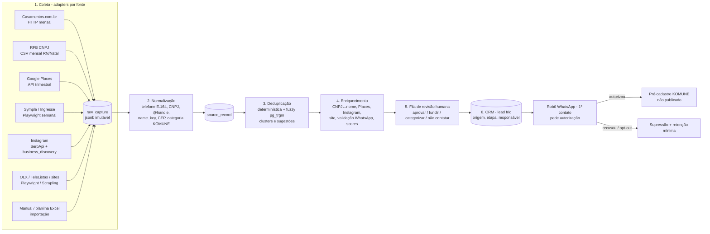

# 03 — Fontes de dados e viabilidade de extração ("Radar de Fornecedores" KOMUNE)

Pesquisa de engenharia de dados para o PRD do CRM de Captação. Data da verificação: **03/09/2026**. Escopo: Natal/RN primeiro (modelo multi-cidade desde o início). Todas as contagens marcadas como "verificado" foram lidas ao vivo nas páginas de listagem; valores marcados como "estimativa" precisam de validação no primeiro run do pipeline.

> Método: fetch real das páginas (HTML servidor → markdown), leitura de `robots.txt`, termos de uso e documentação oficial de APIs. Limitações do ambiente de pesquisa: sem execução de JavaScript e sem acesso a páginas atrás de login (Instagram, Facebook, Sympla renderizado no cliente) — nesses casos a estrutura foi inferida da documentação e da experiência com as plataformas e está sinalizada como "a confirmar com Playwright".

---

## 0. Resumo executivo

1. **Existe um núcleo pequeno e de alta qualidade** (~270 fornecedores únicos em Natal no Casamentos.com.br, com categoria, endereço, preço "a partir de", nota e nº de avaliações) que cobre sozinho a meta de 300 alvos do C1 — mas **sem telefone/WhatsApp/Instagram públicos** (contato só por formulário ou botão "Ver telefone" rastreado). Ele deve ser a **espinha dorsal da lista-alvo**, enriquecida por outras fontes para obter o WhatsApp.
2. **A base de CNPJ da Receita Federal é a fonte mais completa e legalmente mais confortável** (dados abertos, mensal, com DDD+telefone, e-mail, endereço, bairro, situação, data de abertura e flag MEI). Para Natal, só o CNAE 8230-0/01 tem ~1.257 empresas (Econodata); somando os CNAEs de eventos, o universo bruto é de **~5–7 mil estabelecimentos**, dos quais talvez 1.200–1.800 sejam "qualificáveis" (ativos, com celular e presença digital). Custo: zero (self-host do Minha Receita ou carga direta dos CSVs no Supabase).
3. **Google Places API (New)** é a melhor fonte de telefone + site + nota para negócios com presença no Maps, a custo desprezível para o volume de Natal (≈ US$ 10–20/mês, em grande parte dentro das cotas gratuitas: 10 mil chamadas Essentials, 5 mil Pro e 1 mil Enterprise por mês). Restrição: os Termos do Google proíbem armazenar conteúdo além de `place_id` (e lat/lng por 30 dias) — o CRM deve tratar o Places como *gatilho de descoberta* e confirmar/obter os dados definitivos direto com o fornecedor (que é exatamente o fluxo de pré-cadastro com autorização). Alternativas que raspam o Maps (Outscraper US$ 3/mil, Apify US$ 1,50/mil) não têm essa restrição contratual, mas têm risco de ToS próprio.
4. **GetNinjas não serve como base**: as páginas de categoria/cidade viraram landing pages de "pedir orçamento"; não há lista pública de profissionais com perfil navegável (apenas nomes em avaliações), telefone nunca é público e `/pros/*` está bloqueado no robots.txt. Vale só como sinal de demanda.
5. **Instagram é ótimo para achar e péssimo para raspar**: API oficial de hashtags não devolve o autor do post e limita 30 hashtags/7 dias; páginas exigem login; scraping de terceiros (Apify US$ 1,50–2,70/mil) viola ToS da Meta (risco 4/5). Recomendação: descoberta semi-manual (buscas `site:instagram.com` via SerpApi/Google CSE + curadoria da Heloísa) e **enriquecimento oficial por `business_discovery`** (bio, site, seguidores) a partir do @handle; o WhatsApp geralmente está na bio.
6. Pipeline recomendado (custo ≈ US$ 0–60/mês): **Python + Scrapling/Playwright rodando nas máquinas locais → Supabase (Postgres) com `pg_trgm`/`unaccent` → deduplicação determinística (CNPJ, telefone E.164, @instagram, place_id) + fuzzy (nome+bairro) → enriquecimento (CNPJ, Places, Instagram, validação de WhatsApp) → fila de revisão humana → CRM (lead frio com origem/etapa) → pré-cadastro só após autorização por WhatsApp**.

---

## 1. (a) Tabela-catálogo das fontes

Legenda — Dificuldade e Risco: 1 (baixo) … 5 (alto). "Método": HTTP = requisição simples (HTML servidor); PW = Playwright/browser; API = API oficial; SaaS = serviço pago. Cobertura = estimativa de registros úteis para Natal.

| # | Fonte | Campos obtíveis | Cobertura Natal | Método | Dif. | Risco legal/ToS | Custo | Atualização |
|---|---|---|---|---|---|---|---|---|
| 1 | **Casamentos.com.br** (The Knot Worldwide) | nome, categoria, endereço completo (rua, nº, CEP), descrição, preço "a partir de", capacidade (espaços), serviços, nota, nº avaliações e % recomenda, textos de avaliações, nº fotos, selo Awards, promoções, "responde em X" (alguns) | **~290 listagens / ~270 únicos (verificado)**: cerimonial 42, espaços 43, foto 55, vídeo 16, buffet 13, música 39, decoração 13, doces 14, convites 9, lembranças 8, beleza 7, celebrante 7, cabine 5, bebidas 5, florista 4, animação 4, carros 3, bolo 3 | HTTP (HTML servidor; sem anti-bot detectado) | 2 | 3 (ToS §2.3 proíbe crawler/reprodução; robots permite páginas, bloqueia GPTBot e endpoints AJAX) | 0 | mensal |
| 2 | Zankyou | nome, cidade, faixa de preço, capacidade, descrição, formulário | baixa (dezenas; espaços/foto) — *não verificado (DNS falhou)* | HTTP/PW | 2 | 3 | 0 | trimestral |
| 3 | Lápis de Noiva / iCasei (guia unificado) | nome, categoria, cidade, perfil com WhatsApp/site/e-mail (afirmado pelo site) | **13 fornecedores em Natal (verificado)**, maioria papelaria/lembranças | HTTP | 1 | 2 | 0 | trimestral |
| 4 | Constance Zahn (Guia CZ) | nome, categoria, cidades atendidas, portfólio, site/Instagram no perfil | "66 encontrados" para Natal, mas quase todos são fornecedores nacionais de SP que "atendem todo o país"; **locais reais ≈ 5–10** | HTTP | 1 | 2 | 0 | trimestral |
| 5 | Inesquecível Casamento (Guia IC) | nome, cidade, imagem; contato só no perfil | **0 em RN (verificado)** — diretório pago, 7 estados | — | — | — | — | — |
| 6 | Noivas.com | — | não resolvido (domínio não acessível); baixa prioridade | — | — | — | — | — |
| 7 | **GetNinjas** | página por categoria×cidade mostra apenas: avaliações (nome do cliente + primeiro nome/sobrenome do profissional + categoria) e pedidos recentes; **nenhum telefone/site**; perfis `/pros/*` bloqueados no robots | quase nula como lista de fornecedores | PW | 4 | 3 (empresa listada em bolsa; ToS forte) | 0 | — (usar só como sinal de demanda) |
| 8 | Habitissimo / Workana / 99Freelas | serviços de reforma / freelancers remotos | irrelevante para eventos | — | — | — | — | — |
| 9 | **Google Places API (New)** | nome, endereço, lat/lng, tipos, status, **telefone nacional/internacional, site, nota, nº avaliações, horário, faixa de preço**, reviews (Atmosphere), `pureServiceAreaBusiness` | alta para negócios com ficha no Maps: espaços, buffets, restaurantes, confeitarias, floriculturas, salões; média para foto/DJ/cerimonial (via busca textual) — **estimativa 1.000–1.800 fichas úteis** | API | 2 | 3 (Termos proíbem cache/armazenamento exceto `place_id`; lat/lng ≤ 30 dias) | Text Search Enterprise US$ 35/mil (1 mil grátis/mês); Place Details Enterprise US$ 20/mil (1 mil grátis/mês) → **≈ US$ 10–20/mês** | trimestral (re-sync) |
| 10 | Outscraper (Google Maps) | idem + e-mails/redes sociais via "Emails & Contacts" | idem | SaaS | 1 | 3 (raspagem do Maps; risco no provedor) | 500 grátis; US$ 3/mil até 100 mil; US$ 1/mil acima | trimestral |
| 11 | Apify Google Maps Scraper | idem + enriquecimento de contatos/redes sociais (pay-per-event) | idem | SaaS | 1 | 3 | a partir de US$ 1,50/mil lugares + add-ons (contatos ≈ US$ 0,15–0,20/100) | trimestral |
| 12 | SerpApi (Google Maps/Local + Google Search) | resultados de busca e do Maps; útil para `site:instagram.com` | — | SaaS | 1 | 2 | 250 buscas grátis/mês; Starter US$ 25 (1 mil); Developer US$ 75 (5 mil) | sob demanda |
| 13 | **Instagram — Graph API (hashtag)** | ids de mídia, legenda, permalink, likes/comentários, **sem username do autor**; só posts das últimas 24 h (recent) ou top | inútil para descoberta de fornecedores | API | 3 | 1 | 0 | — |
| 14 | **Instagram — Business Discovery (API oficial)** | por @username: biography, website, followers_count, media_count, name, profile_picture_url, mídias | enriquecimento de qualquer conta Business/Creator já identificada | API | 2 | 1 | 0 (exige conta Business própria + app review) | mensal |
| 15 | Instagram — scrapers (Apify instagram-scraper/profile/hashtag; Instaloader) | username, nome, bio, categoria, link externo, seguidores, posts; `business_email`/`business_phone_number` quando expostos; posts por hashtag/local | alta (Natal tem centenas de perfis de eventos) | SaaS/PW | 3 | **4** (ToS Meta proíbe coleta automatizada; bans; dados pessoais) | US$ 1,50–2,70/mil resultados | semanal (hashtags) |
| 16 | **Receita Federal — Dados Abertos CNPJ** | razão social, nome fantasia, CNAE principal/secundários, natureza jurídica, porte, capital, situação + data, data de abertura, endereço (logradouro, nº, compl., bairro, CEP, UF, município SIAFI), DDD+telefone 1/2, e-mail, MEI/Simples, sócios | **total** (100% dos CNPJs); Natal: ~5–7 mil estabelecimentos nos CNAEs de eventos (estimativa) | download mensal (CSV zip, ~5–6 GB total) ou API self-host (Minha Receita) | 2 | **1–2** (dado público por lei; mas telefone/e-mail de MEI = dado pessoal → LGPD/legítimo interesse) | 0 | mensal |
| 17 | Minha Receita (API pública/self-host) | mesmos campos; busca paginada por `uf`, `cnae`, `municipio`, `natureza_juridica` (beta, até 1.000/página, cursor) | idem | API | 1–2 | 1 | 0 | mensal |
| 18 | BrasilAPI `/cnpj/v1/{cnpj}` | mesmos campos, consulta individual | enriquecimento | API | 1 | 1 | 0 (sem SLA; ser gentil no rate) | sob demanda |
| 19 | CNPJ.ws | consulta individual (pública: 3/min); filtros por UF/cidade/CNAE só no plano Premium | idem | API | 1 | 1 | grátis limitado; planos pagos (não divulgados na página) | sob demanda |
| 20 | Casa dos Dados (pesquisa avançada) | filtros: CNAE, UF, município, bairro, CEP, situação, data de abertura, capital, MEI, matriz/filial, **com telefone/e-mail**; export/API nos planos pagos | idem | web/API paga | 1 | 1 | grátis limitado a 20 resultados/página; planos pagos p/ exportação e API | mensal |
| 21 | Econodata | idem + telefones/e-mails "validados", faturamento estimado; amostra grátis | idem | SaaS | 1 | 1 | plano pago (preço sob consulta; página de planos não acessível) | mensal |
| 22 | **Sympla** (eventos em Natal → produtores) | evento, data, local, categoria, **página do produtor** (`/produtor/<id>`: nome, descrição, lista de eventos; às vezes site/Instagram; e-mail via formulário) | dezenas de produtores ativos/mês em Natal (estimativa 80–150 únicos/trimestre) | PW (SPA; SSR entrega "Nada por aqui ainda") | 3 | 2 | 0 | semanal |
| 23 | Eventbrite | evento, organizador (`/o/<slug>`) | baixa em Natal; fetch bloqueado (HTTP 405); API de busca pública descontinuada | PW | 4 | 3 | 0 | mensal |
| 24 | Sites de formaturas (M3TA, Z2, Gideon) + Instagram | nome, telefone, WhatsApp, Instagram, endereço (Z2 verificado: (84) 3346-1506 / WA (84) 99438-7681 / @z2eventos, Capim Macio) | 3–8 empresas | manual/HTTP | 1 | 1 | 0 | única |
| 25 | Abrafesta / ABEOC / ABRAPE (associados) | nome, logo, link do perfil; ABEOC tem filtro por estado; ABRAPE bloqueou fetch (403) | RN: poucos (≤ 10 por entidade, estimativa) | PW/manual | 2 | 1 | 0 | semestral |
| 26 | **OLX Serviços (Natal)** | título, bairro, data, fotos; **telefone só via chat** (WhatsApp às vezes no texto/imagem) | 2.450 anúncios de serviços em Natal (verificado); eventos/festas ≈ 150–300 (estimativa) | PW (paginação `?o=N`) | 3 | 3 | 0 | semanal |
| 27 | Facebook Marketplace/grupos | perfil, posts, telefone no texto | média (grupos locais de fornecedores) | manual (login) | 5 | **4–5** | 0 | manual |
| 28 | TripAdvisor (restaurantes Natal) | nome, nota, nº avaliações, cozinha, faixa de preço, bairro; telefone/site no perfil | **1.239 restaurantes (verificado)**; útil só para "restaurante que faz evento" | PW stealth (anti-bot forte) | 4 | 3 | 0 (Content API oficial exige aprovação) | — (preferir Places) |
| 29 | Airbnb Experiences | título, anfitrião, nota, preço | baixa; robots proíbe | — | 4 | 3 | — | — |
| 30 | TeleListas / GuiaMais | nome, endereço, bairro, telefone ("Ver Tel" por clique), e-mail/site quando há | TeleListas: ~27 "buffet" em Natal (verificado); demais categorias similares; dados frequentemente desatualizados | PW (clique revela telefone) | 2 | 2 | 0 | semestral |
| 31 | Sebrae-RN | sem diretório público de empresas | — | parceria | — | 1 | — | — |
| 32 | Prefeitura de Natal (alvarás/SEMURB) | sem consulta pública de alvarás encontrada; via **pedido LAI (e-SIC)** é possível pedir lista de estabelecimentos licenciados como casa de festas/eventos | ≈ 100–200 (estimativa) | LAI | 2 | 1 | 0 (20+10 dias) | semestral |
| 33 | Sindicatos / Natal Convention & Visitors Bureau | lista de associados (hotéis, espaços, agências, buffets) — **a verificar manualmente** (Sindeventos-RN não localizado) | ≤ 50 | manual | 1 | 1 | 0 | semestral |
| 34 | Guia Natal / Tribuna do Norte | sem diretório estruturado; Tribuna só "informe publicitário" | — | — | — | — | — | — |

---

## 2. Detalhamento por fonte

### 2.1 Casamentos.com.br (grupo The Knot Worldwide / Bodas.net)

**URLs de listagem (padrão descoberto):** `https://www.casamentos.com.br/{slug-categoria}/rio-grande-do-norte/natal` — paginação por sufixo `--2`, `--3` (≈ 20–30 cards por página). Slugs: `cerimonialista`, `espaco-casamento` (com subtipos `salao-casamento`, `restaurante-casamento`, `fazenda-casamento`…), `fotografo-casamento`, `filmagem-casamento`, `buffet-casamento`, `musica-de-casamento` (subpath `dj-para-casamento`), `decoracao-casamento`, `doces-casamento`, `bolo-casamento`, `convites-de-casamento`, `lembrancas-de-casamento`, `florista-casamento`, `carros-casamento`, `animacao-festa`, `beleza-noivas`, `celebrante`, `cabine-de-fotos`, `bebidas-casamento`, `tendas-casamentos` (sem resultados locais — cai na lista nacional).

**Contagens em Natal (03/09/2026, verificado):**

| Categoria | Qtde | Categoria | Qtde |
|---|---|---|---|
| Fotógrafos | 55 | Doces | 14 |
| Espaços | 43 | Buffet | 13 |
| Cerimonialistas | 42 (RN: 53; Mossoró 3, Parnamirim 1) | Decoração | 13 |
| Música (bandas, DJs, solistas, orquestras) | 39 | Convites | 9 |
| Filmagem | 16 | Lembranças | 8 |
| Beleza | 7 | Celebrantes | 7 |
| Cabine de fotos | 5 | Bebidas/bar | 5 |
| Floristas | 4 | Animação | 4 |
| Carros | 3 | Bolos | 3 |
| **Total de listagens** | **290** | **Únicos (estimado, há repetições entre categorias)** | **≈ 270** |

**Card de listagem:** nome (link do perfil `/{categoria}/{slug}--e{id}`), cidade/UF, nota (ex. 4.9) e nº de avaliações, "A partir de R$ X", capacidade (espaços/buffet: "30 a 1000 convidados"), tipo de espaço, trecho da descrição, nº de fotos, badge de promoção, "responde em X" (apenas alguns), botão "Pedir orçamento grátis". **Sem telefone, site ou redes sociais no card.**

**Perfil (ex.: Ativa Cerimoniais; La Mouette Recepções):** nome, descrição longa, **endereço completo com CEP** (ex. "Rua Jaguarari, 2630 | 59064-500 Natal"), mapa, preço a partir de / menu por pessoa, capacidade por salão, lista de serviços (estacionamento, buffet próprio, pista…), nº de fotos/vídeos, nota + nº de avaliações + "% recomenda", avaliações (primeiro nome, data, nota, texto), FAQ, promoções, selo "Casamentos Awards". **Telefone e site ficam atrás de endpoints de clique rastreados** (`emp-ShowTelefonoTrace.php`, `emp-ShowWebsiteTrace.php` — ambos em `Disallow` no robots.txt; em muitos perfis o telefone só aparece para usuário logado ou após "Pedir orçamento"). Instagram/Facebook não são exibidos.

**Técnica:** HTML renderizado no servidor (fetch simples funcionou com user-agent de navegador); nenhum Cloudflare/captcha detectado; JSON-LD não confirmado na conversão para markdown (checar no HTML bruto — provável `ld+json` de `LocalBusiness`). `robots.txt`: `User-agent: *` permite listagens e perfis, bloqueia `/json/`, `/emp-*.php`, `/busc-*.php`, `/apps/empresas/`; **`GPTBot: Disallow: /`**. Sitemaps (`/sitemaps/desktop/vendor-catalog-index.xml`, 39 arquivos) contêm apenas páginas de listagem categoria×cidade, não perfis.

**ToS (Condições Legais, §2.3/§2.4):** proíbe cópia por "Robot/Crawler", reprodução/distribuição de textos, fotos e **bases de dados**; conteúdo enviado pelos fornecedores passa a integrar obra de titularidade do site. **Risco 3/5**: contratual (bloqueio de IP, notificação extrajudicial); baixo risco de litígio para uso interno de ~300 páginas/mês sem republicação. **Mitigações:** volume mínimo (≈ 20 páginas de listagem + ≈ 290 perfis, 1×/mês, 1 req/3–5 s), não baixar fotos nem avaliações (direito autoral), não automatizar "Ver telefone" (buscar telefone em CNPJ/Places/Instagram), armazenar só fatos de negócio (nome, categoria, endereço, faixa de preço, nota/quantidade como sinal de tração) e a URL de origem.

### 2.2 Demais portais de casamento

- **Zankyou** (`zankyou.com.br/espacos-saloes-festa-casamento/cidade/natal`, `/casamentos/cidade/natal`): não pôde ser aberto (falha de DNS no ambiente). Estrutura conhecida: cards com nome, cidade, faixa de preço e capacidade; contato via formulário. Cobertura de Natal historicamente pequena (espaços/fotógrafos). Prioridade baixa; validar com Playwright.
- **Lápis de Noiva / iCasei** (`lapisdenoiva.com/local/rio-grande-do-norte/natal/`): 13 fornecedores em Natal (papelaria, lembranças, 1 celebrante — Rosania Amaral —, 1 cerimonial — Sonhos —, 1 fotógrafo). O guia afirma que o perfil traz WhatsApp/e-mail/site. `revista.icasei.com.br/guia-de-fornecedores` redireciona para o mesmo guia. Fácil (HTML), risco baixo.
- **Constance Zahn** (`constancezahn.com/fornecedores/brasil/rn/natal/`): "66 profissionais encontrados", mas a lista é dominada por fornecedores de SP marcados "atende todo o país"; locais reais são poucos (ex.: Coktelitas Drinks — Maceió/Natal/Fortaleza). Perfil traz site/Instagram. Útil para o segmento luxo/destination wedding.
- **Inesquecível Casamento (Guia IC)**: diretório pago (assinatura), sem fornecedores no RN. Descartar.
- **Noivas.com**: domínio não acessível; irrelevante.

### 2.3 GetNinjas (e Habitissimo/Workana/99Freelas)

- Páginas `getninjas.com.br/eventos/{categoria}/rn/natal` (ex.: `buffet-completo`, `organizacao-de-eventos/formatura`) **não listam profissionais**: mostram formulário de pedido, depoimentos, "pedidos similares em Natal" (nome do cliente + descrição) e avaliações com **primeiro nome/sobrenome do profissional + categoria** (ex.: "Antônio Santos / Buffet Completo"). Categorias de eventos existentes para Natal: animadores infantis, assessores, bandas/cantores, bartenders, brindes, buffets, carros, casting, celebrantes, chocolateiros, churrasqueiros, confeiteiras, DJs, decoração, equipamentos, filmagem, floristas, food truck, fotógrafos, garçons/copeiras, locais, manobristas, organizadores, recepcionistas/cerimonialistas, seguranças, sommeliers, ônibus balada.
- `robots.txt`: `Allow: /` mas `Disallow: /pros/*`, `/usuarios`, `/*page=*`. Perfis públicos de profissionais não são mais expostos nas listagens; telefone nunca é público (modelo de moedas: o profissional paga para responder o pedido).
- **Conclusão:** não é "base" raspável. Usos possíveis: (i) sinal de demanda por categoria/bairro (pedidos recentes) para priorizar prospecção; (ii) parceria comercial. Risco de ToS 3/5, dificuldade 4/5 (SPA + proteções). **Habitissimo** é reforma/casa (sem eventos); **Workana/99Freelas** são freelancers remotos (designers de convite, videomakers) — baixa relevância.

### 2.4 Google Maps / Places API (New) e alternativas

**Preços 2026 (por 1.000 req., faixa 0–100 mil) e cotas gratuitas mensais por SKU (vigentes desde mar/2025):**

| SKU | Text Search / Nearby | Place Details | Grátis/mês |
|---|---|---|---|
| Essentials (IDs Only) | ilimitado grátis (só `id`) | US$ 5 (endereço, geometria, tipos, fotos) | 10.000 |
| Pro | US$ 32 (`displayName`, `businessStatus`, `primaryType`, `googleMapsUri`, `pureServiceAreaBusiness`…) | US$ 17 | 5.000 |
| Enterprise | US$ 35 (**`nationalPhoneNumber`, `internationalPhoneNumber`, `websiteUri`, `rating`, `userRatingCount`, `regularOpeningHours`, `priceLevel`**) | US$ 20 | 1.000 |
| Enterprise + Atmosphere | US$ 40 (`reviews`, `editorialSummary`, atributos) | US$ 25 | 1.000 |

A cobrança é pelo SKU mais alto presente no `FieldMask`. Text Search: máx. 20 por página, até **60 resultados por consulta** via `nextPageToken`; `includedType`, `locationBias`/`locationRestriction` (retângulo), `includePureServiceAreaBusinesses=true` (essencial para DJ/fotógrafo/cerimonial sem loja física).

**Tipos da Tabela A úteis:** `wedding_venue`, `banquet_hall`, `event_venue`, `convention_center`, `community_center`, `concert_hall`, `auditorium`, `catering_service`, `restaurant`, `bar`, `cake_shop`, `bakery`, `confectionery`, `chocolate_shop`, `ice_cream_shop`, `florist`, `night_club`, `dance_hall`, `karaoke`, `amusement_center`, `beauty_salon`, `hair_salon`, `hotel`, `resort_hotel`, `car_rental`. **Não existem** tipos para fotógrafo, DJ, cerimonialista, decorador, som/luz, tendas, brinquedos — usar `textQuery` em português ("fotógrafo de casamento Natal RN", "DJ para festas Natal", "aluguel de brinquedos infláveis Natal", "som e iluminação para eventos Natal") com `locationRestriction` na caixa de Natal + Parnamirim e varrer por bairros (Ponta Negra, Lagoa Nova, Capim Macio, Tirol, Petrópolis, Candelária, Neópolis, Alecrim, Zona Norte) para furar o teto de 60.

**Estimativa de custo (Natal):** ~60 consultas × 3 páginas = 180 Text Search Enterprise (US$ 6,30 → dentro da cota de 1.000) + Place Details Enterprise para ~1.500 fichas (US$ 30 − 1.000 grátis ≈ US$ 10). **≈ US$ 10–20 no primeiro mês; re-sync trimestral menor.**

**Termos (Service Specific Terms §3.2.3 / §14):** só `place_id` pode ser cacheado indefinidamente; lat/lng por até 30 dias; "Google Maps Content" não pode ser pré-buscado, indexado ou armazenado; uso sem mapa Google é permitido, uso com mapa não-Google não. Guardar telefone/site do Places no CRM por tempo indeterminado conflita com a letra dos termos. **Estratégia:** persistir `place_id` + nome + categoria + score; usar telefone/site do Places apenas para o **primeiro contato**; após a autorização, o dado passa a ser "informado pelo fornecedor" (fonte própria). Reconsultar por `place_id` quando precisar (Details Enterprise = US$ 0,02/ficha).

**Alternativas:** Outscraper (500 grátis; US$ 3/mil até 100 mil; "Emails & Contacts" US$ 3/mil domínios — extrai e-mails/Instagram/WhatsApp de sites); Apify `compass/crawler-google-places` (a partir de US$ 1,50/mil lugares; enriquecimento de contatos e perfis sociais como eventos pagos; sem teto de 120 por área); SerpApi (Google Maps/Local; 250 grátis; US$ 25/1 mil; US$ 75/5 mil). Essas raspam a interface do Maps: risco contratual recai sobre o provedor, mas a KOMUNE passa a ter dados obtidos em violação dos termos do Google (risco 3/5, tolerável para uso interno).

### 2.5 Instagram

- **Descoberta por hashtag/local:** páginas `instagram.com/explore/tags/...` exigem login (fetch bloqueado por robots). Hashtags relevantes: `#casamentonatal`, `#casamentorn`, `#noivasrn`, `#noivasnatal`, `#buffetnatal`, `#festanatal`, `#festasnatal`, `#formaturanatal`, `#formaturarn`, `#15anosnatal`, `#eventosnatal`, `#decoracaonatal`, `#fotografonatal`, `#djnatal`, `#cerimonialnatal`, `#espacoparaeventosnatal`. Locais: "Natal, Rio Grande do Norte", "Ponta Negra".
- **Graph API oficial (hashtags):** `ig_hashtag_search` (30 hashtags únicas/7 dias) → `/{id}/recent_media` (só mídias das últimas 24 h) ou `/top_media`; campos `id, caption, media_type, media_url, permalink, like_count, comments_count, timestamp, children`; **"You cannot request the username field on returned media"**. Sem busca por localização. Conclusão: não serve para montar lista de fornecedores.
- **Graph API `business_discovery`:** dada uma conta Business/Creator (`{ig-user-id}?fields=business_discovery.username(handle){biography,website,followers_count,media_count,name,profile_picture_url,media{...}}`), retorna dados públicos; não retorna e-mail/telefone; exige conta Business própria conectada a uma Página e permissões (`instagram_basic`, `instagram_manage_insights`, `pages_read_engagement`) com App Review. Rate limit padrão BUC (~200 chamadas/h por usuário). **Uso: enriquecer @handles já identificados** (extrair WhatsApp/wa.me/linktree da bio por regex).
- **Scrapers de terceiros:** Apify `apify/instagram-scraper` (US$ 2,70/mil no Free, US$ 1,50/mil no Business; posts por hashtag/perfil/local com autor, bio, seguidores, link externo, categoria; `business_email`/`business_phone_number` quando o perfil comercial expõe botões de contato), `instagram-hashtag-scraper`, `instagram-profile-scraper`; Instaloader (open source, precisa de login → bloqueios). Termos da Meta proíbem coleta automatizada sem permissão; risco de ban de contas/IP e de dados pessoais (LGPD). **Risco 4/5.**
- **Rota recomendada (barata e defensável):** (1) descoberta via buscadores — `site:instagram.com "natal" buffet`, `site:instagram.com cerimonial natal rn` etc. — com SerpApi ou Google Programmable Search JSON API (100 consultas grátis/dia; US$ 5/mil) → lista de @handles; (2) curadoria humana (Heloísa/estagiários) em 20 min/dia a partir de seguidores de hubs locais (@casamentos… de Natal, cerimonialistas, espaços); (3) enriquecimento oficial via `business_discovery`; (4) contato pelo WhatsApp da bio. O que se obtém: @handle, nome, bio, categoria, link, seguidores, nº de posts, telefone/WhatsApp quando está na bio ou no botão de contato.

### 2.6 Base de CNPJ (Receita Federal e derivados)

**Fonte primária:** dados abertos do CNPJ (`arquivos.receitafederal.gov.br/dados/cnpj/dados_abertos_cnpj/YYYY-MM/`), atualização **mensal**, arquivos zip: `Empresas0–9`, `Estabelecimentos0–9`, `Socios0–9`, `Simples`, `Cnaes`, `Municipios`, `Naturezas`, `Qualificacoes`, `Motivos`, `Paises` (~5–6 GB compactados). Layout (CSV `;`, Latin-1, sem cabeçalho):
- **Estabelecimentos:** cnpj_basico, cnpj_ordem, cnpj_dv, matriz/filial, **nome_fantasia**, situacao_cadastral (02 = ativa), data_situacao, motivo, cidade_exterior, pais, **data_inicio_atividade**, **cnae_fiscal_principal**, **cnae_fiscal_secundaria** (lista), tipo_logradouro, logradouro, numero, complemento, **bairro**, **cep**, **uf**, **municipio (código SIAFI/TOM — Natal = 1761; não é o IBGE 2408102)**, **ddd_1, telefone_1, ddd_2, telefone_2**, ddd_fax, fax, **correio_eletronico**, situacao_especial.
- **Empresas:** cnpj_basico, **razao_social**, natureza_juridica, qualificacao_responsavel, capital_social, porte, ente_federativo.
- **Simples:** cnpj_basico, opcao_simples, datas, **opcao_mei**, datas.

**Como obter só Natal:** filtrar `Estabelecimentos*` por `uf='RN'` e `municipio=1761` (≈ 60–80 mil linhas) e juntar com `Empresas` e `Simples` → tabela `rfb_estabelecimento_natal` no Supabase (≈ 50 MB). Script Python (pandas/polars/DuckDB) roda em < 30 min numa máquina local. Alternativas: **Minha Receita** self-host (Docker + PostgreSQL; comandos `download`/`transform`; expõe `GET /{cnpj}` e busca paginada `GET /?uf=RN&cnae=8230001&municipio=1761&limit=1000` com `cursor`, beta) — a instância pública `minhareceita.org` redireciona requisições de navegador para a documentação; testar com `curl -H "Accept: application/json"`; **BrasilAPI** (`/api/cnpj/v1/{cnpj}`, grátis, individual); **CNPJ.ws** (pública 3 req/min; filtros por cidade/CNAE só no Premium); **Casa dos Dados** (pesquisa avançada com todos os filtros e "com telefone/e-mail", grátis até 20 resultados por página; exportação e API pagas); **Econodata** (pago; telefones/e-mails validados; a origem do número "1.257 empresas CNAE 8230 em Natal" citado na reunião).

**CNAEs relevantes e volume estimado em Natal** (âncora verificada: 8230-0/01 = 1.257 ativas na Econodata; demais por proporção nacional ≈ 0,45% dos estabelecimentos do país — **validar no primeiro run**):

| CNAE | Descrição | Categoria KOMUNE | Natal (estim.) | Ruído |
|---|---|---|---|---|
| 8230-0/01 | Organização de feiras, congressos, exposições e festas | cerimonial, produtores, decoração, organizadores | **1.257 (verificado)** | médio (muitos MEI genéricos) |
| 8230-0/02 | Casas de festas e eventos | espaços | 150–200 | baixo |
| 5620-1/02 | Alimentação para eventos e recepções — bufê | buffet, churrasqueiro, personal chef | 400–500 | baixo |
| 5611-2/01 | Restaurantes e similares | restaurantes que recebem eventos | 3.000–3.500 | alto (filtrar por nome/Places) |
| 7420-0/01 | Produção de fotografias | fotografia | 1.000–1.300 | médio |
| 7420-0/04 | Filmagem de festas e eventos | vídeo | 250–350 | baixo |
| 9001-9/02 | Produção musical | bandas, DJs, músicos | 500–700 | médio |
| 9001-9/06 | Sonorização e iluminação | som/luz | 250–350 | baixo |
| 7739-0/03 | Aluguel de palcos, coberturas e estruturas temporárias | tendas, palco, estrutura | 70–110 | baixo |
| 7729-2/02 | Aluguel de móveis, utensílios e aparelhos domésticos | mesas/cadeiras/louças | 180–270 | médio |
| 7721-7/00 | Aluguel de equipamentos recreativos e esportivos | brinquedos infláveis, recreação | 90–120 | baixo |
| 9329-8/01 | Discotecas, danceterias, salões de dança | espaços/baladas | 90–130 | baixo |
| 9329-8/99 | Outras atividades de recreação e lazer | recreação infantil, animação | 1.100–1.500 | alto |
| 9319-1/99 | Outras atividades esportivas | tênis/quadras/eventos esportivos | 300–400 | alto |
| 8299-7/99 | Outras atividades de serviços prestados às empresas | garçons, recepcionistas, cerimonial | 2.500–3.000 | muito alto (filtrar por palavras-chave) |
| 4923-0/01 e /02 | Transporte coletivo por fretamento (municipal / inter) | transporte de convidados | 150–200 | médio |
| 1091-1/02 | Padaria/confeitaria com produção própria | bolos, doces | 300–400 | médio |
| 9602-5/01 | Cabeleireiros, manicure | beleza (dia da noiva) | 1.500+ | muito alto |

Total bruto nos CNAEs "limpos" (sem restaurantes, beleza, 8299 e 9329-8/99): **≈ 5–6 mil estabelecimentos**; com filtros (ativa, abertura > 12 meses ou MEI recente, telefone celular presente, nome fantasia ou site) sobram **≈ 1.200–1.800 alvos qualificáveis**.

**Qualidade dos dados (limites):** telefone preenchido em ~60–70% (muitos fixos/desatualizados; MEI costuma ter celular = WhatsApp); e-mail em ~50–60% (frequentemente do contador); nome fantasia vazio em boa parte dos MEI (razão social = "NOME COMPLETO + CPF" → **remover o CPF do nome antes de persistir**); endereço residencial em MEI (não exibir publicamente). Situação "ativa" não significa operante — cruzar com Instagram/Places.

**Novidade útil:** filtrar `data_inicio_atividade` dos últimos 30–60 dias gera automaticamente a lista de **"novos negócios de eventos em Natal"** para prospecção mensal.

### 2.7 Produtores, cerimonialistas e formaturas

- **Sympla:** `sympla.com.br/eventos/natal-rn` é uma SPA (Next.js); o HTML do servidor vem vazio ("Nada por aqui ainda"). Método: Playwright abrindo a busca por cidade e capturando as chamadas XHR internas de busca (paginação por scroll), extraindo `evento → produtor` (`/produtor/<id>`: nome, descrição, logo, eventos passados/futuros; contato geralmente por formulário; alguns exibem site/Instagram). A API pública (`api.sympla.com.br/public/v4`) só lista eventos do próprio organizador (token). Cobertura: dezenas de produtores ativos por mês (shows, festas, cursos, igrejas, corridas). Complementares para festas: Ingresse, Shotgun, Bilheteria Digital, Outgo, Ticket360 (mesma lógica: evento → produtor).
- **Eventbrite:** fetch bloqueado (405); cobertura pequena em Natal; API de busca pública descontinuada. Baixa prioridade.
- **Formaturas:** Z2 Eventos e Cerimonial (verificado: Rua Gustavo Guedes 1857, Capim Macio; tel. (84) 3346-1506; WhatsApp (84) 99438-7681; @z2eventos; também listada no Casamentos.com.br); M3TA e Gideon (sites não resolvidos/SSL inválido no ambiente — usar Instagram e Google Places); CB Formaturas (aparece como fotógrafo no Casamentos.com.br). Lista manual + busca no Instagram por "formaturas natal" + comissões de formatura (UFRN, UnP, Estácio, IFRN) como demanda.
- **Associações:** Abrafesta (diretório WordPress/PMPro com nome + logo, sem filtro por estado visível; poucos no RN), ABEOC Brasil (`abeoc.org.br/associados/`, ~500 associados, filtro por estado e atividade; perfis individuais em `/associados/<empresa>/`), ABRAPE (site retornou 403 para fetch; verificar manualmente se há ABRAPE-RN). Baixo volume, alta qualidade (empresas formais).

### 2.8 Outras fontes

- **OLX Serviços (Natal):** 2.450 anúncios (49 páginas de 50; `?o=N`). Card: título, bairro, data, fotos, "Destaque". **Contato apenas por chat da OLX** (telefone oculto; alguns anúncios trazem WhatsApp no texto/imagem). A URL de subcategoria "eventos-festas" devolveu a lista geral — filtrar por palavras-chave (buffet, festa, decoração, brinquedo, DJ, som, churrasqueiro, cerimonial, fotógrafo). Anti-bot em produção é agressivo (bloqueios por taxa); usar Playwright stealth e volume baixo. Valor: fornecedores informais (recreação infantil, "pegue e monte", decor).
- **Facebook Marketplace/grupos:** login obrigatório; automação = violação clara de ToS (risco 4–5). Usar manualmente: entrar em grupos locais ("Fornecedores de eventos Natal", "Casamento Natal RN", "Formaturas RN") e anotar leads no CRM.
- **TripAdvisor:** 1.239 restaurantes em Natal (30 por página, `oa30`); telefone/site só no perfil; proteção anti-bot forte. Preferir Google Places com `restaurant` + palavras "eventos", "salão", "reservado".
- **Airbnb Experiences:** robots proíbe; poucas experiências em Natal; irrelevante.
- **TeleListas/GuiaMais:** TeleListas mostra ~27 "buffet" em Natal com endereço/bairro e telefone atrás de "Ver Tel" (revelado por clique — Playwright resolve); paginação com `seed`. GuiaMais renderiza via JS. Dados antigos, mas com telefone público → fonte de reconciliação barata.
- **Sebrae-RN:** sem diretório; oportunidade de parceria (turmas de MEI de eventos).
- **Prefeitura de Natal:** não localizada consulta pública de alvarás; caminho: pedido via e-SIC/LAI ("relação de estabelecimentos com alvará de funcionamento cujo CNAE seja 8230-0/02 ou 5620-1/02") — grátis, 20 dias. Redundante com a base CNPJ.
- **Sindicatos / Natal CVB / Guia Natal / Tribuna do Norte:** sem diretórios estruturados encontrados; verificar manualmente a lista de associados do Natal Convention & Visitors Bureau (hotéis e espaços).

---

## 3. (b) Esquema de dados normalizado — "fornecedor capturado"

Princípios: (1) **raw imutável** por captura (auditoria/LGPD); (2) **um registro por fonte** (`source_record`) e **uma entidade resolvida** (`supplier_candidate`) com proveniência campo a campo; (3) multi-cidade desde o início; (4) campos de consentimento/base legal como cidadãos de primeira classe; (5) nada de foto/avaliação armazenada — apenas URL e contagens.

```sql
-- Captura bruta (uma linha por página/objeto obtido)
create table raw_capture (
  id             uuid primary key default gen_random_uuid(),
  source         text not null,          -- 'casamentos', 'rfb_cnpj', 'google_places', 'instagram', 'sympla', 'olx', 'telelistas', 'manual', ...
  source_url     text,
  external_id    text,                   -- id na fonte (e120278, place_id, cnpj, @handle)
  fetched_at     timestamptz not null default now(),
  http_status    int,
  content_hash   text,                   -- sha256 do payload (idempotência)
  payload        jsonb not null,         -- HTML→JSON já parseado ou resposta da API
  run_id         uuid                    -- lote/execução
);

-- Registro normalizado por fonte (ainda não deduplicado)
create table source_record (
  id                 uuid primary key default gen_random_uuid(),
  raw_capture_id     uuid references raw_capture(id),
  source             text not null,
  external_id        text,
  source_url         text,
  name               text,               -- nome como aparece na fonte
  legal_name         text,               -- razão social (RFB)
  cnpj               char(14),
  category_source    text,               -- categoria na fonte (ex. 'fotografo-casamento', CNAE 7420001, 'wedding_venue')
  category_komune    text,               -- mapeada para taxonomia KOMUNE (ver tabela de mapeamento)
  subcategory_komune text,
  description        text,
  address_line       text, bairro text, city text, state char(2), cep char(8),
  lat double precision, lng double precision,
  phones             jsonb,              -- [{"e164":"+5584999999999","kind":"mobile|landline","whatsapp":null|true|false}]
  emails             text[],
  website            text,
  instagram          text,               -- handle sem @ em minúsculas
  facebook           text,
  google_place_id    text,
  rating             numeric(3,2), reviews_count int,
  price_from         numeric(12,2), price_unit text,   -- 'evento' | 'pessoa' | 'hora'
  capacity_min       int, capacity_max int,
  response_time      text,
  photos_count       int, photo_urls text[],           -- apenas URLs (não baixar)
  badges             text[],
  opened_at          date,               -- data_inicio_atividade (RFB)
  is_mei             boolean,
  registry_status    text,               -- 'ativa','baixada','inapta'...
  extra              jsonb,              -- campos específicos da fonte
  captured_at        timestamptz not null,
  unique (source, external_id)
);

-- Entidade resolvida (o "fornecedor capturado" que vai para revisão e CRM)
create table supplier_candidate (
  id                  uuid primary key default gen_random_uuid(),
  canonical_name      text not null,
  legal_name          text,
  cnpj                char(14),
  category_komune     text not null,     -- categoria primária (ex. 'buffet')
  categories          text[],            -- todas as categorias detectadas
  group_komune        text,              -- 'alimentos_bebidas' | 'infraestrutura' | 'servicos' | 'locais' | 'recreacao_infantil'
  city text not null, state char(2) not null, bairro text, address_line text, cep char(8),
  lat double precision, lng double precision,
  phone_primary_e164  text,              -- melhor telefone (preferência: celular c/ WhatsApp validado)
  phones              jsonb,             -- todos, com origem: [{"e164":..,"source":"rfb","whatsapp":true,"checked_at":..}]
  email_primary       text, emails text[],
  website             text, instagram text, facebook text, google_place_id text,
  casamentos_url      text, sympla_producer_url text,
  rating_avg          numeric(3,2), reviews_total int,   -- consolidado (Places + Casamentos)
  price_from          numeric(12,2), capacity_max int,
  opened_at           date, is_mei boolean, registry_status text,
  presence_score      int,               -- 0–100: site, instagram, nota, nº avaliações, fotos
  reachability_score  int,               -- 0–100: celular válido, WhatsApp confirmado, e-mail
  fit_score           int,               -- 0–100: categoria prioritária, cidade, porte
  priority_score      int generated always as ((presence_score+reachability_score+fit_score)/3) stored,
  sources             text[],            -- ['casamentos','rfb_cnpj','google_places']
  field_provenance    jsonb,             -- {"phone_primary_e164":"google_places","address_line":"rfb_cnpj",...}
  dedup_cluster_id    uuid,
  review_status       text not null default 'pending',   -- pending | approved | merged | rejected | needs_info
  reviewed_by         text, reviewed_at timestamptz,
  consent_status      text not null default 'not_contacted', -- not_contacted | contacted | authorized | declined | opt_out
  consent_evidence    jsonb,             -- {"channel":"whatsapp","message_id":..,"at":..,"text":..}
  lgpd_basis          text default 'legitimo_interesse',
  do_not_contact      boolean default false,
  crm_lead_id         uuid,              -- FK para o CRM
  komune_supplier_id  uuid,              -- FK para o pré-cadastro na plataforma (após autorização)
  created_at timestamptz default now(), updated_at timestamptz default now()
);

create table candidate_source_link (      -- N:N candidato ↔ registros de fonte
  candidate_id uuid references supplier_candidate(id),
  source_record_id uuid references source_record(id),
  match_rule text,                        -- 'cnpj' | 'phone' | 'instagram' | 'place_id' | 'fuzzy_name_bairro' | 'manual'
  match_score numeric(4,3),
  primary key (candidate_id, source_record_id)
);

create table dedup_match (                -- sugestões de fusão para revisão
  id uuid primary key default gen_random_uuid(),
  candidate_a uuid, candidate_b uuid, rule text, score numeric(4,3),
  status text default 'pending',          -- pending | merged | not_same
  decided_by text, decided_at timestamptz
);

create table review_task (
  id uuid primary key default gen_random_uuid(),
  candidate_id uuid references supplier_candidate(id),
  kind text,                              -- 'new' | 'merge' | 'category' | 'contact_missing' | 'suspicious'
  assigned_to text, status text default 'open', notes text,
  created_at timestamptz default now(), closed_at timestamptz
);
```

**Taxonomia KOMUNE (mapeamento de origem → categoria):** `espacos` (Casamentos: espaco/salao/restaurante/fazenda; Places: wedding_venue/banquet_hall/event_venue/hotel; CNAE 8230-0/02, 9329-8/01), `buffet` (buffet-casamento; catering_service; 5620-1/02), `fotografia` (fotografo-casamento; 7420-0/01), `video` (filmagem; 7420-0/04), `decoracao_flores` (decoracao, florista; florist), `som_luz_estrutura` (9001-9/06, 7739-0/03; "Som e Luz" no nome), `musica_dj_bandas` (musica-de-casamento; 9001-9/02), `cerimonial_assessoria` (cerimonialista; 8230-0/01 + palavras "cerimonial|assessoria"), `produtor` (Sympla produtor; 8230-0/01 + "produções|eventos"), `doces_bolos` (doces, bolo; cake_shop/confectionery; 1091-1/02), `bebidas_bar` (bebidas; bar), `convites_lembrancas` (convites, lembrancas), `beleza` (beleza-noivas; beauty_salon), `transporte` (carros; 4923-0/xx; car_rental), `mobiliario_equipamentos` (7729-2/02, 7739-0/03, 7721-7/00; "aluguel" no nome), `recreacao_infantil` (animacao; 9329-8/99 + "recreação|brinquedo"), `celebrante`, `cabine_fotos`, `staff` (garçom, segurança, manobrista; 8299-7/99 + palavras), `outros`.

Exemplo de `supplier_candidate` (JSON resumido):

```json
{
  "canonical_name": "La Mouette Recepções",
  "cnpj": "XXXXXXXXXXXXXX",
  "category_komune": "espacos", "group_komune": "locais",
  "city": "Natal", "state": "RN", "bairro": "Lagoa Nova", "address_line": "Rua Jaguarari, 2630", "cep": "59064500",
  "phone_primary_e164": "+5584XXXXXXXXX",
  "phones": [{"e164":"+5584XXXXXXXXX","source":"google_places","kind":"landline","whatsapp":false},
             {"e164":"+5584XXXXXXXXX","source":"rfb_cnpj","kind":"mobile","whatsapp":true,"checked_at":"2026-09-05"}],
  "instagram": "lamouetterecepcoes", "website": "https://…",
  "casamentos_url": "https://www.casamentos.com.br/salao-casamento/la-mouette-recepcoes--e111907",
  "rating_avg": 4.4, "reviews_total": 6, "price_from": 76, "price_unit": "pessoa", "capacity_max": 1200,
  "opened_at": "2009-03-10", "is_mei": false, "registry_status": "ativa",
  "sources": ["casamentos","rfb_cnpj","google_places"],
  "field_provenance": {"address_line":"casamentos","phone_primary_e164":"rfb_cnpj","rating_avg":"casamentos"},
  "presence_score": 78, "reachability_score": 85, "fit_score": 95,
  "review_status": "approved", "consent_status": "not_contacted"
}
```

---

## 4. (c) Estratégia de deduplicação e enriquecimento

### 4.1 Normalização (antes de qualquer match)
- **Telefone:** `phonenumbers` (Python) → E.164; DDD 84 default quando ausente; classificar celular (9 dígitos após DDD, inicia com 9) vs fixo; descartar 0800/inválidos. Guardar todos, eleger `phone_primary` por regra: celular com WhatsApp validado > celular > fixo.
- **CNPJ:** só dígitos, validar DV (`validate-docbr`); `cnpj_basico` (8 dígitos) para agrupar filiais.
- **Instagram:** extrair handle de URLs (`instagram.com/{handle}`), minúsculas, sem `@`; validar regex `^[a-z0-9._]{1,30}$`.
- **Nome:** `unaccent(lower())`, remover pontuação e *stopwords* de negócio (`ltda, me, mei, eireli, s/a, eventos, festas, buffet, cerimonial, assessoria, produções, recepções, fotografia, studio, estúdio, natal, rn`) → `name_key`; para razão social de MEI, remover sequência de 11 dígitos (CPF) e sufixos.
- **Endereço:** CEP (8 dígitos) → bairro/logradouro via base de CEPs (ViaCEP/BrasilAPI) para uniformizar; geocodificar quando faltar lat/lng (Places Essentials ou Nominatim self-host).
- **Site:** host sem `www`, minúsculas; ignorar domínios de plataforma (linktr.ee, wa.me, instagram.com) — extrair o handle/telefone deles.

### 4.2 Regras de match (ordem e confiança)

| Prioridade | Regra | Confiança | Ação |
|---|---|---|---|
| 1 | `cnpj` igual (14 dígitos) | 0,99 | fusão automática |
| 2 | `google_place_id` igual | 0,98 | fusão automática |
| 3 | `instagram` igual | 0,97 | fusão automática |
| 4 | telefone **celular** E.164 igual | 0,95 | fusão automática, exceto se o número aparece em > 3 candidatos (agência/contador) → revisão |
| 5 | telefone fixo igual **e** mesmo bairro/CEP | 0,90 | fusão automática |
| 6 | domínio do site igual | 0,90 | fusão automática |
| 7 | `similarity(name_key_a, name_key_b) ≥ 0,85` (pg_trgm) **e** mesma cidade **e** (mesmo bairro ou CEP com 5 dígitos iguais ou mesma categoria) | 0,70–0,85 | **fila de revisão** (sugestão de merge) |
| 8 | `similarity ≥ 0,92` e mesma cidade, sem outro sinal | 0,65 | fila de revisão |
| 9 | e-mail igual (exceto domínios genéricos/contadores frequentes) | 0,60 | fila de revisão |

Implementação: índices `gin (name_key gin_trgm_ops)`, `btree` em `cnpj`, `instagram`, `google_place_id`, `phone_primary_e164`; blocking por `city` + primeira letra/`metaphone` para evitar O(n²). Para volume de Natal (≈ 6 mil registros), SQL puro basta; para expansão nacional, usar **Splink** (probabilístico, DuckDB/Postgres) ou `dedupe`. **Sobrevivência de campos** (survivorship): dado legal (razão social, CNPJ, abertura, MEI, situação) ← RFB; endereço ← Casamentos > RFB > Places; telefone ← validado por WhatsApp > Places > RFB > TeleListas; nota/avaliações ← Places e Casamentos (guardar separadamente, não somar); categoria ← voto por fonte com pesos (Casamentos 3, Places 2, CNAE 1) + revisão. Registrar `field_provenance` sempre.

### 4.3 Enriquecimento (cadeia por candidato)
1. **CNPJ ↔ nome/telefone:** busca na tabela local da RFB por `name_key` (trigram) + bairro/telefone para vincular CNPJ a fornecedores do Casamentos/Instagram; retorna abertura, MEI, e-mail, situação. Grátis.
2. **Google Places:** `Text Search` "nome + Natal" → `place_id`; `Place Details` (Enterprise) → telefone, site, nota, horário. Custo ≈ US$ 0,05/candidato; cotas cobrem os primeiros 1.000/mês.
3. **Instagram:** se há handle → `business_discovery` (bio, site, seguidores) → regex para `+55 84 9…`, `wa.me/…`, `linktr.ee` (seguir o link e extrair WhatsApp). Se não há handle → busca `site:instagram.com "<nome>" natal` (SerpApi/CSE) e revisão humana.
4. **Site do fornecedor:** Firecrawl/Scrapling extrai `tel:`, `wa.me`, `mailto:`, links sociais e JSON-LD (grátis/centavos).
5. **Validação de WhatsApp:** checar se o número tem conta WhatsApp (Evolution API/Baileys `onWhatsApp`, ou WhatsApp Business Cloud API `contacts` quando disponível) — com o número corporativo dedicado e taxa baixa (≤ 200/dia) para não derrubar o número. Marcar `phones[].whatsapp`.
6. **Scores:** `presence_score` (site 20, Instagram 25, ≥ 500 seguidores +10, nota ≥ 4,5 com ≥ 10 avaliações 25, fotos ≥ 10 10, Casamentos 10), `reachability_score` (celular 40, WhatsApp confirmado 40, e-mail 10, fixo 10), `fit_score` (categoria prioritária da onda 1 = 100, onda 2 = 70, outras 40; fora de Natal/Parnamirim −50).
7. **Fila de revisão humana** (Heloísa/estagiários): aprovar/corrigir categoria, escolher telefone, confirmar merges, marcar "não contatar". Meta: ≤ 60 s por registro; 300 registros ≈ 5 h.
8. **CRM:** aprovado → `lead` (origem = fonte(s), etapa = "prospectado", temperatura = frio, responsável, próxima ação = "1º contato WhatsApp"). Após resposta "autoriza" → `consent_status = authorized` + evidência (id da mensagem) → **pré-cadastro** na plataforma KOMUNE (não publicado) usando somente dados autorizados; fotos só as enviadas pelo fornecedor.

### 4.4 Atualização e higiene
- Re-execução mensal (RFB: novos CNPJs e baixas; Casamentos: novos perfis), trimestral (Places re-sync por `place_id`), semanal (Sympla/OLX/Instagram monitorados). Novos registros passam pelas mesmas regras; alterações geram `review_task` do tipo `changed` apenas para campos-chave (telefone, situação = baixada).
- Direito de oposição/opt-out: qualquer "não quero" no WhatsApp → `do_not_contact = true` + supressão em novas cargas (lista de bloqueio por telefone/CNPJ/handle).
- Retenção: `raw_capture` de fontes com dados pessoais (Instagram, OLX) apagado após 90 dias; candidatos rejeitados sem contato apagados após 12 meses.

---

## 5. (d) Estimativa de volume de alvos em Natal por categoria

| Categoria KOMUNE | Casamentos.com.br (verif.) | Base CNPJ (estim.) | Google Places (estim.) | Instagram/outros (estim.) | **Únicos após dedup (estim.)** | **Qualificáveis** (ativo + celular/WhatsApp + presença) |
|---|---|---|---|---|---|---|
| Espaços/locais (casas de festa, salões, sítios, hotéis, restaurantes p/ eventos) | 43 | 150–200 (8230-0/02) + restaurantes selecionados | 150–250 | 50 | **220–320** | 120–150 |
| Buffet / churrasqueiro / personal chef | 13 | 400–500 | 100–150 | 60 | **300–400** | 100–130 |
| Fotografia | 55 | 1.000–1.300 (muitos inativos) | 80–120 | 200 | **450–650** | 150–200 |
| Vídeo | 16 | 250–350 | 30 | 60 | **150–220** | 60–80 |
| Decoração e flores | 13 + 4 | 150–250 (CNAE difuso) | 60–100 | 120 | **180–260** | 80–100 |
| Som, luz e estruturas (palco, tenda) | 1–2 | 300–450 | 60 | 60 | **250–350** | 80–100 |
| Música, DJ, bandas, atrações | 39 | 500–700 | 40 | 200 | **400–600** | 120–150 |
| Cerimonial / assessoria / produtores | 42 | 1.257 (8230-0/01, misto) + Sympla 80–150 | 60 | 120 | **350–450** | 100–150 (meta: 60 produtores) |
| Doces, bolos, confeitaria | 14 + 3 | 300–400 | 80 | 150 | **250–350** | 60–80 |
| Bebidas / bar | 5 | 30–60 | 20 | 30 | **50–80** | 25–30 |
| Convites, papelaria, lembranças | 9 + 8 | 40–80 | 20 | 40 | **60–90** | 25–30 |
| Beleza (dia da noiva) | 7 | 1.500+ (filtrar) | 300+ | 50 | **80–120 (alvo restrito)** | 30 |
| Transporte / carros | 3 | 150–200 | 30 | 10 | **80–120** | 25–30 |
| Mobiliário, equipamentos, aluguel (mesas, louças, brinquedos) | 0 | 350–500 | 60 | 60 | **250–350** | 60–80 |
| Recreação infantil / animação | 4 | 200–400 (dentro de 9329-8/99) | 30 | 100 | **120–200** | 40–50 |
| Celebrantes / cabine de fotos / staff (garçom, segurança, manobrista) | 7 + 5 | 100–200 | 20 | 40 | **100–150** | 40–50 |
| **Total** | **≈ 290** | **≈ 5.000–7.000 (bruto)** | **≈ 1.100–1.400** | **≈ 1.300** | **≈ 3.300–4.700** | **≈ 1.200–1.500** |

Leitura: a meta do C1 (300 alvos fornecedores + 60 produtores até 18/09) é coberta com folga só pelo Casamentos.com.br + Sympla + os ~1.000 melhores CNPJs; as 14 categorias com ≥ 5 fornecedores são atingíveis em todas as linhas, exceto talvez bebidas/convites/transporte se exigir "qualificado com WhatsApp confirmado" (aí 25–30 cada).

---

## 6. Ferramentas recomendadas e desenho do pipeline

### 6.1 Ferramentas (avaliação)

| Ferramenta | Papel no pipeline | Prós | Contras | Custo |
|---|---|---|---|---|
| **Python + Scrapling 0.4.x** (`Fetcher`, `StealthyFetcher` c/ Camoufox, `DynamicFetcher`/Playwright, spider com checkpoints, MCP para Claude) | coletor principal para HTML estático (Casamentos, TeleListas, sites de fornecedores) e páginas protegidas (OLX, TripAdvisor) | anti-bot embutido (Cloudflare Turnstile), relocação adaptativa de seletores, BSD-3, roda nas máquinas locais | ecossistema menor que Scrapy/Crawlee | 0 |
| **Playwright (Python/Node)** | Sympla (SPA/XHR), OLX, TeleListas ("Ver Tel"), captura de chamadas internas | padrão de mercado; Claude Code escreve rápido | consumo de CPU; manutenção de seletores | 0 |
| **Crawlee (Node/Python; Apify, open source)** | alternativa ao Scrapling se o time preferir TypeScript; fila persistente, autoscaling, rotação de proxy/fingerprints | robusto para crawls maiores (expansão nacional) | mais infraestrutura de código | 0 |
| **Apify Store** (Google Maps, Instagram) | atalhos pagos por resultado, sem infra | rápido de ligar; JSON pronto | ToS da fonte; custo por volume | Free US$ 5/mês; Starter US$ 19; Maps ≥ US$ 1,50/mil; Instagram US$ 1,50–2,70/mil |
| **Outscraper** | Google Maps em lote + e-mails/contatos por domínio | 500 grátis; simples | idem | US$ 3/mil |
| **Google Places API (New)** | descoberta/enriquecimento oficial (telefone, site, nota) | oficial, barato no volume de Natal | não pode armazenar conteúdo (só `place_id`) | ≈ US$ 10–20/mês |
| **SerpApi / Google Programmable Search JSON API** | achar @handles e sites (`site:instagram.com …`) | evita raspar o Instagram | custo por busca | SerpApi 250 grátis, US$ 25/mil; CSE 100 grátis/dia, US$ 5/mil |
| **Firecrawl** (hosted; há versão open source) | scrape → markdown/JSON de sites de fornecedores e extração com LLM | 1 crédito/página; Free 1.000 créditos; Hobby US$ 16/5 mil | não necessário se Scrapling + Claude já fazem o parse | 0–16 US$/mês |
| **Claude (API) com web fetch / web search** | parsing semântico de páginas em JSON (schema), classificação de categoria, extração de WhatsApp de bios/descrições; agente de revisão | web fetch sem custo extra (tokens); web search US$ 10/mil; respeita robots.txt | web fetch não executa JS (não serve para Sympla/OLX); só URLs presentes no contexto | tokens (Haiku para parse em massa) |
| **Browserless** | browsers hospedados se não quiser usar as máquinas locais | captcha solving, BrowserQL, proxies | desnecessário com 3 PCs locais | Free 1.000 unidades; US$ 25/mês (20 mil) |
| **Supabase/Postgres** (`pg_trgm`, `unaccent`, `postgis` opcional) + **Splink** (fase 2) | armazenamento, dedup, filas | já contratado; SQL simples resolve Natal | — | 0 |
| **Evolution API / Baileys** (open source) ou WhatsApp Cloud API | validar WhatsApp; enviar 1º contato com número dedicado | grátis; roda no PC dedicado | risco de bloqueio do número se houver spam → aquecimento + limites | 0 |
| Metabase (já planejado) | painel do radar (cobertura por categoria/bairro, taxa de autorização) | — | — | 0 |

### 6.2 Pipeline (desenho)



**Execução sugerida (rodada de 15 dias):**
- D1–D2: carga RFB (RN/Natal) no Supabase + crawler Casamentos (listagens + perfis) + importação da planilha atual → primeira dedup (esperado: ~2.000 candidatos, ~300 com alta prioridade).
- D3–D4: Google Places (60 consultas + Details dos top 1.000) + enriquecimento CNPJ↔nome; validação de WhatsApp dos top 500.
- D5: interface de revisão (pode ser uma view no próprio CRM/Metabase + formulário) e treinamento da Heloísa; aprovação dos 300 primeiros alvos.
- D6–D7: Sympla/Ingresse → produtores (60 alvos); Instagram semi-manual para categorias fracas (decoração, recreação, som/luz).
- D8–D15: operação (disparos, follow-up) com re-execução semanal dos coletores leves; métricas: cobertura por categoria, % com WhatsApp válido, taxa de resposta/autorização por fonte (para decidir onde investir).

**Custo mensal estimado:** infra 0 (máquinas locais + Supabase existente); Places US$ 10–20; SerpApi 0–25; Apify/Outscraper 0–20 (opcional); tokens Claude ≈ US$ 5–15 (parse/classificação). **Total ≈ US$ 15–80/mês.**

---

## 7. (e) Riscos e limitações técnicas

**Legais e de conformidade**
1. **LGPD:** dados de MEI e profissionais autônomos (telefone celular, e-mail, nome) são dados pessoais. Base legal: **legítimo interesse** (art. 7º, IX e art. 10) para prospecção B2B, com **teste de balanceamento (LIA) documentado**, finalidade específica (convite para cadastro na plataforma), minimização (não armazenar fotos, avaliações, CPF, endereço residencial de MEI), transparência no primeiro contato ("obtivemos seu contato em fontes públicas; se não quiser receber mensagens, responda SAIR") e **opt-out imediato**. Dados de acesso público (art. 7º, §§3º–4º) continuam sujeitos à finalidade e à boa-fé. Manter registro de operações (ROPA) e evidência de autorização por fornecedor.
2. **Termos de uso:** Casamentos.com.br (§2.3 proíbe crawler e reprodução da base), GetNinjas, OLX, Meta/Instagram (proíbe coleta automatizada), Google Maps Platform (proíbe armazenar conteúdo além de `place_id`). Consequências típicas: bloqueio de IP/conta, notificação; litígio improvável para uso interno de baixo volume sem republicação — mas **nunca publicar conteúdo raspado** (fotos/textos) na KOMUNE sem autorização (Lei 9.610 — direito autoral das fotos; e a ideia do "anúncio fake" já foi descartada).
3. **WhatsApp:** disparos em massa a partir de número não oficial (Baileys) podem banir o número; usar aquecimento, ≤ 100–200 novos contatos/dia, mensagens personalizadas, e considerar a Cloud API oficial para o volume maior.

**Técnicos**
4. **Telefone raramente é público nos marketplaces** (Casamentos, GetNinjas, OLX, Zankyou): o WhatsApp virá de CNPJ, Places, Instagram (bio), TeleListas e sites próprios — logo o **enriquecimento é o coração do sistema**, não o scraper do marketplace.
5. **Renderização no cliente e anti-bot:** Sympla (SPA), OLX, TripAdvisor, Eventbrite (405) e Instagram exigem Playwright/stealth e volume baixo; sites mudam de layout — isolar seletores por adapter, testes de fumaça semanais, alertas quando a contagem cai > 30%.
6. **Qualidade da base RFB:** telefones fixos/desatualizados, e-mails de contadores, razão social com CPF (mascarar), endereços residenciais, "ativa" ≠ operante; município em código SIAFI (1761) — mapear com `Municipios.zip`.
7. **Teto de 60 resultados no Text Search** e ausência de tipos para fotógrafo/DJ/cerimonial → varredura por bairro + consultas textuais; `includePureServiceAreaBusinesses` obrigatório.
8. **Dedup fuzzy** gera falsos positivos com nomes genéricos ("Buffet da Ana", "Espaço Vip") — exigir bairro/telefone como segundo sinal e manter humano no laço.
9. **Escala multi-cidade:** o modelo já é `city/state`; para outros estados, a base RFB e o Places escalam linearmente; portais de casamento têm mais cobertura em capitais grandes (SP/RJ podem ter 1.000+ por categoria → paginação e rate limiting mais cuidadosos).
10. **Ambiente de pesquisa:** contagens de CNAE são estimativas (a API pública do Minha Receita redireciona navegadores; validar com `curl -H "Accept: application/json"` ou carga local); Zankyou/Noivas/M3TA/Gideon/ABRAPE não puderam ser abertos.

---

## 8. (f) Fontes consultadas (URLs)

**Casamentos.com.br e portais**
- https://www.casamentos.com.br/robots.txt · https://www.casamentos.com.br/condicoes-legais-br.php · https://www.casamentos.com.br/sitemaps/desktop/vendor-catalog-index.xml
- Listagens Natal: https://www.casamentos.com.br/fotografo-casamento/rio-grande-do-norte/natal · https://www.casamentos.com.br/espaco-casamento/rio-grande-do-norte/natal · https://www.casamentos.com.br/cerimonialista/rio-grande-do-norte/natal · https://www.casamentos.com.br/buffet-casamento/rio-grande-do-norte/natal · https://www.casamentos.com.br/filmagem-casamento/rio-grande-do-norte/natal · https://www.casamentos.com.br/musica-de-casamento/rio-grande-do-norte/natal · https://www.casamentos.com.br/decoracao-casamento/rio-grande-do-norte/natal · https://www.casamentos.com.br/doces-casamento/rio-grande-do-norte/natal · https://www.casamentos.com.br/convites-de-casamento/rio-grande-do-norte/natal · https://www.casamentos.com.br/lembrancas-de-casamento/rio-grande-do-norte/natal · https://www.casamentos.com.br/beleza-noivas/rio-grande-do-norte/natal · https://www.casamentos.com.br/celebrante/rio-grande-do-norte/natal · https://www.casamentos.com.br/cabine-de-fotos/rio-grande-do-norte/natal · https://www.casamentos.com.br/bebidas-casamento/rio-grande-do-norte/natal · https://www.casamentos.com.br/florista-casamento/rio-grande-do-norte/natal · https://www.casamentos.com.br/animacao-festa/rio-grande-do-norte/natal · https://www.casamentos.com.br/carros-casamento/rio-grande-do-norte/natal · https://www.casamentos.com.br/bolo-casamento/rio-grande-do-norte/natal · https://www.casamentos.com.br/cerimonialista/rio-grande-do-norte
- Perfis: https://www.casamentos.com.br/cerimonialista/ativa-cerimoniais--e120278 · https://www.casamentos.com.br/salao-casamento/la-mouette-recepcoes--e111907
- https://www.constancezahn.com/fornecedores/brasil/rn/natal/ · https://lapisdenoiva.com/local/rio-grande-do-norte/natal/ · https://lapisdenoiva.com/fornecedores/ · https://guia.inesquecivelcasamento.com.br/pesquisa · https://www.zankyou.com.br/espacos-saloes-festa-casamento/cidade/natal (não acessível no ambiente)

**GetNinjas / outros marketplaces**
- https://www.getninjas.com.br/robots.txt · https://www.getninjas.com.br/local/rn/natal · https://www.getninjas.com.br/eventos/buffet-completo/rn/natal · https://www.getninjas.com.br/eventos/organizacao-de-eventos/formatura/rn/natal
- https://www.olx.com.br/servicos/estado-rn/rio-grande-do-norte/natal · https://www.tripadvisor.com.br/Restaurants-g303518-Natal_State_of_Rio_Grande_do_Norte.html · https://www.telelistas.net/rn/natal/buffet · https://www.guiamais.com.br/natal-rn/buffet

**Google Maps Platform e alternativas**
- https://developers.google.com/maps/billing-and-pricing/pricing · https://developers.google.com/maps/documentation/places/web-service/usage-and-billing · https://developers.google.com/maps/documentation/places/web-service/text-search · https://developers.google.com/maps/documentation/places/web-service/place-types · https://cloud.google.com/maps-platform/terms/maps-service-terms
- https://outscraper.com/pricing/ · https://apify.com/compass/crawler-google-places · https://apify.com/pricing · https://serpapi.com/pricing

**Instagram / Meta**
- https://developers.facebook.com/docs/instagram-platform/instagram-graph-api/reference/ig-hashtag-search · https://developers.facebook.com/docs/instagram-platform/instagram-graph-api/reference/ig-hashtag/recent-media · https://developers.facebook.com/docs/instagram-platform/instagram-graph-api/reference/ig-user/business_discovery · https://apify.com/apify/instagram-scraper · https://help.instagram.com/581066165581870

**CNPJ**
- https://arquivos.receitafederal.gov.br/dados/cnpj/dados_abertos_cnpj/ (robots bloqueia fetch automatizado; acessar por navegador/wget) · https://docs.minhareceita.org/ · https://docs.minhareceita.org/como-usar/ · https://minhareceita.org/ · https://brasilapi.com.br/docs · https://www.cnpj.ws/ · https://casadosdados.com.br/solucao/cnpj/pesquisa-avancada · https://www.econodata.com.br/lista-empresas

**Produtores, formaturas, associações**
- https://www.sympla.com.br/eventos/natal-rn · https://www.eventbrite.com.br/d/brazil--natal/events/ (405) · https://www.z2eventos.com.br/ · https://www.abrafesta.com.br/associados/ · https://abeoc.org.br/associados/ · https://abrape.com.br/ (403)

**Ferramentas**
- https://github.com/D4Vinci/Scrapling · https://crawlee.dev/ · https://www.firecrawl.dev/pricing · https://www.browserless.io/pricing · https://platform.claude.com/docs/en/agents-and-tools/tool-use/web-search-tool · https://platform.claude.com/docs/en/agents-and-tools/tool-use/web-fetch-tool

**Outros**
- https://www.sebrae.com.br/sites/PortalSebrae/ufs/rn · https://tribunadonorte.com.br/ · https://www.gov.br/anpd/pt-br/ (Guia Orientativo de Legítimo Interesse, 2024 — localizar na seção "Documentos e publicações")
