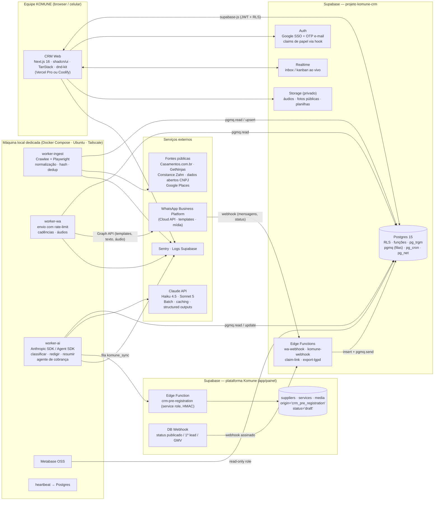
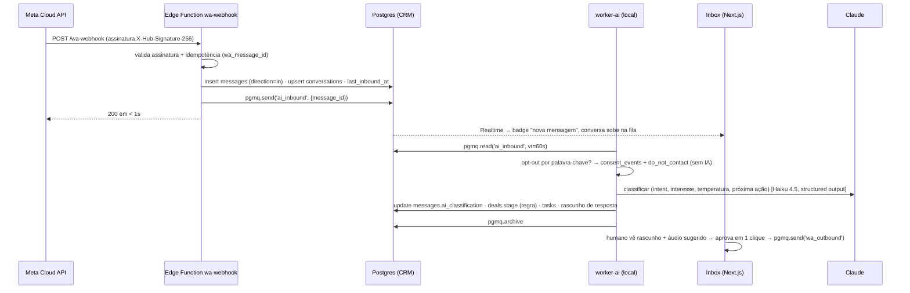
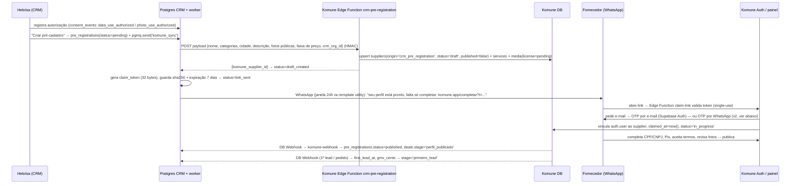

# 05 — Arquitetura técnica do CRM de Captação KOMUNE

**Pesquisa para o PRD · versão 0.1 · 03/09/2026 · pt-BR**
Escopo: decisão "construir vs. adotar base open source", stack recomendada, modelo de dados (DDL esboçado), integrações com a plataforma Komune, camada de IA, segurança/LGPD, plano de sprints e custos. Contexto de entrada: `00-brief-contexto.md`.

> **Resumo executivo (TL;DR)**
> 1. **Construir do zero em cima da Supabase** (projeto separado `komune-crm`, mesma organização) com **Next.js 16 + TypeScript + shadcn/ui + TanStack Query/Table + dnd-kit**, lógica de negócio em Postgres (RLS, funções, `pgmq`, `pg_cron`) e **workers Node** (Crawlee/Playwright + Anthropic SDK) rodando em Docker na **máquina local dedicada**, com a mesma imagem implantável em Fly.io/Railway como contingência.
> 2. Nenhum CRM open source (Twenty, Frappe, EspoCRM, Odoo) cobre mais de ~30% do escopo pedido (scraper + dedup, inbox de WhatsApp com IA e áudio, cadências, rotas, pré-cadastro na Komune, metas + "agente de cobrança", LGPD). Todos impõem uma segunda stack (NestJS/Redis, Python/MariaDB, PHP/MySQL) fora da Supabase. **Atomic CRM (MIT, React + shadcn + Supabase)** é a única base com encaixe perfeito, mas é um *starter kit* de CRUD: vale como **pedreira de código** (import CSV, notas/tarefas/tags, e-mail inbound) e como plano B "CRM em 48h", não como fundação.
> 3. **WhatsApp: usar a API oficial (WhatsApp Business Platform / Cloud API) como canal principal.** Custo irrisório no volume da KOMUNE (≈ US$ 40–80/mês), sem risco de banimento e compatível com LGPD. A Evolution API (Baileys) fica como opção **explicitamente não recomendada** para disparo frio: Meta intensificou banimentos em 2026 e a v2.4 passou a exigir ativação de licença num servidor da Evolution Foundation. O "áudio com voz humana da Heloísa" é resolvido com uma **biblioteca de áudios pré-gravados** enviados dentro da janela de 24h (gratuita).
> 4. **IA com Claude**: Haiku 4.5 (US$ 1/5 por MTok) para classificação/extração em massa (Batch API, −50%), Sonnet 5 (US$ 2/10) para redação, resumos e o agente de cobrança; *structured outputs* e *prompt caching*. Custo estimado para 600 contatos / 5 mil mensagens-mês: **≈ US$ 45–90/mês**.
> 5. **Custo total de infra + APIs: ≈ US$ 150–250/mês (≈ R$ 800–1.400)** — Supabase Pro + compute extra, Vercel Pro (1 assento) ou Coolify, WhatsApp, Claude, Sentry free, Metabase OSS na máquina local.
> 6. **Cronograma**: MVP em 2 semanas (até 18/09, alinhado ao checkpoint C1 "300 alvos + 60 produtores no CRM"), v1 em 6 semanas (16/10), v2 em 10 semanas (13/11).

---

## 1. Premissas e critérios de decisão

| Premissa (do brief) | Consequência arquitetural |
|---|---|
| Equipe pequena; Claude Code constrói; Matheus dá suporte; Luiz cuida de TI | Stack única em TypeScript; poucos serviços; tudo versionado em Git; zero "no-code" no caminho crítico |
| "MVP em dias"; rodada de 15 dias de captação a partir de 04/09 | Primeira entrega útil (importar planilha + kanban + disparo/inbox) em 5 dias úteis; o resto incremental |
| Supabase já contratada; preferência por open source e infra própria | Supabase como backend único (Postgres/Auth/Storage/Realtime/Edge Functions/Queues/Cron); workers em Docker na máquina local |
| 3 máquinas dedicadas para agentes 24/7 | Workers "portáteis" (mesma imagem roda local ou em nuvem); nada crítico de *recepção* depende da máquina estar ligada |
| Pessoalidade (Heloísa), áudio humano, sem cara de robô | IA redige, humano aprova (human-in-the-loop) no primeiro contato; áudios reais pré-gravados; robô só em passos determinísticos |
| Transparência e LGPD; sem "anúncio fake" | Pré-cadastro com dados públicos, autorização registrada (`consent_events`), opt-out em 1 palavra, retenção e eliminação a pedido |
| Multi-cidade desde o modelo | `cities` + `state` em organizações; nada "hard-coded" para Natal |
| Integração futura com a plataforma (Supply Gap, leads, publicação, Viva Positivo, Asana) | Fronteira clara: Edge Function na Komune + webhooks/fila; nunca escrever direto no banco da Komune a partir do CRM |

Critérios da matriz (peso): aderência ao escopo (30%), velocidade até MVP (20%), encaixe com Supabase (15%), custo de customização (15%), operação/custo (10%), licença/risco (10%).

---

## 2. Bases open source avaliadas (estado em setembro/2026)

### 2.1 Fichas técnicas

**Twenty CRM** — TypeScript/Nx, React + NestJS (BullMQ), PostgreSQL + Redis; GraphQL e REST, webhooks, objetos e campos customizados em *runtime*, workflows (retry, logs por passo, iteradores, atribuição round-robin), agentes de IA e MCP, "apps" em TypeScript, permissões por papel e por campo, import AI de CSV, e-mail/calendário (Gmail/Microsoft/IMAP). 53,7 mil estrelas; v2.26.0 (31/07/2026); licença **AGPL-3.0**; self-host via Docker Compose (mín. 2 GB RAM, `ENCRYPTION_KEY`, Postgres + Redis); nuvem US$ 9/usuário/mês. Limitações citadas por revisões: automação "funcional mas não poderosa", relatórios fracos, sem app nativo.
*Encaixe*: melhor CRM OSS genérico de 2026, mas é uma **segunda plataforma completa** (banco, auth, filas, storage) ao lado da Supabase. Inbox WhatsApp, scraper, rotas, pré-cadastro e cobrança seriam apps externos falando com a API do Twenty — duas UIs, dois modelos de dados, dois pontos de RLS/LGPD. Customizar a UI (inbox lado a lado com o deal, aprovação de rascunho de IA) significa lutar contra o framework. Risco médio: ritmo de releases quinzenal com mudanças de schema.

**Atomic CRM (Marmelab)** — React + Vite + shadcn/ui (**shadcn-admin-kit**, migrado do react-admin na v1.5.0 de 10/03/2026) + React Query + React Router, backend **Supabase** (Postgres/Auth/Storage/Edge Functions). Contatos, empresas, deals em kanban, notas, tarefas com lembrete, tags, import/export CSV, e-mail inbound por cópia (Edge Function), SSO, app mobile, múltiplos meios de contato por pessoa. **MIT**, ~1,2 mil estrelas, testes Playwright/Jest, dev com Docker/Node 22/Make.
*Encaixe*: mesma stack que recomendamos, licença permissiva, schema simples e legível. Porém: SPA Vite (sem camada servidor), modelo genérico (companies/contacts/deals) sem pipelines múltiplos, segmentos, conversas, cadências, ingestão ou consentimento; quem diverge do `shadcn-admin-kit` passa a manter um fork. **Uso recomendado: pedreira** (copiar o import CSV, notas/tarefas/tags, a Edge Function de e-mail inbound, padrões de RLS) e **plano B** se a equipe precisar de algo clicável no dia 1.

**Frappe CRM** — Python (Frappe Framework) + Vue 3 (Frappe UI), MariaDB/Redis; leads/deals, kanban, call logs (Twilio/Exotel), templates de e-mail, WhatsApp via app `frappe_whatsapp` (**somente Cloud API oficial; primeiro contato só por template aprovado**). v1.x estável (Frappe v15–16), v2 instável (v17). **AGPL-3.0**, 3,4 mil estrelas; Frappe Cloud ou Docker/bench.
*Encaixe*: UI bonita, mas stack Python/MariaDB totalmente fora da Supabase; customização exige aprender Frappe (DocTypes, hooks). Só faz sentido para quem já usa ERPNext.

**EspoCRM** — PHP/MySQL, maduro (entity manager, workflows no pacote Advanced pago), extensões de WhatsApp de terceiros; licença migrou de GPLv3 para **AGPLv3** em dez/2023. *Encaixe*: fora da stack; UI datada; custo de customização em PHP alto para a equipe.

**Odoo CRM (v19)** — Python + PostgreSQL + OWL; Community **LGPL-3**; módulos de WhatsApp, Studio, entre outros, são **Enterprise (pagos)** (conhecimento geral; conferir na tabela de edições). *Encaixe*: ERP inteiro para um problema de captação; curva de aprendizado e peso operacional incompatíveis com "MVP em dias".

**Chatwoot** (inbox omnichannel) — Rails + Postgres + Redis/Sidekiq; núcleo **MIT**, pasta `enterprise/` com licença comercial (Captain AI, SSO/SAML, audit log, SLA, capacidade de agentes, marca). WhatsApp via **Cloud API com Embedded Signup** (recomendado) ou Twilio; Instagram DM, e-mail, site. Nuvem: Hacker (grátis), US$ 19/39/99 por agente; self-host Community grátis. Apps mobile para agentes, atribuição, etiquetas, respostas prontas, automações, *agent bots* via webhook/API.
*Encaixe*: **melhor inbox pronto** do mercado OSS; mas duplica o conceito de contato/conversa, exige seu próprio Postgres (não o da Supabase) e coloca a equipe em duas telas. Recomendação: **inbox próprio e enxuto no MVP/v1** (volume de 5 mil msgs/mês é pequeno; o valor está na conversa *ao lado do deal* com IA classificando e movendo etapa); **reavaliar Chatwoot na v2** se Instagram DM e atendimento multi-agente virarem prioridade.

**Evolution API** — Node/TypeScript/Express, Prisma (Postgres/MySQL), Redis; conecta via **Baileys (WhatsApp Web não oficial) ou Cloud API oficial**; integrações nativas com Chatwoot, Typebot, OpenAI, Dify, n8n, RabbitMQ/Kafka/SQS, S3/MinIO; transcrição de áudio via OpenAI. Licença Apache-2.0 com cláusulas de marca (v2.3.x). **v2.4.0 (rc1 06/05/2026, rc2 17/05/2026): toda instância precisa ativar licença no servidor da Evolution Foundation, senão responde 503 `LICENSE_REQUIRED`** — o preço/condições não estão descritos nas notas de release. Aparece um segundo provedor ("evolution-go").
*Encaixe/risco*: excelente ferramenta de gateway, mas o modo Baileys viola os termos da Meta; artigos de 2026 relatam que banimentos "chegam em semanas" e que a Meta "intensificou significativamente" a ação contra clientes não oficiais. Um número novo disparando 300–600 primeiros contatos em 15 dias é o padrão clássico de bloqueio — e perderia o histórico e o número da empresa. Ver §4.3.

**n8n / Activepieces / Trigger.dev** — n8n: *fair-code* (Sustainable Use License), ótimo para integrações, mas fluxos em JSON são difíceis de testar/revisar e adicionam um serviço a operar. Activepieces: **MIT**, blocos de IA nativos, agentes, 700+ integrações. Trigger.dev: Apache-2.0, tarefas duráveis em código, self-host pesado (vários containers). *Decisão*: **código primeiro** (workers TypeScript + `pgmq` + `pg_cron`) — Claude Code gera, testa e versiona melhor do que grafos; Activepieces opcional na v2 para automações "não-dev" (Asana, Google Sheets).

**Refine / Retool / Appsmith** (admin rápido) — Refine v6 (MIT, provider Supabase) acelera CRUD, mas com shadcn + TanStack Table + Claude Code o ganho é marginal e o custo é mais uma abstração. Retool (SaaS por usuário) e Appsmith (Apache-2.0) servem para painéis internos descartáveis; aqui o Metabase OSS cobre dashboards. *Decisão*: não usar.

**Crawlee (Apify)** — Apache-2.0, JS/TS e Python; crawlers Playwright/Puppeteer/Cheerio, fila de requisições, autoscaling, rotação de proxy, fingerprinting, session pool, storage local. Roda 100% local (Apify Console opcional). *Decisão*: **adotar** como framework de scraping nos workers.

### 2.2 Matriz de decisão (1 = ruim, 5 = ótimo)

| Opção | Aderência (30%) | Velocidade MVP (20%) | Supabase (15%) | Customização (15%) | Operação/custo (10%) | Licença/risco (10%) | **Nota** |
|---|---|---|---|---|---|---|---|
| **Construir (Next.js + Supabase + workers)** | 5 | 4 | 5 | 5 | 4 | 4 | **4,60** |
| Fork do Atomic CRM (MIT) | 3 | 5 | 5 | 4 | 5 | 4 | 4,15 |
| Twenty CRM + apps externos | 3 | 4 | 1 | 2 | 3 | 3 | 2,75 |
| Frappe CRM | 3 | 3 | 1 | 2 | 2 | 3 | 2,45 |
| EspoCRM | 2 | 3 | 1 | 2 | 3 | 3 | 2,25 |
| Odoo CRM | 2 | 2 | 1 | 1 | 2 | 2 | 1,70 |

Componentes (não concorrem com o CRM, entram ou não como peças):

| Peça | Decisão | Motivo |
|---|---|---|
| WhatsApp Cloud API (Meta, direto, sem BSP) | **Adotar** | Oficial, barato, sem banimento, templates + janela 24h gratuita, áudio suportado |
| Evolution API (Baileys) | **Não** para disparo; opcional isolado | Risco de banimento + licença 2.4 incerta |
| Chatwoot | Reavaliar na v2 | Inbox próprio basta no MVP/v1 |
| Crawlee + Playwright | Adotar | Framework maduro, Apache-2.0 |
| pgmq (Supabase Queues) + pg_cron | Adotar | Sem Redis; durável; exposto por RLS |
| BullMQ + Redis | Não (por ora) | Só se latência sub-segundo ou milhares de jobs/min |
| Metabase OSS | Adotar (máquina local) | Já planejado; AGPL, grátis, ilimitado |
| Sentry (Developer free) | Adotar | 5 mil erros/mês grátis |
| Cloudflare Tunnel | Opcional | Só para expor Metabase/UI internas da máquina local |
| Activepieces | v2, opcional | MIT; automações da equipe não-dev |

### 2.3 Registro de decisões (ADR resumido)

1. **Construir do zero** (ADR-01) — ver §2.2.
2. **Projeto Supabase separado `komune-crm`**, mesma org (ADR-02): isola dados de prospecção (base legal distinta: legítimo interesse) do banco de clientes; RLS mais simples; migrações independentes; custo marginal ≈ US$ 10/mês (Micro).
3. **Postgres como cérebro** (ADR-03): regras (normalização, dedup, estágios, metas) em funções SQL/PLpgSQL; UI e workers finos.
4. **Recepção sempre em nuvem, processamento na máquina local** (ADR-04): webhooks da Meta e da Komune caem em Edge Functions (sempre no ar) e vão para `pgmq`; workers consomem quando estiverem ligados. Nenhuma mensagem se perde se a máquina cair.
5. **Human-in-the-loop por padrão** (ADR-05): IA classifica e rascunha; humano aprova envios de conversa; envios automáticos só em cadências com template aprovado, confirmações e opt-out.
6. **Um deal por organização por pipeline** (ADR-06): `unique (organization_id, pipeline_id)`.
7. **Ingestão unificada** (ADR-07): planilhas e scrapers passam pela mesma esteira `ingest_jobs → ingested_records → revisão → organizations`.
8. **Chaves de dedup**: CNPJ (14 dígitos), telefone E.164, handle do Instagram normalizado, domínio do site; nome por trigram apenas como *sugestão* de duplicata.
9. **Sem CPF, dados bancários ou Pix no CRM** (ADR-09): isso nasce só na plataforma Komune quando o fornecedor completa o cadastro.
10. **Modelos Claude**: Haiku 4.5 para volume; Sonnet 5 para linguagem; Opus/Fable só sob demanda (ADR-10).

---

## 3. Arquitetura recomendada

### 3.1 Visão geral



### 3.2 Fluxos principais

**Mensagem recebida no WhatsApp**



**Pré-cadastro na Komune** — ver §5.

### 3.3 Stack, justificativas e alternativas

| Camada | Escolha | Por quê | Alternativas consideradas |
|---|---|---|---|
| Web app | **Next.js 16.3** (App Router, Turbopack, React 19.2) + TypeScript | Padrão de mercado que o Claude Code domina; route handlers para poucos endpoints server-side; Vercel preview por PR | Vite SPA (como Atomic CRM) — mais simples, mas sem camada servidor; Remix/TanStack Start |
| UI | **shadcn/ui** + Tailwind + **TanStack Table** (listas densas, filtros, colunas) + **TanStack Query** (cache/otimismo) + **dnd-kit** (kanban acessível) | Componentes copiáveis (sem lock-in), mesma família do Atomic CRM | MUI/Ant (mais pesados); react-beautiful-dnd (descontinuado) |
| Formulários/validação | react-hook-form + **zod** (mesmos schemas no worker) | Tipos compartilhados UI ↔ workers ↔ RPC | — |
| Banco/back-end | **Supabase Postgres** (RLS, funções, `pg_trgm`, `unaccent`, `citext`), **Auth** (Google SSO restrito ao domínio + OTP por e-mail; papel no JWT via Custom Access Token Hook), **Storage** (buckets privados, URLs assinadas), **Realtime** (inbox/kanban), **Edge Functions** (webhooks), **Queues/pgmq**, **Cron/pg_cron**, **pg_net** | Tudo já contratado; Pro inclui 8 GB de banco, 100 GB de storage, 2 M invocações, 500 conexões Realtime/5 M msgs, logs 7 dias | Projeto Postgres próprio na máquina local (perderia Auth/Storage/Realtime prontos) |
| Filas/agendamento | **pgmq** (durável, *exactly-once* dentro do *visibility timeout*, exposta por RLS, painel no dashboard) + **pg_cron** (até cada segundo; ≤ 8 jobs concorrentes, ≤ 10 min cada) | Zero infra extra; o worker local só precisa de uma conexão Postgres | BullMQ + Redis (MIT; só se precisar de milhares de jobs/min ou rate-limit sofisticado); Trigger.dev |
| Workers | **Node 22 + TypeScript** em Docker Compose na máquina local: `worker-ingest` (**Crawlee** + Playwright), `worker-wa` (envios, cadências), `worker-ai` (Anthropic SDK; **Agent SDK** para o agente de cobrança). Mesma imagem publicável em **Fly.io/Railway** em minutos | Máquinas dedicadas já existem; Crawlee resolve fila, proxies, fingerprint; workers idempotentes sobre pgmq | Edge Functions para scraping (inviável: 2 s de CPU, 256 MB, 400 s de *wall clock*); Apify (pago) |
| Conectividade local → Supabase | Conexão via **Supavisor (pooler) em modo sessão** (IPv4) ou add-on IPv4; **Tailscale** (grátis) para administrar a máquina; **Cloudflare Tunnel** (`cloudflared`, saída-somente) apenas se for expor Metabase/Evolution UI | Nada de porta aberta em casa/escritório; recepção de webhooks fica em Edge Functions | ngrok pago |
| WhatsApp | **Cloud API oficial direto na Meta** (sem BSP): templates de marketing para o primeiro contato, janela de 24 h para conversa livre e áudios, templates de utilidade para lembretes | Ver §4.3 | Evolution API (Baileys); Twilio/360dialog (BSP cobram taxa) |
| IA | **Claude**: Haiku 4.5 (classificação/extração, Batch API), Sonnet 5 (redação, resumos, cobrança); *structured outputs*, *prompt caching*, *tool use* | Ver §6 | Modelos locais (Ollama) na máquina dedicada para classificação trivial (custo zero, qualidade menor) |
| Observabilidade | **Sentry Developer** (grátis: 5 mil erros, 1 usuário; Team US$ 26) no Next.js e workers; logs de Edge Functions/Postgres no Supabase (Logflare, 7 dias); tabela `worker_heartbeats` + `pg_cron` alerta se worker calar > 10 min | Custo zero no MVP | Grafana/Loki self-host (mais ops) |
| CI/CD | GitHub Actions: lint + typecheck + Vitest + `supabase db lint`; migrações com Supabase CLI (`db push` no merge); **Vercel** (preview por PR) ou **Coolify** (VPS Hetzner ≈ € 4–8/mês ou na própria máquina local); imagem dos workers no GHCR, `docker compose pull` automatizado (Watchtower) | Vercel Hobby **proíbe uso comercial** → Pro US$ 20/assento; Coolify é grátis e sem lock-in | Netlify; Railway |
| BI | **Metabase OSS** (AGPL, usuários ilimitados) na máquina local com role Postgres read-only; **PostHog** no app (já planejado) | Dashboards de metas/funil sem código; relatório de segunda 8h gerado por worker | Supabase Reports (limitado) |

### 3.4 Estrutura do repositório (monorepo)

```
komune-crm/
  apps/web/            # Next.js 16 (App Router)
  apps/workers/        # Node 22: ingest, wa, ai (uma imagem, 3 comandos)
  packages/schema/     # zod + tipos gerados (supabase gen types)
  packages/prompts/    # prompts versionados (.md) + evals mínimos
  supabase/
    migrations/        # DDL (§4) — fonte da verdade
    functions/         # wa-webhook, komune-webhook, claim-link, export-lgpd
    seed.sql           # categorias, pipelines/etapas, cidades, templates
  infra/local/         # docker-compose.yml (workers, metabase, cloudflared opcional)
  .github/workflows/   # ci.yml, deploy-db.yml, build-workers.yml
```

---

## 4. Modelo de dados (DDL esboçado, Postgres 15+ / Supabase)

Convenções: `uuid` para entidades de negócio, `serial` para catálogos; `created_at/updated_at` em tudo (trigger); *soft delete* onde há PII (`deleted_at`, `anonymized_at`); normalização por trigger; unicidade por índices parciais. Comentários `-- ...` explicam decisões.

```sql
-- =====================================================================
-- KOMUNE CRM — schema v0.1 (esboço para o PRD)
-- =====================================================================
create extension if not exists pgcrypto;   -- gen_random_uuid, pgp_sym_encrypt
create extension if not exists citext;
create extension if not exists pg_trgm;    -- similaridade de nomes (sugestão de duplicata)
create extension if not exists unaccent;
create extension if not exists pgmq;       -- Supabase Queues
create extension if not exists pg_cron;    -- Supabase Cron
create extension if not exists pg_net;     -- HTTP assíncrono

create schema if not exists app;           -- funções e tipos internos

-- ---------- tipos ----------
create type app.org_kind      as enum ('fornecedor','produtor','cerimonialista','espaco','empresa','outro');
create type app.temperature   as enum ('frio','morno','quente','cliente');
create type app.deal_status   as enum ('open','won','lost','paused');
create type app.activity_type as enum ('call','visit','meeting','message','note','email','stage_change','system');
create type app.task_status   as enum ('todo','doing','done','cancelled');
create type app.task_kind     as enum ('call','visit','meeting','message','follow_up','other');
create type app.channel       as enum ('whatsapp','instagram','email','phone','presencial','other');
create type app.msg_direction as enum ('in','out');
create type app.msg_type      as enum ('text','audio','image','video','document','template','interactive','reaction','system');
create type app.msg_status    as enum ('queued','sent','delivered','read','failed','received');
create type app.user_role     as enum ('admin','gestor','sdr','embaixador','leitura');
create type app.consent_kind  as enum ('contact_optin','contact_optout','data_use_authorized','photo_use_authorized',
                                       'data_use_revoked','access_request','erasure_request','erasure_done');
create type app.prereg_status as enum ('pending','draft_created','link_sent','in_progress','completed',
                                       'published','rejected','expired');
create type app.review_status as enum ('new','approved','rejected','merged','duplicate');
create type app.source_kind   as enum ('scrape','import','manual','api','referral');
create type app.goal_metric   as enum ('new_targets','first_contacts','replies','meetings_booked','visits_done',
                                       'pre_registrations','published');
create type app.goal_period   as enum ('day','week','month');

-- ---------- funções utilitárias ----------
-- Telefone BR -> E.164 (+55DDDNÚMERO). Insere o 9 em celulares antigos de 8 dígitos; mantém fixos com 10.
create or replace function app.normalize_phone_br(p text) returns text
language plpgsql immutable as $$
declare d text := regexp_replace(coalesce(p,''), '\D', '', 'g');
begin
  if d = '' then return null; end if;
  if left(d,2) = '55' and length(d) in (12,13) then d := substr(d,3); end if;  -- remove DDI
  if left(d,1) = '0'  and length(d) in (11,12) then d := substr(d,2); end if;  -- remove 0 de operadora
  if length(d) = 10 and substr(d,3,1) between '6' and '9' then               -- celular sem o 9
     d := substr(d,1,2) || '9' || substr(d,3);
  end if;
  if length(d) not in (10,11) then return null; end if;
  return '+55' || d;
end $$;

create or replace function app.normalize_instagram(h text) returns text
language sql immutable as $$
  select nullif(lower(regexp_replace(regexp_replace(trim(h),
           '^(https?://)?(www\.)?instagram\.com/', '', 'i'), '^@|[/?].*$', '', 'g')), '')
$$;

create or replace function app.normalize_cnpj(c text) returns text
language sql immutable as $$
  select case when length(regexp_replace(coalesce(c,''), '\D', '', 'g')) = 14
              then regexp_replace(c, '\D', '', 'g') else null end
$$;  -- validação dos dígitos verificadores: função app.cnpj_is_valid() (omitida)

create or replace function app.website_domain(u text) returns text
language sql immutable as $$
  select nullif(lower(regexp_replace(regexp_replace(trim(u), '^(https?://)?(www\.)?', '', 'i'), '[/?#].*$', '')), '')
$$;

-- Papel do usuário lido do JWT (injetado pelo Custom Access Token Hook a partir de profiles.role)
create or replace function app.role() returns app.user_role
language sql stable as $$
  select coalesce((auth.jwt() -> 'app_metadata' ->> 'app_role')::app.user_role, 'leitura')
$$;

create or replace function app.set_updated_at() returns trigger language plpgsql as $$
begin new.updated_at := now(); return new; end $$;

-- ---------- pessoas do time ----------
create table teams (
  id serial primary key,
  name text not null
);

create table profiles (                       -- 1:1 com auth.users
  id uuid primary key references auth.users(id) on delete cascade,
  full_name text not null,
  role app.user_role not null default 'sdr',
  team_id int references teams,
  phone_e164 text,                             -- para o agente de cobrança falar com a pessoa
  is_active boolean not null default true,
  daily_digest_at time default '08:00',
  created_at timestamptz not null default now(),
  updated_at timestamptz not null default now()
);

-- ---------- catálogos ----------
create table cities (
  id serial primary key,
  name text not null,
  state char(2) not null,
  ibge_code text,
  unique (name, state)
);

create table categories (                    -- taxonomia comercial do CRM (≠ taxonomia da Komune)
  id serial primary key,
  slug text not null unique,
  name text not null,
  "group" text not null check ("group" in
    ('alimentos_bebidas','infraestrutura','servicos','locais','recreacao','producao')),
  priority smallint not null default 0,      -- onda 1 / onda 2
  komune_category_key text                   -- mapeamento para a categoria no app Komune
);

create table sources (                        -- registro de operações de tratamento (LGPD art. 37)
  id serial primary key,
  slug text not null unique,
  name text not null,
  kind app.source_kind not null,
  base_url text,
  legal_basis text not null default 'legitimo_interesse',   -- + dados manifestamente públicos (art. 7, §4)
  terms_notes text,                           -- avaliação dos termos de uso da fonte
  robots_ok boolean,
  is_enabled boolean not null default true,
  config jsonb not null default '{}',         -- seletores, paginação, rate limit
  created_at timestamptz not null default now()
);

create table tags (
  id serial primary key,
  name text not null unique,
  color text
);

-- ---------- organizações e pessoas ----------
create table organizations (
  id uuid primary key default gen_random_uuid(),
  kind app.org_kind not null default 'fornecedor',
  name text not null,
  legal_name text,
  cnpj text,                                  -- 14 dígitos (trigger normaliza)
  phone_e164 text,                            -- telefone principal/WhatsApp comercial
  email citext,
  instagram_handle text,                      -- sem @, minúsculo (trigger normaliza)
  website text,
  website_domain text,                        -- derivado (trigger)
  city_id int references cities,
  neighborhood text,
  address text,
  lat double precision, lng double precision, -- para rotas de visita
  price_range text,                           -- ex.: '$$', 'R$ 2–5 mil'
  rating numeric(3,2), reviews_count int,     -- copiados da fonte pública (com origem)
  description text,
  photo_urls text[] default '{}',             -- URLs públicas de origem (não copiar sem autorização)
  source_id int references sources,
  source_url text,
  owner_id uuid references profiles,          -- responsável comercial
  temperature app.temperature not null default 'frio',
  komune_supplier_id uuid,                    -- id no banco da Komune após pré-cadastro
  custom jsonb not null default '{}',
  search_name text,                           -- nome sem acento/minúsculo (trigger) p/ trigram
  created_at timestamptz not null default now(),
  updated_at timestamptz not null default now(),
  deleted_at timestamptz,
  anonymized_at timestamptz
);
-- chaves de dedup (índices únicos parciais; soft-deleted não bloqueiam)
create unique index organizations_cnpj_uq      on organizations (cnpj)             where cnpj is not null and deleted_at is null;
create unique index organizations_instagram_uq on organizations (instagram_handle) where instagram_handle is not null and deleted_at is null;
create unique index organizations_phone_uq     on organizations (phone_e164)       where phone_e164 is not null and deleted_at is null;
create index organizations_domain_idx on organizations (website_domain) where website_domain is not null;
create index organizations_search_trgm on organizations using gin (search_name gin_trgm_ops);
create index organizations_city_kind_idx on organizations (city_id, kind) where deleted_at is null;
create index organizations_owner_idx on organizations (owner_id);

create or replace function app.organizations_normalize() returns trigger language plpgsql as $$
begin
  new.cnpj := app.normalize_cnpj(new.cnpj);
  new.phone_e164 := app.normalize_phone_br(new.phone_e164);
  new.instagram_handle := app.normalize_instagram(new.instagram_handle);
  new.website_domain := app.website_domain(new.website);
  new.search_name := lower(unaccent(new.name));
  new.updated_at := now();
  return new;
end $$;
create trigger organizations_normalize before insert or update on organizations
  for each row execute function app.organizations_normalize();

create table organization_categories (
  organization_id uuid references organizations on delete cascade,
  category_id int references categories,
  is_primary boolean not null default false,
  primary key (organization_id, category_id)
);
create unique index organization_categories_primary_uq
  on organization_categories (organization_id) where is_primary;

create table organization_tags (
  organization_id uuid references organizations on delete cascade,
  tag_id int references tags on delete cascade,
  primary key (organization_id, tag_id)
);

create table contacts (                        -- pessoas (donos, sócios, gerentes)
  id uuid primary key default gen_random_uuid(),
  full_name text not null,
  first_name text,
  phone_e164 text,                             -- WhatsApp pessoal (trigger normaliza)
  email citext,
  instagram_handle text,
  role_title text,
  is_decision_maker boolean not null default false,
  preferred_channel app.channel not null default 'whatsapp',
  do_not_contact boolean not null default false,  -- mantido por trigger de consent_events
  source_id int references sources,
  notes text,
  created_at timestamptz not null default now(),
  updated_at timestamptz not null default now(),
  deleted_at timestamptz,
  anonymized_at timestamptz
);
create unique index contacts_phone_uq on contacts (phone_e164) where phone_e164 is not null and deleted_at is null;
create index contacts_email_idx on contacts (email) where email is not null;

create table organization_contacts (
  organization_id uuid references organizations on delete cascade,
  contact_id uuid references contacts on delete cascade,
  role text,
  is_primary boolean not null default false,
  primary key (organization_id, contact_id)
);

-- ---------- pipeline ----------
create table pipelines (
  id serial primary key,
  slug text not null unique,                   -- 'fornecedor', 'produtor'
  name text not null,
  kind app.org_kind not null
);

create table stages (
  id serial primary key,
  pipeline_id int not null references pipelines,
  slug text not null,
  name text not null,
  position int not null,
  temperature app.temperature not null default 'frio',  -- frio/morno/quente/cliente derivado da etapa
  is_won boolean not null default false,
  is_lost boolean not null default false,
  sla_hours int,                               -- máximo sem atividade antes de virar "parado"
  unique (pipeline_id, slug), unique (pipeline_id, position)
);
-- seed (fornecedor): prospectado → contato → conversa → apresentacao → interessado → cadastro_iniciado
--   → perfil_completo → perfil_publicado → primeiro_lead → proposta → contratacao → recorrencia (+ perdido)
-- seed (produtor): identificado → contato → demonstracao → evento_escolhido → evento_criado
--   → participantes_convidados → ativados → evento_realizado → novo_evento (+ perdido)

create table deals (
  id uuid primary key default gen_random_uuid(),
  organization_id uuid not null references organizations on delete cascade,
  pipeline_id int not null references pipelines,
  stage_id int not null references stages,
  status app.deal_status not null default 'open',
  owner_id uuid references profiles,
  primary_contact_id uuid references contacts,
  source_id int references sources,
  entered_stage_at timestamptz not null default now(),
  last_activity_at timestamptz,
  next_action text,
  next_action_at timestamptz,
  lost_reason text,                            -- motivo da perda (campo mínimo do Contexto Mestre)
  won_at timestamptz, lost_at timestamptz,
  ai_summary text,                             -- resumo da conversa (IA)
  ai_next_action jsonb,                        -- sugestão estruturada da IA
  created_at timestamptz not null default now(),
  updated_at timestamptz not null default now(),
  unique (organization_id, pipeline_id)        -- ADR-06: um deal por organização por pipeline
);
create index deals_board_idx on deals (pipeline_id, stage_id, owner_id) where status = 'open';
create index deals_next_action_idx on deals (next_action_at) where status = 'open';
create index deals_stuck_idx on deals (entered_stage_at) where status = 'open';

create table deal_stage_history (
  id bigserial primary key,
  deal_id uuid not null references deals on delete cascade,
  from_stage_id int references stages,
  to_stage_id int not null references stages,
  changed_by uuid references profiles,         -- null = automação/IA
  reason text,
  changed_at timestamptz not null default now()
);

create or replace function app.deals_track_stage() returns trigger language plpgsql as $$
begin
  if tg_op = 'UPDATE' and new.stage_id is distinct from old.stage_id then
    insert into deal_stage_history (deal_id, from_stage_id, to_stage_id, changed_by)
      values (new.id, old.stage_id, new.stage_id, auth.uid());
    new.entered_stage_at := now();
    select s.temperature into new.temperature from stages s where s.id = new.stage_id;
    update organizations o set temperature = new.temperature where o.id = new.organization_id;
  end if;
  new.updated_at := now();
  return new;
end $$;
create trigger deals_track_stage before update on deals for each row execute function app.deals_track_stage();

-- ---------- atividades, tarefas, agenda ----------
create table activities (                      -- tudo que aconteceu (timeline)
  id uuid primary key default gen_random_uuid(),
  type app.activity_type not null,
  organization_id uuid references organizations on delete cascade,
  contact_id uuid references contacts on delete set null,
  deal_id uuid references deals on delete set null,
  user_id uuid references profiles,            -- null = sistema/IA
  occurred_at timestamptz not null default now(),
  duration_min int,
  outcome text,                                -- 'atendeu','nao_atendeu','interessado','sem_interesse','reagendou'
  body text,
  channel app.channel,
  message_id uuid,                             -- link para messages quando type='message'
  metadata jsonb not null default '{}',
  created_at timestamptz not null default now()
);
create index activities_org_idx on activities (organization_id, occurred_at desc);
create index activities_user_day_idx on activities (user_id, occurred_at desc);

create table tasks (
  id uuid primary key default gen_random_uuid(),
  title text not null,
  kind app.task_kind not null default 'follow_up',
  status app.task_status not null default 'todo',
  priority smallint not null default 2,        -- 1 alta · 2 normal · 3 baixa
  due_at timestamptz,
  assignee_id uuid references profiles,
  organization_id uuid references organizations on delete cascade,
  deal_id uuid references deals on delete cascade,
  contact_id uuid references contacts on delete set null,
  created_by uuid references profiles,
  origin text not null default 'manual',       -- 'manual' | 'cadence' | 'ai' | 'system'
  completed_at timestamptz,
  created_at timestamptz not null default now(),
  updated_at timestamptz not null default now()
);
create index tasks_assignee_due_idx on tasks (assignee_id, due_at) where status in ('todo','doing');

create table appointments (                    -- reuniões (manhã, vídeo) e visitas (tarde, rota)
  id uuid primary key default gen_random_uuid(),
  kind text not null check (kind in ('video','visita','ligacao')),
  status text not null default 'scheduled' check (status in ('scheduled','done','no_show','cancelled','rescheduled')),
  starts_at timestamptz not null,
  ends_at timestamptz,
  user_id uuid not null references profiles,
  organization_id uuid references organizations on delete cascade,
  contact_id uuid references contacts,
  deal_id uuid references deals,
  meet_url text,
  address text, lat double precision, lng double precision,
  route_id uuid,                               -- agrupamento da rota do dia
  route_order smallint,
  notes text,
  created_at timestamptz not null default now(),
  updated_at timestamptz not null default now()
);
create index appointments_user_day_idx on appointments (user_id, starts_at);

create table routes (                          -- rota de ~4 visitas por tarde
  id uuid primary key default gen_random_uuid(),
  user_id uuid not null references profiles,
  route_date date not null,
  start_address text, start_lat double precision, start_lng double precision,
  optimized_order jsonb,                       -- [{appointment_id, eta}]
  total_km numeric(6,1),
  maps_url text,                               -- link Google Maps multi-parada
  unique (user_id, route_date)
);
alter table appointments add constraint appointments_route_fk foreign key (route_id) references routes;

-- ---------- metas ----------
create table goals (
  id uuid primary key default gen_random_uuid(),
  user_id uuid references profiles,            -- null = meta do time
  team_id int references teams,
  metric app.goal_metric not null,
  period app.goal_period not null,
  period_start date not null,
  target int not null,
  created_by uuid references profiles,
  created_at timestamptz not null default now(),
  unique (user_id, metric, period, period_start)
);
-- progresso calculado (view) a partir de activities/deals/pre_registrations — não persistido
create or replace view goal_progress as
select g.*,
  case g.metric
    when 'first_contacts'    then (select count(*) from activities a where a.user_id = g.user_id
                                   and a.type = 'message' and a.metadata->>'first_contact' = 'true'
                                   and a.occurred_at::date >= g.period_start)
    when 'visits_done'       then (select count(*) from appointments ap where ap.user_id = g.user_id
                                   and ap.kind = 'visita' and ap.status = 'done'
                                   and ap.starts_at::date >= g.period_start)
    when 'meetings_booked'   then (select count(*) from appointments ap where ap.user_id = g.user_id
                                   and ap.created_at::date >= g.period_start)
    else 0 end as achieved
from goals g;  -- (esboço; completar métricas restantes)

-- ---------- conversas / WhatsApp ----------
create table conversations (
  id uuid primary key default gen_random_uuid(),
  channel app.channel not null default 'whatsapp',
  wa_phone_e164 text not null,                 -- número do outro lado
  organization_id uuid references organizations on delete set null,
  contact_id uuid references contacts on delete set null,
  deal_id uuid references deals on delete set null,
  status text not null default 'open' check (status in ('open','pending','snoozed','resolved')),
  assignee_id uuid references profiles,        -- "inbox com responsável"
  last_message_at timestamptz,
  last_inbound_at timestamptz,                 -- janela de 24 h = now() - last_inbound_at < 24h
  unread_count int not null default 0,
  ai_summary text,
  ai_intent text,                              -- 'interessado','sem_interesse','pediu_info','agendar','opt_out',...
  ai_temperature app.temperature,
  snoozed_until timestamptz,
  created_at timestamptz not null default now(),
  updated_at timestamptz not null default now(),
  unique (channel, wa_phone_e164)
);
create index conversations_inbox_idx on conversations (status, assignee_id, last_message_at desc);

create table message_templates (
  id serial primary key,
  slug text not null unique,
  name text not null,
  channel app.channel not null default 'whatsapp',
  category text not null check (category in ('marketing','utility','authentication','service','internal')),
  meta_template_name text,                     -- nome aprovado na Meta (para category ≠ service)
  meta_status text,                            -- 'approved','pending','rejected'
  language text not null default 'pt_BR',
  body text not null,                          -- com {{1}}, {{2}} ...
  variables jsonb not null default '[]',       -- [{"n":1,"field":"contact.first_name"}]
  audio_asset_id uuid,                         -- áudio a enviar junto (na janela de 24h)
  is_active boolean not null default true,
  created_at timestamptz not null default now()
);

create table audio_assets (                    -- áudios pré-gravados pela Heloísa
  id uuid primary key default gen_random_uuid(),
  slug text not null unique,
  title text not null,
  storage_path text not null,                  -- bucket privado 'audios' (ogg/opus)
  duration_sec int,
  transcript text,
  recorded_by uuid references profiles,
  created_at timestamptz not null default now()
);
alter table message_templates add constraint message_templates_audio_fk
  foreign key (audio_asset_id) references audio_assets;

create table messages (
  id uuid primary key default gen_random_uuid(),
  conversation_id uuid not null references conversations on delete cascade,
  direction app.msg_direction not null,
  type app.msg_type not null default 'text',
  status app.msg_status not null default 'queued',
  wa_message_id text,                          -- wamid (idempotência)
  body text,
  media_path text,                             -- Storage (privado)
  media_mime text,
  template_id int references message_templates,
  template_params jsonb,
  sent_by uuid references profiles,            -- null = robô/cadência
  approved_by uuid references profiles,        -- human-in-the-loop
  cadence_enrollment_id uuid,
  error_code text, error_detail text,
  ai_classification jsonb,                     -- {intent, interest, temperature, confidence, model, run_id}
  ai_transcript text,                          -- transcrição de áudio recebido
  cost_usd numeric(8,5),                       -- custo Meta estimado (marketing/utility)
  created_at timestamptz not null default now(),
  sent_at timestamptz, delivered_at timestamptz, read_at timestamptz
);
create unique index messages_wamid_uq on messages (wa_message_id) where wa_message_id is not null;
create index messages_conv_idx on messages (conversation_id, created_at);
create index messages_outbox_idx on messages (status) where status = 'queued';

-- ---------- cadências ----------
create table cadences (
  id uuid primary key default gen_random_uuid(),
  name text not null,
  pipeline_id int references pipelines,
  entry_stage_id int references stages,        -- inscrição automática ao entrar na etapa
  exit_on_reply boolean not null default true, -- respondeu → sai da cadência e vira conversa humana
  business_hours jsonb not null default '{"start":"09:00","end":"18:00","days":[1,2,3,4,5]}',
  is_active boolean not null default true,
  created_at timestamptz not null default now()
);

create table cadence_steps (
  id serial primary key,
  cadence_id uuid not null references cadences on delete cascade,
  step_no smallint not null,
  delay_hours int not null default 0,          -- a partir do passo anterior
  action text not null check (action in ('send_template','send_audio','create_task','ai_draft','move_stage','notify_owner')),
  template_id int references message_templates,
  audio_asset_id uuid references audio_assets,
  task_kind app.task_kind,
  target_stage_id int references stages,
  conditions jsonb not null default '{}',      -- ex.: {"only_if_no_reply": true}
  unique (cadence_id, step_no)
);

create table cadence_enrollments (
  id uuid primary key default gen_random_uuid(),
  cadence_id uuid not null references cadences,
  deal_id uuid not null references deals on delete cascade,
  contact_id uuid references contacts,
  conversation_id uuid references conversations,
  status text not null default 'active' check (status in ('active','paused','completed','exited','failed')),
  current_step smallint not null default 0,
  next_run_at timestamptz,
  exit_reason text,                            -- 'replied','opt_out','manual','completed','error'
  created_at timestamptz not null default now(),
  updated_at timestamptz not null default now(),
  unique (cadence_id, deal_id)
);
create index cadence_enrollments_due_idx on cadence_enrollments (next_run_at) where status = 'active';
alter table messages add constraint messages_enrollment_fk
  foreign key (cadence_enrollment_id) references cadence_enrollments;

-- ---------- ingestão: scrapers e planilhas (ADR-07) ----------
create table ingest_jobs (                     -- = "scrape_jobs" do brief; também recebe planilhas
  id uuid primary key default gen_random_uuid(),
  source_id int not null references sources,
  kind app.source_kind not null,               -- scrape | import
  status text not null default 'queued' check (status in ('queued','running','done','failed','cancelled')),
  triggered_by uuid references profiles,
  file_path text,                              -- planilha no Storage (kind = import)
  column_mapping jsonb,                        -- mapeamento coluna → campo (kind = import)
  params jsonb not null default '{}',          -- ex.: {"city":"Natal","category":"fotografos"}
  stats jsonb not null default '{}',           -- {"found":55,"new":40,"updated":10,"dupes":5}
  error text,
  started_at timestamptz, finished_at timestamptz,
  created_at timestamptz not null default now()
);

create table ingested_records (                -- = "scraped_records": raw + normalizado + dedup
  id uuid primary key default gen_random_uuid(),
  source_id int not null references sources,
  job_id uuid references ingest_jobs on delete set null,
  external_id text,                            -- id/slug na fonte (ou nº da linha da planilha)
  url text,
  raw jsonb not null,                          -- payload bruto (HTML já parseado / linha)
  normalized jsonb,                            -- {name, phone_e164, instagram_handle, cnpj, category_slugs, ...}
  content_hash text not null,                  -- sha256(normalized) → detecta mudança entre execuções
  first_seen_at timestamptz not null default now(),
  last_seen_at timestamptz not null default now(),
  review_status app.review_status not null default 'new',
  matched_organization_id uuid references organizations on delete set null,
  match_confidence numeric(4,3),               -- 1.0 = chave exata (cnpj/telefone/instagram); <1 = trigram
  match_reasons text[] default '{}',           -- ['phone','instagram','name_trgm:0.82']
  reviewed_by uuid references profiles,
  reviewed_at timestamptz,
  ai_extraction jsonb,                         -- saída estruturada da IA (categoria, faixa de preço, resumo)
  created_at timestamptz not null default now()
);
create unique index ingested_records_source_ext_uq on ingested_records (source_id, external_id) where external_id is not null;
create index ingested_records_hash_idx on ingested_records (content_hash);
create index ingested_records_review_idx on ingested_records (review_status, created_at desc);
create index ingested_records_norm_phone_idx on ingested_records ((normalized->>'phone_e164'));
create index ingested_records_norm_ig_idx on ingested_records ((normalized->>'instagram_handle'));

-- candidatos a duplicata para um registro normalizado (usado na revisão e no import)
create or replace function app.find_org_matches(n jsonb)
returns table (organization_id uuid, confidence numeric, reason text)
language sql stable as $$
  select o.id, 1.0, 'cnpj'      from organizations o where o.cnpj = app.normalize_cnpj(n->>'cnpj') and o.deleted_at is null
  union all
  select o.id, 1.0, 'phone'     from organizations o where o.phone_e164 = app.normalize_phone_br(n->>'phone_e164') and o.deleted_at is null
  union all
  select o.id, 1.0, 'instagram' from organizations o where o.instagram_handle = app.normalize_instagram(n->>'instagram_handle') and o.deleted_at is null
  union all
  select o.id, similarity(o.search_name, lower(unaccent(n->>'name')))::numeric, 'name_trgm'
    from organizations o
   where o.deleted_at is null and similarity(o.search_name, lower(unaccent(n->>'name'))) > 0.6
$$;

create table enrichment_logs (
  id bigserial primary key,
  organization_id uuid references organizations on delete cascade,
  provider text not null,                      -- 'claude','google_places','brasilapi_cnpj','manual'
  input jsonb, output jsonb,
  tokens_in int, tokens_out int, cost_usd numeric(8,5),
  created_by uuid references profiles,
  created_at timestamptz not null default now()
);

create table ai_runs (                         -- toda chamada a LLM (auditoria + custo)
  id bigserial primary key,
  purpose text not null,                       -- 'classify_inbound','draft_reply','summarize','next_action','digest','extract_listing'
  model text not null,
  entity_type text, entity_id uuid,
  prompt_version text,
  tokens_in int, tokens_cached int, tokens_out int,
  cost_usd numeric(8,5),
  latency_ms int,
  output jsonb,
  error text,
  created_at timestamptz not null default now()
);
create index ai_runs_purpose_day_idx on ai_runs (purpose, created_at desc);

-- ---------- pré-cadastro na Komune ----------
create table pre_registrations (
  id uuid primary key default gen_random_uuid(),
  organization_id uuid not null references organizations on delete cascade,
  deal_id uuid references deals,
  status app.prereg_status not null default 'pending',
  payload jsonb not null,                      -- espelho do que foi enviado (sem dados sensíveis)
  komune_supplier_id uuid,                     -- retornado pela Edge Function da Komune
  claim_token_hash text,                       -- sha256 do token do link mágico (single-use)
  claim_expires_at timestamptz,
  link_sent_at timestamptz,
  link_opened_at timestamptz,
  completed_at timestamptz,
  published_at timestamptz,
  first_lead_at timestamptz,
  leads_count int not null default 0,
  gmv_cents bigint not null default 0,
  last_synced_at timestamptz,
  consent_event_id uuid,                       -- autorização registrada antes de criar o rascunho
  rejection_reason text,
  created_at timestamptz not null default now(),
  updated_at timestamptz not null default now(),
  unique (organization_id)
);

-- ---------- LGPD: consentimento, opt-out, pedidos do titular ----------
create table consent_events (
  id uuid primary key default gen_random_uuid(),
  kind app.consent_kind not null,
  organization_id uuid references organizations on delete cascade,
  contact_id uuid references contacts on delete cascade,
  channel app.channel,
  evidence_message_id uuid references messages, -- a mensagem/áudio onde a pessoa autorizou/pediu saída
  evidence_text text,
  recorded_by uuid references profiles,          -- null = automático (palavra-chave)
  created_at timestamptz not null default now()
);
create index consent_events_contact_idx on consent_events (contact_id, created_at desc);
alter table pre_registrations add constraint pre_registrations_consent_fk
  foreign key (consent_event_id) references consent_events;

create or replace function app.consent_apply() returns trigger language plpgsql as $$
begin
  if new.contact_id is not null then
    update contacts set do_not_contact = (new.kind in ('contact_optout','data_use_revoked','erasure_request'))
     where id = new.contact_id;
    if new.kind in ('contact_optout','erasure_request') then
      update cadence_enrollments e set status = 'exited', exit_reason = 'opt_out'
       where e.contact_id = new.contact_id and e.status = 'active';
    end if;
  end if;
  return new;
end $$;
create trigger consent_apply after insert on consent_events for each row execute function app.consent_apply();

create table data_subject_requests (           -- art. 18: acesso, correção, eliminação, portabilidade
  id uuid primary key default gen_random_uuid(),
  kind text not null check (kind in ('access','correction','erasure','portability','info')),
  contact_id uuid references contacts,
  organization_id uuid references organizations,
  requested_via app.channel,
  received_at timestamptz not null default now(),
  due_at timestamptz generated always as (received_at + interval '15 days') stored,  -- art. 19, II
  status text not null default 'open' check (status in ('open','in_progress','done','denied')),
  handled_by uuid references profiles,
  export_path text,                            -- Storage (privado, URL assinada)
  completed_at timestamptz,
  notes text
);

-- ---------- auditoria e acesso a PII ----------
create table audit_log (
  id bigserial primary key,
  actor_id uuid,                               -- auth.uid() ou null (service role)
  actor_role text,
  action text not null,                        -- 'INSERT','UPDATE','DELETE'
  table_name text not null,
  row_id text not null,
  old_data jsonb, new_data jsonb,
  created_at timestamptz not null default now()
);
create index audit_log_row_idx on audit_log (table_name, row_id, created_at desc);

create or replace function app.audit() returns trigger language plpgsql security definer as $$
begin
  insert into audit_log (actor_id, actor_role, action, table_name, row_id, old_data, new_data)
  values (auth.uid(), app.role()::text, tg_op, tg_table_name,
          coalesce((case when tg_op = 'DELETE' then old.id::text else new.id::text end), '?'),
          case when tg_op in ('UPDATE','DELETE') then to_jsonb(old) end,
          case when tg_op in ('INSERT','UPDATE') then to_jsonb(new) end);
  return coalesce(new, old);
end $$;
-- aplicar em: organizations, contacts, deals, pre_registrations, consent_events, profiles
create trigger audit_contacts after insert or update or delete on contacts for each row execute function app.audit();
create trigger audit_organizations after insert or update or delete on organizations for each row execute function app.audit();
create trigger audit_deals after insert or update or delete on deals for each row execute function app.audit();

create table pii_access_log (                  -- quem exportou/visualizou dados em massa
  id bigserial primary key,
  actor_id uuid not null,
  action text not null,                        -- 'export_csv','view_contact_phone','bulk_view'
  scope jsonb,                                 -- filtros/ids
  created_at timestamptz not null default now()
);

create table worker_heartbeats (
  worker text primary key,                     -- 'ingest','wa','ai'
  host text,
  version text,
  last_seen_at timestamptz not null default now()
);

-- ---------- filas e agendamentos ----------
select pgmq.create('ai_inbound');      -- mensagens recebidas → classificar
select pgmq.create('wa_outbound');     -- mensagens aprovadas → enviar (rate-limit no worker)
select pgmq.create('ingest');          -- jobs de scraping/importação
select pgmq.create('komune_sync');     -- pré-cadastros a enviar / status a reconciliar
select pgmq.create('ai_batch');        -- extração em massa (Batch API)

-- cadências: a cada minuto, enfileira passos vencidos (função app.cadence_tick() — omitida)
select cron.schedule('cadence_tick', '* * * * *', $$select app.cadence_tick()$$);
-- deals parados além do SLA da etapa → task + notificação (08:00 e 14:00, dias úteis)
select cron.schedule('stuck_deals', '0 8,14 * * 1-5', $$select app.flag_stuck_deals()$$);
-- digest do agente de cobrança (enfileira 1 job por usuário ativo)
select cron.schedule('digest_morning', '0 8 * * 1-5', $$select app.enqueue_digests('morning')$$);
select cron.schedule('digest_evening', '30 17 * * 1-5', $$select app.enqueue_digests('evening')$$);
-- relatório semanal de growth (segunda 08:00)
select cron.schedule('weekly_report', '0 8 * * 1', $$select app.enqueue_weekly_report()$$);
-- retenção (§7): raw não casado > 180 d; mídia > 365 d; opt-out anonimizado após 90 d
select cron.schedule('retention', '0 3 * * *', $$select app.apply_retention()$$);
-- alerta se um worker ficar mudo > 10 min
select cron.schedule('worker_watchdog', '*/5 * * * *', $$select app.check_worker_heartbeats()$$);

-- ---------- RLS (padrão) ----------
alter table organizations       enable row level security;
alter table contacts            enable row level security;
alter table deals               enable row level security;
alter table conversations       enable row level security;
alter table messages            enable row level security;
alter table ingested_records    enable row level security;
alter table consent_events      enable row level security;
alter table audit_log           enable row level security;
alter table ai_runs             enable row level security;
-- (idem para as demais tabelas de negócio)

-- leitura: todo usuário ativo autenticado enxerga a base (time pequeno, visibilidade total é desejada)
create policy org_read on organizations for select to authenticated
  using (deleted_at is null);
-- escrita: dono, gestor ou admin; 'leitura' nunca escreve
create policy org_insert on organizations for insert to authenticated
  with check (app.role() in ('admin','gestor','sdr','embaixador'));
create policy org_update on organizations for update to authenticated
  using (app.role() in ('admin','gestor') or owner_id = auth.uid())
  with check (app.role() in ('admin','gestor') or owner_id = auth.uid());
create policy org_delete on organizations for delete to authenticated
  using (app.role() = 'admin');

create policy deals_read   on deals for select to authenticated using (true);
create policy deals_write  on deals for update to authenticated
  using (app.role() in ('admin','gestor') or owner_id = auth.uid())
  with check (app.role() in ('admin','gestor') or owner_id = auth.uid());

-- inbox: todos leem; responder exige ser responsável, gestor ou admin
create policy conv_read on conversations for select to authenticated using (true);
create policy conv_write on conversations for update to authenticated
  using (app.role() in ('admin','gestor') or assignee_id = auth.uid());
create policy msg_read on messages for select to authenticated using (true);
create policy msg_insert on messages for insert to authenticated
  with check (direction = 'out' and app.role() in ('admin','gestor','sdr','embaixador'));

-- dados brutos de ingestão e logs de IA: só admin/gestor (o resto passa pela tela de revisão via RPC)
create policy ingested_admin on ingested_records for all to authenticated
  using (app.role() in ('admin','gestor')) with check (app.role() in ('admin','gestor'));
create policy audit_admin on audit_log for select to authenticated using (app.role() = 'admin');
create policy ai_runs_admin on ai_runs for select to authenticated using (app.role() in ('admin','gestor'));
-- consent_events: append-only (ninguém atualiza/apaga pela API)
create policy consent_read on consent_events for select to authenticated using (true);
create policy consent_insert on consent_events for insert to authenticated with check (true);

-- filas pgmq: expor só ao worker (role dedicada) e ao service role — nunca ao 'anon'
-- workers usam uma role Postgres própria ('crm_worker') com grants mínimos + bypass de RLS via funções security definer
```

**Notas sobre o modelo**

- *Pessoa × organização*: um cerimonialista autônomo é uma `organization` (kind `cerimonialista`) com um `contact` que é ele mesmo; isso mantém "um deal por organização" e permite que ele também seja contato de um buffet.
- *Temperatura* deriva da etapa (`stages.temperature`) e é copiada para `organizations.temperature` para filtros rápidos; a IA só *sugere* mudança de etapa, a regra final vive em `app.apply_ai_classification()`.
- *Janela de 24 h*: `conversations.last_inbound_at` decide se o worker pode mandar texto/áudio livre (grátis) ou precisa de template (pago).
- *Import de planilha* = `ingest_jobs.kind='import'` + `ingested_records` (uma linha por registro) → mesma tela de revisão dos scrapers (aprovar / mesclar / rejeitar), com `find_org_matches()` sugerindo duplicatas.
- *Campos mínimos do Contexto Mestre* (nome, empresa, categoria, cidade, contato, origem, etapa, responsável, último contato, próxima ação, status, motivo da perda) estão cobertos por `organizations` + `deals` + `activities`.
- *Supply Gap / Research Requests* (v2): tabela `demand_signals(source, category_id, city_id, requested_at, komune_request_id)` alimentando uma view "categorias com demanda e sem oferta" que gera alvos.

---

## 5. Integração com a plataforma Komune (Supabase do app/painel)

### 5.1 Princípios

1. O CRM **nunca** escreve direto no banco da Komune. Toda escrita passa por **uma Edge Function na Komune** (`crm-pre-registration`) com *service role*, validando assinatura HMAC (segredo compartilhado guardado no **Vault** dos dois projetos) e um schema zod.
2. Mudanças mínimas na Komune (Matheus): colunas `origin text default 'organic'` (`'crm_pre_registration'`), `crm_organization_id uuid`, `pre_registration_status text`, `claimed_at timestamptz` na tabela de fornecedores; bucket `pre-registrations/` para mídia pública com campo `media_license` (`'public_source_pending_authorization'` → `'authorized'`); um **DB Webhook** (pg_net) em `suppliers` (mudança de `status`/`published_at`) e em `leads`/`orders` (primeiro lead, GMV) apontando para a Edge Function `komune-webhook` do CRM.
3. Rascunhos **não aparecem** no app: `status='draft'` e `published=false` até o fornecedor completar dados obrigatórios (CPF/CNPJ, Pix, e-mail) e aceitar os termos — exatamente o "pré-cadastro transparente" da reunião.

### 5.2 Opções técnicas comparadas

| Opção | Como | Prós | Contras | Uso |
|---|---|---|---|---|
| **A. Edge Function na Komune (service role) + fila no CRM** | `worker-ai`/`worker-wa` lê `komune_sync` → `POST https://<komune>.functions.supabase.co/crm-pre-registration` (HMAC + idempotency-key = `pre_registrations.id`) → upsert `suppliers`/`services`/`media` → retorna `komune_supplier_id` | Fronteira explícita, validação, idempotência, logs; segredo nunca no browser | Precisa de deploy na Komune | **Escrita (recomendado)** |
| **B. `postgres_fdw` entre projetos** | Habilitar `postgres_fdw` no CRM, `create server komune ... host/port/dbname`, `user mapping` com role read-only, `import foreign schema (suppliers, leads, orders)` | Reconciliação/BI em SQL puro; sem código | FDW **não aplica RLS** — jamais expor via API; acopla schemas; cada query bate no banco de produção | **Leitura de reconciliação** (job noturno `pg_cron`) e Metabase |
| **C. DB Webhook Komune → CRM** | Trigger `pg_net` na Komune chama `komune-webhook` do CRM com `{supplier_id, status, published_at, first_lead_at, gmv_cents}` | Quase tempo real; simples | pg_net sem retry documentado → usar B como rede de segurança | **Sincronização de status (recomendado)** |
| D. Escrita direta com service key da Komune no worker | worker usa PostgREST da Komune | Rápido de fazer | Chave onipotente fora da Komune; sem validação; quebra com mudanças de schema | Não |
| E. Banco único (CRM dentro do projeto Komune) | Schema `crm.` no mesmo Postgres | Joins nativos | Mistura bases legais e blast radius; RLS/migrations entrelaçadas; risco de derrubar o app com scraping | Não (ADR-02) |

### 5.3 Fluxo do pré-cadastro e link mágico



**Link mágico / OTP — opções**

- *v1 (recomendado)*: **token de reivindicação próprio** (single-use, 7 dias) + **OTP por e-mail** do Supabase Auth na Komune (`signInWithOtp({email})`). Não depende de o CRM ter o e-mail antes: o fornecedor informa na primeira tela. Funciona com o login unificado planejado.
- *v2*: **OTP por telefone entregue pelo WhatsApp**. O Supabase Auth só suporta canal WhatsApp nativamente via **Twilio/Twilio Verify**; alternativa sem Twilio é o **Send SMS Auth Hook** apontando para uma Edge Function que envia o código por um **template de autenticação** da nossa própria Cloud API (US$ 0,0068/msg no Brasil). Assim o fornecedor entra com o mesmo número em que conversou com a Heloísa.
- *Evitar*: `admin.generateLink({type:'magiclink'})` exige e-mail já conhecido e cria usuários "fantasmas" antes de o fornecedor querer.

### 5.4 Sincronização de volta ao CRM

| Evento na Komune | Canal | Efeito no CRM |
|---|---|---|
| Rascunho reivindicado (`claimed_at`) | Webhook C | `pre_registrations.status='in_progress'`, tarefa "acompanhar conclusão" em 48 h |
| Perfil completo / publicado | Webhook C | `status='published'`, deal → `perfil_publicado`, cadência "pós-publicação" (dica de primeiro lead, banner rotativo) |
| Primeiro lead / proposta / pedido pago | Webhook C | `first_lead_at`, `leads_count`, `gmv_cents`; deal → `primeiro_lead`/`contratacao` |
| Ninguém mexeu em 3 dias após link | `pg_cron` no CRM | cadência "perturbar para completar" ("a gente viu que você ainda não cadastrou seu produto…"), em nome da Heloísa |
| Reconciliação noturna | FDW (B) ou `GET /crm-sync?since=` | corrige divergências, recalcula métricas para o relatório de segunda |
| Supply Gap / Research Requests (v2) | Webhook C ou FDW | `demand_signals` → lista "categorias com demanda sem oferta" → novos alvos com prioridade |

---

## 6. Camada de IA (Claude)

### 6.1 Modelos e preços vigentes (Claude API, 03/09/2026)

| Modelo | Entrada | Saída | Cache write (5 min / 1 h) | Cache read | Batch (−50%) | Uso no CRM |
|---|---|---|---|---|---|---|
| **Claude Haiku 4.5** | US$ 1 /MTok | US$ 5 | 1,25 / 2,00 | 0,10 | 0,50 / 2,50 | classificação de respostas, extração estruturada de páginas, transcrição→intent, sugestão de próxima ação |
| **Claude Sonnet 5** (preço "travado" em US$ 2/10) | US$ 2 | US$ 10 | 2,50 / 4,00 | 0,20 | 1 / 5 | rascunho de mensagens, resumo de conversas, digest do agente de cobrança, relatório semanal |
| Claude Opus 5 | US$ 5 | US$ 25 | 6,25 / 10 | 0,50 | 2,50 / 12,50 | casos difíceis sob demanda (ex.: negociação sensível) |
| Claude Fable 5.1 | US$ 10 | US$ 50 | 1,25–2,00 | 0,25 | 5 / 25 | não usar em produção do CRM (custo) |

Recursos relevantes: **structured outputs** (`output_format` com JSON Schema e `strict: true` em tools — suportado em Haiku 4.5, Sonnet 5, Opus 5); **prompt caching** (system prompt + playbook + templates cacheados: leitura a 10% do preço); **Message Batches** (até 100 mil requisições/256 MB por lote, maioria em < 1 h, máx. 24 h, resultados por 29 dias, −50%); **tool use** (funções `get_deal`, `move_stage`, `create_task`, `schedule`); **Agent SDK** (TypeScript/Python; hooks, subagentes, MCP, sessões, permissões; autenticação por API key) para o agente de cobrança; **Managed Agents** (beta, US$ 0,08/sessão-hora + tokens; cron nativo) como alternativa hospedada se a máquina local não puder ficar 24/7. Observação: o tokenizador dos modelos 4.7+ gera ~30% mais tokens que gerações anteriores — as estimativas abaixo já incluem essa margem.

### 6.2 Casos de uso e desenho

| Caso | Modelo / modo | Entrada (tokens típicos) | Saída | Gatilho | Política |
|---|---|---|---|---|---|
| Classificar resposta recebida (`intent`, `interest`, `temperature`, `wants_meeting`, `opt_out`, `confidence`) | Haiku 4.5, structured output, cache no system prompt | ~1,6 k (1,2 k cacheados) | ~120 | cada mensagem `in` | automático; move etapa só se `confidence ≥ 0,85`, senão cria tarefa |
| Transcrever áudio recebido | Whisper local (faster-whisper na máquina) ou API de STT; texto vai para a classificação | — | — | mensagem `audio` | automático |
| Rascunhar resposta "em nome da Heloísa" + sugerir áudio da biblioteca | Sonnet 5, cache (playbook, tom, objeções, pitch 8%) | ~2,5 k (2 k cacheados) | ~200 | após classificação | **humano aprova** (1 clique) — exceto confirmações determinísticas |
| Resumir conversa + próxima ação para o card do deal | Haiku 4.5 (Sonnet se > 40 msgs) | ~3 k | ~250 | a cada 5 msgs ou ao abrir o card | automático |
| Sugerir próxima ação diária por deal aberto | Haiku 4.5 via **Batch** noturno | ~2,5 k | ~150 | 05:00 | grava `deals.ai_next_action` |
| Extração estruturada de páginas raspadas (categoria, faixa de preço, cidade, telefones, Instagram, resumo) | Haiku 4.5 via **Batch**, structured output | ~6 k por página (HTML limpo) | ~400 | fim de `ingest_job` | grava `ingested_records.ai_extraction` |
| **Agente de cobrança** (digest 08:00 / 17:30 por pessoa) | Sonnet 5 + tool use (`get_goals_progress`, `get_overdue_tasks`, `get_stuck_deals`, `get_unanswered_conversations`) — Agent SDK | ~8 k | ~500 | pg_cron | envia via WhatsApp (template utility) ou e-mail/Slack; tom configurável ("Rafael, você tinha 10 coisas, fez 1") |
| Relatório semanal de growth (segunda 08:00) | Sonnet 5 | ~30 k | ~2 k | pg_cron | Markdown → e-mail + Storage; números vêm de SQL, a IA só narra |
| Detecção de duplicata ambígua (nome parecido, telefone diferente) | Haiku 4.5 | ~1 k | ~50 | revisão de ingestão | sugere "mesclar?" |

Guardrails: prompts versionados em `packages/prompts` com 20–30 exemplos de avaliação (respostas reais anonimizadas); toda chamada registrada em `ai_runs` (tokens, custo, versão do prompt); a IA nunca envia primeiro contato sem template aprovado; palavras de opt-out ("sair", "parar", "remover", "não quero") são tratadas por regra **antes** da IA; nenhum dado sensível vai ao modelo (o CRM não os tem).

### 6.3 Estimativa de custo mensal (600 contatos ativos, 5.000 mensagens/mês)

Premissas: 2.500 mensagens recebidas + 2.500 enviadas; 300 deals abertos; 6 usuários; 2.000 páginas raspadas/mês; câmbio de referência **R$ 5,50/US$** (ajustar).

| Item | Cálculo | US$/mês |
|---|---|---|
| Classificação de 2.500 msgs (Haiku): 0,4 k não cacheado × 2.500 = 1,0 M × 1 + 3,0 M cache × 0,10 + 0,3 M out × 5 | | ≈ 2,8 |
| Rascunhos de 2.500 respostas (Sonnet): 1,25 M in × 2 + 5 M cache × 0,20 + 0,5 M out × 10 | | ≈ 8,5 |
| Resumos (2.400/mês, Haiku): 7,2 M in × 1 + 0,6 M out × 5 | | ≈ 10,2 |
| Próxima ação diária (300 deals × 22 dias, Haiku Batch): 16,5 M in × 0,5 + 1 M out × 2,5 | | ≈ 10,8 |
| Extração de 2.000 páginas (Haiku Batch): 12 M in × 0,5 + 0,8 M out × 2,5 | | ≈ 8,0 |
| Agente de cobrança (6 × 2 × 22 = 264 digests, Sonnet): 2,1 M in × 2 + 0,13 M out × 10 | | ≈ 5,5 |
| Relatório semanal + dedup ambígua + extras | | ≈ 2,0 |
| **Subtotal** | | **≈ 48** |
| Margem de 30% (tokenizador, retries, testes) | | ≈ 14 |
| **Total IA** | | **≈ US$ 60–65 (≈ R$ 330–360)** · faixa realista **US$ 45–90** |

Alavancas para reduzir: rodar resumos só sob demanda (−US$ 8), classificação trivial com modelo local (Ollama) na máquina dedicada, agrupar próximas ações por dono em vez de por deal.

---

## 7. Segurança e LGPD (técnica)

**Base legal e registro.** Prospecção B2B com dados de contato comerciais tornados públicos pelo próprio titular (site, Instagram comercial, diretórios) apoia-se em **legítimo interesse (art. 7, IX; art. 10)** e na dispensa de consentimento para **dados manifestamente públicos (art. 7, §4)** — resguardados os direitos do titular. Isso exige: finalidade concreta e registrada (`sources.legal_basis`, `terms_notes`), **registro das operações (art. 37)** (`sources`, `ingest_jobs`, `audit_log`), transparência no primeiro contato (quem somos, de onde veio o contato, como sair), opt-out fácil e **encarregado (art. 41)** nomeado (Dennis ou Luiz). Uso de **fotos/material** do fornecedor no app exige autorização explícita (`consent_events.photo_use_authorized`) — o pré-cadastro só é criado após `data_use_authorized`.

**Controles técnicos**

| Área | Medida |
|---|---|
| Autenticação | Supabase Auth com Google SSO restrito ao domínio da empresa; OTP por e-mail como fallback; MFA obrigatório para `admin`; sessões curtas; papel injetado no JWT por Custom Access Token Hook (nunca confiar em `user_metadata`) |
| Autorização | RLS em todas as tabelas (§4): leitura ampla para o time, escrita por dono/gestor/admin, `leitura` só lê; tabelas brutas/logs só admin; filas `pgmq` inacessíveis ao `anon`; workers com role Postgres própria (`crm_worker`) e funções `security definer` com escopo mínimo; `service_role` só em Edge Functions e no `.env` da máquina local |
| Segredos | Supabase **Vault** para tokens da Meta, HMAC da Komune, chaves Anthropic usadas por funções SQL; `.env` cifrado (sops/age) na máquina local; rotação semestral |
| Criptografia | TLS em tudo; discos Supabase cifrados em repouso; **pgsodium está "pendente de depreciação"** → para qualquer campo sensível futuro usar `pgcrypto` (`pgp_sym_encrypt`) com chave lida do Vault dentro de função `security definer`; **não armazenar CPF, dados bancários ou Pix no CRM** (ADR-09); mídia em buckets privados com URLs assinadas curtas |
| Logs de acesso | `audit_log` (trigger) para alterações; `pii_access_log` para exportações/visualizações em massa; logs de Edge Functions (7 dias no Pro; exportar para Storage mensalmente se quiser 1 ano); Sentry sem PII (scrub de telefone/e-mail) |
| Minimização | Scraper coleta só campos do `sources.config.fields`; `ingested_records.raw` guarda HTML já reduzido; nada de dados de menores, saúde, etc. |
| Retenção (pg_cron `retention`) | `ingested_records` não casados > 180 d → apagar; mídia de mensagens > 365 d → apagar (manter metadados); contatos com opt-out sem relação comercial > 90 d → **anonimizar** (`app.anonymize_contact()` troca nome/telefone/e-mail por hash, mantém contagens); `audit_log` 2 anos; `ai_runs.output` 90 d |
| Direitos do titular (art. 18/19) | Tela "Pedidos LGPD" sobre `data_subject_requests` (prazo 15 dias); Edge Function `export-lgpd` gera JSON/CSV com tudo do titular (organizations, contacts, messages, consent_events) em bucket privado; eliminação = anonimização + registro `erasure_done`; o CRM notifica a Komune para o mesmo titular (webhook) |
| Opt-out | Palavras-chave tratadas por regra, resposta automática de confirmação, `do_not_contact=true` bloqueia envio no worker **e** por constraint na função `app.enqueue_outbound()` |
| Incidentes (art. 48) | Runbook: revogar chaves (Vault), avaliar escopo via `audit_log`, comunicar ANPD/titulares; backups diários (Pro, 7 dias); teste de restauração trimestral |
| Scraping responsável | Respeitar `robots.txt` e termos (registrar em `sources.terms_notes`), rate limit ≤ 1 req/2–5 s por domínio, identificação por User-Agent, sem contornar login/captcha; **Instagram: não raspar** (anti-bot e termos) — coleta assistida manual/Claude in Chrome do handle e telefone público; CNPJ via **dados abertos da Receita Federal** (CNAE 8230-0/01 + município) e **BrasilAPI** para consulta unitária, em vez de bases pagas |

---

## 8. Plano de construção (sprints) e esforço

Equipe: Claude Code (constrói), Matheus (revisão de PRs, integração Komune, dev do lado Komune), Luiz (máquina local, Meta Business, domínios/DNS, backups), Heloísa/Bárbara (validação de fluxo, áudios, templates), Rafael (decisões). Ritmo: entregas diárias em `main` com preview.

### 8.1 Sprint 0 + MVP — Semanas 1–2 (04/09 → 18/09)

**Objetivo:** substituir a planilha e o "CRM pago disparador" já na rodada de 15 dias; atingir C1 (300 alvos fornecedores + 60 produtores no CRM).

| Dia | Entrega | Detalhe |
|---|---|---|
| D1 | Fundamentos | Projeto `komune-crm` na Supabase (Pro, Micro); repo + CI; migração v0.1 (§4) + seeds (categorias, 2 pipelines, cidades RN); Auth Google; Next.js com layout, lista de organizações (TanStack Table), formulário; **início da verificação do Meta Business + número + 3 templates** (leva dias) |
| D2 | Importação | Upload de planilha (SheetJS) → mapeamento de colunas → `ingest_jobs/ingested_records` → revisão com dedup (`find_org_matches`) → commit; importar a planilha atual |
| D3 | Pipeline | Kanban (dnd-kit) por pipeline, card com temperatura/próxima ação/responsável; atividades e tarefas; Realtime |
| D4 | Scraper 1 | `worker-ingest` (Crawlee) para **Casamentos.com.br** (cerimonialistas, espaços, fotógrafos, buffets em Natal) → revisão → alvos; heartbeat + Sentry |
| D5 | WhatsApp v0 | Edge Function `wa-webhook`; `worker-wa` enviando templates aprovados; inbox básico (conversas, atribuição, envio na janela de 24h, áudio da biblioteca); opt-out por palavra-chave |
| D6–D7 | IA v0 | Classificação de respostas (Haiku, structured output) → sugestão de etapa + rascunho (Sonnet) com aprovação; `ai_runs` |
| D8 | Cadências v0 | Cadência "primeiro contato" (D0 template → D+2 template → D+5 tarefa de ligação), sai ao responder |
| D9 | Agenda/rotas v0 | Reuniões (manhã) e visitas (tarde) com agrupamento por dia, geocodificação e link Google Maps multi-parada |
| D10 | Metas + cobrança v0 | Metas por pessoa/dia (3 portas/dia, contatos, reuniões); digest 08:00/17:30 por WhatsApp/e-mail (template utility) |
| D10 | Pré-cadastro v0 | Edge Function na Komune (`crm-pre-registration`) criando `supplier` rascunho + `consent_events`; link de reivindicação + OTP por e-mail |
| D10 | Relatório | Dashboard Metabase (funil, atividades por pessoa) + relatório de segunda 08:00 (SQL → Markdown) |

**Esforço estimado:** ~10 dias de Claude Code + ~4 dias de Matheus (Komune) + ~2 dias de Luiz (infra). Riscos do MVP: verificação Meta atrasar (mitigação: começar D1; enquanto isso, primeiros contatos manuais pelo WhatsApp Business app registrados no CRM); qualidade dos seletores do scraper (mitigação: revisão humana obrigatória).

### 8.2 v1 — Semanas 3–6 (21/09 → 16/10)

- Fontes: GetNinjas, Constance Zahn, dados abertos CNPJ (CNAE 8230 Natal), Google Places (telefone/endereço/avaliações); Sympla/produtores de formatura (lista curada); agendamento de re-crawl com diff por `content_hash`.
- Extração estruturada em massa (Batch API) + enriquecimento (BrasilAPI CNPJ, Places).
- Inbox completo: filtros (minhas, sem responsável, > 2 h sem resposta), notas internas, transferência, transcrição de áudio recebido, envio de imagens/PDF do pitch, respostas prontas.
- Cadências configuráveis na UI; cadência "pós-link" ("perturbar para completar"); cadência produtor.
- Rotas otimizadas (vizinho mais próximo + janelas de horário) e check-in de visita pelo celular (PWA).
- Sincronização de status Komune (webhooks + reconciliação noturna via FDW): publicado, primeiro lead, GMV; etapas automáticas.
- Metas semanais/mensais, ranking, agente de cobrança com tool use (Agent SDK) e tom configurável; revisão de marco dia 30.
- Papéis (`admin/gestor/sdr/embaixador/leitura`), auditoria, tela LGPD (pedidos, exportação, anonimização), retenção automática.
- Testes: Vitest para normalização/dedup, pgTAP para RLS, Playwright para o fluxo de inbox.

**Esforço:** ~15 dias de Claude Code + 3 de Matheus + 2 de Luiz.

### 8.3 v2 — Semanas 7–10 (19/10 → 13/11)

- Supply Gap / Research Requests → `demand_signals` → alvos priorizados; leads por fornecedor visíveis no card.
- OTP por WhatsApp (Send SMS hook → template de autenticação) e login unificado.
- Instagram DM como canal (avaliar Chatwoot vs. Meta Messenger Platform); e-mail inbound (padrão Atomic CRM).
- Previsão de funil, SLA por etapa, alertas de deal parado, análise de motivos de perda.
- Multi-cidade: seeds de cidades/estados, filtros globais, rotas por cidade; embaixadores comissionados com visão restrita (`embaixador` só vê seus deals).
- PostHog no CRM; Activepieces (opcional) para Asana/Google Sheets; Viva Positivo (financeiro) via webhook de contratação.
- Hardening: exportação de logs para Storage, revisão de acessos, teste de restauração, playbook de incidente; revisão de marco dia 60.

**Esforço:** ~15 dias de Claude Code + 3 de Matheus + 2 de Luiz.

---

## 9. Custos mensais de infraestrutura e APIs

| Item | Plano / premissa | US$/mês | ≈ R$/mês |
|---|---|---|---|
| Supabase Pro (org) | inclui 8 GB DB, 100 GB storage, 250 GB egress, 100 k MAU, 2 M invocações Edge, Realtime 500 conexões / 5 M msgs, backups 7 d, US$ 10 de crédito de compute | 25 | 138 |
| Compute do projeto `komune-crm` | Micro (1 GB) US$ 10 — o crédito cobre um projeto; o segundo paga | 10 | 55 |
| IPv4 add-on (se o worker local conectar direto sem pooler) | opcional | 0–4 | 0–22 |
| Vercel Pro (1 assento; Hobby proíbe uso comercial) **ou** Coolify em VPS Hetzner | Pro US$ 20 · Hetzner CX22 ≈ € 4–8 | 8–20 | 45–110 |
| Máquina local (energia + internet) | já existente; UPS recomendado (~R$ 600 único) | 0 | ~30 (energia) |
| WhatsApp Cloud API (Meta, sem BSP) | campanha: 600 templates marketing × US$ 0,0625 + 600 follow-ups × 0,0625 + 400 utility × 0,0068; conversas na janela 24 h gratuitas | 40–80 | 220–440 |
| Claude API | §6.3 | 45–90 | 250–495 |
| Sentry Developer | 5 mil erros/mês, 1 usuário (Team US$ 26 se precisar de mais assentos) | 0 | 0 |
| Metabase OSS / Tailscale / Cloudflare (DNS + Tunnel) | gratuitos | 0 | 0 |
| Domínio + e-mail transacional (Resend/Postmark free tier no volume atual) | | 1–3 | 5–15 |
| Proxies residenciais para scraping (opcional, só se houver bloqueio) | | 0–30 | 0–165 |
| **Total** | | **≈ 130–260** | **≈ 750–1.450** |

Referência: o CRM pago atual + planilha custam mais em tempo do que isso; o orçamento cabe folgado nos ~R$ 15 mil/mês que Rafael investe. Custos que **não** entram: verificação do Meta Business (grátis), Supabase Team (US$ 599, desnecessário), PITR (US$ 100/7 dias, desnecessário no MVP).

---

## 10. Riscos e mitigações

| Risco | Prob. | Impacto | Mitigação |
|---|---|---|---|
| Verificação do Meta Business / aprovação de templates atrasa o disparo | Média | Alto no MVP | Iniciar no D1; templates neutros e transparentes; enquanto isso, contatos manuais pelo app WhatsApp Business registrados no CRM |
| Limite inicial de conversas iniciadas pela empresa (números novos começam com cota diária baixa e sobem com qualidade/verificação) | Alta | Médio | Ritmo de 50–100 primeiros contatos/dia, qualidade alta (poucas denúncias), verificação concluída |
| Bloqueios anti-bot nas fontes (GetNinjas) | Média | Médio | Crawlee com session pool, rate limit baixo, revisão humana; fallback manual |
| Máquina local desligada (energia/internet em Natal) | Média | Baixo | Recepção em Edge Functions + filas duráveis; watchdog; imagem pronta para Fly.io/Railway |
| Escopo cresce (ERP de eventos) | Alta | Médio | PRD por versão; ADRs; tudo modular sobre Postgres |
| Dependência do Claude Code para manutenção | Média | Médio | Código convencional (Next.js/Postgres), testes, documentação em `docs/`; Matheus revisa PRs |
| Reclamação LGPD de fornecedor | Baixa | Alto | Transparência no 1º contato, opt-out imediato, registro de base legal, encarregado nomeado, resposta em 15 dias |
| Evolução de preços (Meta, Supabase, Anthropic) | Média | Baixo | Custos por item em `ai_runs`/`messages.cost_usd`; alertas de gasto |

---

## 11. Fontes consultadas (setembro/2026)

**CRMs open source**
- Twenty — releases: https://twenty.com/releases · repositório: https://github.com/twentyhq/twenty · self-hosting (Docker Compose): https://docs.twenty.com/developers/self-hosting/docker-compose · revisão 2026: https://www.dench.com/blog/twenty-crm-review · visão geral/estatísticas: https://pasqualepillitteri.it/en/news/954/twenty-crm-open-source-salesforce-hubspot-alternative
- Atomic CRM — repositório: https://github.com/marmelab/atomic-crm · releases (v1.5.0, 10/03/2026): https://github.com/marmelab/atomic-crm/releases
- Frappe CRM — repositório: https://github.com/frappe/crm · WhatsApp: https://docs.frappe.io/crm/whatsapp
- EspoCRM — mudança de licença (AGPLv3): https://www.espocrm.com/blog/espocrm-license/
- Odoo — repositório (19.0): https://github.com/odoo/odoo
- Comparativo de CRMs WhatsApp OSS 2026: https://wacrm.tech/blog/best-open-source-whatsapp-crm

**WhatsApp**
- Meta — modelo de preços da WhatsApp Business Platform: https://whatsappbusiness.com/products/platform-pricing/ · documentação de preços (login): https://developers.facebook.com/documentation/business-messaging/whatsapp/pricing
- Tarifas Brasil 2026 (marketing US$ 0,0625; utility/auth US$ 0,0068; serviço grátis): https://whautomate.com/whatsapp-business-api-pricing-brazil · mudança para preço por mensagem (01/07/2025): https://payperwa.com/blog/whatsapp-business-api-pricing-brazil-2026
- Evolution API — repositório: https://github.com/evolution-foundation/evolution-api · releases (2.4.0-rc, ativação de licença): https://github.com/evolution-foundation/evolution-api/releases · https://github.com/evolution-foundation/evolution-api/releases/tag/2.4.0-rc1
- Riscos de API não oficial: https://blog.tipefy.com/api-oficial-do-whatsapp-vs-evolution-api-e-baileys-o-que-muda-na-pratica-para-sua-empresa · https://sporesec.com/en/blog/whatsapp-unofficial-api-ban-risk
- Chatwoot — preços/licença 2026: https://dev.to/beton/chatwoot-pricing-teardown-2026-a7g · canal WhatsApp Cloud: https://www.chatwoot.com/docs/product/channels/whatsapp/whatsapp-cloud

**Supabase**
- Preços: https://supabase.com/pricing · análise 2026: https://makerkit.dev/blog/saas/supabase-pricing
- Queues (pgmq): https://supabase.com/docs/guides/queues · Cron (pg_cron): https://supabase.com/docs/guides/cron · Database Webhooks: https://supabase.com/docs/guides/database/webhooks
- Edge Functions — limites: https://supabase.com/docs/guides/functions/limits · background tasks: https://supabase.com/docs/guides/functions/background-tasks
- postgres_fdw: https://supabase.com/docs/guides/database/extensions/postgres_fdw · Wrappers (sem RLS): https://supabase.com/docs/guides/database/extensions/wrappers/overview · Vault: https://supabase.com/docs/guides/database/vault
- Auth por telefone (WhatsApp via Twilio): https://supabase.com/docs/guides/auth/phone-login

**Claude / Anthropic**
- Preços oficiais: https://platform.claude.com/docs/en/about-claude/pricing · agregadores: https://benchlm.ai/anthropic/api-pricing · https://www.aipricing.guru/anthropic-pricing/
- Message Batches: https://platform.claude.com/docs/en/build-with-claude/batch-processing · Structured outputs: https://platform.claude.com/docs/en/build-with-claude/structured-outputs
- Agent SDK: https://code.claude.com/docs/en/agent-sdk/overview · Managed Agents (beta): https://platform.claude.com/docs/en/managed-agents/overview

**Automação, scraping, infra, observabilidade**
- Activepieces vs n8n (licenças): https://www.activepieces.com/blog/activepieces-vs-n8n
- Crawlee: https://crawlee.dev/ · BullMQ: https://docs.bullmq.io/
- Cloudflare Tunnel: https://developers.cloudflare.com/cloudflare-one/networks/connectors/cloudflare-tunnel/
- Vercel — preços (Hobby não comercial; Pro US$ 20): https://vercel.com/pricing · Coolify: https://coolify.io/
- Sentry — preços: https://sentry.io/pricing/ · Metabase — preços/OSS: https://www.metabase.com/pricing
- Next.js — blog (16.3, ago/2026): https://nextjs.org/blog · Refine (v6): https://refine.dev/

**LGPD**
- Lei 13.709/2018 (texto consolidado): https://www.planalto.gov.br/ccivil_03/_ato2015-2018/2018/lei/l13709.htm

*Itens marcados como "conhecimento geral" ou "conferir" não foram verificados em fonte primária nesta rodada (ex.: módulo WhatsApp do Odoo ser Enterprise; limites iniciais de conversas por número na Meta; plano gratuito do Cloudflare Zero Trust; preço do add-on IPv4 da Supabase).*
