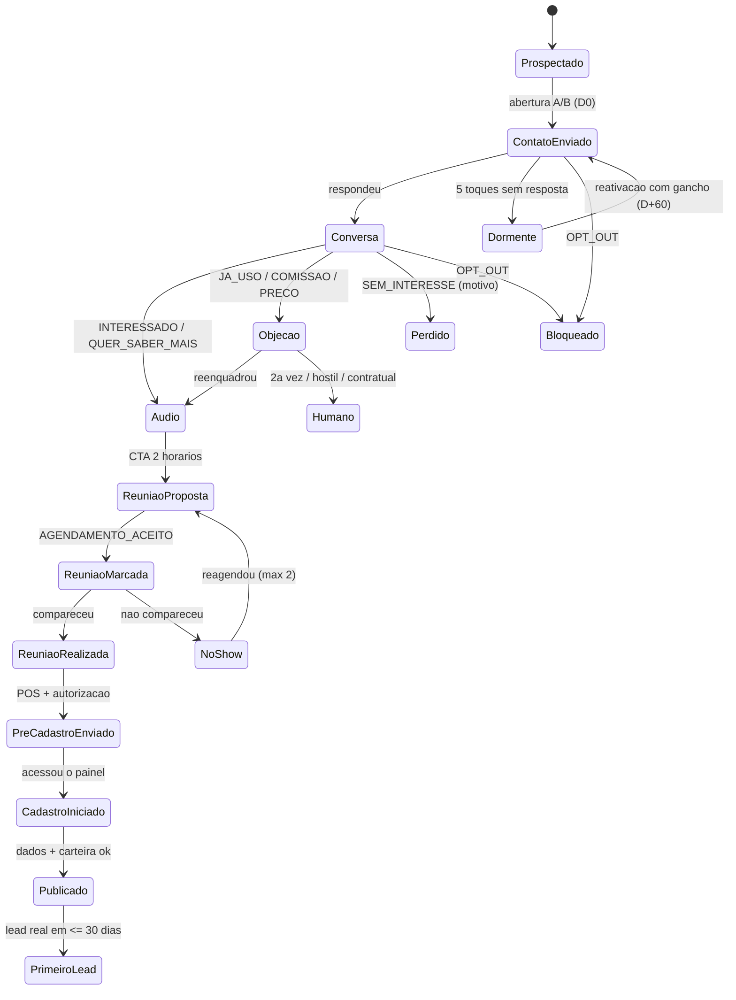

# 08 — Playbook Conversacional KOMUNE
## Captação de fornecedores e produtores por WhatsApp (robô + equipe)

> Versão 1.0 — 03/09/2026. Insumo para o PRD do CRM de Captação.
> Base: brief `00-brief-contexto.md`, Contexto Mestre (tom de voz e funis), plano de 90 dias e pesquisa de mercado de setembro/2026 (fontes ao final).
> Idioma dos scripts: pt-BR falado, do jeito que a Heloísa falaria. Tudo aqui é para copiar e usar.

---

## 0. Como usar este documento

| Se você é… | Leia primeiro |
|---|---|
| **Matheus / Cláudio (constroem o robô)** | Seção 1 (taxonomia → ação), Seção 5 (regras do robô), Seção 6 (campos do CRM e A/B) |
| **Heloísa / Bárbara / embaixadores (falam com fornecedor)** | Seção 2 (scripts por segmento), Seção 3 (follow-up), Seção 4 (pós-reunião e onboarding) |
| **Rafael (decide)** | Seção 0.1 (o que a pesquisa muda), Seção 5.4 (o que nunca prometer), Seção 6 (metas) |

**Convenção de IDs de mensagem** (o CRM grava o ID de cada texto enviado — ver 6.3):
`SEG-TIPO-VAR` → `AEB-ABR-A` = segmento Alimentos & Bebidas, tipo Abertura, variante A.
Segmentos: `AEB` (alimentos & bebidas) · `INF` (infraestrutura) · `PRE` (prestador: foto, vídeo, DJ, decoração) · `ESP` (espaço/local) · `CER` (cerimonialista) · `FOR` (produtor de formatura) · `GEN` (genérico, qualquer segmento).
Tipos: `ABR` abertura · `AUD` roteiro de áudio · `OBJ` objeção · `CTA` chamada para reunião · `FUP` follow-up · `AGD` agendamento · `POS` pós-reunião · `ONB` onboarding · `REA` reativação · `SYS` mensagens fixas do sistema.

### 0.1 O que a pesquisa diz — e o que muda no nosso jeito de abordar

| Achado (fonte) | O que fazemos com isso |
|---|---|
| WhatsApp tem ~98% de abertura contra ~20% do e-mail; mensagens personalizadas rendem 40–60% de resposta; pitch direto rende **menos de 5%** (eesier; Koee) | Toda abertura é personalizada com um detalhe real do fornecedor. Nunca "disparo" genérico. |
| Mensagem com mais de 6 linhas derruba a resposta em ~50%; pedir reunião logo na primeira mensagem é erro; **áudio em contato frio é erro** (Koee) | Abertura ≤ 6 linhas, pede permissão. Áudio só **depois** que a pessoa responde — e depois de a gente avisar que vai mandar. |
| Abordagem que **pede permissão** foi a mais eficaz em estudos de abertura fria (84,9% de conversas iniciadas num teste de 100 ligações; "permission-based" entre as duas melhores no ranking de 300 mi de ligações). Já o "te peguei em má hora?" foi o pior (0,9% no estudo da Gong) (Cold Calling Chronicles; Prospeo) | Fórmula da abertura: *quem sou + por que você + posso te explicar em 30 s?* Nunca "te peguei em má hora?". |
| 56% dos brasileiros gostam de mandar áudio e 57% gostam de receber; ~20% não gostam; **50% preferem uma sequência de áudios curtos** a um áudio longo; mais de 80% ainda preferem texto como meio principal (pesquisa citada pela Exame) | Áudio de 20–30 s, um só, sempre precedido de texto. Quem não responde ao áudio recebe o resumo em texto. |
| Áudio de venda: no máximo 40 s — 5–10 s de apresentação, 15 s de proposta, 5–10 s de chamada; gravar com antecedência, sem pausas; não mandar áudio sem consentimento (Agendor) | Roteiros de 20–30 s por segmento (Seção 2) com essa estrutura. |
| Responder em até 5 min multiplica a conversão por 9; depois de 30 min a conversão cai 80% (relatório SocialHub 2026) | Robô confirma em ≤ 1 min; áudio da Heloísa em ≤ 15 min no horário comercial; fila "quente" com alerta. |
| 80% das vendas precisam de 5+ follow-ups; 44% dos vendedores desistem no 1º; 57% dos compradores B2B preferem quem não pressiona; pausar após 4–5 toques sem resposta (Winning Sales; SocialHub; SDRMAX) | Cadência de 5 toques em 30 dias, cada um com **motivo novo**, depois dormente. Reativação só com gancho real. |
| Regra prática de volume: 20–50 mensagens/dia por número em prospecção personalizada; disparo súbito e genérico é gatilho de bloqueio; **opção clara de "parar" sempre**; ferramentas não oficiais têm risco alto (eesier; SocialHub) | Número aquecido, volume gradual, texto variado, opt-out em 1 palavra. Ver 5.6. |
| Fornecedores relatam nos portais pagos: contrato de 12 meses, "não consegui fechar nenhum negócio pelo site", leads que "só estavam sondando", multa de cancelamento (Reclame Aqui — Casamentos.com.br); no GetNinjas, "gasta moedas e não tem retorno", lead que não responde não é reembolsado (Reclame Aqui — GetNinjas) | Nosso argumento central não é "somos mais baratos": é **"você não paga pra aparecer, paga quando fecha"** — sem fidelidade, sem moeda, sem multa. |
| Buffet paga R$ 8–40 por lead em anúncio e R$ 1.500–3.000/mês de mídia; fotógrafo vive de indicação e "indicação vira problema no mês em que ela para" (Marketek; ENF) | Falar da dor real de cada segmento (agenda vazia de meio de semana, janeiro/fevereiro, dependência do Instagram). |
| Marketplaces novos recrutam oferta em plataformas concorrentes, priorizam 10–20 fornecedores de qualidade, oferecem benefícios de fundador (destaque, comissão reduzida, exclusividade) e **visitam pessoalmente** os primeiros (Sharetribe) | Rota de visitas à tarde, selo e destaque de Fundador, transparência sobre o estágio do app. |
| No-show: confirmação imediata, lembrete 24 h com pedido de confirmação, ativação 1–2 h antes com link; pergunta de compromisso no agendamento (Clint); show rate médio 60–70%, times bons 80%+ (Prospeo) | Sequência de agendamento na Seção 4.1. Meta: ≥ 75% de comparecimento. |
| Handoff para humano: pedido explícito, frustração, termos de alto valor (preço, proposta, contrato), repetição 3×, fora de escopo; passar com resumo e histórico (SocialHub) | Gatilhos de escalada na Seção 5.3. |
| LGPD: dados de CNPJ não são dados pessoais; dados **manifestamente públicos** + legítimo interesse permitem contato B2B se a empresa se identifica, respeita opt-out e registra origem (LeadCNPJ; ANPD) | Abertura sempre diz quem somos e onde vimos o perfil; opt-out sai de **todas** as cadências; CRM guarda `origem` e `opt_out_em`. |

---

## 1. Taxonomia de intenções (o que o classificador precisa reconhecer)

Regras gerais do classificador:
- Saída obrigatória: `{intencao, confianca, entidades}` — entidades: data/hora, nome citado, plataforma citada, motivo.
- Confiança < 0,7 → tratar como `AMBIGUO` (pergunta curta de esclarecimento), nunca chutar.
- Uma mensagem pode ter duas intenções (ex.: "quanto é a taxa? me chama sexta") → aplicar a de maior impacto no funil primeiro (`PEDIU_TAXA` responde, `ME_CHAMA_DEPOIS` agenda).
- `OPT_OUT`, `HOSTIL` e `NAO_E_A_PESSOA` têm prioridade absoluta sobre qualquer outra.
- Temperaturas: **frio** (só prospectado) · **morno** (respondeu, em conversa) · **quente** (interessado / reunião) · **cliente** (cadastrado/publicado) · **dormente** (sem resposta após cadência) · **perdido** (não, com motivo) · **bloqueado** (opt-out).

| # | Intenção | Exemplos do que a pessoa escreve | Quem responde | Ação do robô | Etapa CRM → Temperatura |
|---|---|---|---|---|---|
| 1 | `INTERESSADO` | "pode mandar", "quero saber mais", "manda o áudio", "como funciona?", "tenho interesse" | Texto fixo + áudio Heloísa | Envia `SYS-PRE-AUDIO` ("te mandei um áudio de 28 s 👇") + áudio do segmento. Se áudio já foi enviado → `CTA` com 2 horários. Cria tarefa "áudio personalizado" para Heloísa se ela estiver online. | conversa → **quente** |
| 2 | `QUER_SABER_MAIS` (pergunta específica) | "como o cliente me acha?", "e o pagamento, como chega?", "tem app pra mim?" | IA (base de conhecimento) | Responde em ≤ 4 linhas usando só a FAQ aprovada; termina com pergunta de avanço ("faz sentido te mostrar isso em 20 min?"). Pergunta fora da FAQ → `FORA_ESCOPO`. | conversa → **morno/quente** |
| 3 | `PEDIU_TAXA_PRECO` | "quanto custa?", "qual a taxa?", "tem mensalidade?" | Texto fixo (`GEN-OBJ-TAXA-INFO`) | Responde a taxa exata (8%, sem mensalidade; com cerimonialista 3% + 5%) sem enrolar, e propõe reunião. Nunca esconder a taxa até a reunião — parece pegadinha. | conversa → **quente** |
| 4 | `JA_USO_OUTRO` | "já tô no Casamentos.com", "uso o GetNinjas", "meu Instagram já dá conta" | IA com script `*-OBJ-JAUSO` | Não ataca o concorrente; complementa. Uma pergunta de descoberta. | conversa → **morno** |
| 5 | `NAO_TRABALHO_COM_COMISSAO` | "não pago comissão", "8% é muito", "não trabalho com porcentagem" | IA com script `*-OBJ-COMISSAO` | Reenquadra (paga quando fecha; preço é seu). Se a objeção volta pela 2ª vez → `HUMANO` (Heloísa/Bárbara). | conversa → **morno** |
| 6 | `MANDA_MATERIAL` | "manda por escrito", "tem um PDF?", "manda o site" | Texto fixo + card | Envia 1 imagem-resumo + link do site + vídeo de 60 s. Faz a pergunta de compromisso ("o que você quer ver nele pra decidir?"). Agenda `FUP` em D+2. | conversa → **morno** |
| 7 | `ME_CHAMA_DEPOIS` | "me chama semana que vem", "agora não dá", "depois do evento de sábado" | IA extrai data; texto fixo confirma | Se tem data → agenda retorno na data/hora (manhã seguinte às 9h30 se só disse o dia). Se não tem → propõe uma ("posso te chamar terça de manhã?"). | contato → **morno** (com `proxima_acao` datada) |
| 8 | `SEM_INTERESSE_SUAVE` | "obrigado, mas não", "não é pra mim agora", "não tô buscando" | Texto fixo `GEN-SYS-NAO-SUAVE` | Agradece, deixa porta aberta, pergunta motivo em 1 linha (opcional). Marca perdido com `motivo_perda`. Elegível a reativação em 60 dias **só** com gancho real. | perdido (motivo) → **frio** |
| 9 | `SEM_INTERESSE_FIRME` | "não tenho interesse", "não quero", "não insiste" | Texto fixo `GEN-SYS-NAO-FIRME` | Uma mensagem de encerramento, sem pergunta. Sai de toda cadência. Reativação só manual, após 90 dias, com aprovação. | perdido → **frio** (flag `nao_reativar_auto`) |
| 10 | `NAO_E_A_PESSOA` / `NUMERO_ERRADO` | "não sou o dono", "número errado", "aqui é pessoal" | Texto fixo | Pede desculpa, pergunta o contato certo (1 vez). Atualiza cadastro; se número pessoal → marcar `telefone_invalido`. | prospectado → **frio** |
| 11 | `QUEM_E_VOCE` / `DESCONFIANCA` | "quem é você?", "como conseguiu meu número?", "isso é golpe?" | Texto fixo `GEN-SYS-QUEM-SOMOS` | Diz quem somos, **onde vimos o perfil** (origem gravada), link do site/Instagram oficial e nome de quem manda. Se persistir → `HUMANO`. | contato → **morno** |
| 12 | `E_ROBO` | "é robô?", "tô falando com um bot?" | Texto fixo `GEN-SYS-E-ROBO` | Resposta honesta (5.5). Áudio e reunião são sempre humanos. | mantém |
| 13 | `OPT_OUT` | "para", "pare", "não me manda mais", "sair", "remove meu número", "bloquear" | Texto fixo (1 linha) | Encerra **imediatamente**, confirma em uma linha, grava `opt_out_em`, remove de todas as cadências e listas. Nenhum contato futuro sem pedido da pessoa. | **bloqueado** |
| 14 | `HOSTIL` / `RECLAMACAO` | xingamento, "vocês são chatos", "me ligaram três vezes" | Texto fixo + `HUMANO` | Pede desculpa, para a cadência, abre tarefa para humano revisar. Nunca responde de forma automática além do pedido de desculpa. | pausado → humano decide |
| 15 | `AGENDAMENTO_ACEITO` | "quinta 9h30 tá bom", "pode ser de tarde", "a primeira opção" | Texto fixo `GEN-AGD-CONFIRMA` | Confirma dia/hora/formato, cria evento (Google Calendar), envia link do Meet ou endereço, dispara sequência anti no-show (4.1). | apresentação → **quente** (`reuniao_marcada`) |
| 16 | `AGENDAMENTO_CONTRAPROPOSTA` | "só posso sexta às 16h", "de manhã não dá" | IA verifica agenda; humano confirma se conflito | Aceita se cabe na regra (Meet de manhã, visita à tarde). Se não cabe, oferece 2 alternativas próximas. | apresentação → **quente** |
| 17 | `REAGENDAR` / `NAO_VAI_PODER` | "não vou conseguir hoje", "podemos remarcar?" | Texto fixo | Sem drama; 2 novos horários nas próximas 48 h. Grava `reagendamentos +1`. 2º reagendamento → humano liga. | mantém **quente** |
| 18 | `PEDIU_LIGACAO` | "me liga", "melhor por telefone" | `HUMANO` | Tarefa urgente para Heloísa ligar em ≤ 30 min (horário comercial). Robô responde "te ligo em instantes". | conversa → **quente** |
| 19 | `INDICACAO` | "fala com a Ana, ela cuida disso", "o dono é o Marcos: 84 9…" | Texto fixo + cria alvo | Agradece, cria novo contato com `origem = indicação de [nome]`, abertura em nome de quem indicou. | novo alvo (**frio**, prioridade alta) |
| 20 | `JA_CADASTRADO` / `JA_E_CLIENTE` | "já fiz meu cadastro", "já tô no app" | Texto fixo | Verifica no Supabase; se incompleto → fluxo de onboarding (4.2); se publicado → agradece e pergunta feedback. | onboarding → **cliente** |
| 21 | `PERGUNTA_CONTRATUAL` | "tem contrato?", "quando cai o dinheiro?", "emite nota?", "e se o cliente cancelar?" | Texto fixo (FAQ aprovada) + `HUMANO` se sair da FAQ | Responde só o que está na FAQ jurídica/financeira aprovada por Dennis/Rafael. Fora disso: "vou confirmar com o financeiro e te respondo hoje". | conversa → **quente** |
| 22 | `FORA_ESCOPO` | "quero contratar um DJ pro meu aniversário", "vocês vendem ingresso?", "trabalha com casamento em João Pessoa?" | IA (curto) + roteamento | Responde 1 linha e roteia: cliente querendo contratar → passa para o app/demanda (lead!); outra cidade → grava `cidade` e informa que Natal é primeiro; assunto sem relação → educado e encerra. | mantém |
| 23 | `AMBIGUO` / `SO_EMOJI` / `OK` | "ok", "👍", "hum", "kkk" | IA (1 pergunta) | "Posso te mandar o áudio de 30 s?" ou "prefere que eu explique por aqui mesmo?". Nunca duas perguntas. | mantém |
| 24 | `SILENCIO` (sem resposta) | — | Cadência (Seção 3) | Toque seguinte na data da régua; após o 5º toque sem resposta → **dormente**. | conforme régua |

**Regra de ouro do classificador:** quando a mensagem é longa e mistura tudo, o robô **não** tenta responder tudo; responde à parte mais importante e passa o resto para humano com resumo. Fornecedor que escreve muito é fornecedor engajado — merece gente.

### 1.1 Máquina de estados (visão do PRD)

---

## 2. Scripts por segmento

### 2.0 A espinha dorsal (vale para todo segmento)

**Fórmula da abertura (≤ 6 linhas, ~60 palavras):**
1. *Quem sou e de onde* → "Heloísa, da Komune, aqui de Natal".
2. *Por que você* → um detalhe real (foto, evento, prato, espaço) — vem do scraper/pesquisa. **Sem detalhe real, usar a versão B.**
3. *O que é, em uma frase* → "app de eventos da cidade que está escolhendo os fornecedores fundadores".
4. *Pedir permissão* → "posso te explicar em um áudio de 30 segundos?".
5. *Saída fácil* → "se não for o momento, me diz, sem problema".

**O que não entra na abertura:** link, PDF, preço detalhado, "reunião", "parceria", "oportunidade imperdível", "sem compromisso", mais de 1 emoji, letras maiúsculas.

**Sequência padrão depois da resposta positiva:**
- `SYS-PRE-AUDIO`: "Que bom! Te mandei um áudio rapidinho (uns 30 s) explicando 👇"
- Áudio do segmento (2.x) — gravado pela Heloísa. Ideal: com o nome da pessoa e o detalhe, gravado na hora (fila quente). Se ela não puder em 15 min, o robô manda o áudio-base do segmento (sem nome).
- `SYS-POS-AUDIO` (30–60 s depois do áudio): "Resumindo por escrito: sem mensalidade, taxa de 8% só quando um evento fecha, e os fundadores entram com destaque e selo. Consigo te mostrar em 20 min — prefere [dia] de manhã pelo Meet ou eu passo aí à tarde?"

**A chamada para reunião (CTA) tem sempre 2 opções concretas**, uma de manhã (Meet, 20 min) e uma à tarde (visita, na rota). Nunca "quando você puder?". Exemplo-base `GEN-CTA-1`:

> "Consigo te mostrar o app funcionando em 20 minutos. Prefere **quinta às 9h30 pelo Meet** ou eu **passo aí quinta à tarde, umas 15h**? Se nenhum encaixar, me diz um horário que eu me viro."

**As 8 objeções — o raciocínio por trás de cada resposta** (o texto muda por segmento; a lógica não):

| Objeção | Não faça | Faça |
|---|---|---|
| Comissão | Defender a taxa, comparar com iFood | "Você não paga pra aparecer, paga quando fecha." Trazer o custo real de anúncio/portal. Preço continua sendo do fornecedor. |
| "Não preciso" | Insistir que precisa | Concordar. Quem está lotado é exatamente quem queremos como fundador (referência). Uma porta a mais para janeiro/fevereiro e meio de semana. |
| "Já tenho clientes / indicação" | Menosprezar indicação | Indicação é o melhor canal; Komune é indicação em escala (avaliações + selo Verificado), que não para quando o boca a boca para. |
| "Quero mensalidade zero" | Ficar explicando | "É zero." Sem adesão, sem fidelidade de 12 meses, sem multa. |
| "Vou ver e te falo" | "Ok, fico no aguardo" | Pergunta de clareza: "o que pesa mais pra decidir?" + data de retorno combinada. |
| "Quem usa?" | Inventar nome | Nomes reais autorizados + eventos próprios (Natal Experience, LDM, LCC, formaturas) + "estamos começando, por isso o programa Fundador". |
| "O app tem gente?" | Inflar número | Número real (~15 mil contas via ingressos) + a garantia da primeira oportunidade real em 30 dias vinda dos eventos que a própria Komune produz. |
| "E o meu preço?" | Prometer que vende mais caro | Preço é do fornecedor; Komune não tabela nem pede desconto; Pix absorvido; cartão o cliente vê o total. |

---

### 2.1 Alimentos & Bebidas (buffet, churrasqueiro, sushi, bolo, bar, coffee)

**Gancho de contexto para personalizar:** um prato/foto específica, um evento recente, cardápio (ex.: "o risoto de camarão do casamento da [data]").

**`AEB-ABR-A` — abertura com referência de origem**
> Oi, [Nome], tudo bem? Aqui é a Heloísa, da Komune, aqui de Natal 🙂
> Vi o [Buffet X] no Casamentos.com — as fotos da mesa de [detalhe] me chamaram atenção.
> A gente está montando a rede de fornecedores fundadores de um app de eventos da cidade, e buffet é a categoria mais pedida.
> Posso te explicar num áudio de 30 segundos? Se não for o momento, me diz sem problema.

**`AEB-ABR-B` — abertura sem referência de origem**
> Oi, [Nome], tudo bem? Heloísa, da Komune, aqui de Natal 🙂
> Somos um app que conecta quem está organizando um evento com quem faz acontecer — e estamos escolhendo os primeiros buffets da rede fundadora.
> Sem mensalidade: o fornecedor só paga quando um evento fecha.
> Posso te explicar em 30 segundos por áudio? Se não for o momento, sem problema.

**`AEB-AUD-1` — roteiro do áudio da Heloísa (25–30 s)**
> Oi, [Nome], Heloísa aqui, da Komune. Rapidinho: a Komune é um app de eventos aqui de Natal. Quem tá organizando um casamento, uma formatura, um aniversário, entra, diz o que precisa, e encontra os fornecedores da cidade. A gente tá escolhendo os buffets fundadores agora — e fundador ganha destaque na vitrine, selo, aparece nos nossos vídeos e recebe a primeira oportunidade real de evento em até 30 dias. Não tem mensalidade: você só paga 8% quando um evento fecha. Queria te mostrar funcionando, leva 20 minutos. Pode ser?

**Objeções — `AEB-OBJ-*`**

- **Comissão** (`AEB-OBJ-COMISSAO`)
> Entendo, [Nome]. Só pra deixar claro: não é comissão sobre o que você já vende — é só sobre o evento que chegar pela Komune e fechar. Se não fechar, não paga nada. Hoje um buffet que anuncia paga R$ 8 a R$ 40 por contato, feche ou não. Aqui você paga por resultado. E o preço continua sendo o seu.

- **"Não preciso, minha agenda tá cheia"** (`AEB-OBJ-NAOPRECISO`)
> Que bom, e é por isso que eu te chamei: a gente quer os buffets que já são referência como fundadores, não quem tá começando. Não é pra você depender da Komune — é pra ter uma porta a mais quando aparecer aquela quarta ou quinta vazia, ou janeiro e fevereiro. Vale 20 minutos?

- **"Já tenho clientes, trabalho por indicação"** (`AEB-OBJ-JATENHO`)
> Indicação é o melhor canal que existe. A Komune é isso em escala: quem contrata avalia, o selo Verificado aparece, e a indicação continua chegando mesmo no mês em que o boca a boca dá uma parada. Você não troca nada, só soma.

- **"Quero mensalidade zero"** (`AEB-OBJ-MENSALIDADE`)
> É zero mesmo. Não tem mensalidade, adesão, fidelidade de 12 meses nem multa pra sair. O único custo é 8% sobre o evento que fechar pela plataforma.

- **"Vou ver e te falo"** (`AEB-OBJ-VOUVER`)
> Claro. Só pra eu não te encher à toa: o que pesa mais pra você decidir — a taxa, o app ainda ser novo, ou o tempo de cadastrar? Me diz que eu te mando só o que importa. Posso te dar um toque na [terça] de manhã?

- **"Quem usa?"** (`AEB-OBJ-QUEMUSA`)
> Estamos começando com a rede fundadora: [Fornecedor A], [Fornecedor B] e [Fornecedor C] já entraram [usar só nomes autorizados]. E os nossos próprios eventos — Natal Experience, LDM, formaturas — rodam 100% pelo app, então o buffet fundador já entra com evento de verdade pedindo orçamento.

- **"O app tem gente?"** (`AEB-OBJ-TEMGENTE`)
> Vou ser transparente: hoje temos cerca de 15 mil contas criadas pelos ingressos dos nossos eventos, e a parte de fornecedores está sendo lançada agora com os fundadores. Por isso a gente garante, por escrito, pelo menos uma oportunidade real de evento nos primeiros 30 dias — vem dos eventos que a própria Komune produz.

- **"E o meu preço?"** (`AEB-OBJ-PRECO`)
> O preço é seu. A Komune não tabela, não pede desconto e não compara você por preço — o cliente vê o que você faz, as fotos e as avaliações. Você pode cadastrar cardápios e pacotes diferentes. Pix a Komune absorve; no cartão, o cliente vê o valor total na vitrine.

**`AEB-CTA-1` — chamada para reunião**
> Consigo te mostrar o app com um evento real em 20 minutos. Prefere **[quinta] às 9h30 pelo Meet** ou eu **passo no buffet [quinta] à tarde, umas 15h**? Aproveito e já vejo a cozinha pra tirar umas fotos do perfil, se você topar.

---

### 2.2 Infraestrutura (som, iluminação, tendas, palco, mobiliário, geradores, banheiros, equipamentos)

**Gancho de contexto:** uma montagem recente (festival, casamento na praia, formatura), porte do evento, equipamento que aparece no perfil.

**`INF-ABR-A` — com origem**
> Oi, [Nome], tudo bem? Heloísa, da Komune, aqui de Natal 🙂
> Vi a montagem da [Empresa X] no [Instagram/Constance Zahn] — a estrutura do [evento] ficou impecável.
> Estamos formando a rede de fornecedores fundadores de um app de eventos da cidade, e som/estrutura é o que mais falta pra quem organiza.
> Posso te explicar em um áudio de 30 segundos? Se não for o momento, me avisa, sem problema.

**`INF-ABR-B` — sem origem**
> Oi, [Nome], tudo bem? Heloísa, da Komune, aqui de Natal 🙂
> Somos um app onde quem organiza evento em Natal encontra som, luz, estrutura e mobiliário num lugar só — e estamos escolhendo as primeiras empresas da rede fundadora.
> Sem mensalidade: paga só quando um evento fecha.
> Posso te explicar num áudio de 30 segundos?

**`INF-AUD-1` — áudio (25–30 s)**
> Oi, [Nome], Heloísa, da Komune. Bem rápido: a Komune é um app de eventos aqui de Natal. Quem tá organizando — produtor, cerimonialista, empresa, formatura — entra e monta o evento com os fornecedores da cidade. Estrutura, som e iluminação é o que mais pedem e menos encontram. A gente tá fechando as empresas fundadoras de infraestrutura agora: fundador tem destaque na busca, selo, entra nos nossos vídeos e recebe a primeira oportunidade real em até 30 dias. Sem mensalidade, 8% só quando fecha. Te mostro em 20 minutos, pode ser?

**Objeções — `INF-OBJ-*`**

- **Comissão**
> Entendo. Os 8% só existem em cima do evento que chegar pela Komune e fechar — o seu contrato com quem já é seu cliente continua igual. E infraestrutura fecha ticket alto: é melhor pagar por um evento que fechou do que pagar anúncio, portal ou representante pra ir atrás.

- **"Não preciso"**
> Perfeito, e é justamente quem já tem operação rodando que a gente quer como fundador. A ideia não é te dar trabalho: é entrar como referência de estrutura na cidade e ter mais um canal pros meses fracos e pros eventos corporativos de meio de semana.

- **"Já tenho clientes"**
> Ótimo sinal. A Komune não substitui seus clientes — ela coloca você na frente de quem ainda não te conhece: produtor novo, empresa fazendo evento interno, cerimonialista que perdeu o fornecedor de som de última hora. E as avaliações viram indicação automática.

- **"Quero mensalidade zero"**
> É zero. Nenhuma mensalidade, nenhuma taxa de adesão, nenhum contrato de fidelidade. 8% só sobre o que fechar pela plataforma.

- **"Vou ver e te falo"**
> Sem problema. Me ajuda a te ajudar: o que você precisaria ver pra dizer sim — como chega o pedido, como é o pagamento, ou quem já está dentro? Te mando isso hoje e te chamo na [quinta] de manhã, pode ser?

- **"Quem usa?"**
> Rede fundadora com [nomes autorizados], mais os eventos que a própria Komune produz (Natal Experience, LDM/LCC, formaturas) — todos contratam estrutura pelo app. Então tem evento de verdade no pipeline, não só promessa.

- **"O app tem gente?"**
> Vou ser direta: ~15 mil contas criadas pelos ingressos dos nossos eventos, e a parte de fornecedores está nascendo agora com os fundadores. Por isso a gente garante por escrito a primeira oportunidade real em 30 dias. Você entra cedo e com destaque, não numa lista de 200.

- **"E o meu preço?"**
> Você define, inclusive por pacote (locação por dia, com e sem operador, com montagem). A Komune não tabela nem negocia por você. Se o cliente pagar no cartão, o valor total já aparece na vitrine; no Pix, a Komune absorve a taxa.

**`INF-CTA-1`**
> Consigo te mostrar como chega um pedido de estrutura no app em 20 minutos. Prefere **[quarta] às 10h pelo Meet** ou eu **passo no galpão [quarta] à tarde, umas 16h**? Na visita eu já fotografo uns equipamentos pro perfil, se você quiser.

---

### 2.3 Prestador de serviço (fotógrafo, videomaker, DJ, banda, decoração, animação, recreação)

**Gancho de contexto:** um post específico (ensaio, festa, pista), estilo (foto documental, decoração tropical), evento recente com nome.

**`PRE-ABR-A` — com origem**
> Oi, [Nome], tudo bem? Heloísa, da Komune, aqui de Natal 🙂
> Vi seu perfil no Casamentos.com e o [ensaio/festa] da [detalhe] — seu estilo é bem [documental/clean/vibrante], gostei muito.
> Estamos montando a rede de fornecedores fundadores de um app de eventos da cidade, e [fotografia/DJ/decoração] é uma das categorias prioritárias.
> Posso te explicar num áudio de 30 segundos? Se não for o momento, me diz sem problema.

**`PRE-ABR-B` — sem origem**
> Oi, [Nome], tudo bem? Heloísa, da Komune, aqui de Natal 🙂
> Somos um app onde quem está organizando uma festa, um casamento ou uma formatura em Natal encontra [fotógrafo/DJ/decoração] pelo trabalho, não só pelo preço.
> Estamos escolhendo os primeiros da rede fundadora — sem mensalidade, paga só quando fecha.
> Posso te explicar em 30 segundos por áudio?

**`PRE-AUD-1` — áudio (25–30 s)**
> Oi, [Nome], Heloísa, da Komune. Rapidinho: a Komune é um app de eventos aqui de Natal — quem tá organizando entra, conta o que quer viver, e encontra quem faz acontecer. Pra [fotógrafo/DJ/decorador] a diferença é que o cliente vê o seu trabalho, as avaliações, e chega já querendo orçar, não só "quanto custa". A gente tá escolhendo os fundadores agora: destaque na vitrine, selo, participação nos nossos vídeos e a primeira oportunidade real em até 30 dias. Sem mensalidade, 8% só quando fecha. Te mostro em 20 minutos?

**Objeções — `PRE-OBJ-*`**

- **Comissão**
> Entendo, [Nome]. Os 8% são só sobre o evento que veio pela Komune e fechou — o cliente que te achou no Instagram continua sendo seu, sem taxa nenhuma. Pensa assim: você não paga pra aparecer, paga quando fecha. E o preço continua sendo o seu.

- **"Não preciso"**
> Que bom, e é por isso que faz sentido entrar como fundador: quem já está cheio entra como referência, não como quem precisa. É uma porta a mais pros meses que a agenda respira — e você decide quais pedidos aceitar.

- **"Já tenho clientes, é tudo indicação"**
> Indicação é o melhor canal — e é o que mais dói no mês em que ela para. Na Komune cada evento vira uma avaliação e o selo Verificado faz a indicação continuar chegando de gente que você ainda não conhece. Você não muda nada do que já faz.

- **"Quero mensalidade zero"**
> É zero. Sem mensalidade, sem plano premium, sem fidelidade de 12 meses. Só 8% se um evento fechar pela plataforma.

- **"Vou ver e te falo"**
> Tranquilo. O que te faria decidir com mais segurança: ver como o cliente chega, ver o perfil de um fundador já publicado, ou entender o pagamento? Te mando só isso. Te chamo [sexta] de manhã, pode ser?

- **"Quem usa?"**
> A rede fundadora tem [nomes autorizados], e os eventos que a Komune produz (Natal Experience, LDM, formaturas) contratam foto, som e decoração pelo app. Estamos começando — quem entra agora entra como os primeiros, não como mais um.

- **"O app tem gente?"**
> Honestamente: ~15 mil contas via ingressos dos nossos eventos, e a vitrine de fornecedores está sendo lançada agora com os fundadores. Por isso a gente garante por escrito a primeira oportunidade real em 30 dias, vinda dos nossos próprios eventos.

- **"E o meu preço? Vão me comparar por preço?"**
> O preço é seu e a Komune não tabela. E o app é feito pra mostrar o trabalho antes do preço: fotos, estilo, avaliações. Você pode cadastrar pacotes diferentes (ensaio, cobertura completa, por hora). No Pix a Komune absorve a taxa; no cartão o cliente vê o total.

**`PRE-CTA-1`**
> Consigo te mostrar como o cliente vê o seu perfil em 20 minutos. Prefere **[terça] às 9h30 pelo Meet** ou eu **te encontro [terça] à tarde, umas 15h**, onde for melhor pra você? Se você tiver evento essa semana, também posso passar lá e já gravar um conteúdo pro seu perfil.

---

### 2.4 Espaço / local (casa de festas, salão, sítio, restaurante com evento, hotel, rooftop, praia privativa)

**Gancho de contexto:** capacidade, vista, ambiente específico (jardim, pé na areia, salão climatizado), um evento realizado lá.

**`ESP-ABR-A` — com origem**
> Oi, [Nome], tudo bem? Heloísa, da Komune, aqui de Natal 🙂
> Vi o [Espaço X] no Casamentos.com — o [jardim/salão/vista] com [detalhe] é lindo.
> Estamos montando a rede de fornecedores fundadores de um app de eventos da cidade, e espaço é a primeira coisa que todo mundo procura.
> Posso te explicar num áudio de 30 segundos? Se não for o momento, me diz sem problema.

**`ESP-ABR-B` — sem origem**
> Oi, [Nome], tudo bem? Heloísa, da Komune, aqui de Natal 🙂
> Somos um app onde quem organiza evento em Natal começa escolhendo o espaço — e estamos selecionando os primeiros locais da rede fundadora.
> Sem mensalidade: o espaço só paga quando uma reserva fecha.
> Posso te explicar em 30 segundos por áudio?

**`ESP-AUD-1` — áudio (25–30 s)**
> Oi, [Nome], Heloísa, da Komune. Rapidinho: a Komune é um app de eventos aqui de Natal, e o espaço é a primeira coisa que a pessoa escolhe quando entra. Quem organiza vê capacidade, fotos, datas, avaliações, e pede orçamento já com data e número de pessoas — chega mais qualificado, menos "só sondando". A gente tá escolhendo os espaços fundadores: destaque na busca, selo, tour em vídeo feito por nós e a primeira oportunidade real em até 30 dias. Sem mensalidade, 8% só quando fecha. Te mostro em 20 minutos, pode ser?

**Objeções — `ESP-OBJ-*`**

- **Comissão**
> Entendo, [Nome]. Os 8% só valem pra reserva que chegou pela Komune e fechou. Não incide sobre o que você já fecha por indicação ou Instagram. Hoje um espaço que paga portal ou anúncio paga pra aparecer, feche ou não; aqui é o contrário. E a diária é você quem define.

- **"Não preciso, o espaço vive lotado"**
> Perfeito — espaço lotado é exatamente o que a gente quer como fundador, porque é referência. A Komune entra pros buracos: quinta, domingo à tarde, janeiro e fevereiro, evento corporativo de meio de semana. E você controla a agenda.

- **"Já tenho clientes"**
> Ótimo. A diferença é que na Komune o pedido chega com data, quantidade de pessoas e tipo de evento — você gasta menos tempo respondendo curioso. E cada evento realizado vira avaliação pública, que é indicação que não para.

- **"Quero mensalidade zero"**
> É zero. Sem mensalidade, sem pacote premium, sem fidelidade de 12 meses. Só 8% sobre a reserva fechada pela plataforma.

- **"Vou ver e te falo"**
> Claro. Pra eu te mandar só o que importa: sua dúvida é mais sobre como chega o pedido, como fica a agenda, ou sobre a taxa? Te chamo na [quarta] de manhã pra fechar essa conversa, pode ser?

- **"Quem usa?"**
> Rede fundadora com [nomes autorizados], e os eventos da própria Komune (Natal Experience, LDM/LCC, formaturas) precisam de espaço — então tem demanda real desde o primeiro mês. Estamos começando; por isso o programa Fundador tem destaque e tour em vídeo.

- **"O app tem gente?"**
> Transparente: cerca de 15 mil contas criadas pelos ingressos dos nossos eventos, e a vitrine de espaços está sendo lançada agora com os fundadores. Por isso garantimos por escrito a primeira oportunidade real em 30 dias.

- **"E o meu preço?"**
> Você define a diária, os pacotes (só locação, com mobiliário, com buffet parceiro) e as datas disponíveis. A Komune não tabela nem pede desconto. No cartão o cliente vê o total na vitrine; no Pix a Komune absorve a taxa.

**`ESP-CTA-1`**
> Consigo te mostrar em 20 minutos como um espaço aparece pra quem está buscando. Prefere **[sexta] às 9h30 pelo Meet** ou eu **visito o espaço [sexta] à tarde, umas 15h30**? Na visita eu já gravo o tour em vídeo pro seu perfil, sem custo.

---

### 2.5 Cerimonialista / assessoria de eventos

**Gancho de contexto:** um casamento/15 anos recente com nome dos noivos (se público), número de eventos por ano, estilo.

**Nota de posicionamento:** cerimonialista na Komune é **sócio**: recebe 5% via split, transparente e contratual (Komune fica com 3%). Isso responde à polêmica do "BV" escondido — nas comunidades de noivas a prática é chamada de "totalmente antiética" quando o cliente não sabe. Nosso discurso: comissão à luz do dia, no contrato.

**`CER-ABR-A` — com origem**
> Oi, [Nome], tudo bem? Heloísa, da Komune, aqui de Natal 🙂
> Vi a [Assessoria X] no Casamentos.com e o casamento [detalhe] — a condução ficou linda.
> Estamos montando a rede fundadora de um app de eventos da cidade, e cerimonialista pra gente não é fornecedor: é sócio do evento.
> Posso te explicar em um áudio de 30 segundos? Se não for o momento, me diz sem problema.

**`CER-ABR-B` — sem origem**
> Oi, [Nome], tudo bem? Heloísa, da Komune, aqui de Natal 🙂
> Somos um app de eventos da cidade onde o cerimonialista organiza o evento com os fornecedores num lugar só e ainda recebe 5% de tudo que fecha por lá, de forma transparente.
> Estamos escolhendo as primeiras assessorias fundadoras.
> Posso te explicar em 30 segundos por áudio?

**`CER-AUD-1` — áudio (25–30 s)**
> Oi, [Nome], Heloísa, da Komune. Rapidinho: a Komune é um app de eventos aqui de Natal. Você cria o evento do seu cliente lá dentro, escolhe e contrata os fornecedores pela plataforma, e a gente cuida da parte chata: pagamento, split, acompanhamento. O fornecedor paga 8%: 3 ficam com a Komune e 5 vão pra você, no contrato, sem ninguém precisar esconder nada. E como fundadora você tem destaque, selo e entra nos nossos vídeos. Queria te mostrar funcionando em 20 minutos. Pode ser?

**Objeções — `CER-OBJ-*`**

- **Comissão ("não gosto dessa história de comissão")**
> Entendo — e é por isso que a gente fez diferente. Não é BV por baixo dos panos: os 5% estão no contrato, o fornecedor sabe, e você pode mostrar pro seu cliente que a Komune paga o cerimonialista por organizar o evento pela plataforma. Quem não quiser receber pode reverter em desconto pro cliente. Transparência é o argumento, não o problema.

- **"Não preciso, já tenho meus fornecedores"**
> Perfeito, e você continua com eles — pode inclusive convidá-los pra entrar como fundadores junto com você. A Komune não troca seus parceiros; ela organiza o evento, o pagamento e as tarefas num lugar só, e ainda te remunera por isso.

- **"Já tenho clientes"**
> Ótimo. A Komune serve mais pra você organizar o que já tem do que pra achar cliente: evento, fornecedores, pagamentos e cronograma no mesmo lugar — e cada evento realizado vira avaliação pública sua.

- **"Quero mensalidade zero"**
> É zero pra você. Cerimonialista não paga nada: recebe. O fornecedor paga 8% só quando fecha.

- **"Vou ver e te falo"**
> Claro. O que te ajudaria a decidir: ver como fica o evento montado no app, entender como cai o seu 5%, ou conversar com uma assessoria que já entrou? Te chamo [terça] de manhã, pode ser?

- **"Quem usa?"**
> Assessorias fundadoras: [nomes autorizados]. E a Komune produz os próprios eventos (Natal Experience, LDM/LCC, formaturas) dentro do app, então o fluxo de fornecedor, pagamento e split já está rodando de verdade.

- **"O app tem gente?"**
> Sendo transparente: ~15 mil contas via ingressos dos nossos eventos, e a parte de fornecedores está sendo lançada agora com os fundadores. Pra cerimonialista o valor não depende de "ter gente": é a organização do evento e a remuneração que já funcionam no dia 1.

- **"E o meu preço? Vou ter que cobrar menos?"**
> Não. Seu honorário continua o mesmo, cobrado do seu jeito. Os 5% são adicionais, sobre o que os fornecedores fecharem pela Komune nos eventos que você organiza. Nada muda no seu contrato com o cliente.

**`CER-CTA-1`**
> Consigo te mostrar um evento montado no app, com o split funcionando, em 20 minutos. Prefere **[quinta] às 10h pelo Meet** ou eu **te encontro [quinta] à tarde, umas 15h**, no seu escritório ou num café? Se você tiver evento em andamento, dá pra usar ele como exemplo.

---

### 2.6 Produtor de formatura (M3TA, Z2, Gideon e similares)

**Gancho de contexto:** curso/turma/instituição com baile recente, tamanho médio das turmas, próximo baile anunciado.

**Nota de posicionamento:** produtor de formatura contrata dezenas de fornecedores por baile, lida com comissão de formatura (alunos) e rateio. Discurso = organização + fornecedores num lugar só + demanda de alunos (ingressos/rateio) + 5% quando ele organiza como cerimonialista/produtor do evento.

**`FOR-ABR-A` — com origem**
> Oi, [Nome], tudo bem? Heloísa, da Komune, aqui de Natal 🙂
> Vi o baile de [curso/instituição] da [Produtora X] no Instagram — a produção ficou enorme.
> Estamos montando a rede fundadora de um app de eventos da cidade, e produtor de formatura é o perfil que mais contrata fornecedor por evento.
> Posso te explicar em um áudio de 30 segundos? Se não for o momento, me diz sem problema.

**`FOR-ABR-B` — sem origem**
> Oi, [Nome], tudo bem? Heloísa, da Komune, aqui de Natal 🙂
> Somos um app de eventos da cidade onde o produtor monta o baile, contrata os fornecedores e organiza a turma (ingressos, rateio, comunicação) num lugar só.
> Estamos escolhendo os primeiros produtores fundadores.
> Posso te explicar em 30 segundos por áudio?

**`FOR-AUD-1` — áudio (25–30 s)**
> Oi, [Nome], Heloísa, da Komune. Rapidinho: a Komune é um app de eventos aqui de Natal. Pra formatura ele faz duas coisas: organiza o baile — fornecedores, contratos, pagamento — e organiza a turma: ingressos, rateio, comunicação com a comissão, tudo dentro do app, sem grupo de WhatsApp virando bagunça. Você contrata pela plataforma, os fornecedores pagam 8% e 5% disso volta pra você como organizador do evento. Como fundador, destaque, selo e a gente ajuda a cadastrar. Te mostro em 20 minutos com um baile de exemplo, pode ser?

**Objeções — `FOR-OBJ-*`**

- **Comissão**
> Entendo. Pra produtor a conta é ao contrário: você não paga — quem paga é o fornecedor (8%), e 5% volta pra você como quem organiza o evento, de forma transparente e contratual. E você continua livre pra negociar direto com quem quiser fora do app.

- **"Não preciso, tenho meus fornecedores há anos"**
> E eles continuam sendo seus — a ideia é trazê-los pra dentro como fundadores junto com você. O ganho é organização: contrato, pagamento, cronograma e a turma no mesmo lugar. Menos planilha, menos grupo, menos "quem pagou?".

- **"Já tenho clientes (turmas)"**
> Ótimo. A Komune ajuda a manter: a turma fica dentro do app, compra ingresso, vê o rateio, recebe aviso — e a próxima comissão de formatura da mesma faculdade vê o baile que você fez, com avaliação.

- **"Quero mensalidade zero"**
> É zero. Produtor não paga nada pra usar. O fornecedor paga 8% quando fecha, e uma parte volta pra você.

- **"Vou ver e te falo"**
> Claro. Me diz o que pesa: organização da turma, a parte dos fornecedores, ou a remuneração? Te mando só isso. E posso te chamar [segunda] de manhã, antes da sua semana engrenar?

- **"Quem usa?"**
> Produtores fundadores: [nomes autorizados]. E a Komune já roda formaturas próprias dentro do app — ingresso, rateio e fornecedor pagando pela plataforma. Não é protótipo, tá em uso.

- **"O app tem gente?"**
> Transparente: ~15 mil contas criadas via ingressos dos nossos eventos, e a parte de fornecedores está sendo lançada com os fundadores. Pra você o valor está na organização do baile e da turma desde o dia 1 — a vitrine é bônus.

- **"E o meu preço?"**
> Seu contrato com a comissão de formatura não muda. A Komune não interfere no que você cobra nem no que negocia com fornecedor fora do app. Dentro do app, você vê o preço do fornecedor e a sua parte já calculada.

**`FOR-CTA-1`**
> Consigo te mostrar um baile montado no app — turma, ingressos e fornecedores — em 20 minutos. Prefere **[quarta] às 9h30 pelo Meet** ou eu **passo na produtora [quarta] à tarde, umas 16h**? Se tiver baile chegando, a gente usa ele como piloto.

---

### 2.7 Mensagens fixas do sistema (`GEN-SYS-*`)

- **`GEN-SYS-QUEM-SOMOS`** (resposta a "quem é você? / como pegou meu número?")
> Justo perguntar. Sou a Heloísa, do comercial da Komune (komune.app / @komune.natal). A gente está montando a rede de fornecedores de eventos de Natal e encontrei seu contato no [Casamentos.com / seu Instagram / site], que é público. Se preferir não receber mais mensagens, é só me dizer que eu paro por aqui.

- **`GEN-SYS-E-ROBO`** (resposta a "é robô?")
> Tem um pouco de cada 🙂 As primeiras mensagens saem de um sistema pra eu conseguir responder rápido, mas quem fala com você sou eu, Heloísa — o áudio é minha voz e a reunião sou eu. Quer que eu te mande o áudio agora?

- **`GEN-SYS-OPTOUT`** (resposta a "pare")
> Entendido, [Nome]. Não vou mais te mandar mensagem. Obrigada pelo retorno e sucesso nos eventos.

- **`GEN-SYS-NAO-SUAVE`**
> Tranquilo, [Nome], obrigada por responder. Se um dia fizer sentido, a porta está aberta. Posso te perguntar só uma coisa, pra gente melhorar: foi mais a taxa, o momento, ou não faz sentido pro seu negócio?

- **`GEN-SYS-NAO-FIRME`**
> Entendido, [Nome]. Obrigada pela sinceridade — não vou insistir. Sucesso por aí.

- **`GEN-SYS-NAO-E-PESSOA`**
> Desculpa incomodar! Esse número não é da [Empresa X]? Se souber quem cuida da parte comercial por lá, agradeço muito o contato. Se não, já paro por aqui.

- **`GEN-SYS-HOSTIL`**
> Você tem razão, e peço desculpa. Vou parar as mensagens agora. Se quiser conversar em outro momento, é só me chamar.

- **`GEN-SYS-FORA-CIDADE`**
> Boa pergunta! A gente está começando por Natal e vai abrir outras cidades em seguida. Posso te avisar quando chegar em [cidade]? Só me diz e eu anoto.

- **`GEN-SYS-CLIENTE-QUER-CONTRATAR`** (pessoa quer contratar, não fornecer)
> Que bom! Então você está do outro lado 🙂 O app é gratuito pra quem organiza: [link]. Me conta em uma linha o que você está planejando (tipo de evento, data, quantas pessoas) que eu te ajudo a encontrar os fornecedores certos.

- **`GEN-SYS-PEDIU-LIGACAO`**
> Claro! Te ligo em instantes deste mesmo número, tudo bem?

- **`GEN-SYS-HUMANO-ASSUME`** (quando escala)
> Deixa eu te responder com calma, [Nome]. Vou te dar um retorno ainda hoje, até as [hora] — pode ser?

- **`GEN-OBJ-TAXA-INFO`** (resposta direta a "quanto custa?")
> Direto ao ponto: não tem mensalidade. O fornecedor paga 8% só sobre o evento que fechar pela Komune — se não fechar, não paga. Quando o evento tem cerimonialista, a Komune fica com 3% e o cerimonialista recebe 5%. Pix a gente absorve; no cartão o cliente vê o valor total. Consigo te mostrar isso funcionando em 20 min — [dia] de manhã pelo Meet ou à tarde aí com você?

---

## 3. Cadência de follow-up

### 3.1 Princípios
1. **Cada toque tem um motivo novo** (um dado, um case, uma pergunta diferente). Nunca "só passando pra saber". (Winning Sales; SDRMAX)
2. **Intervalo mínimo de 48 h** entre toques sem resposta (Koee).
3. **Máximo 5 toques sem resposta** (D0 + D+1 + D+3 + D+7 + D+14) → **dormente**. D+30 é a "carta de despedida" com gancho e só sai se houver gancho real.
4. Alternar estímulo: texto → texto com imagem → áudio curto (só se a pessoa já respondeu alguma vez) → texto de encerramento.
5. Se a pessoa responder em qualquer ponto, a cadência de silêncio **para** e entra a taxonomia da Seção 1.
6. Toques só em horário comercial (5.7). Nunca dois toques no mesmo dia.
7. Variação obrigatória: o robô sorteia 1 entre as variantes de cada dia (V1/V2/V3) e grava `variante_followup`. O mesmo contato nunca recebe a mesma variante duas vezes.

### 3.2 Régua para quem **não respondeu** à abertura (`GEN-FUP-*`)

**D+1 — lembrete leve (mesma conversa, responde a si mesma)**
- `GEN-FUP-D1-V1`: "Oi, [Nome]! Só pra essa mensagem não se perder no meio das outras 🙂 Posso te mandar o áudio de 30 s?"
- `GEN-FUP-D1-V2`: "[Nome], sei que WhatsApp de quem faz evento é uma loucura. Se preferir, eu resumo em duas linhas por aqui mesmo — pode?"
- `GEN-FUP-D1-V3`: "Oi, [Nome], tudo bem? Fico por aqui até você ter um minutinho. Só me diz: áudio ou texto?"

**D+3 — motivo novo: prova/contexto**
- `GEN-FUP-D3-V1`: "[Nome], um dado que talvez te interesse: [categoria] é a [1ª/2ª] categoria mais procurada por quem organiza evento em Natal no app, e ainda tem pouca oferta cadastrada. Por isso te chamei primeiro. Vale 20 min?"
- `GEN-FUP-D3-V2`: "[Nome], entrou mais um [buffet/espaço/fotógrafo] fundador essa semana: [nome autorizado]. Queria ter você junto desde o começo. Posso te explicar em 30 s?"
- `GEN-FUP-D3-V3`: "[Nome], deixa eu ser objetiva: sem mensalidade, 8% só quando fecha, destaque pra quem entra agora. Se fizer sentido, te mostro em 20 min; se não fizer, me diz que eu paro de te chamar 🙂"

**D+7 — motivo novo: evento/oportunidade real + imagem**
- `GEN-FUP-D7-V1` (+ card-resumo em imagem): "[Nome], te mandei um resumo em uma imagem pra você olhar em 10 segundos. A gente tem [evento próprio, ex.: Natal Experience em [mês]] precisando de [categoria] — quem estiver cadastrado recebe o pedido. Quer entrar antes?"
- `GEN-FUP-D7-V2`: "[Nome], tem [N] pessoas organizando [tipo de evento] pelo app pra [mês] e procurando [categoria]. Seu perfil já está quase pronto do nosso lado — falta você autorizar. Posso te mostrar?"
- `GEN-FUP-D7-V3`: "[Nome], pergunta sincera: é o momento (agenda cheia), a taxa, ou simplesmente não faz sentido? Qualquer resposta me ajuda — inclusive 'não'."

**D+14 — encerramento elegante (break-up)**
- `GEN-FUP-D14-V1`: "[Nome], pelo silêncio imagino que não seja o momento. Vou parar de te chamar por aqui. Se quiser retomar, é só responder 'sim' — o lugar de fundador fica reservado até [data]."
- `GEN-FUP-D14-V2`: "[Nome], última mensagem minha por agora, prometo 🙂 Se em algum momento fizer sentido, me chama que eu te mostro em 20 min. Sucesso nos eventos!"
- `GEN-FUP-D14-V3`: "[Nome], vou fechar sua conversa aqui pra não te incomodar. Deixo só o link do app pra você conhecer quando quiser: [link]. Qualquer coisa, é só chamar."

→ após D+14 sem resposta: **dormente** (`temperatura = dormente`, `dormente_em = data`).

**D+30 — despedida com gancho (só sai se houver gancho real)**
- `GEN-FUP-D30-V1`: "[Nome], voltei só por um motivo: [gancho — ex.: 'chegou um pedido de [categoria] pra um casamento de 200 pessoas em [mês] e ainda não temos ninguém do seu estilo']. Quer que eu te passe?"
- `GEN-FUP-D30-V2`: "[Nome], publicamos o caso do [fornecedor fundador] — [resultado concreto, ex.: fechou 2 eventos no primeiro mês]. Achei que valia te mostrar. Quer ver?"

### 3.3 Régua para quem **respondeu e sumiu** (morno parado)

| Situação | Quando | Mensagem |
|---|---|---|
| Disse "vou ver e te falo" e não voltou | data combinada (ou D+2) | "Oi, [Nome]! Como combinado, passando pra saber se deu pra pensar. Se quiser, te mostro em 20 min [dia] de manhã ou à tarde." |
| Pediu material e não respondeu | D+2 | "[Nome], conseguiu ver o material? Se ficou alguma dúvida sobre [taxa/como chega o pedido], eu explico em 2 linhas." |
| Ouviu o áudio e não respondeu | D+1 | "[Nome], ficou alguma dúvida do áudio? Se preferir, te resumo por escrito." → D+4: pergunta de clareza → D+10: break-up |
| Recebeu CTA e não escolheu horário | D+1 | "[Nome], os horários que mandei não encaixaram? Me diz um dia que eu me adapto." → D+3: "Consigo [novo dia] de manhã ou à tarde." → D+8: break-up |
| Marcou reunião e faltou (no-show) | +2 h | ver 4.1 |

Morno parado por 14 dias sem resposta → **dormente** (mesma regra).

### 3.4 Reativação de dormentes e perdidos suaves (`GEN-REA-*`)

Só reativar com **gancho real** — o CRM deve exigir preencher o campo `gancho` antes de liberar. Ganchos válidos:
- **Lead real / Research Request:** "tem [N] pessoas procurando [categoria] pra [mês]" (Supply Gap do app).
- **Novo case:** fornecedor fundador com resultado concreto e autorizado.
- **Evento próprio:** Natal Experience, LDM/LCC, formatura — precisa da categoria.
- **Novidade de produto:** Android liberado, novo módulo, selo Verificado.
- **Sazonalidade:** "temporada de formaturas/casamentos está fechando fornecedores agora".

- `GEN-REA-60-V1`: "Oi, [Nome], Heloísa da Komune. Faz um tempo que a gente conversou. Te chamo porque [gancho]. Se agora fizer sentido, te mostro em 20 min; se não, sem problema."
- `GEN-REA-60-V2`: "[Nome], lembra da Komune? Desde a nossa conversa entraram [N] fornecedores de [categoria] e [gancho]. Quer dar uma olhada?"
- `GEN-REA-90-V1` (perdido suave, 1 toque só): "[Nome], sem insistência: [gancho]. Se quiser, é só responder 'quero'. Se não, já paro por aqui."

Depois de 2 reativações sem resposta (D+60 e D+120) → `nao_reativar_auto = true`. Só humano, com motivo.

---

## 4. Agendamento, pós-reunião e onboarding

### 4.1 Anti no-show (`GEN-AGD-*`)

Sequência baseada em: confirmação imediata → lembrete 24 h com pedido de confirmação → ativação 1–2 h antes com link (Clint). Pergunta de compromisso no agendamento.

- **`GEN-AGD-CONFIRMA`** (imediato, após escolha do horário)
> Fechado, [Nome]: **[quinta, 05/09, 9h30]**, pelo Meet — 20 minutos. Link: [link]. Já vai cair um convite no seu e-mail/agenda. Pra eu preparar direitinho: o que você mais quer ver — como chega o pedido, o pagamento, ou o perfil pronto?
> *(visita)* Fechado, [Nome]: **[quinta, 05/09, 15h]** aí no [endereço]. Vou eu, Heloísa [+ nome, se for com Bárbara/Rafael]. Leva uns 20 minutos. Se puder, deixa um lugar pra gente abrir o notebook.

- **`GEN-AGD-24H`** (24 h antes, pede confirmação explícita)
> Oi, [Nome]! Amanhã, **[9h30]**, nossa conversa de 20 min pelo Meet ([link]). Tá confirmado? Responde "confirmo" ou "preciso remarcar", sem problema nenhum.

- **`GEN-AGD-1H`** (1–2 h antes)
> [Nome], daqui a pouco, às [9h30] 🙂 Link: [link]. Já deixei seu perfil quase pronto pra te mostrar na tela.
> *(visita)* [Nome], saio daqui em 30 min, chego aí por volta das [15h]. Tudo certo?

- **`GEN-AGD-NOSHOW-1`** (+15 min sem aparecer; humano tenta ligar antes)
> Oi, [Nome], entrei na sala e não te encontrei — imagino que apareceu coisa aí, acontece. Consigo **hoje às [16h]** ou **amanhã às [9h30]**. Qual encaixa?

- **`GEN-AGD-NOSHOW-2`** (D+1, se não respondeu)
> [Nome], sem pressão: se preferir, me diz um dia da semana que vem que eu me adapto. Se não for o momento, também me diz que eu paro por aqui 🙂

Regras: 2º no-show → humano liga; 3º → dormente com `motivo = no-show recorrente`. Reunião marcada para > 5 dias à frente ganha um toque extra de "aquecimento" no meio (ex.: vídeo de 60 s do app).

### 4.2 Pós-reunião (`GEN-POS-*`) — em até 1 hora depois

- **`GEN-POS-RESUMO`**
> [Nome], obrigada pelo tempo! Resumindo o que a gente combinou:
> • Você entra como **Fornecedor Fundador**: destaque na vitrine, selo, participação nos vídeos e a primeira oportunidade real em até 30 dias.
> • Sem mensalidade; 8% só quando um evento fecha pela Komune.
> • Próximo passo: completar o cadastro no painel (leva ~15 min).
> Seu pré-cadastro já está montado: [link]. Faltam só [CPF/CNPJ, dados de recebimento e e-mail] pra publicar.

- **`GEN-POS-AUTORIZACAO`** (pedido de autorização — obrigatório antes de usar fotos/textos públicos)
> Uma coisa importante: pra adiantar seu perfil, a gente já montou um rascunho com as informações públicas do seu [Instagram/Casamentos.com] — nome, descrição, categoria e algumas fotos. **Você autoriza a Komune a usar esse material no seu perfil?** Responde "autorizo" que eu libero. Se preferir trocar as fotos ou o texto, dá pra fazer no painel a qualquer hora. Nada é publicado sem o seu ok.

→ o robô grava `autorizacao_dados = sim/não/pendente` com data e a mensagem literal. Sem "autorizo" (ou equivalente claro), o pré-cadastro fica **sem fotos** e o robô pede que a pessoa suba as próprias.

- **`GEN-POS-VISITA-FOTOS`** (quando houve visita e a equipe fotografou/filmou)
> [Nome], as fotos/vídeo que a gente fez hoje ficaram ótimos. Posso usar no seu perfil e nos conteúdos da Komune (Instagram, vídeos de lançamento)? Me responde "pode" que eu já publico com seu crédito.

### 4.3 "Perturbar com educação" — lembretes para completar o cadastro (`GEN-ONB-*`)

O robô lê no Supabase **o que falta** e menciona o campo específico. Nunca "você não terminou seu cadastro"; sempre "falta só X".

- **`GEN-ONB-D1`**
> Oi, [Nome]! Vi que você abriu o painel e já está com [fotos e descrição] no lugar 👏 Falta só [dados de recebimento] pra publicar. São 3 minutos: [link direto]. Qualquer dúvida, me chama que eu faço junto com você.
> *(se nem abriu)* Oi, [Nome]! Seu pré-cadastro está te esperando aqui: [link]. Leva uns 15 minutos. Se preferir, marco 10 min por chamada e a gente faz junto — amanhã às 9h ou às 14h?

- **`GEN-ONB-D3`**
> [Nome], passando pra lembrar: falta só [campo] pra seu perfil ir ao ar. Tem [N] pessoas organizando [tipo de evento] pra [mês] e você ainda não aparece pra elas. Quer que eu ligue e a gente finaliza em 5 min?

- **`GEN-ONB-D7`**
> [Nome], vou ser sincera: seu perfil está 90% pronto e parado 🙂 Sei que a rotina engole. Me dá 10 minutos hoje — te ligo às [hora] e a gente termina juntos? Se tiver travado em alguma coisa (documento, conta pra receber, foto), me diz que eu resolvo.

- **`GEN-ONB-D14`** (última automática; depois vira tarefa humana + visita)
> [Nome], não quero ser chata, então essa é a última lembrança automática. Quando quiser terminar, o link é [link] e eu estou aqui. Se algo no cadastro te travou, me conta — isso ajuda a gente a melhorar pro próximo fundador.

- **`GEN-ONB-TRAVOU`** (robô detecta erro ou abandono num passo específico)
> [Nome], vi que travou na parte de [carteira/documento]. Isso acontece — [instrução de 1 linha]. Se preferir, te ligo agora e a gente resolve em 2 min.

### 4.4 Publicação, primeiro lead e feedback

- **`GEN-ONB-PUBLICADO`** (parabéns + pedido de compartilhamento)
> [Nome], seu perfil está no ar 🎉 Olha como ficou: [link do perfil]. Já com o selo de Fornecedor Fundador. Duas coisas que ajudam muito: (1) coloca o link na bio do Instagram; (2) me manda uma foto sua/da equipe pra gente te apresentar nos nossos canais essa semana. E lembra: pedido que chegar, responde em até 24 h — o app dá prioridade pra quem responde rápido.

- **`GEN-ONB-PRIMEIRO-LEAD`** (na hora em que chega o 1º pedido)
> [Nome], chegou! 🎯 [Cliente] pediu orçamento pra [tipo de evento] em [data], [N] pessoas. Está no seu painel: [link]. Responde por lá em até 24 h que eu acompanho de perto — se precisar de ajuda pra montar a proposta, me chama.

- **`GEN-ONB-LEAD-SEM-RESPOSTA`** (lead há 24 h sem resposta do fornecedor)
> [Nome], o pedido de [cliente] está esperando sua resposta desde ontem. Quer que eu te ajude a responder? Pedido parado esfria rápido.

- **`GEN-ONB-FEEDBACK-7D`** (7 dias após publicar)
> [Nome], uma pergunta rápida e sincera, pra gente melhorar: **o que foi mais difícil** no cadastro? E o que você esperava encontrar no app e não achou? Pode responder por áudio, do jeito que vier.

- **`GEN-ONB-FEEDBACK-POS-LEAD`** (após o 1º lead ser respondido)
> [Nome], como foi o primeiro contato com [cliente]? Fechou, ficou em negociação ou não rolou? Me conta em uma linha — isso define quem a gente manda pra você em seguida.

- **`GEN-ONB-PARTICIPACAO-VIDEO`** (benefício Fundador)
> [Nome], como fundador você entra nos vídeos de lançamento da Komune. A gente grava [dia] em [local] — 15 minutos, você fala do seu trabalho e a gente cuida do resto. Topa? Se preferir, gravamos aí no seu espaço.

---

## 5. Tom de voz e regras do robô

### 5.1 Tom de voz (do Contexto Mestre para o WhatsApp)

Humana, clara, confiável, próxima. Moderna sem ser fria; jovem sem ser infantil; premium sem ser distante; tecnológica sem perder calor humano.

**Como isso soa no WhatsApp:**
- Fala como a Heloísa fala: "a gente", "rapidinho", "me diz", "tranquilo". Nada de "prezado", "venho por meio desta", "oportunidade imperdível", "parceria estratégica".
- Uma ideia por mensagem. Frases curtas. Verbo no começo quando pede algo ("Posso te explicar…?").
- Vocabulário do território, usado com naturalidade: **conectar, encontrar, pertencer, descobrir, viver, comunidade, experiência, encontro, fazer acontecer**. Ex.: "quem está organizando um evento entra e **encontra** quem **faz acontecer**"; "você entra como **fundador**, não como mais um".
- Concorda antes de reenquadrar ("Entendo…", "Que bom…", "Você tem razão…"). Nunca "mas" logo depois do nome da pessoa.
- Transparente sobre o estágio do app. Honestidade é argumento de confiança, não fraqueza.
- Confiável = específico: números reais, nomes reais autorizados, prazos reais.
- Sem pressão: sempre oferecer a saída ("se não for o momento, me diz").

**Palavras/expressões proibidas:** "imperdível", "grátis" (usar "sem mensalidade"), "garantido" fora do que está no termo do Fundador, "urgente", "última chance", "promoção", "parceiro(a)" como vocativo, "querido(a)", caixa alta, mais de um "!" seguido.

### 5.2 Quando usar IA generativa vs. texto fixo vs. humano

| Situação | Quem | Por quê |
|---|---|---|
| Abertura (D0) | **Texto fixo** com campos preenchidos (`[Nome]`, `[detalhe]`, `[origem]`) | Precisa ser testável (A/B) e previsível. IA só sugere o `[detalhe]` a partir do perfil raspado; humano aprova em lote. |
| Follow-ups da régua | Texto fixo (variantes sorteadas) | Mesma razão. |
| Pré/pós-áudio, CTA, confirmações, lembretes, opt-out, "quem somos", taxa | Texto fixo | Zero risco de alucinar preço, prazo ou promessa. |
| Objeções (1ª vez) | **IA** com o script do segmento como base + FAQ aprovada; limite 4 linhas; termina com 1 pergunta | Precisa adaptar ao que a pessoa escreveu. |
| Perguntas específicas dentro da FAQ | IA restrita à FAQ (RAG sobre o documento aprovado) | Fora da FAQ → "vou confirmar e te respondo hoje" + tarefa humana. |
| Objeção repetida, contratual/financeira fora da FAQ, hostilidade, pedido de ligação, negociação de taxa, fornecedor "grande" (lista VIP) | **Humano** | Confiança antes de autonomia (Contexto Mestre). |
| Áudio | **Sempre humano** (Heloísa) — gravado na hora ou áudio-base por segmento gravado por ela | É o argumento central de "quebrar a barreira de tecnologia". Nunca voz sintética. |
| Reunião | Sempre humano | — |

Regra técnica: a IA **nunca** gera número, percentual, prazo ou nome de cliente que não esteja na FAQ. Se o modelo produzir um, o validador bloqueia e cai para texto fixo/humano.

### 5.3 Quando escalar para humano (gatilhos)

1. Pedido explícito ("quero falar com alguém", "me liga").
2. Frustração/hostilidade (palavras negativas, emojis de raiva, reclamação de excesso de mensagens).
3. Termos de alto valor: "contrato", "proposta", "negociar", "exclusividade", "nota fiscal", "repasse", "quando cai".
4. Objeção repetida (mesma intenção 2×) ou 3 mensagens seguidas sem avanço.
5. Confiança do classificador < 0,7 por 2 mensagens seguidas.
6. Contato marcado como VIP (espaços grandes, buffets top, produtoras de formatura).
7. Mensagem longa (> 400 caracteres) ou com múltiplas perguntas.
8. Qualquer coisa fora da FAQ.
9. Fora do horário comercial: robô responde `GEN-SYS-HUMANO-ASSUME` com horário previsto e enfileira.

Ao escalar, o robô entrega ao humano: resumo de 3 linhas, intenção, temperatura, histórico completo e a resposta sugerida. **SLA humano: 15 min em horário comercial; 1ª hora do próximo dia útil fora dele.** Inbox com responsável nomeado por contato — nada "cai num grupo onde ninguém vê".

### 5.4 O que nunca prometer (lista para o validador)

- Volume de leads ("você vai receber X pedidos por mês"). Só o que está no termo do Fundador: **1 oportunidade real em até 30 dias** — e só depois que o termo estiver assinado/publicado.
- Taxa zero / promoção de 0% — não está no pitch padrão. Só a direção libera, por escrito, caso a caso.
- Seguro/garantia de valores ("até R$ 100 mil") — em avaliação; não citar.
- Exclusividade de categoria ou de região.
- Que o cliente "vai pagar mais" ou que o fornecedor "vai vender mais caro".
- Prazo de repasse, condições de cancelamento, emissão de nota — só o que estiver na FAQ aprovada por Dennis.
- Que o app "já tem milhares de fornecedores" ou qualquer número não verificado.
- Datas de lançamento de recursos (Android, login unificado) sem confirmação de Luiz/Matheus.
- Nomes de fornecedores fundadores sem autorização registrada no CRM (`autoriza_citar_nome = true`).

### 5.5 Identidade e honestidade

- As mensagens saem em nome da Heloísa, de um número comercial da Komune com foto e nome reais ("Heloísa · Komune").
- Se perguntarem se é robô: responder com verdade (`GEN-SYS-E-ROBO`). Mentir quebra o argumento de confiança e, se descoberto, vira print. Áudio e reunião são sempre humanos — é isso que torna a resposta verdadeira.
- A abertura sempre diz **quem** (nome + empresa) e **de onde** veio o contato (origem) — exigência de transparência da LGPD para contato com base em legítimo interesse e dado manifestamente público.

### 5.6 Volume, número e proteção contra bloqueio

- Número dedicado, com WhatsApp Business (perfil completo: nome, site, endereço, descrição, catálogo com 1 item "Fornecedor Fundador").
- **Aquecimento:** semana 1 ≤ 15 aberturas/dia; semana 2 ≤ 30; a partir da 3ª ≤ 50/dia por número (faixa segura de prospecção personalizada). Conversas de resposta e follow-up não contam nesse limite, mas o total diário de mensagens saídas não passa de 120.
- Intervalo aleatório de 45–180 s entre envios; nunca em lote instantâneo.
- Rotação de variantes de abertura (A/B) e de follow-up para não repetir texto idêntico dezenas de vezes.
- **Métrica de saúde:** bloqueios/denúncias ≤ 1% dos contatos abertos na semana; opt-out ≤ 3%. Acima disso: pausa de 48 h, revisão da lista e do texto.
- Risco assumido: automação sobre WhatsApp comum (não API oficial) é tratada pelo mercado como risco alto de banimento. Mitigação: volume humano, conversas reais, opt-out em 1 palavra, número reserva já aquecido, backup diário do histórico no CRM. Reavaliar API oficial (Cloud API) para lembretes de onboarding quando o volume passar de 100 fornecedores.

### 5.7 Tamanho, emojis, horário, opt-out

- **Tamanho:** abertura ≤ 6 linhas / ~60 palavras; respostas ≤ 4 linhas; follow-up ≤ 3 linhas; áudio 20–30 s (nunca > 40 s); um áudio por conversa, no máximo dois em toda a jornada.
- **Emojis:** no máximo 1 por mensagem; nunca na primeira linha da abertura; nunca em resposta sobre taxa, contrato ou objeção; permitidos em confirmação, parabéns e follow-up leve (🙂 👏 🎉 🎯 👇).
- **Horário de envio proativo:** segunda a sexta, 9h–12h e 14h–18h; sábado 10h–12h só para follow-up de quem já respondeu; nunca domingo, feriado, antes das 9h ou depois das 19h. Respostas a quem escreveu: imediatas dentro de 8h–20h; fora disso, resposta automática curta com previsão. Pico recomendado para aberturas B2B: 9h–12h.
- **Opt-out:** qualquer variação de "para/pare/parar/sair/remove/não quero receber/bloquear" → parar na hora, confirmar em 1 linha, gravar `opt_out_em`, remover de todas as listas e cadências (inclusive onboarding e reativação). Opt-out é por **pessoa/número**, não por campanha.
- **LGPD/operacional:** todo contato tem `origem` (de onde veio o número/perfil) e `origem_url`; só usar números que apareçam em contexto comercial público (site, perfil comercial, portal de fornecedores, cartão digital); nunca listas compradas ou grupos privados; uso de fotos/textos só após `autorizacao_dados = sim`.

---

## 6. Métricas do playbook

### 6.1 Funil e definições

| Métrica | Fórmula | Meta inicial (30 dias) | Referência |
|---|---|---|---|
| Taxa de entrega | entregues ÷ enviados (abertura) | ≥ 95% | número aquecido; abaixo disso, lista suja |
| **Taxa de resposta da abertura** (por versão A/B e por segmento) | respondeu em ≤ 7 dias ÷ entregues | ≥ 30% (A) / ≥ 20% (B) | frameworks com contexto: 20–60%; pitch direto < 5% |
| Taxa de resposta positiva | INTERESSADO + QUER_SABER_MAIS + PEDIU_TAXA ÷ respondeu | ≥ 50% | — |
| Taxa de áudio ouvido | áudio com "ouvido" ÷ áudios enviados | ≥ 80% | — |
| **Taxa de reunião marcada** | reuniões marcadas ÷ respondeu | ≥ 35% | — |
| Reuniões por 100 aberturas | marcadas ÷ entregues × 100 | ≥ 10 | 2,3–2,5% em cold call; WhatsApp personalizado é bem acima |
| **No-show** | não compareceu ÷ marcadas | ≤ 25% | média de mercado 30–40%; bons times ≤ 20% |
| Reunião → pré-cadastro enviado | ≥ 90% (é automático) | — | — |
| Reunião → autorização de dados | "autorizo" ÷ reuniões realizadas | ≥ 70% | — |
| **Reunião → cadastro iniciado** | abriu o painel ÷ reuniões realizadas | ≥ 70% | — |
| Cadastro iniciado → publicado em 7 dias | ≥ 60% | — | — |
| Tempo médio abertura → publicado | mediana em dias | ≤ 10 dias | — |
| Publicado → 1º lead em 30 dias | ≥ 100% (compromisso do programa) | — | — |
| 70% com interação relevante em 30 dias | fornecedores publicados com ≥ 1 pedido/visualização qualificada | 70% | Contexto Mestre |
| Toques até resposta | média de toques na primeira resposta | acompanhar | 80% das vendas precisam 5+ toques |
| Tempo de 1ª resposta humana | mediana | ≤ 15 min (comercial) | 9× conversão em ≤ 5 min |
| Opt-out | opt-outs ÷ contatos abertos | ≤ 3% | — |
| Bloqueios/denúncias | ÷ contatos abertos | ≤ 1% | saúde do número |
| Escaladas para humano | ÷ conversas | 20–35% (saudável) | acima de 50% = FAQ pobre; abaixo de 10% = robô respondendo demais |
| Motivo de perda | distribuição (taxa, momento, já usa outro, sem resposta, não é a pessoa) | acompanhar semanalmente | orienta pitch |

### 6.2 Teste A/B da abertura

- Unidade: contato. Sorteio 50/50 dentro de cada segmento no momento do envio (`abertura_versao ∈ {A, B}`), gravado antes de enviar.
- Versão A = com referência de origem (só elegível quando há `detalhe` real preenchido); versão B = sem origem. Contatos sem `detalhe` vão obrigatoriamente para B (e isso é marcado como `ab_forcado = true` para não contaminar a comparação).
- Amostra mínima: 50 entregues por braço por segmento antes de tirar conclusão; leitura semanal na reunião de growth de segunda.
- Métrica primária: **taxa de resposta em 7 dias**. Secundária: reunião marcada em 14 dias e opt-out.
- Regra de decisão: diferença ≥ 8 pontos percentuais com n ≥ 50 por braço → a vencedora vira padrão e entra uma nova variante desafiante (nunca ficar sem teste rodando). Se o opt-out da vencedora for > 3%, ela perde mesmo com mais resposta.
- Depois da abertura, testar na mesma lógica: (1) pedir permissão para áudio vs. pedir permissão para explicar por texto; (2) CTA com dia nomeado vs. "essa semana"; (3) follow-up D+3 com dado vs. com nome de fundador.

### 6.3 Como o CRM registra (campos mínimos)

**Tabela `contatos`** (além dos campos do Contexto Mestre — nome, empresa, categoria, cidade, contato, origem, etapa, responsável, último contato, próxima ação, status, motivo da perda):
`segmento` (AEB/INF/PRE/ESP/CER/FOR) · `origem_url` · `detalhe_personalizacao` · `abertura_versao` (A/B) · `abertura_id` (ex.: AEB-ABR-A) · `ab_forcado` · `abertura_enviada_em` · `primeira_resposta_em` · `toques_sem_resposta` · `audio_enviado_em` · `audio_tipo` (personalizado/base) · `audio_ouvido` · `temperatura` · `intencao_ultima` · `intencao_confianca` · `reuniao_tipo` (meet/visita) · `reuniao_em` · `reuniao_status` (marcada/confirmada/realizada/no-show/reagendada) · `reagendamentos` · `precadastro_enviado_em` · `autorizacao_dados` (sim/não/pendente) · `autorizacao_dados_em` · `autorizacao_texto_literal` · `cadastro_iniciado_em` · `publicado_em` · `primeiro_lead_em` · `opt_out_em` · `dormente_em` · `nao_reativar_auto` · `gancho_reativacao` · `autoriza_citar_nome` · `vip`.

**Tabela `mensagens`** (log de cada mensagem, entrada e saída):
`id` · `contato_id` · `direcao` (in/out) · `template_id` (ex.: GEN-FUP-D3-V2, ou `IA` quando gerada) · `variante` · `texto` · `tipo` (texto/áudio/imagem) · `gerado_por` (robô-fixo / robô-IA / humano:nome) · `intencao_classificada` · `confianca` · `entidades` (json) · `escalado` (bool) · `enviado_em` · `entregue_em` · `lido_em` · `respondido_em`.

**Tabela `experimentos`:** `nome` · `hipotese` · `metrica_primaria` · `bracos` · `inicio` · `fim` · `resultado` · `decisao`.

**Relatório automático de segunda, 8h** (para a reunião de growth): aberturas enviadas por versão e segmento; resposta 7 d por braço; reuniões marcadas/realizadas/no-show; pré-cadastros, autorizações, publicados; 1º lead entregue no prazo; opt-out e bloqueios; top 5 motivos de perda; top 5 perguntas fora da FAQ (para alimentar a FAQ); fila de escaladas sem resposta > 15 min por responsável.

---

## 7. FAQ aprovada (base da IA) — rascunho a validar com Rafael/Dennis

Só o que estiver aqui pode ser dito pela IA. Itens marcados **[validar]** não entram no ar até confirmação.

1. **O que é a Komune?** App de eventos de Natal que conecta quem organiza (pessoas, produtores, cerimonialistas, empresas) com fornecedores da cidade. "Onde conexões viram encontros."
2. **Quanto custa para o fornecedor?** Sem mensalidade, sem adesão, sem fidelidade. 8% sobre o valor do evento fechado pela plataforma. Com cerimonialista organizando: Komune 3% + cerimonialista 5%.
3. **E as taxas de pagamento?** Pix: absorvido pela Komune. Cartão: repassado ao cliente, com valor total exibido na vitrine.
4. **O que é Fornecedor Fundador?** Destaque rotativo na vitrine, selo Fundador, participação nos vídeos/conteúdos da Komune, cadastro assistido, prioridade em ações comerciais, e a primeira oportunidade real de evento em até 30 dias (eventos próprios da Komune). Contrapartidas: perfil completo e responder pedidos em até 24 h **[validar cota e termo]**.
5. **Como o cliente me encontra?** Busca por categoria, tipo de evento, data e faixa de preço; vitrine com fotos, descrição e avaliações; selo Verificado após validação documental **[validar critérios]**.
6. **Como chega o pedido?** Notificação no painel e no WhatsApp; o cliente informa tipo de evento, data e número de pessoas.
7. **Quem define o preço?** O fornecedor. A Komune não tabela nem negocia em nome do fornecedor.
8. **Quando recebo?** **[validar com Dennis — prazo de repasse e regra de cancelamento]**
9. **Preciso de CNPJ?** **[validar — CPF/CNPJ + dados de recebimento para publicar]**
10. **Quantos usuários o app tem?** ~15 mil contas criadas via ingressos de eventos próprios; ~400 instalações; Android em liberação **[atualizar semanalmente]**. Regra: dizer sempre o número real.
11. **Quais eventos a Komune produz?** Natal Experience, LDM, LCC, formaturas, torneio de tênis, churrasco **[validar nomes públicos]**.
12. **Tem contrato?** Termo de uso da plataforma + termo do Fornecedor Fundador **[validar]**.
13. **Posso sair quando quiser?** Sim, sem multa **[validar]**.
14. **Outras cidades?** Natal primeiro; expansão planejada. Anotar interesse.

---

## 8. Fontes consultadas (setembro/2026)

**Prospecção e scripts no WhatsApp (Brasil)**
- Agendor — Prospecção ativa no WhatsApp: guia de scripts, templates e boas práticas: https://www.agendor.com.br/blog/prospecao-ativa-whatsapp/
- eesier — Prospecção B2B pelo WhatsApp: guia completo 2026 (98% abertura, 40–60% resposta personalizada, 20–50 msgs/dia, cadência 3 toques → 60–90 dias): https://eesier.com.br/prospeccao-b2b-pelo-whatsapp
- Koee — Como abordar um lead frio no WhatsApp: 3 frameworks (pitch direto < 5%, > 6 linhas −50%, permissão social, sem áudio no frio, 48–72 h entre toques): https://koee.com.br/perguntas/como-abordar-lead-frio-no-whatsapp/
- Terra/Hyphen — Prospectar pelo WhatsApp pode reduzir vendas em até 80% (3 tentativas em média → 70% dos leads perdidos): https://www.terra.com.br/noticias/prospectar-pelo-whatsapp-pode-reduzir-vendas-em-ate-80,60792d355d2fc03e9f11e4ade5caca648v8qumb0.html
- SocialHub — Estado do CRM e WhatsApp no Brasil 2026 (9× conversão em ≤ 5 min; −80% após 30 min; 44% desistem no 1º toque): https://www.socialhub.pro/relatorio-crm-whatsapp-brasil-2026/
- Rede Negócio — Prospecção ativa pelo WhatsApp sem spam: https://redenegocio.com.br/blog/prospeccao-ativa-whatsapp-sem-spam
- Cubo Suite — Texto de prospecção de clientes: 10 modelos: https://blog.cubosuite.com.br/texto-de-prospeccao-de-clientes-modelos-prontos/

**Abertura com permissão (dados de ligação fria, aplicáveis ao princípio)**
- Cold Calling Chronicles — A case study for the most effective cold call openers (permission-based 84,9%; "bad time" 88,6% no estudo de 100 ligações): https://coldcallingchronicles.substack.com/p/a-case-study-for-the-most-effective
- Prospeo — Best cold calling opening lines ranked by data (permission-based 11,18%; context-based 11,24%; "Did I catch you at a bad time?" 0,9% na Gong; show rate 60–70%/80%+): https://prospeo.io/s/best-cold-calling-opening-lines
- Luru — Cold call openers that work in 2025: https://www.luru.app/post/cold-calling-isnt-dead-bad-openers-are

**Áudio no WhatsApp**
- Exame — "Desculpa mandar áudio": pesquisa mostra como o brasileiro usa o WhatsApp (56%/57% gostam; ~20% não; 50% preferem áudios curtos em sequência): https://exame.com/marketing/desculpa-mandar-audio-pesquisa-mostra-como-o-brasileiro-usa-o-whatsapp/
- Agendor — Vendas por mensagens de voz (máx. 40 s; 5–10/15/5–10 s; texto antes; não enviar sem consentimento): https://www.agendor.com.br/blog/vendas-mensagens-voz/
- Consumidor Moderno — Enviar áudio pelo WhatsApp é ou não recomendado pelos especialistas?: https://consumidormoderno.com.br/atendimento-digital-audio-whatsapp/
- Salestech Brasil — Vendas por áudio: 5 dicas: https://salestechbrasil.com.br/vendas-por-audio-5-dicas-para-nao-espantar-nenhum-cliente/
- SocialHub — Áudio no WhatsApp Business profissional em 2026: https://www.socialhub.pro/blog/audio-whatsapp-business-profissional/

**Follow-up e cadência**
- Winning Sales — Follow-up de vendas: cadência WhatsApp e telefone B2B 2026 (4 toques/14 dias; 80% das vendas com 5+ follow-ups; 57% preferem quem não pressiona): https://winningsales.com.br/blog/follow-up/
- SDRMAX — Quantos follow-ups fazer em vendas B2B antes de desistir (5–8; break-up): https://sdrmax.com.br/blog/quantos-follow-ups-fazer
- Vinteo — Como fazer follow-up com clientes B2B sem parecer desesperado: https://vinteo.com.br/blog/como-fazer-follow-up-sem-parecer-desesperado.html
- Thiago Concer — Follow-up sem ser chato: https://thiagoconcer.com/blog/follow-up-vendas-sequencia-contatos
- Chatsac — Melhor sequência de follow-up em vendas: https://chatsac.com/blog/follow-up-em-vendas/

**No-show e agendamento**
- Clint — 5 erros que mais aumentam o no-show em reuniões de vendas pelo WhatsApp em 2026: https://www.clint.digital/blog/no-show-vendas-whatsapp-2026
- oHub — Taxa de no-show em reuniões comerciais e como reduzir: https://base.ohub.com.br/pme/vendas/indicadores-de-vendas/artigos/taxa-de-no-show-em-reunioes-comerciais
- Growth Machine — Como reduzir o no-show em vendas: https://blog.growthmachine.com.br/como-reduzir-o-no-show/

**Objeções de fornecedores a marketplaces e comissões**
- Reclame Aqui — Casamentos.com.br: "Enganação dos fornecedores que pagam para estar no site" (contrato 12 meses; nenhum negócio em 10 meses; leads de sorteio): https://www.reclameaqui.com.br/casamentos-com-br/enganacao-dos-fornecedores-que-pagam-para-estar-no-site-pessima-experienci_JSWT50pmDwCAFGq0/
- Reclame Aqui — Casamentos.com.br: "Pacote Premium é uma furada" (leads sondando; multa de cancelamento): https://www.reclameaqui.com.br/casamentos-com-br/insatisfacao-total-pacote-premium-e-uma-furada_eQEkK1IXBbVwKjQQ/
- Reclame Aqui — Casamentos.com.br (página da empresa): https://www.reclameaqui.com.br/empresa/casamentos-com-br/
- Reclame Aqui — GetNinjas: profissionais relatam prejuízos com sistema de moedas (paga sem fechar; "não garantimos o fechamento"): https://www.reclameaqui.com.br/getninjas/getninjas-profissionais-relatam-prejuizos-com-sistema-de-moedas-e-falta-de_DGortn-oZvqwEDQe/
- Reclame Aqui — GetNinjas: cobrança por lead inválido: https://www.reclameaqui.com.br/getninjas/cobranca-por-lead-invalido-e-falta-de-reembolso-na-plataforma-getninjas_LHFpsboLE9KZfq6i/
- iFood para Parceiros — Taxas do iFood: planos, comissão e taxa de serviço: https://blog-parceiros.ifood.com.br/taxas-ifood/
- E-Commerce Brasil — iFood, Keeta, 99Food: restaurantes reclamam de taxas e suporte: https://www.ecommercebrasil.com.br/noticias/ifood-keeta-99food-restaurantes-reclamam-de-taxas-e-suporte
- Comunidade Casamentos.com.br — "Comissão do cerimonial (BV)" (prática vista como antiética quando escondida): https://comunidade.casamentos.com.br/forum/comissao-do-cerimonial-bv--t717309
- HubSpot — Como quebrar objeções: https://br.hubspot.com/blog/sales/como-quebrar-objecoes
- Noblah — Objeção de preço: como contornar sem baixar valor: https://noblah.com.br/blog/objecao-de-preco-como-contornar

**Dores dos segmentos**
- Marketek — Tráfego pago para buffets (lead R$ 8–40; R$ 1.500–3.000/mês; baixa em jan/fev; quartas e quintas vazias): https://marketek.digital/blog/trafego-pago-buffet/
- ENF by Leo Saldanha — Marketing para fotógrafos em 2026: 15 verdades duras ("indicação vira problema no mês em que ela para"; 88.227 CNPJs de fotografia): https://www.enfbyleosaldanha.com/post/verdades-duras-marketing-negocios-fotografos-2026
- Agência Novo Foco — Marketing para buffet e eventos: tráfego pago ou parcerias locais: https://agencianovofoco.com.br/marketing-para-buffet-e-eventos-trafego-pago-ou-parcerias-locais/

**Marketplace: recrutar oferta antes da demanda**
- Sharetribe — How to build supply for your marketplace (recrutar em plataformas concorrentes; 10–20 fornecedores de qualidade; benefícios de fundador; visitar os primeiros 50–100): https://www.sharetribe.com/academy/how-to-build-supply-marketplace/
- Applico — Marketplaces and the chicken-and-egg problem: https://www.applicoinc.com/blog/marketplaces-and-the-chicken-and-egg-problem-supply-or-demand-first/

**Regras de WhatsApp, bloqueio, horário, design conversacional e handoff**
- Meta for Developers — Get opt-in for WhatsApp (opt-in, opt-out, quality rating): https://developers.facebook.com/documentation/business-messaging/whatsapp/getting-opt-in
- SocialHub — Como não ser bloqueado no WhatsApp Business em 2026 (volume gradual; "parar" sempre; ferramentas não oficiais = risco extremo): https://www.socialhub.pro/blog/como-nao-ser-bloqueado-whatsapp-business/
- SocialHub — Regras da API oficial WhatsApp 2026: https://www.socialhub.pro/blog/regras-politicas-whatsapp-business-api-meta-2026/
- Duoke — WhatsApp Business bloqueado: limite de mensagens: https://www.duoke.com/pt/blog/article/413-whatsapp-business-bloqueado-limite-mensagens-evitar
- AiSensy — Melhor horário para enviar mensagens no WhatsApp no Brasil (B2B 9h–12h; evitar após 21h): https://m.aisensy.com/blog/pt/melhor-horario-para-enviar-disparos-no-whatsapp/
- SocialHub — Hand-off chatbot IA para humano no WhatsApp (8 gatilhos; resumo + histórico): https://www.socialhub.pro/blog/handoff-chatbot-ia-humano-whatsapp/
- Blip — Design de conversas do chatbot: boas práticas (persona; sem "textão"; honestidade sobre limites): https://www.blip.ai/blog/chatbots/design-de-conversas-do-chatbot/
- Umbler — Chatbot humanizado no WhatsApp: https://blog.umbler.com/br/chatbot-humanizado-no-whatsapp/

**LGPD e prospecção B2B**
- LeadCNPJ — LGPD na prospecção B2B: o que é permitido (art. 7º IX e §4º; identificar-se; opt-out de toda cadência; registrar origem): https://leadcnpj.com.br/blog/lgpd-na-prospeccao-b2b/
- ANPD — Guia orientativo sobre legítimo interesse: https://www.gov.br/anpd/pt-br/centrais-de-conteudo/materiais-educativos-e-publicacoes/copy_of_guia_legitimo_interesse.pdf/@@display-file/file
- Neoway — LGPD na prospecção de clientes B2B: https://blog.neoway.com.br/lgpd-na-prospeccao/
- SocialHub — LGPD e WhatsApp marketing 2026: https://www.socialhub.pro/blog/lgpd-whatsapp-marketing-2026-compliance/

**Documentos internos KOMUNE**
- `00-brief-contexto.md` (CRM de captação — reunião 03/09/2026)
- Contexto Mestre da KOMUNE — síntese (tom de voz, funis, programa Fornecedor Fundador, Customer Success)
- Plano estratégico de 90 dias (modelo de taxa, promoção de lançamento, cerimonialista como sócio)
